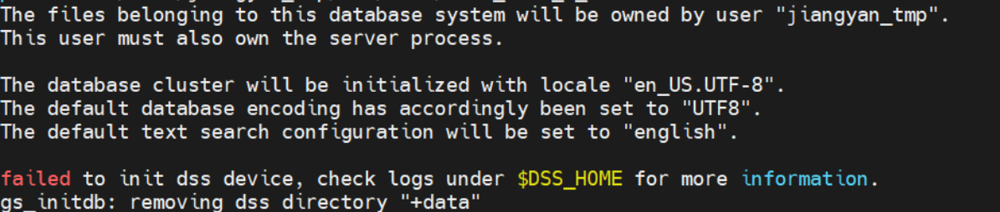

# 无法单独拉起节点

## 现象
单独gs_ctl start单个节点无法拉起一直在等待，进入日志显示如下错误。

## 原因
没有同时拉起主备节点。

## 解决方案
cm_config.ini文件里，把REFORMER_ID设置为0，BITMAP_ONLINE设置为1，并且进到/data/node1 目录下，将postgresql.conf文件里ss_enable_reform参数设置为ON，便可以单独拉起节点。