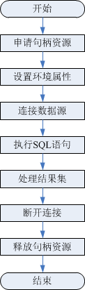

# 开发流程

**图 1**  ODBC开发应用程序的流程  

## 开发流程中涉及的API

**表 1**  相关API说明

<table><thead align="left"><tr id="zh-cn_topic_0237120409_zh-cn_topic_0059778957_ra4bc7ab7d7a7493ea839a0e52ecf4825"><th class="cellrowborder" valign="top" width="37.2%" id="mcps1.2.3.1.1">
<strong id="zh-cn_topic_0237120409_zh-cn_topic_0059778957_a2b60e1107ec14759972d891c2c5424dd">功能</strong>

</th>
<th class="cellrowborder" valign="top" width="62.8%" id="mcps1.2.3.1.2">
<strong id="zh-cn_topic_0237120409_zh-cn_topic_0059778957_a16bae9c276314a118debccb05cc4734f">API</strong>

</th>
</tr>
</thead>
<tbody><tr id="zh-cn_topic_0237120409_zh-cn_topic_0059778957_r6ff7b44edfc64cc69677920a5fd8a9af"><td class="cellrowborder" valign="top" width="37.2%" headers="mcps1.2.3.1.1 ">
申请句柄资源

</td>
<td class="cellrowborder" valign="top" width="62.8%" headers="mcps1.2.3.1.2 ">
<a href="SQLAllocHandle.md">SQLAllocHandle</a>：申请句柄资源，可替代如下函数：

<ul id="zh-cn_topic_0237120409_zh-cn_topic_0059778957_u9a01eda0e47a4f5791a8febb1bb4d13d"><li><a href="SQLAllocEnv.md">SQLAllocEnv</a>：申请环境句柄</li><li><a href="SQLAllocConnect.md">SQLAllocConnect</a>：申请连接句柄</li><li><a href="SQLAllocStmt.md">SQLAllocStmt</a>：申请语句句柄</li></ul>
</td>
</tr>
<tr id="zh-cn_topic_0237120409_zh-cn_topic_0059778957_reca69a78621d4b29bfdbb97fc83bb8d8"><td class="cellrowborder" valign="top" width="37.2%" headers="mcps1.2.3.1.1 ">
设置环境属性

</td>
<td class="cellrowborder" valign="top" width="62.8%" headers="mcps1.2.3.1.2 ">
<a href="SQLSetEnvAttr.md">SQLSetEnvAttr</a>

</td>
</tr>
<tr id="zh-cn_topic_0237120409_zh-cn_topic_0059778957_r8a93f2fb0cf94874b2c487c93cf898c8"><td class="cellrowborder" valign="top" width="37.2%" headers="mcps1.2.3.1.1 ">
设置连接属性

</td>
<td class="cellrowborder" valign="top" width="62.8%" headers="mcps1.2.3.1.2 ">
<a href="SQLSetConnectAttr.md">SQLSetConnectAttr</a>

</td>
</tr>
<tr id="zh-cn_topic_0237120409_zh-cn_topic_0059778957_r215312d81bd845ef9af783522d0a5d31"><td class="cellrowborder" valign="top" width="37.2%" headers="mcps1.2.3.1.1 ">
设置语句属性

</td>
<td class="cellrowborder" valign="top" width="62.8%" headers="mcps1.2.3.1.2 ">
<a href="SQLSetStmtAttr.md">SQLSetStmtAttr</a>

</td>
</tr>
<tr id="zh-cn_topic_0237120409_zh-cn_topic_0059778957_r6b385e2697d94978b0f72e9c319dfc62"><td class="cellrowborder" valign="top" width="37.2%" headers="mcps1.2.3.1.1 ">
连接数据源

</td>
<td class="cellrowborder" valign="top" width="62.8%" headers="mcps1.2.3.1.2 ">
<a href="SQLConnect.md">SQLConnect</a>

</td>
</tr>
<tr id="zh-cn_topic_0237120409_zh-cn_topic_0059778957_r74f5e5648cc545bd989724498fd61272"><td class="cellrowborder" valign="top" width="37.2%" headers="mcps1.2.3.1.1 ">
绑定缓冲区到结果集的列中

</td>
<td class="cellrowborder" valign="top" width="62.8%" headers="mcps1.2.3.1.2 ">
<a href="SQLBindCol.md">SQLBindCol</a>

</td>
</tr>
<tr id="zh-cn_topic_0237120409_zh-cn_topic_0059778957_r2310b53cbeb44e5189d23d8cb4d54e93"><td class="cellrowborder" valign="top" width="37.2%" headers="mcps1.2.3.1.1 ">
绑定SQL语句的参数标志和缓冲区

</td>
<td class="cellrowborder" valign="top" width="62.8%" headers="mcps1.2.3.1.2 ">
<a href="SQLBindParameter.md">SQLBindParameter</a>

</td>
</tr>
<tr id="zh-cn_topic_0237120409_zh-cn_topic_0059778957_rb868d10c6c8049dda87a0655f29547a8"><td class="cellrowborder" valign="top" width="37.2%" headers="mcps1.2.3.1.1 ">
查看最近一次操作错误信息

</td>
<td class="cellrowborder" valign="top" width="62.8%" headers="mcps1.2.3.1.2 ">
<a href="SQLGetDiagRec.md">SQLGetDiagRec</a>

</td>
</tr>
<tr id="zh-cn_topic_0237120409_zh-cn_topic_0059778957_r64f440bf6f134ca09eb319dce4445f92"><td class="cellrowborder" valign="top" width="37.2%" headers="mcps1.2.3.1.1 ">
为执行SQL语句做准备

</td>
<td class="cellrowborder" valign="top" width="62.8%" headers="mcps1.2.3.1.2 ">
<a href="SQLPrepare.md">SQLPrepare</a>

</td>
</tr>
<tr id="zh-cn_topic_0237120409_zh-cn_topic_0059778957_r86d122da7e6a45a98abd0d2c1ceeb611"><td class="cellrowborder" valign="top" width="37.2%" headers="mcps1.2.3.1.1 ">
执行一条准备好的SQL语句

</td>
<td class="cellrowborder" valign="top" width="62.8%" headers="mcps1.2.3.1.2 ">
<a href="SQLExecute.md">SQLExecute</a>

</td>
</tr>
<tr id="zh-cn_topic_0237120409_zh-cn_topic_0059778957_r62d4c8e0f9d3431399af1211f6fb6ee2"><td class="cellrowborder" valign="top" width="37.2%" headers="mcps1.2.3.1.1 ">
直接执行SQL语句

</td>
<td class="cellrowborder" valign="top" width="62.8%" headers="mcps1.2.3.1.2 ">
<a href="SQLExecDirect.md">SQLExecDirect</a>

</td>
</tr>
<tr id="zh-cn_topic_0237120409_zh-cn_topic_0059778957_r568da8c171a74a8e84f5f8c8c0979afc"><td class="cellrowborder" valign="top" width="37.2%" headers="mcps1.2.3.1.1 ">
结果集中取行集

</td>
<td class="cellrowborder" valign="top" width="62.8%" headers="mcps1.2.3.1.2 ">
<a href="SQLFetch.md">SQLFetch</a>

</td>
</tr>
<tr id="zh-cn_topic_0237120409_zh-cn_topic_0059778957_r38d974abf84e450ca7f96100e8a6a077"><td class="cellrowborder" valign="top" width="37.2%" headers="mcps1.2.3.1.1 ">
返回结果集中某一列的数据

</td>
<td class="cellrowborder" valign="top" width="62.8%" headers="mcps1.2.3.1.2 ">
<a href="SQLGetData.md">SQLGetData</a>

</td>
</tr>
<tr id="zh-cn_topic_0237120409_zh-cn_topic_0059778957_r91f9e273dc364f31b8661698941c8f92"><td class="cellrowborder" valign="top" width="37.2%" headers="mcps1.2.3.1.1 ">
获取结果集中列的描述信息

</td>
<td class="cellrowborder" valign="top" width="62.8%" headers="mcps1.2.3.1.2 ">
<a href="SQLColAttribute.md">SQLColAttribute</a>

</td>
</tr>
<tr id="zh-cn_topic_0237120409_zh-cn_topic_0059778957_re2de0c9ab1fd476dad5108b6e9a8e21c"><td class="cellrowborder" valign="top" width="37.2%" headers="mcps1.2.3.1.1 ">
断开与数据源的连接

</td>
<td class="cellrowborder" valign="top" width="62.8%" headers="mcps1.2.3.1.2 ">
<a href="SQLDisconnect.md">SQLDisconnect</a>

</td>
</tr>
<tr id="zh-cn_topic_0237120409_zh-cn_topic_0059778957_r2f6f79089ce944fc96e3c5299ab3529d"><td class="cellrowborder" valign="top" width="37.2%" headers="mcps1.2.3.1.1 ">
释放句柄资源

</td>
<td class="cellrowborder" valign="top" width="62.8%" headers="mcps1.2.3.1.2 ">
<a href="SQLFreeHandle.md">SQLFreeHandle</a>：释放句柄资源，可替代如下函数：

<ul id="zh-cn_topic_0237120409_zh-cn_topic_0059778957_u912c46b1932d4d4b8b4136bd8317d0b5"><li><a href="SQLFreeEnv.md">SQLFreeEnv</a>：释放环境句柄</li><li><a href="SQLFreeConnect.md">SQLFreeConnect</a>：释放连接句柄</li><li><a href="SQLFreeStmt.md">SQLFreeStmt</a>：释放语句句柄</li></ul>
</td>
</tr>
</tbody>
</table>

> **说明：**   
>数据库中收到的一次执行请求（不在事务块中），如果含有多条语句，将会被打包成一个事务，同时如果其中有一个语句失败，那么整个请求都将会被回滚。  

>  **警告：**   
>
> ODBC为应用程序与数据库的中心层，负责把应用程序发出的SQL指令传到数据库当中，自身并不解析SQL语法。故在应用程序中写入带有保密信息的SQL语句时（如明文密码），保密信息会被暴露在驱动日志中。

