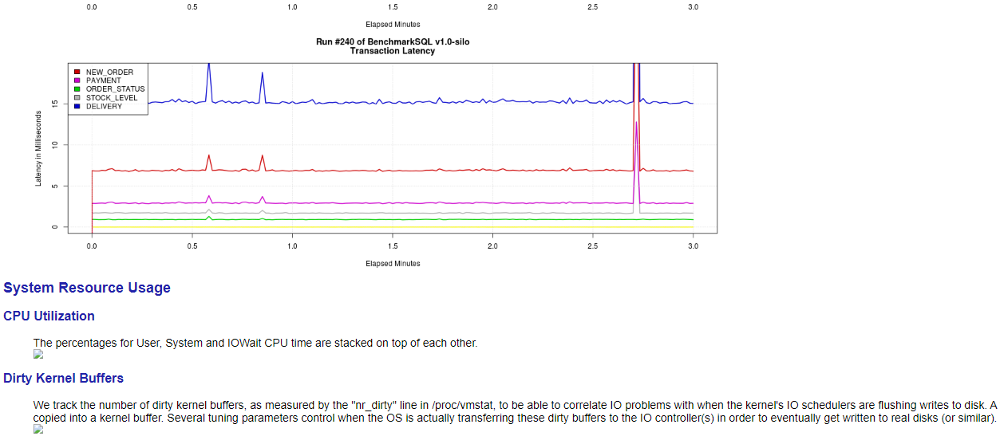

# MOT样例TPC-C基准

## TPC-C简介

TPC-C基准是衡量联机事务处理（OLTP）系统性能的行业标准基准。它基于一个复杂的数据库和许多不同的事务类型。这些事务类型在此基准上执行。TPC-C基准测试既不依赖硬件，也不依赖软件，因此可以在每个测试平台上运行。基准模型的官方概述，见tpc.org网站（[http://www.tpc.org/default5.asp](http://www.tpc.org/default5.asp)）。

该数据库由9个不同结构的表组成，因此也包括9种类型的数据。每个表的数据大小和数量不同。在数据库上混合执行五种不同类型和复杂性的并发事务。这些大部分是在线事务或者部分排队等待延迟批处理。由于这些表竞争有限的系统资源，许多系统组件都有压力，数据更改以各种方式执行。

**表 1**  TPC-C数据库结构

<table><thead align="left"><tr id="row35451093"><th class="cellrowborder" valign="top" width="25.25%" id="mcps1.2.3.1.1">
表

</th>
<th class="cellrowborder" valign="top" width="74.75%" id="mcps1.2.3.1.2">
条目数

</th>
</tr>
</thead>
<tbody><tr id="row22343220"><td class="cellrowborder" valign="top" width="25.25%" headers="mcps1.2.3.1.1 ">
仓库

</td>
<td class="cellrowborder" valign="top" width="74.75%" headers="mcps1.2.3.1.2 ">
n

</td>
</tr>
<tr id="row51680192"><td class="cellrowborder" valign="top" width="25.25%" headers="mcps1.2.3.1.1 ">
供货商品

</td>
<td class="cellrowborder" valign="top" width="74.75%" headers="mcps1.2.3.1.2 ">
100,000

</td>
</tr>
<tr id="row22336519"><td class="cellrowborder" valign="top" width="25.25%" headers="mcps1.2.3.1.1 ">
库存

</td>
<td class="cellrowborder" valign="top" width="74.75%" headers="mcps1.2.3.1.2 ">
n x 100,000

</td>
</tr>
<tr id="row58618348"><td class="cellrowborder" valign="top" width="25.25%" headers="mcps1.2.3.1.1 ">
地区

</td>
<td class="cellrowborder" valign="top" width="74.75%" headers="mcps1.2.3.1.2 ">
n x 10

</td>
</tr>
<tr id="row13882526"><td class="cellrowborder" valign="top" width="25.25%" headers="mcps1.2.3.1.1 ">
客户

</td>
<td class="cellrowborder" valign="top" width="74.75%" headers="mcps1.2.3.1.2 ">
3000/区，30,000/仓库

</td>
</tr>
<tr id="row14517968"><td class="cellrowborder" valign="top" width="25.25%" headers="mcps1.2.3.1.1 ">
订单

</td>
<td class="cellrowborder" valign="top" width="74.75%" headers="mcps1.2.3.1.2 ">
客户数量（初始值）

</td>
</tr>
<tr id="row22919169"><td class="cellrowborder" valign="top" width="25.25%" headers="mcps1.2.3.1.1 ">
新增订单

</td>
<td class="cellrowborder" valign="top" width="74.75%" headers="mcps1.2.3.1.2 ">
30%订单（初始值）

</td>
</tr>
<tr id="row36704181"><td class="cellrowborder" valign="top" width="25.25%" headers="mcps1.2.3.1.1 ">
定单分录

</td>
<td class="cellrowborder" valign="top" width="74.75%" headers="mcps1.2.3.1.2 ">
~10/单

</td>
</tr>
<tr id="row64463545"><td class="cellrowborder" valign="top" width="25.25%" headers="mcps1.2.3.1.1 ">
历史记录

</td>
<td class="cellrowborder" valign="top" width="74.75%" headers="mcps1.2.3.1.2 ">
客户数量（初始值）

</td>
</tr>
</tbody>
</table>

事务组合代表从订单输入到订单交付的完整业务处理。具体来说，所提供的组合旨在产生相等数量的新订单事务和支付事务，并且为每十个新订单事务产生一个交付事务、一个订单状态事务和一个库存水平事务。

**表 2**  TPC-C事务比例

<table><thead align="left"><tr id="row54980168"><th class="cellrowborder" valign="top" width="35.35%" id="mcps1.2.3.1.1">
事务级别≥4%

</th>
<th class="cellrowborder" valign="top" width="64.64999999999999%" id="mcps1.2.3.1.2">
占所有事务份额

</th>
</tr>
</thead>
<tbody><tr id="row53338714"><td class="cellrowborder" valign="top" width="35.35%" headers="mcps1.2.3.1.1 ">
TPC-C新订单

</td>
<td class="cellrowborder" valign="top" width="64.64999999999999%" headers="mcps1.2.3.1.2 ">
≤ 45%

</td>
</tr>
<tr id="row44574134"><td class="cellrowborder" valign="top" width="35.35%" headers="mcps1.2.3.1.1 ">
支付

</td>
<td class="cellrowborder" valign="top" width="64.64999999999999%" headers="mcps1.2.3.1.2 ">
≥ 43%

</td>
</tr>
<tr id="row48416589"><td class="cellrowborder" valign="top" width="35.35%" headers="mcps1.2.3.1.1 ">
订单状态

</td>
<td class="cellrowborder" valign="top" width="64.64999999999999%" headers="mcps1.2.3.1.2 ">
≥ 4%

</td>
</tr>
<tr id="row46506838"><td class="cellrowborder" valign="top" width="35.35%" headers="mcps1.2.3.1.1 ">
交付

</td>
<td class="cellrowborder" valign="top" width="64.64999999999999%" headers="mcps1.2.3.1.2 ">
≥4%（批次）

</td>
</tr>
<tr id="row20494029"><td class="cellrowborder" valign="top" width="35.35%" headers="mcps1.2.3.1.1 ">
库存水平

</td>
<td class="cellrowborder" valign="top" width="64.64999999999999%" headers="mcps1.2.3.1.2 ">
≥ 4%

</td>
</tr>
</tbody>
</table>

有两种方法来执行事务：作为存储过程（允许更高的吞吐量）和以标准交互式SQL模式执行。

**性能指标：tpm-C**

tpm-C指标是每分钟执行的新订单事务数。考虑到事务中所需的组合以及广泛的复杂性和类型，此指标最接近地模拟一个全面的业务活动，而不仅仅是一个或两个事务或计算机操作。因此，tpm-C指标被认为是业务吞吐量的指标。

tpm-C指标单位表示为每分钟事务数-C，而C表示TPC-C特定基准。

> **说明：** 
>官方TPC-C基准规范可访问：[http://www.tpc.org/tpc\_documents\_current\_versions/pdf/tpc-c\_v5.11.0.pdf](http://www.tpc.org/tpc_documents_current_versions/pdf/tpc-c_v5.11.0.pdf)。本规范中的一些规则在行业中难以实现，因为对行业现状来说这些规则太严格了。例如：扩容规则（a） tpm-C/Warehouse必须大于9且小于12.86（要达到较高的tpm-C率，需要很高的仓库费率。这就意味着需要非常大的数据库和内存容量）以及规则（b）10倍终端\*仓库（意味着大量的模拟客户端）。

## 系统级优化

请按照[MOT部署](MOT部署.md)中的说明进行操作。下面介绍openGauss数据库在华为TaiShan服务器和Euler 2.8操作系统上部署时系统级的关键优化点，以达到极致性能。

## BenchmarkSQL：开源TPC-C工具

可以使用BenchmarkSQL测试TPCC，如下所示：

-   下载benchmarksql：[https://osdn.net/frs/g\_redir.php?m=kent&f=benchmarksql%2Fbenchmarksql-5.0.zip](https://osdn.net/frs/g_redir.php?m=kent&f=benchmarksql/benchmarksql-5.0.zip)
-   benchmarksql工具中的模式创建脚本需要调整为MOT语法，避免使用不支持的DDL。下载调整后的脚本：[https://opengauss.obs.cn-south-1.myhuaweicloud.com/1.0.0/MOT-TPCC-Benchmark.tar.gz](https://opengauss.obs.cn-south-1.myhuaweicloud.com/1.0.0/MOT-TPCC-Benchmark.tar.gz)。该tar文件的内容包括sql.common.opengauss.mot文件夹和jTPCCTData.java文件，以及一个示例配置文件postgresql.conf和TPCC属性文件props.mot供参考。
-   将sql.common.opengauss.mot文件夹放在run文件夹下与sql.common同级的文件夹，用下载的Java文件替换src/client/jTPCCTData.java文件。
-   编辑run文件夹下的runDatabaseBuild.sh文件，将extraHistID从AFTER\_LOAD列表中删除，以避免不支持的ALTER表DDL。
-   将lib/postgres文件夹下的JDBC驱动替换为openGauss JDBC。驱动下载链接：[https://opengauss.org/en/download/](https://opengauss.org/en/download/)。

在下载的Java文件（与原始文件相比）中所做的唯一更改是注释错误日志打印，以进行序列化和重复键错误。这些错误在MOT中是正常的，因为MOT使用的是乐观并发控制（OCC）机制。

> **说明：** 
>基准测试使用标准交互式SQL模式执行，没有存储过程。

## 运行基准

任何人都可以启动服务器，运行benchmarksql脚本。

运行基准测试：

1.  进入benchmarksql运行文件夹，将sql.common重命名为sql.common.orig。
2.  创建sql.common到sql.common.opengauss.mot的链接，用于测试MOT。
3.  启动数据库服务器。
4.  配置客户端props.pg文件。
5.  运行基准测试。

## 结果报告

-   CLI结果

    BenchmarkSQL结果应如下所示：

    

    随着时间的推移，基准测量并平均已提交的事务。上面的例子是两分钟的基准测试。

    得分为271万tmp-C（每分钟新增订单数），占总承诺事务数的45%，即tpmTOTAL。

-   详细结果报告

    详细结果报告示例：

**图 1**  详细结果报告  

BenchmarkSQL收集详细的性能统计数据和操作系统性能数据（如果配置了的话）。

这些信息可以显示查询的延迟，从而暴露与存储/网络/CPU相关的瓶颈。

华为TaiShan 2480 MOT TPC-C测试结果

2020年5月1日TPC-C基准测试，TaiShan 2480服务器（Arm/鲲鹏4路服务器）安装openGauss数据库，吞吐量达到479万tpmC。

下图展示了近乎线性的可扩展性：

**图 2**  华为TaiShan 2480 MOT TPC-C测试结果  

