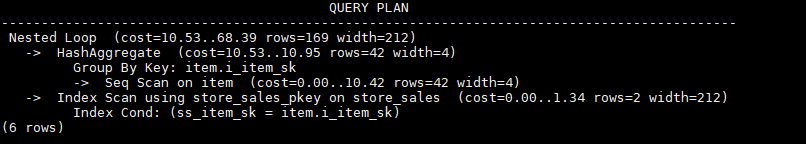

# 子链接块名的hint<a name="ZH-CN_TOPIC_0245374573"></a>

## 功能描述<a name="zh-cn_topic_0237121538_section290819468377"></a>

指明子链接块的名称。

## 语法格式<a name="zh-cn_topic_0237121538_section530131664410"></a>

```
blockname (table)
```

## 参数说明<a name="zh-cn_topic_0237121538_section41303128143838"></a>

-   **table**表示为该子链接块hint的别名的名称。

> **说明：**
>-   **blockname hint**仅在对应的子链接块没有提升时才会被上层查询使用。目前支持的子链接提升包括IN子链接提升、EXISTS子链接提升和包含Agg等值相关子链接提升。该hint通常会和前面章节提到的hint联合使用。
>-   对于FROM关键字后的子查询，则需要使用子查询的别名进行hint，blockname hint不会被用到。
>-   如果子链接中含有多个表，则提升后这些表可与外层表以任意优化顺序连接，hint也不会被用到。

## 示例<a name="zh-cn_topic_0237121538_section1127715590585"></a>

```
explain select /*+nestloop(store_sales tt) */ * from store_sales where ss_item_sk in (select /*+blockname(tt)*/ i_item_sk from item group by 1);
```

该hint表示：子链接的别名为tt，提升后与上层的store\_sales表关联时使用nestloop。生成计划如下所示：


