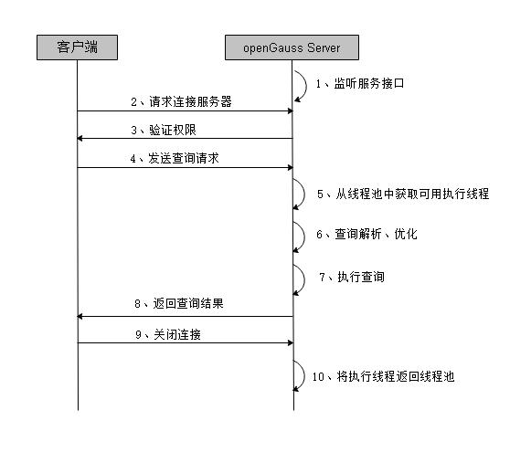

# 数据查询请求处理过程

数据请求分为创建、删除、修改和查询，处理过程大致相同。以数据查询过程为例，展现客户端如何与openGauss sever进行交互。数据查询请求过程如[图1](#zh-cn_topic_0237120246_zh-cn_topic_0059778641_f8739a7e890f246bb9fb77f8a9b1c4105)所示所示，创建、删除和修改请求处理过程只在图中第7步有差异。

**图 1**  openGauss服务响应流程  

