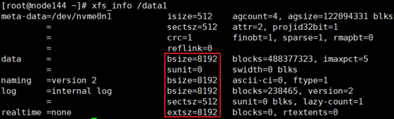

# 文件系统配置<a name="ZH-CN_TOPIC_0263913268"></a>

为了提升数据库的IO效率，我们使用NVME盘作为数据盘，需要采用的文件系统类型为xfs，数据块大小为8KB。具体操作如下：

1. <a name="li13131455153313"></a>查看当前数据盘的文件系统类型。

   a. 执行如下命令查看当前挂载的nvme盘。

   ```
   df -h | grep nvme
   ```

   结果如下。

   ```
   /dev/nvme0n1                3.7T  2.6T  1.2T  69% /data1 
   /dev/nvme1n1                3.7T  1.9T  1.8T  51% /data2 
   /dev/nvme2n1                3.7T  2.2T  1.6T  59% /data3 
   /dev/nvme3n1                3.7T  1.4T  2.3T  39% /data4
   ```

   b.执行如下命令查看nvme盘的信息。

   ```
   xfs_info
   ```

   例如执行命令**xfs\_info /data1**，如[图1](#fig16848819124216)所示，block的大小正好为8KB，不需要修改；若block不满足8kB大小的要求，需要重新格式化，格式化前请将数据进行备份。

   **图 1**  查看nvme盘的信息<a name="fig16848819124216"></a>  
   

2.  对于需要修改的磁盘，备份所需的数据至其他磁盘或其他服务器。
3.  格式化磁盘为xfs文件系统。

    以/dev/nvme0n1盘，加载路径为/data1为例，参考命令如下。此步骤需根据实际环境情况进行操作。

    ```
    umount /data1 
    mkfs.xfs -b size=8192 /dev/nvme0n1 -f 
    mount /dev/nvme0n1 /data1
    ```

4.  执行[步骤一](#li13131455153313)，确认blocksize是否已修改为8KB。

