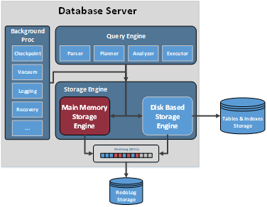

# 概述

内存表（MOT）是一个基于事务性行存储\(rowstore\)的存储引擎，该引擎针对多核和大内存服务器进行了优化。MOT是openGauss数据库最先进的商用特性之一，可为事务性负载提供更高的性能。MOT完全支持原子性、一致性、隔离性、持久性\(ACID\)，并包括严格的耐久性和高可用性支持。用户可以在关键任务、性能敏感的在线事务处理\(OLTP\)中使用MOT，以实现高性能、高吞吐、低且可预测的时延以及多路/多核处理器的高利用率。MOT特别适合用于多路/多核处理器的现代服务器。例如，基于鲲鹏CPU的华为Taishan服务器（例如Taishan 2280或Taishan 2480服务器，最多256个核心）和x86的服务器（例如Taishan 2288服务器）。

**图 1**  openGauss中的内存引擎  

如[图1](#fig2268114482311)所示，内存引擎组件（红色部分）是openGauss中负责管理MOT（以下使用MOT表示内存表）和内存表事务的模块。

MOT与普通基于磁盘的表可并存。MOT的有效设计实现了几乎完全的SQL覆盖，并支持完整的数据库功能集（限制参见10.5小节），此外还支持存储过程和用户自定义函数。

由于数据和索引完全存储在内存中，NUMA-aware设计，消除锁和锁存竞争的算法以及查询本地编译，MOT可提供更快的数据访问和更高效的事务执行。MOT有效的几乎无锁的设计和高度调优的实现，使其在多核服务器上实现了卓越的近线性吞吐量扩展，可能是业界最好的。

MOT完全符合ACID标准，其中隔离性方面，MOT支持可重复读和读提交两种隔离级别。在下一个版本中，MOT还将支持可序列化隔离级别。更多信息请参见隔离级别部分；持久化方面MOT已和openGauss基于WAL的日志记录持久化方式集成，MOT同时支持同步和异步日志方式。MOT还支持同步+面向NUMA优化的组提交。更多信息请参见持久化章节。

