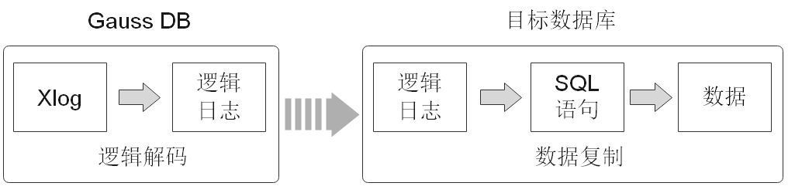

# 逻辑解码概述

## 功能描述

openGauss对数据复制能力的支持情况为：

支持通过数据迁移工具定期向异构数据库（如Oracle等）进行数据同步，不具备实时数据复制能力。不足以支撑与异构数据库间并网运行实时数据同步的诉求。

openGauss提供了逻辑解码功能，通过反解xlog的方式生成逻辑日志。目标数据库解析逻辑日志以实时进行数据复制。具体如[图1](#zh-cn_topic_0283136720_zh-cn_topic_0237121452_fig65787201989)所示。逻辑复制降低了对目标数据库的形态限制，支持异构数据库、同构异形数据库对数据的同步，支持目标库进行数据同步期间的数据可读写，数据同步时延低。

**图 1**  逻辑复制  

逻辑复制由两部分组成：逻辑解码和数据复制。逻辑解码会输出以事务为单位组织的逻辑日志。业务或数据库中间件将会对逻辑日志进行解析并最终实现数据复制。openGauss当前只提供逻辑解码功能，因此本章节只涉及逻辑解码的说明。

逻辑解码为逻辑复制提供事务解码的基础能力，openGauss使用SQL函数接口进行逻辑解码。此方法调用方便，不需使用工具，对接外部工具接口也比较清晰，不需要额外适配。

由于逻辑日志是以事务为单位的，在事务提交后才能输出，且逻辑解码是由用户驱动的；因此为了防止事务开始时的xlog被系统回收，或所需的事务信息被VACUUM回收，openGauss使用了逻辑复制槽，用于阻塞xlog的回收。

一个逻辑复制槽表示一个更改流，这些更改可以在其它数据库中以它们在原数据库上产生的顺序被重放。逻辑复制槽，由每个逻辑日志的获取者维护一个。

## 注意事项

-   不支持DDL语句解码，在执行特定的DDL语句（例如普通表truncate或分区表exchange）时，可能造成解码数据丢失。
-   不支持列存、数据页复制的解码。
-   不支持级联备机进行逻辑解码。
-   当执行DDL语句（如alter table）后，该DDL语句前尚未解码的物理日志可能会丢失。
-   单条元组大小不超过1GB，考虑解码结果可能大于插入数据，因此建议单条元组大小不超过500MB。
-   openGauss支持解码的数据类型为：INTEGER、BIGINT、SMALLINT、TINYINT、SERIAL、SMALLSERIAL、BIGSERIAL、FLOAT、DOUBLE PRECISION、DATE、TIME\[WITHOUT TIME ZONE\]、TIMESTAMP\[WITHOUT TIME ZONE\]、CHAR\(n\)、VARCHAR\(n\)、TEXT。
-   如果需要ssl连接需要保证前置设置GUC参数ssl=on。
-   逻辑复制槽名称必须小于64个字符，且只包含小写字母、数字或者下划线中的一种或几种。
-   当前逻辑复制不支持MOT特性。
-   当逻辑复制槽所在数据库被删除后，这些复制槽变为不可用状态，需要用户手动删除。
-   仅支持utf-8字符集。
-   对多库的解码需要分别在库内创建流复制槽并开始解码，每个库的解码都需要单独扫一遍日志。
-   不支持强起，强起后需要重新全量导出数据。
-   备机解码时，switchover和failover时可能出现解码数据变多，需用户手动过滤。Qurem协议下，switchover和failover选择升主的备机，需要与当前主机日志同步。
-   不允许主备，多个备机同时使用同一个复制槽解码，否则会产生数据不一致。
-   只支持主机创建删除复制槽。
-   数据库故障重启或逻辑复制进程重启后，解码数据存在重复，用户需自己过滤。
-   计算机内核故障后，解码存在乱码，需手动或自动过滤。
-   当前备机逻辑解码，不支持开启极致RTO。
-   请确保在创建逻辑复制槽过程中长事务未启动，启动长事务会阻塞逻辑复制槽的创建。
-   不支持interval partition表复制。
-   不支持全局临时表。
-   在事务中执行DDL语句后，该DDL语句与之后的语句不会被解码。
-   如需进行备机解码，需在对应主机上设置guc参数enable\_slot\_log = on。
-   禁止在使用逻辑复制槽时在其他节点对该复制槽进行操作，删除复制槽进行操作的操作需在该复制槽停止解码后执行。

## 性能

在Benchmarksql-5.0的100warehouse场景下，采用pg\_logical\_slot\_get\_changes时：

-   单次解码数据量4K行（对应约5MB～10MB日志），解码性能0.3MB/s～0.5 MB/s 。
-   单次解码数据量32K行（对应约40MB～80MB日志），解码性能3MB/s～5MB/s 。
-   单次解码数据量256K行（对应约320MB～640MB日志），解码性能3MB/s～5MB/s 。
-   单次解码数据量再增大，解码性能无明显提升。

如果采用pg\_logical\_slot\_peek\_changes + pg\_replication\_slot\_advance 方式，解码性能相比采用pg\_logical\_slot\_get\_changes时要下降30%～50%。

