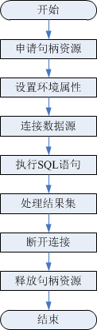

# ODBC<a name="ZH-CN_TOPIC_0000001233927853"></a>

ODBC（Open Database Connectivity，开放数据库互连）是由Microsoft公司基于X/OPEN CLI提出的用于访问数据库的应用程序编程接口。应用程序通过ODBC提供的API与数据库进行交互，增强了应用程序的可移植性、扩展性和可维护性。

ODBC的系统结构参见[图1](#zh-cn_topic_0283137057_fig1255101034110)。

**图 1**  ODBC系统机构<a name="zh-cn_topic_0283137057_fig1255101034110"></a>  


openGauss目前在以下环境中提供对ODBC的支持。

**表 1**  ODBC支持平台

<a name="zh-cn_topic_0283137057_zh-cn_topic_0237120405_zh-cn_topic_0059778944_tcc3bf62098e14505b94680dffaa5940d"></a>
<table><thead align="left"><tr id="zh-cn_topic_0283137057_zh-cn_topic_0237120405_zh-cn_topic_0059778944_re1a7b791067f4bac9743d0de9f2ae8b6"><th class="cellrowborder" valign="top" width="78.64%" id="mcps1.2.3.1.1"><p id="zh-cn_topic_0283137057_zh-cn_topic_0237120405_zh-cn_topic_0059778944_aa56cbe2a342d43b59dfc4501d2fc6172"><a name="zh-cn_topic_0283137057_zh-cn_topic_0237120405_zh-cn_topic_0059778944_aa56cbe2a342d43b59dfc4501d2fc6172"></a><a name="zh-cn_topic_0283137057_zh-cn_topic_0237120405_zh-cn_topic_0059778944_aa56cbe2a342d43b59dfc4501d2fc6172"></a>操作系统</p>
</th>
<th class="cellrowborder" valign="top" width="21.36%" id="mcps1.2.3.1.2"><p id="zh-cn_topic_0283137057_zh-cn_topic_0237120405_zh-cn_topic_0059778944_a645fcd4314514ac5b4409e804145c94b"><a name="zh-cn_topic_0283137057_zh-cn_topic_0237120405_zh-cn_topic_0059778944_a645fcd4314514ac5b4409e804145c94b"></a><a name="zh-cn_topic_0283137057_zh-cn_topic_0237120405_zh-cn_topic_0059778944_a645fcd4314514ac5b4409e804145c94b"></a>平台</p>
</th>
</tr>
</thead>
<tbody><tr id="zh-cn_topic_0283137057_zh-cn_topic_0237120405_zh-cn_topic_0059778944_row246633982912"><td class="cellrowborder" valign="top" width="78.64%" headers="mcps1.2.3.1.1 "><p id="zh-cn_topic_0283137057_zh-cn_topic_0237120405_zh-cn_topic_0059778944_p55601140183018"><a name="zh-cn_topic_0283137057_zh-cn_topic_0237120405_zh-cn_topic_0059778944_p55601140183018"></a><a name="zh-cn_topic_0283137057_zh-cn_topic_0237120405_zh-cn_topic_0059778944_p55601140183018"></a>CentOS 6.4/6.5/6.6/6.7/6.8/6.9/7.0/7.1/7.2/7.3/7.4</p>
</td>
<td class="cellrowborder" align="left" valign="top" width="21.36%" headers="mcps1.2.3.1.2 "><p id="zh-cn_topic_0283137057_zh-cn_topic_0237120405_zh-cn_topic_0059778944_p37001047123019"><a name="zh-cn_topic_0283137057_zh-cn_topic_0237120405_zh-cn_topic_0059778944_p37001047123019"></a><a name="zh-cn_topic_0283137057_zh-cn_topic_0237120405_zh-cn_topic_0059778944_p37001047123019"></a>x86_64位</p>
</td>
</tr>
<tr id="zh-cn_topic_0283137057_zh-cn_topic_0237120405_row196422068554"><td class="cellrowborder" valign="top" width="78.64%" headers="mcps1.2.3.1.1 "><p id="zh-cn_topic_0283137057_zh-cn_topic_0237120405_p12643116125510"><a name="zh-cn_topic_0283137057_zh-cn_topic_0237120405_p12643116125510"></a><a name="zh-cn_topic_0283137057_zh-cn_topic_0237120405_p12643116125510"></a>CentOS 7.6</p>
</td>
<td class="cellrowborder" valign="top" width="21.36%" headers="mcps1.2.3.1.2 "><p id="zh-cn_topic_0283137057_zh-cn_topic_0237120405_p864386185519"><a name="zh-cn_topic_0283137057_zh-cn_topic_0237120405_p864386185519"></a><a name="zh-cn_topic_0283137057_zh-cn_topic_0237120405_p864386185519"></a>ARM64位</p>
</td>
</tr>
<tr id="zh-cn_topic_0283137057_zh-cn_topic_0237120405_zh-cn_topic_0059778944_row1915312215011"><td class="cellrowborder" valign="top" width="78.64%" headers="mcps1.2.3.1.1 "><p id="zh-cn_topic_0283137057_zh-cn_topic_0237120405_zh-cn_topic_0059778944_p826525664919"><a name="zh-cn_topic_0283137057_zh-cn_topic_0237120405_zh-cn_topic_0059778944_p826525664919"></a><a name="zh-cn_topic_0283137057_zh-cn_topic_0237120405_zh-cn_topic_0059778944_p826525664919"></a>EulerOS 2.0 SP2/SP3</p>
</td>
<td class="cellrowborder" align="left" valign="top" width="21.36%" headers="mcps1.2.3.1.2 "><p id="zh-cn_topic_0283137057_zh-cn_topic_0237120405_zh-cn_topic_0059778944_p93583610509"><a name="zh-cn_topic_0283137057_zh-cn_topic_0237120405_zh-cn_topic_0059778944_p93583610509"></a><a name="zh-cn_topic_0283137057_zh-cn_topic_0237120405_zh-cn_topic_0059778944_p93583610509"></a>x86_64位</p>
</td>
</tr>
<tr id="zh-cn_topic_0283137057_zh-cn_topic_0237120405_row1728515110349"><td class="cellrowborder" valign="top" width="78.64%" headers="mcps1.2.3.1.1 "><p id="zh-cn_topic_0283137057_zh-cn_topic_0237120405_p1028612118342"><a name="zh-cn_topic_0283137057_zh-cn_topic_0237120405_p1028612118342"></a><a name="zh-cn_topic_0283137057_zh-cn_topic_0237120405_p1028612118342"></a>EulerOS 2.0 SP8</p>
</td>
<td class="cellrowborder" valign="top" width="21.36%" headers="mcps1.2.3.1.2 "><p id="zh-cn_topic_0283137057_zh-cn_topic_0237120405_p162863113411"><a name="zh-cn_topic_0283137057_zh-cn_topic_0237120405_p162863113411"></a><a name="zh-cn_topic_0283137057_zh-cn_topic_0237120405_p162863113411"></a>ARM64位</p>
</td>
</tr>
</tbody>
</table>

## Linux下的ODBC包<a name="section1352910461980"></a>

从发布包中获取，包名为openGauss-\*.\*.0-ODBC.tar.gz。Linux环境下，开发应用程序要用到unixODBC提供的头文件（sql.h、sqlext.h等）和库libodbc.so。这些头文件和库可从unixODBC-2.3.0的安装包中获得。

## 配置数据源<a name="section12696151016177"></a>

将openGauss提供的ODBC DRIVER（psqlodbcw.so）配置到数据源中便可使用。配置数据源需要配置“odbc.ini”和“odbcinst.ini”两个文件（在编译安装unixODBC过程中生成且默认放在“/usr/local/etc”目录下），并在服务器端进行配置。

1.  获取unixODBC-2.3.9源码包。

    获取参考地址：http://www.unixodbc.org/download.html

2.  安装unixODBC。如果机器上已经安装了其他版本的unixODBC，可以直接覆盖安装。

    目前不支持unixODBC-2.2.1版本。以unixODBC-2.3.0版本为例，在客户端执行如下命令安装unixODBC。默认安装到“/usr/local”目录下，生成数据源文件到 “/usr/local/etc”目录下，库文件生成在“/usr/local/lib”目录。

    ```
    tar zxvf unixODBC-2.3.9.tar.gz
    cd unixODBC-2.3.9
    #修改configure文件（如果不存在，那么请修改configure.ac），找到LIB_VERSION
    #将它的值修改为"1:0:0"，这样将编译出*.so.1的动态库，与psqlodbcw.so的依赖关系相同。
    vim configure
    
    ./configure --enable-gui=no #如果要在ARM服务器上编译，请追加一个configure参数： --build=aarch64-unknown-linux-gnu 
    make
    #安装可能需要root权限
    make install
    ```

3.  替换客户端openGauss驱动程序。
    1.  将openGauss-x.x.x-ODBC.tar.gz解压到“/usr/local/lib”目录下。解压会得到“psqlodbcw.la”和“psqlodbcw.so”两个文件。
    2.  将openGauss-x.x.x-ODBC.tar.gz解压后lib目录中的库拷贝到“/usr/local/lib”目录下。

4.  配置数据源。
    1.  配置ODBC驱动文件。

        在“/xxx/odbc/etc/odbcinst.ini”文件中追加以下内容。

        ```
        [GaussMPP]
        Driver64=/xxx/odbc/lib/psqlodbcw.so
        setup=/xxx/odbc/lib/psqlodbcw.so
        ```

        odbcinst.ini文件中的配置参数说明如[表2](#zh-cn_topic_0283136654_zh-cn_topic_0237120407_zh-cn_topic_0059778464_td564f21e7c8e458bbd741b09896f5d91)所示。

        **表 2**  odbcinst.ini文件配置参数

        <a name="zh-cn_topic_0283136654_zh-cn_topic_0237120407_zh-cn_topic_0059778464_td564f21e7c8e458bbd741b09896f5d91"></a>
        <table><thead align="left"><tr id="zh-cn_topic_0283136654_zh-cn_topic_0237120407_zh-cn_topic_0059778464_rb271d7f472844a738954ee76c1e32380"><th class="cellrowborder" valign="top" width="26.340000000000003%" id="mcps1.2.4.1.1"><p id="zh-cn_topic_0283136654_zh-cn_topic_0237120407_zh-cn_topic_0059778464_a28c78abf21ca48ddaee6fd3c34f3397f"><a name="zh-cn_topic_0283136654_zh-cn_topic_0237120407_zh-cn_topic_0059778464_a28c78abf21ca48ddaee6fd3c34f3397f"></a><a name="zh-cn_topic_0283136654_zh-cn_topic_0237120407_zh-cn_topic_0059778464_a28c78abf21ca48ddaee6fd3c34f3397f"></a><strong id="zh-cn_topic_0283136654_zh-cn_topic_0237120407_zh-cn_topic_0059778464_a8250ebf049654830b8253567e694de2e"><a name="zh-cn_topic_0283136654_zh-cn_topic_0237120407_zh-cn_topic_0059778464_a8250ebf049654830b8253567e694de2e"></a><a name="zh-cn_topic_0283136654_zh-cn_topic_0237120407_zh-cn_topic_0059778464_a8250ebf049654830b8253567e694de2e"></a>参数</strong></p>
        </th>
        <th class="cellrowborder" valign="top" width="38.89%" id="mcps1.2.4.1.2"><p id="zh-cn_topic_0283136654_zh-cn_topic_0237120407_zh-cn_topic_0059778464_a87fb9ed3f1b140119593e71843494a31"><a name="zh-cn_topic_0283136654_zh-cn_topic_0237120407_zh-cn_topic_0059778464_a87fb9ed3f1b140119593e71843494a31"></a><a name="zh-cn_topic_0283136654_zh-cn_topic_0237120407_zh-cn_topic_0059778464_a87fb9ed3f1b140119593e71843494a31"></a><strong id="zh-cn_topic_0283136654_zh-cn_topic_0237120407_zh-cn_topic_0059778464_ace84b030832948cdafb08ca46b7053d4"><a name="zh-cn_topic_0283136654_zh-cn_topic_0237120407_zh-cn_topic_0059778464_ace84b030832948cdafb08ca46b7053d4"></a><a name="zh-cn_topic_0283136654_zh-cn_topic_0237120407_zh-cn_topic_0059778464_ace84b030832948cdafb08ca46b7053d4"></a>描述</strong></p>
        </th>
        <th class="cellrowborder" valign="top" width="34.77%" id="mcps1.2.4.1.3"><p id="zh-cn_topic_0283136654_zh-cn_topic_0237120407_zh-cn_topic_0059778464_ad3bb948669de4429be3b566882116d70"><a name="zh-cn_topic_0283136654_zh-cn_topic_0237120407_zh-cn_topic_0059778464_ad3bb948669de4429be3b566882116d70"></a><a name="zh-cn_topic_0283136654_zh-cn_topic_0237120407_zh-cn_topic_0059778464_ad3bb948669de4429be3b566882116d70"></a><strong id="zh-cn_topic_0283136654_zh-cn_topic_0237120407_zh-cn_topic_0059778464_zh-cn_topic_0058965230_b696083205917"><a name="zh-cn_topic_0283136654_zh-cn_topic_0237120407_zh-cn_topic_0059778464_zh-cn_topic_0058965230_b696083205917"></a><a name="zh-cn_topic_0283136654_zh-cn_topic_0237120407_zh-cn_topic_0059778464_zh-cn_topic_0058965230_b696083205917"></a>示例</strong></p>
        </th>
        </tr>
        </thead>
        <tbody><tr id="zh-cn_topic_0283136654_zh-cn_topic_0237120407_zh-cn_topic_0059778464_r6bdd431c96eb4f7c85664375766de400"><td class="cellrowborder" valign="top" width="26.340000000000003%" headers="mcps1.2.4.1.1 "><p id="zh-cn_topic_0283136654_zh-cn_topic_0237120407_zh-cn_topic_0059778464_a8e9446f0aa7646fe9538d94cde8e74a3"><a name="zh-cn_topic_0283136654_zh-cn_topic_0237120407_zh-cn_topic_0059778464_a8e9446f0aa7646fe9538d94cde8e74a3"></a><a name="zh-cn_topic_0283136654_zh-cn_topic_0237120407_zh-cn_topic_0059778464_a8e9446f0aa7646fe9538d94cde8e74a3"></a>[DriverName]</p>
        </td>
        <td class="cellrowborder" valign="top" width="38.89%" headers="mcps1.2.4.1.2 "><p id="zh-cn_topic_0283136654_zh-cn_topic_0237120407_zh-cn_topic_0059778464_accc06fd075c040e0884c74e19c4239b2"><a name="zh-cn_topic_0283136654_zh-cn_topic_0237120407_zh-cn_topic_0059778464_accc06fd075c040e0884c74e19c4239b2"></a><a name="zh-cn_topic_0283136654_zh-cn_topic_0237120407_zh-cn_topic_0059778464_accc06fd075c040e0884c74e19c4239b2"></a>驱动器名称，对应数据源DSN中的驱动名。</p>
        </td>
        <td class="cellrowborder" valign="top" width="34.77%" headers="mcps1.2.4.1.3 "><p id="zh-cn_topic_0283136654_zh-cn_topic_0237120407_zh-cn_topic_0059778464_ad04d23410c114609aec4f993de148ce3"><a name="zh-cn_topic_0283136654_zh-cn_topic_0237120407_zh-cn_topic_0059778464_ad04d23410c114609aec4f993de148ce3"></a><a name="zh-cn_topic_0283136654_zh-cn_topic_0237120407_zh-cn_topic_0059778464_ad04d23410c114609aec4f993de148ce3"></a>[DRIVER_N]</p>
        </td>
        </tr>
        <tr id="zh-cn_topic_0283136654_zh-cn_topic_0237120407_zh-cn_topic_0059778464_r1fbbae158f634be28568c80376a63292"><td class="cellrowborder" valign="top" width="26.340000000000003%" headers="mcps1.2.4.1.1 "><p id="zh-cn_topic_0283136654_zh-cn_topic_0237120407_zh-cn_topic_0059778464_a67dcf15c971843c0a09bcb75af898ed8"><a name="zh-cn_topic_0283136654_zh-cn_topic_0237120407_zh-cn_topic_0059778464_a67dcf15c971843c0a09bcb75af898ed8"></a><a name="zh-cn_topic_0283136654_zh-cn_topic_0237120407_zh-cn_topic_0059778464_a67dcf15c971843c0a09bcb75af898ed8"></a>Driver64</p>
        </td>
        <td class="cellrowborder" valign="top" width="38.89%" headers="mcps1.2.4.1.2 "><p id="zh-cn_topic_0283136654_zh-cn_topic_0237120407_zh-cn_topic_0059778464_ac1271d08ff5242849aefc93aed5b0038"><a name="zh-cn_topic_0283136654_zh-cn_topic_0237120407_zh-cn_topic_0059778464_ac1271d08ff5242849aefc93aed5b0038"></a><a name="zh-cn_topic_0283136654_zh-cn_topic_0237120407_zh-cn_topic_0059778464_ac1271d08ff5242849aefc93aed5b0038"></a>驱动动态库的路径。</p>
        </td>
        <td class="cellrowborder" valign="top" width="34.77%" headers="mcps1.2.4.1.3 "><p id="zh-cn_topic_0283136654_zh-cn_topic_0237120407_zh-cn_topic_0059778464_a9a7de0f221414c0f97d14fbbf74eb104"><a name="zh-cn_topic_0283136654_zh-cn_topic_0237120407_zh-cn_topic_0059778464_a9a7de0f221414c0f97d14fbbf74eb104"></a><a name="zh-cn_topic_0283136654_zh-cn_topic_0237120407_zh-cn_topic_0059778464_a9a7de0f221414c0f97d14fbbf74eb104"></a>Driver64=/xxx/odbc/lib/psqlodbcw.so</p>
        </td>
        </tr>
        <tr id="zh-cn_topic_0283136654_zh-cn_topic_0237120407_zh-cn_topic_0059778464_r4e8ad74343a849f8a7224716cf20ab57"><td class="cellrowborder" valign="top" width="26.340000000000003%" headers="mcps1.2.4.1.1 "><p id="zh-cn_topic_0283136654_zh-cn_topic_0237120407_zh-cn_topic_0059778464_a18a35a0225c14a2e9aecdc72084f1418"><a name="zh-cn_topic_0283136654_zh-cn_topic_0237120407_zh-cn_topic_0059778464_a18a35a0225c14a2e9aecdc72084f1418"></a><a name="zh-cn_topic_0283136654_zh-cn_topic_0237120407_zh-cn_topic_0059778464_a18a35a0225c14a2e9aecdc72084f1418"></a>setup</p>
        </td>
        <td class="cellrowborder" valign="top" width="38.89%" headers="mcps1.2.4.1.2 "><p id="zh-cn_topic_0283136654_zh-cn_topic_0237120407_zh-cn_topic_0059778464_a6eecb8f4cf064448a14a46be8e243daa"><a name="zh-cn_topic_0283136654_zh-cn_topic_0237120407_zh-cn_topic_0059778464_a6eecb8f4cf064448a14a46be8e243daa"></a><a name="zh-cn_topic_0283136654_zh-cn_topic_0237120407_zh-cn_topic_0059778464_a6eecb8f4cf064448a14a46be8e243daa"></a>驱动安装路径，与Driver64中动态库的路径一致。</p>
        </td>
        <td class="cellrowborder" valign="top" width="34.77%" headers="mcps1.2.4.1.3 "><p id="zh-cn_topic_0283136654_zh-cn_topic_0237120407_zh-cn_topic_0059778464_a7f838d6444df4566853f51533341401b"><a name="zh-cn_topic_0283136654_zh-cn_topic_0237120407_zh-cn_topic_0059778464_a7f838d6444df4566853f51533341401b"></a><a name="zh-cn_topic_0283136654_zh-cn_topic_0237120407_zh-cn_topic_0059778464_a7f838d6444df4566853f51533341401b"></a>setup=/xxx/odbc/lib/psqlodbcw.so</p>
        </td>
        </tr>
        </tbody>
        </table>

    2.  配置数据源文件。

        在“/usr/local/etc/odbc.ini”文件中追加以下内容。

        ```
        [MPPODBC]
        Driver=GaussMPP
        Servername=10.145.130.26（数据库Server IP）
        Database=postgres  （数据库名）
        Username=omm  （数据库用户名）
        Password=  （数据库用户密码）
        Port=8000 （数据库侦听端口）
        Sslmode=allow
        ```

        odbc.ini文件配置参数说明如[表3](#zh-cn_topic_0283136654_zh-cn_topic_0237120407_zh-cn_topic_0059778464_t55845a6555f2454297b64ce47ad3d648)所示。

        **表 3**  odbc.ini文件配置参数

        <a name="zh-cn_topic_0283136654_zh-cn_topic_0237120407_zh-cn_topic_0059778464_t55845a6555f2454297b64ce47ad3d648"></a>
        <table><thead align="left"><tr id="zh-cn_topic_0283136654_zh-cn_topic_0237120407_zh-cn_topic_0059778464_r670b13dddd7d4cf1803d4fb238347e4f"><th class="cellrowborder" valign="top" width="30.570000000000004%" id="mcps1.2.4.1.1"><p id="zh-cn_topic_0283136654_zh-cn_topic_0237120407_zh-cn_topic_0059778464_acaf03818449f45a3baf67b847f258487"><a name="zh-cn_topic_0283136654_zh-cn_topic_0237120407_zh-cn_topic_0059778464_acaf03818449f45a3baf67b847f258487"></a><a name="zh-cn_topic_0283136654_zh-cn_topic_0237120407_zh-cn_topic_0059778464_acaf03818449f45a3baf67b847f258487"></a><strong id="zh-cn_topic_0283136654_zh-cn_topic_0237120407_zh-cn_topic_0059778464_aa54a5590250c4c4ea04282a93d622454"><a name="zh-cn_topic_0283136654_zh-cn_topic_0237120407_zh-cn_topic_0059778464_aa54a5590250c4c4ea04282a93d622454"></a><a name="zh-cn_topic_0283136654_zh-cn_topic_0237120407_zh-cn_topic_0059778464_aa54a5590250c4c4ea04282a93d622454"></a>参数</strong></p>
        </th>
        <th class="cellrowborder" valign="top" width="33.37%" id="mcps1.2.4.1.2"><p id="zh-cn_topic_0283136654_zh-cn_topic_0237120407_zh-cn_topic_0059778464_a2996382cc39847f79d6e271605212118"><a name="zh-cn_topic_0283136654_zh-cn_topic_0237120407_zh-cn_topic_0059778464_a2996382cc39847f79d6e271605212118"></a><a name="zh-cn_topic_0283136654_zh-cn_topic_0237120407_zh-cn_topic_0059778464_a2996382cc39847f79d6e271605212118"></a><strong id="zh-cn_topic_0283136654_zh-cn_topic_0237120407_zh-cn_topic_0059778464_zh-cn_topic_0058965230_b522969821213"><a name="zh-cn_topic_0283136654_zh-cn_topic_0237120407_zh-cn_topic_0059778464_zh-cn_topic_0058965230_b522969821213"></a><a name="zh-cn_topic_0283136654_zh-cn_topic_0237120407_zh-cn_topic_0059778464_zh-cn_topic_0058965230_b522969821213"></a>描述</strong></p>
        </th>
        <th class="cellrowborder" valign="top" width="36.059999999999995%" id="mcps1.2.4.1.3"><p id="zh-cn_topic_0283136654_zh-cn_topic_0237120407_zh-cn_topic_0059778464_a5962444038ea45f4a049a6659667dbf3"><a name="zh-cn_topic_0283136654_zh-cn_topic_0237120407_zh-cn_topic_0059778464_a5962444038ea45f4a049a6659667dbf3"></a><a name="zh-cn_topic_0283136654_zh-cn_topic_0237120407_zh-cn_topic_0059778464_a5962444038ea45f4a049a6659667dbf3"></a><strong id="zh-cn_topic_0283136654_zh-cn_topic_0237120407_zh-cn_topic_0059778464_abdb053af064f4fd39fba24fd58949b21"><a name="zh-cn_topic_0283136654_zh-cn_topic_0237120407_zh-cn_topic_0059778464_abdb053af064f4fd39fba24fd58949b21"></a><a name="zh-cn_topic_0283136654_zh-cn_topic_0237120407_zh-cn_topic_0059778464_abdb053af064f4fd39fba24fd58949b21"></a>示例</strong></p>
        </th>
        </tr>
        </thead>
        <tbody><tr id="zh-cn_topic_0283136654_zh-cn_topic_0237120407_zh-cn_topic_0059778464_r0fb190e64b064cd5bdc4ba6a85b7f5b5"><td class="cellrowborder" valign="top" width="30.570000000000004%" headers="mcps1.2.4.1.1 "><p id="zh-cn_topic_0283136654_zh-cn_topic_0237120407_zh-cn_topic_0059778464_a5a22b1b502ce470daf0e150a5a22478d"><a name="zh-cn_topic_0283136654_zh-cn_topic_0237120407_zh-cn_topic_0059778464_a5a22b1b502ce470daf0e150a5a22478d"></a><a name="zh-cn_topic_0283136654_zh-cn_topic_0237120407_zh-cn_topic_0059778464_a5a22b1b502ce470daf0e150a5a22478d"></a>[DSN]</p>
        </td>
        <td class="cellrowborder" valign="top" width="33.37%" headers="mcps1.2.4.1.2 "><p id="zh-cn_topic_0283136654_zh-cn_topic_0237120407_zh-cn_topic_0059778464_a4d0e13e5a4974e95ba02b65f0880769a"><a name="zh-cn_topic_0283136654_zh-cn_topic_0237120407_zh-cn_topic_0059778464_a4d0e13e5a4974e95ba02b65f0880769a"></a><a name="zh-cn_topic_0283136654_zh-cn_topic_0237120407_zh-cn_topic_0059778464_a4d0e13e5a4974e95ba02b65f0880769a"></a>数据源的名称。</p>
        </td>
        <td class="cellrowborder" valign="top" width="36.059999999999995%" headers="mcps1.2.4.1.3 "><p id="zh-cn_topic_0283136654_zh-cn_topic_0237120407_zh-cn_topic_0059778464_zh-cn_topic_0058965230_p574463221213"><a name="zh-cn_topic_0283136654_zh-cn_topic_0237120407_zh-cn_topic_0059778464_zh-cn_topic_0058965230_p574463221213"></a><a name="zh-cn_topic_0283136654_zh-cn_topic_0237120407_zh-cn_topic_0059778464_zh-cn_topic_0058965230_p574463221213"></a>[MPPODBC]</p>
        </td>
        </tr>
        <tr id="zh-cn_topic_0283136654_zh-cn_topic_0237120407_zh-cn_topic_0059778464_r6594d9c7f185417cbb0362b69ff20436"><td class="cellrowborder" valign="top" width="30.570000000000004%" headers="mcps1.2.4.1.1 "><p id="zh-cn_topic_0283136654_zh-cn_topic_0237120407_zh-cn_topic_0059778464_a11f2651489984caaa3ba6c5a69b3bb4a"><a name="zh-cn_topic_0283136654_zh-cn_topic_0237120407_zh-cn_topic_0059778464_a11f2651489984caaa3ba6c5a69b3bb4a"></a><a name="zh-cn_topic_0283136654_zh-cn_topic_0237120407_zh-cn_topic_0059778464_a11f2651489984caaa3ba6c5a69b3bb4a"></a>Driver</p>
        </td>
        <td class="cellrowborder" valign="top" width="33.37%" headers="mcps1.2.4.1.2 "><p id="zh-cn_topic_0283136654_zh-cn_topic_0237120407_zh-cn_topic_0059778464_a45cdb983d7eb4357bfe4363048fff41b"><a name="zh-cn_topic_0283136654_zh-cn_topic_0237120407_zh-cn_topic_0059778464_a45cdb983d7eb4357bfe4363048fff41b"></a><a name="zh-cn_topic_0283136654_zh-cn_topic_0237120407_zh-cn_topic_0059778464_a45cdb983d7eb4357bfe4363048fff41b"></a>驱动名，对应odbcinst.ini中的DriverName。</p>
        </td>
        <td class="cellrowborder" valign="top" width="36.059999999999995%" headers="mcps1.2.4.1.3 "><p id="zh-cn_topic_0283136654_zh-cn_topic_0237120407_zh-cn_topic_0059778464_zh-cn_topic_0058965230_p587420421213"><a name="zh-cn_topic_0283136654_zh-cn_topic_0237120407_zh-cn_topic_0059778464_zh-cn_topic_0058965230_p587420421213"></a><a name="zh-cn_topic_0283136654_zh-cn_topic_0237120407_zh-cn_topic_0059778464_zh-cn_topic_0058965230_p587420421213"></a>Driver=DRIVER_N</p>
        </td>
        </tr>
        <tr id="zh-cn_topic_0283136654_zh-cn_topic_0237120407_zh-cn_topic_0059778464_ra2915c8c5cb64c31bca0b7cc97b3cb94"><td class="cellrowborder" valign="top" width="30.570000000000004%" headers="mcps1.2.4.1.1 "><p id="zh-cn_topic_0283136654_zh-cn_topic_0237120407_zh-cn_topic_0059778464_acda586c1c3074516b55eca79e45c96b9"><a name="zh-cn_topic_0283136654_zh-cn_topic_0237120407_zh-cn_topic_0059778464_acda586c1c3074516b55eca79e45c96b9"></a><a name="zh-cn_topic_0283136654_zh-cn_topic_0237120407_zh-cn_topic_0059778464_acda586c1c3074516b55eca79e45c96b9"></a>Servername</p>
        </td>
        <td class="cellrowborder" valign="top" width="33.37%" headers="mcps1.2.4.1.2 "><p id="zh-cn_topic_0283136654_zh-cn_topic_0237120407_zh-cn_topic_0059778464_af9844951ac5f42cf95b1e70a86da25ed"><a name="zh-cn_topic_0283136654_zh-cn_topic_0237120407_zh-cn_topic_0059778464_af9844951ac5f42cf95b1e70a86da25ed"></a><a name="zh-cn_topic_0283136654_zh-cn_topic_0237120407_zh-cn_topic_0059778464_af9844951ac5f42cf95b1e70a86da25ed"></a>服务器的IP地址。</p>
        </td>
        <td class="cellrowborder" valign="top" width="36.059999999999995%" headers="mcps1.2.4.1.3 "><p id="zh-cn_topic_0283136654_zh-cn_topic_0237120407_zh-cn_topic_0059778464_zh-cn_topic_0058965230_p705535321213"><a name="zh-cn_topic_0283136654_zh-cn_topic_0237120407_zh-cn_topic_0059778464_zh-cn_topic_0058965230_p705535321213"></a><a name="zh-cn_topic_0283136654_zh-cn_topic_0237120407_zh-cn_topic_0059778464_zh-cn_topic_0058965230_p705535321213"></a>Servername=10.145.130.26</p>
        </td>
        </tr>
        <tr id="zh-cn_topic_0283136654_zh-cn_topic_0237120407_zh-cn_topic_0059778464_rf57dbfc6a8404544a5844f08783f6892"><td class="cellrowborder" valign="top" width="30.570000000000004%" headers="mcps1.2.4.1.1 "><p id="zh-cn_topic_0283136654_zh-cn_topic_0237120407_zh-cn_topic_0059778464_a628bf205a20d43c69555a3424981c8f0"><a name="zh-cn_topic_0283136654_zh-cn_topic_0237120407_zh-cn_topic_0059778464_a628bf205a20d43c69555a3424981c8f0"></a><a name="zh-cn_topic_0283136654_zh-cn_topic_0237120407_zh-cn_topic_0059778464_a628bf205a20d43c69555a3424981c8f0"></a>Database</p>
        </td>
        <td class="cellrowborder" valign="top" width="33.37%" headers="mcps1.2.4.1.2 "><p id="zh-cn_topic_0283136654_zh-cn_topic_0237120407_zh-cn_topic_0059778464_a7dacdbe0757946ed85ca6e897a443cab"><a name="zh-cn_topic_0283136654_zh-cn_topic_0237120407_zh-cn_topic_0059778464_a7dacdbe0757946ed85ca6e897a443cab"></a><a name="zh-cn_topic_0283136654_zh-cn_topic_0237120407_zh-cn_topic_0059778464_a7dacdbe0757946ed85ca6e897a443cab"></a>要连接的数据库的名称。</p>
        </td>
        <td class="cellrowborder" valign="top" width="36.059999999999995%" headers="mcps1.2.4.1.3 "><p id="zh-cn_topic_0283136654_zh-cn_topic_0237120407_zh-cn_topic_0059778464_a44897122ba4248fb8fdb9ff9235f04f2"><a name="zh-cn_topic_0283136654_zh-cn_topic_0237120407_zh-cn_topic_0059778464_a44897122ba4248fb8fdb9ff9235f04f2"></a><a name="zh-cn_topic_0283136654_zh-cn_topic_0237120407_zh-cn_topic_0059778464_a44897122ba4248fb8fdb9ff9235f04f2"></a>Database=postgres</p>
        </td>
        </tr>
        <tr id="zh-cn_topic_0283136654_zh-cn_topic_0237120407_zh-cn_topic_0059778464_r478d8852e4294c01bb48cbaaf087df82"><td class="cellrowborder" valign="top" width="30.570000000000004%" headers="mcps1.2.4.1.1 "><p id="zh-cn_topic_0283136654_zh-cn_topic_0237120407_zh-cn_topic_0059778464_zh-cn_topic_0058965230_p237028621213"><a name="zh-cn_topic_0283136654_zh-cn_topic_0237120407_zh-cn_topic_0059778464_zh-cn_topic_0058965230_p237028621213"></a><a name="zh-cn_topic_0283136654_zh-cn_topic_0237120407_zh-cn_topic_0059778464_zh-cn_topic_0058965230_p237028621213"></a>Username</p>
        </td>
        <td class="cellrowborder" valign="top" width="33.37%" headers="mcps1.2.4.1.2 "><p id="zh-cn_topic_0283136654_zh-cn_topic_0237120407_zh-cn_topic_0059778464_a6d4497d8c6134705a3971992b73eb9a8"><a name="zh-cn_topic_0283136654_zh-cn_topic_0237120407_zh-cn_topic_0059778464_a6d4497d8c6134705a3971992b73eb9a8"></a><a name="zh-cn_topic_0283136654_zh-cn_topic_0237120407_zh-cn_topic_0059778464_a6d4497d8c6134705a3971992b73eb9a8"></a>数据库用户名称。</p>
        </td>
        <td class="cellrowborder" valign="top" width="36.059999999999995%" headers="mcps1.2.4.1.3 "><p id="zh-cn_topic_0283136654_zh-cn_topic_0237120407_zh-cn_topic_0059778464_a4c244a359e2341a9a25a634898bef6f8"><a name="zh-cn_topic_0283136654_zh-cn_topic_0237120407_zh-cn_topic_0059778464_a4c244a359e2341a9a25a634898bef6f8"></a><a name="zh-cn_topic_0283136654_zh-cn_topic_0237120407_zh-cn_topic_0059778464_a4c244a359e2341a9a25a634898bef6f8"></a>Username=<span id="zh-cn_topic_0283136654_zh-cn_topic_0237120407_text542984584919"><a name="zh-cn_topic_0283136654_zh-cn_topic_0237120407_text542984584919"></a><a name="zh-cn_topic_0283136654_zh-cn_topic_0237120407_text542984584919"></a>omm</span></p>
        </td>
        </tr>
        <tr id="zh-cn_topic_0283136654_zh-cn_topic_0237120407_zh-cn_topic_0059778464_r373830e4fd9c4f8997fcdde5596099f4"><td class="cellrowborder" valign="top" width="30.570000000000004%" headers="mcps1.2.4.1.1 "><p id="zh-cn_topic_0283136654_zh-cn_topic_0237120407_zh-cn_topic_0059778464_a72415586711142e39d29a2d8b664ff2b"><a name="zh-cn_topic_0283136654_zh-cn_topic_0237120407_zh-cn_topic_0059778464_a72415586711142e39d29a2d8b664ff2b"></a><a name="zh-cn_topic_0283136654_zh-cn_topic_0237120407_zh-cn_topic_0059778464_a72415586711142e39d29a2d8b664ff2b"></a>Password</p>
        </td>
        <td class="cellrowborder" valign="top" width="33.37%" headers="mcps1.2.4.1.2 "><p id="zh-cn_topic_0283136654_zh-cn_topic_0237120407_zh-cn_topic_0059778464_ab0a86a7c047f420081b1c5d1c57ca78f"><a name="zh-cn_topic_0283136654_zh-cn_topic_0237120407_zh-cn_topic_0059778464_ab0a86a7c047f420081b1c5d1c57ca78f"></a><a name="zh-cn_topic_0283136654_zh-cn_topic_0237120407_zh-cn_topic_0059778464_ab0a86a7c047f420081b1c5d1c57ca78f"></a>数据库用户密码。</p>
        </td>
        <td class="cellrowborder" valign="top" width="36.059999999999995%" headers="mcps1.2.4.1.3 "><p id="zh-cn_topic_0283136654_zh-cn_topic_0237120407_zh-cn_topic_0059778464_a7803bcaba1324e56913a1a44d46f692e"><a name="zh-cn_topic_0283136654_zh-cn_topic_0237120407_zh-cn_topic_0059778464_a7803bcaba1324e56913a1a44d46f692e"></a><a name="zh-cn_topic_0283136654_zh-cn_topic_0237120407_zh-cn_topic_0059778464_a7803bcaba1324e56913a1a44d46f692e"></a>Password=</p>
        <div class="note" id="zh-cn_topic_0283136654_zh-cn_topic_0237120407_zh-cn_topic_0059778464_note66001755162217"><a name="zh-cn_topic_0283136654_zh-cn_topic_0237120407_zh-cn_topic_0059778464_note66001755162217"></a><a name="zh-cn_topic_0283136654_zh-cn_topic_0237120407_zh-cn_topic_0059778464_note66001755162217"></a><span class="notetitle"> 说明： </span><div class="notebody"><p id="zh-cn_topic_0283136654_zh-cn_topic_0237120407_zh-cn_topic_0059778464_p57144884162217"><a name="zh-cn_topic_0283136654_zh-cn_topic_0237120407_zh-cn_topic_0059778464_p57144884162217"></a><a name="zh-cn_topic_0283136654_zh-cn_topic_0237120407_zh-cn_topic_0059778464_p57144884162217"></a>ODBC驱动本身已经对内存密码进行过清理，以保证用户密码在连接后不会再在内存中保留。</p>
        <p id="zh-cn_topic_0283136654_zh-cn_topic_0237120407_zh-cn_topic_0059778464_p33900700162423"><a name="zh-cn_topic_0283136654_zh-cn_topic_0237120407_zh-cn_topic_0059778464_p33900700162423"></a><a name="zh-cn_topic_0283136654_zh-cn_topic_0237120407_zh-cn_topic_0059778464_p33900700162423"></a>但是如果配置了此参数，由于UnixODBC对数据源文件等进行缓存，可能导致密码长期保留在内存中。</p>
        <p id="zh-cn_topic_0283136654_zh-cn_topic_0237120407_zh-cn_topic_0059778464_p9307938162511"><a name="zh-cn_topic_0283136654_zh-cn_topic_0237120407_zh-cn_topic_0059778464_p9307938162511"></a><a name="zh-cn_topic_0283136654_zh-cn_topic_0237120407_zh-cn_topic_0059778464_p9307938162511"></a>推荐在应用程序连接时，将密码传递给相应API，而非写在数据源配置文件中。同时连接成功后，应当及时清理保存密码的内存段。</p>
        </div></div>
        </td>
        </tr>
        <tr id="zh-cn_topic_0283136654_zh-cn_topic_0237120407_zh-cn_topic_0059778464_r99417f5e349c4f7b89331e2a2d56200d"><td class="cellrowborder" valign="top" width="30.570000000000004%" headers="mcps1.2.4.1.1 "><p id="zh-cn_topic_0283136654_zh-cn_topic_0237120407_zh-cn_topic_0059778464_af23b15858fa341b6b849ff850e10a6cb"><a name="zh-cn_topic_0283136654_zh-cn_topic_0237120407_zh-cn_topic_0059778464_af23b15858fa341b6b849ff850e10a6cb"></a><a name="zh-cn_topic_0283136654_zh-cn_topic_0237120407_zh-cn_topic_0059778464_af23b15858fa341b6b849ff850e10a6cb"></a>Port</p>
        </td>
        <td class="cellrowborder" valign="top" width="33.37%" headers="mcps1.2.4.1.2 "><p id="zh-cn_topic_0283136654_zh-cn_topic_0237120407_zh-cn_topic_0059778464_a86b34375cfcd4cdd84b070cc42d847c3"><a name="zh-cn_topic_0283136654_zh-cn_topic_0237120407_zh-cn_topic_0059778464_a86b34375cfcd4cdd84b070cc42d847c3"></a><a name="zh-cn_topic_0283136654_zh-cn_topic_0237120407_zh-cn_topic_0059778464_a86b34375cfcd4cdd84b070cc42d847c3"></a>服务器的端口号。</p>
        </td>
        <td class="cellrowborder" valign="top" width="36.059999999999995%" headers="mcps1.2.4.1.3 "><p id="zh-cn_topic_0283136654_zh-cn_topic_0237120407_zh-cn_topic_0059778464_ab47ede062bc6450097f576df5aa63442"><a name="zh-cn_topic_0283136654_zh-cn_topic_0237120407_zh-cn_topic_0059778464_ab47ede062bc6450097f576df5aa63442"></a><a name="zh-cn_topic_0283136654_zh-cn_topic_0237120407_zh-cn_topic_0059778464_ab47ede062bc6450097f576df5aa63442"></a>Port=<span id="zh-cn_topic_0283136654_zh-cn_topic_0237120407_text64689595438"><a name="zh-cn_topic_0283136654_zh-cn_topic_0237120407_text64689595438"></a><a name="zh-cn_topic_0283136654_zh-cn_topic_0237120407_text64689595438"></a>8000</span></p>
        </td>
        </tr>
        <tr id="zh-cn_topic_0283136654_zh-cn_topic_0237120407_zh-cn_topic_0059778464_rd27aa89b945d4ac6b33000b6df5c916e"><td class="cellrowborder" valign="top" width="30.570000000000004%" headers="mcps1.2.4.1.1 "><p id="zh-cn_topic_0283136654_zh-cn_topic_0237120407_zh-cn_topic_0059778464_a5f7c150a5b5f471fa60adba4fd913dd4"><a name="zh-cn_topic_0283136654_zh-cn_topic_0237120407_zh-cn_topic_0059778464_a5f7c150a5b5f471fa60adba4fd913dd4"></a><a name="zh-cn_topic_0283136654_zh-cn_topic_0237120407_zh-cn_topic_0059778464_a5f7c150a5b5f471fa60adba4fd913dd4"></a>Sslmode</p>
        </td>
        <td class="cellrowborder" valign="top" width="33.37%" headers="mcps1.2.4.1.2 "><p id="zh-cn_topic_0283136654_zh-cn_topic_0237120407_zh-cn_topic_0059778464_zh-cn_topic_0058965230_p462272821213"><a name="zh-cn_topic_0283136654_zh-cn_topic_0237120407_zh-cn_topic_0059778464_zh-cn_topic_0058965230_p462272821213"></a><a name="zh-cn_topic_0283136654_zh-cn_topic_0237120407_zh-cn_topic_0059778464_zh-cn_topic_0058965230_p462272821213"></a>开启SSL模式</p>
        </td>
        <td class="cellrowborder" valign="top" width="36.059999999999995%" headers="mcps1.2.4.1.3 "><p id="zh-cn_topic_0283136654_zh-cn_topic_0237120407_zh-cn_topic_0059778464_a53d9561f3715460d9f7b8a022292214c"><a name="zh-cn_topic_0283136654_zh-cn_topic_0237120407_zh-cn_topic_0059778464_a53d9561f3715460d9f7b8a022292214c"></a><a name="zh-cn_topic_0283136654_zh-cn_topic_0237120407_zh-cn_topic_0059778464_a53d9561f3715460d9f7b8a022292214c"></a>Sslmode=allow</p>
        </td>
        </tr>
        <tr id="row115681541336"><td class="cellrowborder" valign="top" width="30.570000000000004%" headers="mcps1.2.4.1.1 "><p id="p65681140317"><a name="p65681140317"></a><a name="p65681140317"></a>Debug</p>
        </td>
        <td class="cellrowborder" valign="top" width="33.37%" headers="mcps1.2.4.1.2 "><p id="p195681543312"><a name="p195681543312"></a><a name="p195681543312"></a>设置为1时，将会打印psqlodbc驱动的mylog，日志生成目录为/tmp/。设置为0时则不会生成。</p>
        </td>
        <td class="cellrowborder" valign="top" width="36.059999999999995%" headers="mcps1.2.4.1.3 "><p id="p205681419316"><a name="p205681419316"></a><a name="p205681419316"></a>Debug=1</p>
        </td>
        </tr>
        <tr id="zh-cn_topic_0283136654_zh-cn_topic_0237120407_row3180734193610"><td class="cellrowborder" valign="top" width="30.570000000000004%" headers="mcps1.2.4.1.1 "><p id="zh-cn_topic_0283136654_zh-cn_topic_0237120407_p91811034123617"><a name="zh-cn_topic_0283136654_zh-cn_topic_0237120407_p91811034123617"></a><a name="zh-cn_topic_0283136654_zh-cn_topic_0237120407_p91811034123617"></a>UseServerSidePrepare</p>
        </td>
        <td class="cellrowborder" valign="top" width="33.37%" headers="mcps1.2.4.1.2 "><p id="zh-cn_topic_0283136654_zh-cn_topic_0237120407_p31811134143616"><a name="zh-cn_topic_0283136654_zh-cn_topic_0237120407_p31811134143616"></a><a name="zh-cn_topic_0283136654_zh-cn_topic_0237120407_p31811134143616"></a>是否开启数据库端扩展查询协议。</p>
        <p id="zh-cn_topic_0283136654_zh-cn_topic_0237120407_p19694134018382"><a name="zh-cn_topic_0283136654_zh-cn_topic_0237120407_p19694134018382"></a><a name="zh-cn_topic_0283136654_zh-cn_topic_0237120407_p19694134018382"></a>可选值0或1，默认为1，表示打开扩展查询协议。</p>
        </td>
        <td class="cellrowborder" valign="top" width="36.059999999999995%" headers="mcps1.2.4.1.3 "><p id="zh-cn_topic_0283136654_zh-cn_topic_0237120407_p318163493616"><a name="zh-cn_topic_0283136654_zh-cn_topic_0237120407_p318163493616"></a><a name="zh-cn_topic_0283136654_zh-cn_topic_0237120407_p318163493616"></a>UseServerSidePrepare=1</p>
        </td>
        </tr>
        <tr id="zh-cn_topic_0283136654_zh-cn_topic_0237120407_row18741310143913"><td class="cellrowborder" valign="top" width="30.570000000000004%" headers="mcps1.2.4.1.1 "><p id="zh-cn_topic_0283136654_zh-cn_topic_0237120407_p674191083916"><a name="zh-cn_topic_0283136654_zh-cn_topic_0237120407_p674191083916"></a><a name="zh-cn_topic_0283136654_zh-cn_topic_0237120407_p674191083916"></a>UseBatchProtocol</p>
        </td>
        <td class="cellrowborder" valign="top" width="33.37%" headers="mcps1.2.4.1.2 "><p id="zh-cn_topic_0283136654_zh-cn_topic_0237120407_p67427101397"><a name="zh-cn_topic_0283136654_zh-cn_topic_0237120407_p67427101397"></a><a name="zh-cn_topic_0283136654_zh-cn_topic_0237120407_p67427101397"></a>是否开启批量查询协议（打开可提高DML性能）；可选值0或者1，默认为1。</p>
        <p id="zh-cn_topic_0283136654_zh-cn_topic_0237120407_p20481152784010"><a name="zh-cn_topic_0283136654_zh-cn_topic_0237120407_p20481152784010"></a><a name="zh-cn_topic_0283136654_zh-cn_topic_0237120407_p20481152784010"></a>当此值为0时，不使用批量查询协议（主要用于与早期数据库版本通信兼容）。</p>
        <p id="zh-cn_topic_0283136654_zh-cn_topic_0237120407_p05131728428"><a name="zh-cn_topic_0283136654_zh-cn_topic_0237120407_p05131728428"></a><a name="zh-cn_topic_0283136654_zh-cn_topic_0237120407_p05131728428"></a>当此值为1，并且数据库support_batch_bind参数存在且为on时，将打开批量查询协议。</p>
        </td>
        <td class="cellrowborder" valign="top" width="36.059999999999995%" headers="mcps1.2.4.1.3 "><p id="zh-cn_topic_0283136654_zh-cn_topic_0237120407_p7742101083917"><a name="zh-cn_topic_0283136654_zh-cn_topic_0237120407_p7742101083917"></a><a name="zh-cn_topic_0283136654_zh-cn_topic_0237120407_p7742101083917"></a>UseBatchProtocol=1</p>
        </td>
        </tr>
        <tr id="row3254426236"><td class="cellrowborder" valign="top" width="30.570000000000004%" headers="mcps1.2.4.1.1 "><p id="p725410268312"><a name="p725410268312"></a><a name="p725410268312"></a>ForExtensionConnector</p>
        </td>
        <td class="cellrowborder" valign="top" width="33.37%" headers="mcps1.2.4.1.2 "><p id="p1125417269313"><a name="p1125417269313"></a><a name="p1125417269313"></a>这个开关控制着savepoint是否发送，savepoint相关问题可以注意这个开关。</p>
        </td>
        <td class="cellrowborder" valign="top" width="36.059999999999995%" headers="mcps1.2.4.1.3 "><p id="p32542266317"><a name="p32542266317"></a><a name="p32542266317"></a>ForExtensionConnector=1</p>
        </td>
        </tr>
        <tr id="row102684231731"><td class="cellrowborder" valign="top" width="30.570000000000004%" headers="mcps1.2.4.1.1 "><p id="p6268223637"><a name="p6268223637"></a><a name="p6268223637"></a>UnamedPrepStmtThreshold</p>
        </td>
        <td class="cellrowborder" valign="top" width="33.37%" headers="mcps1.2.4.1.2 "><p id="p42681323638"><a name="p42681323638"></a><a name="p42681323638"></a>每次调用SQLFreeHandle释放Stmt时，ODBC都会向server端发送一个Deallocate plan_name语句，业务中存在大量这类语句。为了减少这类语句的发送，我们将        stmt-&gt;plan_name置空，从而使得数据库识别这个为unamed stmt。增加这个参数对unamed stmt的阈值进行控制。</p>
        </td>
        <td class="cellrowborder" valign="top" width="36.059999999999995%" headers="mcps1.2.4.1.3 "><p id="p0268142318319"><a name="p0268142318319"></a><a name="p0268142318319"></a>UnamedPrepStmtThreshold=100</p>
        </td>
        </tr>
        <tr id="zh-cn_topic_0283136654_zh-cn_topic_0237120407_row9789524184113"><td class="cellrowborder" valign="top" width="30.570000000000004%" headers="mcps1.2.4.1.1 "><p id="zh-cn_topic_0283136654_zh-cn_topic_0237120407_p182621858115514"><a name="zh-cn_topic_0283136654_zh-cn_topic_0237120407_p182621858115514"></a><a name="zh-cn_topic_0283136654_zh-cn_topic_0237120407_p182621858115514"></a>ConnectionExtraInfo</p>
        </td>
        <td class="cellrowborder" valign="top" width="33.37%" headers="mcps1.2.4.1.2 "><p id="zh-cn_topic_0283136654_zh-cn_topic_0237120407_p1626217582555"><a name="zh-cn_topic_0283136654_zh-cn_topic_0237120407_p1626217582555"></a><a name="zh-cn_topic_0283136654_zh-cn_topic_0237120407_p1626217582555"></a>GUC参数connection_info中显示驱动部署路径和进程属主用户的开关。</p>
        </td>
        <td class="cellrowborder" valign="top" width="36.059999999999995%" headers="mcps1.2.4.1.3 "><p id="zh-cn_topic_0283136654_zh-cn_topic_0237120407_p42621158185515"><a name="zh-cn_topic_0283136654_zh-cn_topic_0237120407_p42621158185515"></a><a name="zh-cn_topic_0283136654_zh-cn_topic_0237120407_p42621158185515"></a>ConnectionExtraInfo=1</p>
        <div class="note" id="zh-cn_topic_0283136654_zh-cn_topic_0237120407_note523613263217"><a name="zh-cn_topic_0283136654_zh-cn_topic_0237120407_note523613263217"></a><a name="zh-cn_topic_0283136654_zh-cn_topic_0237120407_note523613263217"></a><span class="notetitle"> 说明： </span><div class="notebody"><p id="zh-cn_topic_0283136654_zh-cn_topic_0237120407_p17978439306"><a name="zh-cn_topic_0283136654_zh-cn_topic_0237120407_p17978439306"></a><a name="zh-cn_topic_0283136654_zh-cn_topic_0237120407_p17978439306"></a>默认值为0。当设置为1时，ODBC驱动会将当前驱动的部署路径、进程属主用户上报到数据库中，记录在connection_info参数里；同时可以在PG_STAT_ACTIVITY中查询到。</p>
        </div></div>
        </td>
        </tr>
        <tr id="row151219194419"><td class="cellrowborder" valign="top" width="30.570000000000004%" headers="mcps1.2.4.1.1 "><p id="p1812118199417"><a name="p1812118199417"></a><a name="p1812118199417"></a>BoolAsChar</p>
        </td>
        <td class="cellrowborder" valign="top" width="33.37%" headers="mcps1.2.4.1.2 "><p id="p9121419947"><a name="p9121419947"></a><a name="p9121419947"></a>设置为Yes是，Bools值将会映射为SQL_CHAR。如不设置将会映射为SQL_BIT。</p>
        </td>
        <td class="cellrowborder" valign="top" width="36.059999999999995%" headers="mcps1.2.4.1.3 "><p id="p1712114193419"><a name="p1712114193419"></a><a name="p1712114193419"></a>BoolsAsChar = Yes</p>
        </td>
        </tr>
        <tr id="row1295715161419"><td class="cellrowborder" valign="top" width="30.570000000000004%" headers="mcps1.2.4.1.1 "><p id="p195720163417"><a name="p195720163417"></a><a name="p195720163417"></a>RowVersioning</p>
        </td>
        <td class="cellrowborder" valign="top" width="33.37%" headers="mcps1.2.4.1.2 "><p id="p9957191615418"><a name="p9957191615418"></a><a name="p9957191615418"></a>当尝试更新一行数据时，设置为Yes会允许应用检测数据有没有被其他用户进行修改。</p>
        </td>
        <td class="cellrowborder" valign="top" width="36.059999999999995%" headers="mcps1.2.4.1.3 "><p id="p2095791613416"><a name="p2095791613416"></a><a name="p2095791613416"></a>RowVersioning=Yes</p>
        </td>
        </tr>
        <tr id="row1429519142045"><td class="cellrowborder" valign="top" width="30.570000000000004%" headers="mcps1.2.4.1.1 "><p id="p12954141643"><a name="p12954141643"></a><a name="p12954141643"></a>ShowSystemTables</p>
        </td>
        <td class="cellrowborder" valign="top" width="33.37%" headers="mcps1.2.4.1.2 "><p id="p529511142411"><a name="p529511142411"></a><a name="p529511142411"></a>驱动将会默认系统表格为普通SQL表格。</p>
        </td>
        <td class="cellrowborder" valign="top" width="36.059999999999995%" headers="mcps1.2.4.1.3 "><p id="p162955148416"><a name="p162955148416"></a><a name="p162955148416"></a>ShowSystemTables=Yes</p>
        </td>
        </tr>
        </tbody>
        </table>

        其中关于Sslmode的选项的允许值，具体信息见下表：

        **表 4**  Sslmode的可选项及其描述

        <a name="zh-cn_topic_0283136654_zh-cn_topic_0237120407_zh-cn_topic_0059778464_table22136585143846"></a>
        <table><thead align="left"><tr id="zh-cn_topic_0283136654_zh-cn_topic_0237120407_zh-cn_topic_0059778464_row7964795143846"><th class="cellrowborder" valign="top" width="14.87%" id="mcps1.2.4.1.1"><p id="zh-cn_topic_0283136654_zh-cn_topic_0237120407_zh-cn_topic_0059778464_p44475740143856"><a name="zh-cn_topic_0283136654_zh-cn_topic_0237120407_zh-cn_topic_0059778464_p44475740143856"></a><a name="zh-cn_topic_0283136654_zh-cn_topic_0237120407_zh-cn_topic_0059778464_p44475740143856"></a>Sslmode</p>
        </th>
        <th class="cellrowborder" valign="top" width="18.87%" id="mcps1.2.4.1.2"><p id="zh-cn_topic_0283136654_zh-cn_topic_0237120407_zh-cn_topic_0059778464_p45765196143856"><a name="zh-cn_topic_0283136654_zh-cn_topic_0237120407_zh-cn_topic_0059778464_p45765196143856"></a><a name="zh-cn_topic_0283136654_zh-cn_topic_0237120407_zh-cn_topic_0059778464_p45765196143856"></a>是否会启用SSL加密</p>
        </th>
        <th class="cellrowborder" valign="top" width="66.25999999999999%" id="mcps1.2.4.1.3"><p id="zh-cn_topic_0283136654_zh-cn_topic_0237120407_zh-cn_topic_0059778464_p15993376143856"><a name="zh-cn_topic_0283136654_zh-cn_topic_0237120407_zh-cn_topic_0059778464_p15993376143856"></a><a name="zh-cn_topic_0283136654_zh-cn_topic_0237120407_zh-cn_topic_0059778464_p15993376143856"></a>描述</p>
        </th>
        </tr>
        </thead>
        <tbody><tr id="zh-cn_topic_0283136654_zh-cn_topic_0237120407_zh-cn_topic_0059778464_row4599577143846"><td class="cellrowborder" valign="top" width="14.87%" headers="mcps1.2.4.1.1 "><p id="zh-cn_topic_0283136654_zh-cn_topic_0237120407_zh-cn_topic_0059778464_p41388182143856"><a name="zh-cn_topic_0283136654_zh-cn_topic_0237120407_zh-cn_topic_0059778464_p41388182143856"></a><a name="zh-cn_topic_0283136654_zh-cn_topic_0237120407_zh-cn_topic_0059778464_p41388182143856"></a>disable</p>
        </td>
        <td class="cellrowborder" valign="top" width="18.87%" headers="mcps1.2.4.1.2 "><p id="zh-cn_topic_0283136654_zh-cn_topic_0237120407_zh-cn_topic_0059778464_p64108423143856"><a name="zh-cn_topic_0283136654_zh-cn_topic_0237120407_zh-cn_topic_0059778464_p64108423143856"></a><a name="zh-cn_topic_0283136654_zh-cn_topic_0237120407_zh-cn_topic_0059778464_p64108423143856"></a>否</p>
        </td>
        <td class="cellrowborder" valign="top" width="66.25999999999999%" headers="mcps1.2.4.1.3 "><p id="zh-cn_topic_0283136654_zh-cn_topic_0237120407_zh-cn_topic_0059778464_p25399806143856"><a name="zh-cn_topic_0283136654_zh-cn_topic_0237120407_zh-cn_topic_0059778464_p25399806143856"></a><a name="zh-cn_topic_0283136654_zh-cn_topic_0237120407_zh-cn_topic_0059778464_p25399806143856"></a>不使用SSL安全连接。</p>
        </td>
        </tr>
        <tr id="zh-cn_topic_0283136654_zh-cn_topic_0237120407_zh-cn_topic_0059778464_row10527338143846"><td class="cellrowborder" valign="top" width="14.87%" headers="mcps1.2.4.1.1 "><p id="zh-cn_topic_0283136654_zh-cn_topic_0237120407_zh-cn_topic_0059778464_p61520998143856"><a name="zh-cn_topic_0283136654_zh-cn_topic_0237120407_zh-cn_topic_0059778464_p61520998143856"></a><a name="zh-cn_topic_0283136654_zh-cn_topic_0237120407_zh-cn_topic_0059778464_p61520998143856"></a>allow</p>
        </td>
        <td class="cellrowborder" valign="top" width="18.87%" headers="mcps1.2.4.1.2 "><p id="zh-cn_topic_0283136654_zh-cn_topic_0237120407_zh-cn_topic_0059778464_p17144918143856"><a name="zh-cn_topic_0283136654_zh-cn_topic_0237120407_zh-cn_topic_0059778464_p17144918143856"></a><a name="zh-cn_topic_0283136654_zh-cn_topic_0237120407_zh-cn_topic_0059778464_p17144918143856"></a>可能</p>
        </td>
        <td class="cellrowborder" valign="top" width="66.25999999999999%" headers="mcps1.2.4.1.3 "><p id="zh-cn_topic_0283136654_zh-cn_topic_0237120407_zh-cn_topic_0059778464_p46561127143856"><a name="zh-cn_topic_0283136654_zh-cn_topic_0237120407_zh-cn_topic_0059778464_p46561127143856"></a><a name="zh-cn_topic_0283136654_zh-cn_topic_0237120407_zh-cn_topic_0059778464_p46561127143856"></a>如果数据库服务器要求使用，则可以使用SSL安全加密连接，但不验证数据库服务器的真实性。</p>
        </td>
        </tr>
        <tr id="zh-cn_topic_0283136654_zh-cn_topic_0237120407_zh-cn_topic_0059778464_row19876694143846"><td class="cellrowborder" valign="top" width="14.87%" headers="mcps1.2.4.1.1 "><p id="zh-cn_topic_0283136654_zh-cn_topic_0237120407_zh-cn_topic_0059778464_p53085640143856"><a name="zh-cn_topic_0283136654_zh-cn_topic_0237120407_zh-cn_topic_0059778464_p53085640143856"></a><a name="zh-cn_topic_0283136654_zh-cn_topic_0237120407_zh-cn_topic_0059778464_p53085640143856"></a>prefer</p>
        </td>
        <td class="cellrowborder" valign="top" width="18.87%" headers="mcps1.2.4.1.2 "><p id="zh-cn_topic_0283136654_zh-cn_topic_0237120407_zh-cn_topic_0059778464_p4969569143856"><a name="zh-cn_topic_0283136654_zh-cn_topic_0237120407_zh-cn_topic_0059778464_p4969569143856"></a><a name="zh-cn_topic_0283136654_zh-cn_topic_0237120407_zh-cn_topic_0059778464_p4969569143856"></a>可能</p>
        </td>
        <td class="cellrowborder" valign="top" width="66.25999999999999%" headers="mcps1.2.4.1.3 "><p id="zh-cn_topic_0283136654_zh-cn_topic_0237120407_zh-cn_topic_0059778464_p66990807143856"><a name="zh-cn_topic_0283136654_zh-cn_topic_0237120407_zh-cn_topic_0059778464_p66990807143856"></a><a name="zh-cn_topic_0283136654_zh-cn_topic_0237120407_zh-cn_topic_0059778464_p66990807143856"></a>如果数据库支持，那么建议使用SSL安全加密连接，但不验证数据库服务器的真实性。</p>
        </td>
        </tr>
        <tr id="zh-cn_topic_0283136654_zh-cn_topic_0237120407_zh-cn_topic_0059778464_row43737844143846"><td class="cellrowborder" valign="top" width="14.87%" headers="mcps1.2.4.1.1 "><p id="zh-cn_topic_0283136654_zh-cn_topic_0237120407_zh-cn_topic_0059778464_p48154267143856"><a name="zh-cn_topic_0283136654_zh-cn_topic_0237120407_zh-cn_topic_0059778464_p48154267143856"></a><a name="zh-cn_topic_0283136654_zh-cn_topic_0237120407_zh-cn_topic_0059778464_p48154267143856"></a>require</p>
        </td>
        <td class="cellrowborder" valign="top" width="18.87%" headers="mcps1.2.4.1.2 "><p id="zh-cn_topic_0283136654_zh-cn_topic_0237120407_zh-cn_topic_0059778464_p8181559143856"><a name="zh-cn_topic_0283136654_zh-cn_topic_0237120407_zh-cn_topic_0059778464_p8181559143856"></a><a name="zh-cn_topic_0283136654_zh-cn_topic_0237120407_zh-cn_topic_0059778464_p8181559143856"></a>是</p>
        </td>
        <td class="cellrowborder" valign="top" width="66.25999999999999%" headers="mcps1.2.4.1.3 "><p id="zh-cn_topic_0283136654_zh-cn_topic_0237120407_zh-cn_topic_0059778464_p58726539143856"><a name="zh-cn_topic_0283136654_zh-cn_topic_0237120407_zh-cn_topic_0059778464_p58726539143856"></a><a name="zh-cn_topic_0283136654_zh-cn_topic_0237120407_zh-cn_topic_0059778464_p58726539143856"></a>必须使用SSL安全连接，但是只做了数据加密，而并不验证数据库服务器的真实性。</p>
        </td>
        </tr>
        <tr id="zh-cn_topic_0283136654_zh-cn_topic_0237120407_zh-cn_topic_0059778464_row38957604143846"><td class="cellrowborder" valign="top" width="14.87%" headers="mcps1.2.4.1.1 "><p id="zh-cn_topic_0283136654_zh-cn_topic_0237120407_zh-cn_topic_0059778464_p63301190143856"><a name="zh-cn_topic_0283136654_zh-cn_topic_0237120407_zh-cn_topic_0059778464_p63301190143856"></a><a name="zh-cn_topic_0283136654_zh-cn_topic_0237120407_zh-cn_topic_0059778464_p63301190143856"></a>verify-ca</p>
        </td>
        <td class="cellrowborder" valign="top" width="18.87%" headers="mcps1.2.4.1.2 "><p id="zh-cn_topic_0283136654_zh-cn_topic_0237120407_zh-cn_topic_0059778464_p27122799143856"><a name="zh-cn_topic_0283136654_zh-cn_topic_0237120407_zh-cn_topic_0059778464_p27122799143856"></a><a name="zh-cn_topic_0283136654_zh-cn_topic_0237120407_zh-cn_topic_0059778464_p27122799143856"></a>是</p>
        </td>
        <td class="cellrowborder" valign="top" width="66.25999999999999%" headers="mcps1.2.4.1.3 "><p id="zh-cn_topic_0283136654_zh-cn_topic_0237120407_zh-cn_topic_0059778464_p49463116143856"><a name="zh-cn_topic_0283136654_zh-cn_topic_0237120407_zh-cn_topic_0059778464_p49463116143856"></a><a name="zh-cn_topic_0283136654_zh-cn_topic_0237120407_zh-cn_topic_0059778464_p49463116143856"></a>必须使用SSL安全连接，并且验证数据库是否具有可信证书机构签发的证书。</p>
        </td>
        </tr>
        <tr id="zh-cn_topic_0283136654_zh-cn_topic_0237120407_zh-cn_topic_0059778464_row17092427143846"><td class="cellrowborder" valign="top" width="14.87%" headers="mcps1.2.4.1.1 "><p id="zh-cn_topic_0283136654_zh-cn_topic_0237120407_zh-cn_topic_0059778464_p21152121143856"><a name="zh-cn_topic_0283136654_zh-cn_topic_0237120407_zh-cn_topic_0059778464_p21152121143856"></a><a name="zh-cn_topic_0283136654_zh-cn_topic_0237120407_zh-cn_topic_0059778464_p21152121143856"></a>verify-full</p>
        </td>
        <td class="cellrowborder" valign="top" width="18.87%" headers="mcps1.2.4.1.2 "><p id="zh-cn_topic_0283136654_zh-cn_topic_0237120407_zh-cn_topic_0059778464_p35600232143856"><a name="zh-cn_topic_0283136654_zh-cn_topic_0237120407_zh-cn_topic_0059778464_p35600232143856"></a><a name="zh-cn_topic_0283136654_zh-cn_topic_0237120407_zh-cn_topic_0059778464_p35600232143856"></a>是</p>
        </td>
        <td class="cellrowborder" valign="top" width="66.25999999999999%" headers="mcps1.2.4.1.3 "><p id="zh-cn_topic_0283136654_zh-cn_topic_0237120407_zh-cn_topic_0059778464_p65046568143856"><a name="zh-cn_topic_0283136654_zh-cn_topic_0237120407_zh-cn_topic_0059778464_p65046568143856"></a><a name="zh-cn_topic_0283136654_zh-cn_topic_0237120407_zh-cn_topic_0059778464_p65046568143856"></a>必须使用SSL安全连接，在verify-ca的验证范围之外，同时验证数据库所在主机的主机名是否与证书内容一致。<span id="text18227139123314"><a name="text18227139123314"></a><a name="text18227139123314"></a>openGauss</span>不支持此模式。</p>
        </td>
        </tr>
        </tbody>
        </table>

        > **说明：** 
        >SSL模式：
        >保证client.key\*系列文件为600权限：
        >退回根目录，创建.postgresql目录，并将root.crt，client.crt，client.key，client.key.cipher，client.key.rand，client.req，server.crt，server.key，server.key.cipher，server.key.rand，server.req放在此路径下。
        >Unix系统下，server.crt、server.key的权限设置必须禁止任何外部或组的访问，请执行如下命令实现这一点。
        >```
        >chmod 0600 server.key
        >```
        >将root.crt以及server开头的证书相关文件全部拷贝进数据库install/data目录下（与postgresql.conf文件在同一路径）。
        >修改postgresql.conf文件：
        >```
        >ssl = on
        >ssl_cert_file = 'server.crt'
        >ssl_key_file = 'server.key'
        >ssl_ca_file = 'root.crt'
        >```
        >修改完参数后需重启数据库。
        >修改配置文件odbc.ini中的sslmode参数（require或verify-ca）。


5.  配置数据库服务器。
    1.  以操作系统用户omm登录数据库主节点。
    2.  执行如下命令增加对外提供服务的网卡IP或者主机名（英文逗号分隔），其中NodeName为当前节点名称：

        ```
        gs_guc reload -N NodeName -I all -c "listen_addresses='localhost,192.168.0.100,10.11.12.13'"
        ```

        在DR（Direct Routing，LVS的直接路由DR模式）模式中需要将虚拟IP地址（10.11.12.13）加入到服务器的侦听地址列表中。

        listen\_addresses也可以配置为“\*”或“0.0.0.0”，此配置下将侦听所有网卡，但存在安全风险，不推荐用户使用，推荐用户按照需要配置IP或者主机名，打开侦听。

    3.  执行如下命令在数据库主节点配置文件中增加一条认证规则。（这里假设客户端IP地址为10.11.12.13，即远程连接的机器的IP地址）

        ```
        gs_guc reload -N all -I all -h "host all jack 10.11.12.13/32 sha256"
        ```

        > **说明：**   
        >-   -N all表示openGauss中的所有主机。  
        >-   -I all表示主机中的所有实例。  
        >-   -h表示指定需要在“pg\_hba.conf”增加的语句。  
        >-   all表示允许客户端连接到任意的数据库。  
        >-   jack表示连接数据库的用户。  
        >-   10.11.12.13/_32_表示只允许IP地址为10.11.12.13的主机连接。在使用过程中，请根据用户的网络进行配置修改。32表示子网掩码为1的位数，即255.255.255.255。  
        >-   sha256表示连接时jack用户的密码使用sha256算法加密。  

        如果将ODBC客户端配置在和要连接的数据库主节点在同一台机器上，则可使用local trust认证方式，如下：

        ```
        local all all trust
        ```

        如果将ODBC客户端配置在和要连接的数据库主节点在不同机器上，则需要使用sha256认证方式，如下：

        ```
        host all all xxx.xxx.xxx.xxx/32 sha256
        ```

    4.  重启openGauss。

        ```
        gs_om -t stop
        gs_om -t start
        ```

6.  在客户端配置环境变量。

    ```
    vim ~/.bashrc
    ```

    在配置文件中追加以下内容。

    ```
    export LD_LIBRARY_PATH=/usr/local/lib/:$LD_LIBRARY_PATH
    export ODBCSYSINI=/usr/local/etc
    export ODBCINI=/usr/local/etc/odbc.ini
    ```

7.  执行如下命令使设置生效。

    ```
    source ~/.bashrc
    ```


## 测试数据源配置<a name="section1224317573217"></a>

执行./isql -v MPPODBC（数据源名称）命令。

-   如果显示如下信息，表明配置正确，连接成功。

    ```
    +---------------------------------------+
    | Connected!                            |
    |                                       |
    | sql-statement                         |
    | help [tablename]                      |
    | quit                                  |
    |                                       |
    +---------------------------------------+
    SQL> 
    ```

-   若显示ERROR信息，则表明配置错误。请检查上述配置是否正确。

## 开发流程<a name="section3537202314458"></a>

**图 2**  ODBC开发应用程序的流程<a name="zh-cn_topic_0283137079_zh-cn_topic_0237120409_zh-cn_topic_0059778957_fba9450765c4b4dc8b2809b91c8de76b3"></a>  


## 常用接口<a name="section1274764216461"></a>

**表 5**  相关API说明

<a name="zh-cn_topic_0283137079_zh-cn_topic_0237120409_zh-cn_topic_0059778957_tc65ecd08370c4dc98898ce8ff83d394f"></a>
<table><thead align="left"><tr id="zh-cn_topic_0283137079_zh-cn_topic_0237120409_zh-cn_topic_0059778957_ra4bc7ab7d7a7493ea839a0e52ecf4825"><th class="cellrowborder" valign="top" width="37.2%" id="mcps1.2.3.1.1"><p id="zh-cn_topic_0283137079_zh-cn_topic_0237120409_zh-cn_topic_0059778957_a9bc9fcc9378a4be996a16e650d1d5bf9"><a name="zh-cn_topic_0283137079_zh-cn_topic_0237120409_zh-cn_topic_0059778957_a9bc9fcc9378a4be996a16e650d1d5bf9"></a><a name="zh-cn_topic_0283137079_zh-cn_topic_0237120409_zh-cn_topic_0059778957_a9bc9fcc9378a4be996a16e650d1d5bf9"></a><strong id="zh-cn_topic_0283137079_zh-cn_topic_0237120409_zh-cn_topic_0059778957_a2b60e1107ec14759972d891c2c5424dd"><a name="zh-cn_topic_0283137079_zh-cn_topic_0237120409_zh-cn_topic_0059778957_a2b60e1107ec14759972d891c2c5424dd"></a><a name="zh-cn_topic_0283137079_zh-cn_topic_0237120409_zh-cn_topic_0059778957_a2b60e1107ec14759972d891c2c5424dd"></a>功能</strong></p>
</th>
<th class="cellrowborder" valign="top" width="62.8%" id="mcps1.2.3.1.2"><p id="zh-cn_topic_0283137079_zh-cn_topic_0237120409_zh-cn_topic_0059778957_aa13d1096091a4bc1898f97cd790bdf27"><a name="zh-cn_topic_0283137079_zh-cn_topic_0237120409_zh-cn_topic_0059778957_aa13d1096091a4bc1898f97cd790bdf27"></a><a name="zh-cn_topic_0283137079_zh-cn_topic_0237120409_zh-cn_topic_0059778957_aa13d1096091a4bc1898f97cd790bdf27"></a><strong id="zh-cn_topic_0283137079_zh-cn_topic_0237120409_zh-cn_topic_0059778957_a16bae9c276314a118debccb05cc4734f"><a name="zh-cn_topic_0283137079_zh-cn_topic_0237120409_zh-cn_topic_0059778957_a16bae9c276314a118debccb05cc4734f"></a><a name="zh-cn_topic_0283137079_zh-cn_topic_0237120409_zh-cn_topic_0059778957_a16bae9c276314a118debccb05cc4734f"></a>API</strong></p>
</th>
</tr>
</thead>
<tbody><tr id="zh-cn_topic_0283137079_zh-cn_topic_0237120409_zh-cn_topic_0059778957_r6ff7b44edfc64cc69677920a5fd8a9af"><td class="cellrowborder" valign="top" width="37.2%" headers="mcps1.2.3.1.1 "><p id="zh-cn_topic_0283137079_zh-cn_topic_0237120409_zh-cn_topic_0059778957_a89b6ab630a8e43a7a9b99f82f0e1d141"><a name="zh-cn_topic_0283137079_zh-cn_topic_0237120409_zh-cn_topic_0059778957_a89b6ab630a8e43a7a9b99f82f0e1d141"></a><a name="zh-cn_topic_0283137079_zh-cn_topic_0237120409_zh-cn_topic_0059778957_a89b6ab630a8e43a7a9b99f82f0e1d141"></a>申请句柄资源</p>
</td>
<td class="cellrowborder" valign="top" width="62.8%" headers="mcps1.2.3.1.2 "><p id="zh-cn_topic_0283137079_zh-cn_topic_0237120409_zh-cn_topic_0059778957_a22aa3bfdad22487990dcb987291addf5"><a name="zh-cn_topic_0283137079_zh-cn_topic_0237120409_zh-cn_topic_0059778957_a22aa3bfdad22487990dcb987291addf5"></a><a name="zh-cn_topic_0283137079_zh-cn_topic_0237120409_zh-cn_topic_0059778957_a22aa3bfdad22487990dcb987291addf5"></a><a href="../DeveloperGuide/SQLAllocHandle.md">SQLAllocHandle</a>：申请句柄资源，可替代如下函数：</p>
<a name="zh-cn_topic_0283137079_zh-cn_topic_0237120409_zh-cn_topic_0059778957_u9a01eda0e47a4f5791a8febb1bb4d13d"></a><a name="zh-cn_topic_0283137079_zh-cn_topic_0237120409_zh-cn_topic_0059778957_u9a01eda0e47a4f5791a8febb1bb4d13d"></a><ul id="zh-cn_topic_0283137079_zh-cn_topic_0237120409_zh-cn_topic_0059778957_u9a01eda0e47a4f5791a8febb1bb4d13d"><li><a href="../DeveloperGuide/SQLAllocEnv.md">SQLAllocEnv</a>：申请环境句柄</li><li><a href="../DeveloperGuide/SQLAllocConnect.md">SQLAllocConnect</a>：申请连接句柄</li><li><a href="../DeveloperGuide/SQLAllocStmt.md">SQLAllocStmt</a>：申请语句句柄</li></ul>
</td>
</tr>
<tr id="zh-cn_topic_0283137079_zh-cn_topic_0237120409_zh-cn_topic_0059778957_reca69a78621d4b29bfdbb97fc83bb8d8"><td class="cellrowborder" valign="top" width="37.2%" headers="mcps1.2.3.1.1 "><p id="zh-cn_topic_0283137079_zh-cn_topic_0237120409_zh-cn_topic_0059778957_a71153a57e2a54a62967800f76ab2ffdb"><a name="zh-cn_topic_0283137079_zh-cn_topic_0237120409_zh-cn_topic_0059778957_a71153a57e2a54a62967800f76ab2ffdb"></a><a name="zh-cn_topic_0283137079_zh-cn_topic_0237120409_zh-cn_topic_0059778957_a71153a57e2a54a62967800f76ab2ffdb"></a>设置环境属性</p>
</td>
<td class="cellrowborder" valign="top" width="62.8%" headers="mcps1.2.3.1.2 "><p id="zh-cn_topic_0283137079_zh-cn_topic_0237120409_zh-cn_topic_0059778957_adc03933783fd442d940ef8f738043c9c"><a name="zh-cn_topic_0283137079_zh-cn_topic_0237120409_zh-cn_topic_0059778957_adc03933783fd442d940ef8f738043c9c"></a><a name="zh-cn_topic_0283137079_zh-cn_topic_0237120409_zh-cn_topic_0059778957_adc03933783fd442d940ef8f738043c9c"></a><a href="../DeveloperGuide/SQLSetEnvAttr.md">SQLSetEnvAttr</a></p>
</td>
</tr>
<tr id="zh-cn_topic_0283137079_zh-cn_topic_0237120409_zh-cn_topic_0059778957_r8a93f2fb0cf94874b2c487c93cf898c8"><td class="cellrowborder" valign="top" width="37.2%" headers="mcps1.2.3.1.1 "><p id="zh-cn_topic_0283137079_zh-cn_topic_0237120409_zh-cn_topic_0059778957_a9ff560be7477470a8e6db4e86b358ee2"><a name="zh-cn_topic_0283137079_zh-cn_topic_0237120409_zh-cn_topic_0059778957_a9ff560be7477470a8e6db4e86b358ee2"></a><a name="zh-cn_topic_0283137079_zh-cn_topic_0237120409_zh-cn_topic_0059778957_a9ff560be7477470a8e6db4e86b358ee2"></a>设置连接属性</p>
</td>
<td class="cellrowborder" valign="top" width="62.8%" headers="mcps1.2.3.1.2 "><p id="zh-cn_topic_0283137079_zh-cn_topic_0237120409_zh-cn_topic_0059778957_a9149ac8d2d234782ab15210ec0fadbb2"><a name="zh-cn_topic_0283137079_zh-cn_topic_0237120409_zh-cn_topic_0059778957_a9149ac8d2d234782ab15210ec0fadbb2"></a><a name="zh-cn_topic_0283137079_zh-cn_topic_0237120409_zh-cn_topic_0059778957_a9149ac8d2d234782ab15210ec0fadbb2"></a><a href="../DeveloperGuide/SQLSetConnectAttr.md">SQLSetConnectAttr</a></p>
</td>
</tr>
<tr id="zh-cn_topic_0283137079_zh-cn_topic_0237120409_zh-cn_topic_0059778957_r215312d81bd845ef9af783522d0a5d31"><td class="cellrowborder" valign="top" width="37.2%" headers="mcps1.2.3.1.1 "><p id="zh-cn_topic_0283137079_zh-cn_topic_0237120409_zh-cn_topic_0059778957_ac88c707a2d6143799f25be6b716fb858"><a name="zh-cn_topic_0283137079_zh-cn_topic_0237120409_zh-cn_topic_0059778957_ac88c707a2d6143799f25be6b716fb858"></a><a name="zh-cn_topic_0283137079_zh-cn_topic_0237120409_zh-cn_topic_0059778957_ac88c707a2d6143799f25be6b716fb858"></a>设置语句属性</p>
</td>
<td class="cellrowborder" valign="top" width="62.8%" headers="mcps1.2.3.1.2 "><p id="zh-cn_topic_0283137079_zh-cn_topic_0237120409_zh-cn_topic_0059778957_ad7a656048ff54f62b4a937bed290b7bf"><a name="zh-cn_topic_0283137079_zh-cn_topic_0237120409_zh-cn_topic_0059778957_ad7a656048ff54f62b4a937bed290b7bf"></a><a name="zh-cn_topic_0283137079_zh-cn_topic_0237120409_zh-cn_topic_0059778957_ad7a656048ff54f62b4a937bed290b7bf"></a><a href="../DeveloperGuide/SQLSetStmtAttr.md">SQLSetStmtAttr</a></p>
</td>
</tr>
<tr id="zh-cn_topic_0283137079_zh-cn_topic_0237120409_zh-cn_topic_0059778957_r6b385e2697d94978b0f72e9c319dfc62"><td class="cellrowborder" valign="top" width="37.2%" headers="mcps1.2.3.1.1 "><p id="zh-cn_topic_0283137079_zh-cn_topic_0237120409_zh-cn_topic_0059778957_a2cc92ac0c3ae4858887aab730cfdd932"><a name="zh-cn_topic_0283137079_zh-cn_topic_0237120409_zh-cn_topic_0059778957_a2cc92ac0c3ae4858887aab730cfdd932"></a><a name="zh-cn_topic_0283137079_zh-cn_topic_0237120409_zh-cn_topic_0059778957_a2cc92ac0c3ae4858887aab730cfdd932"></a>连接数据源</p>
</td>
<td class="cellrowborder" valign="top" width="62.8%" headers="mcps1.2.3.1.2 "><p id="zh-cn_topic_0283137079_zh-cn_topic_0237120409_zh-cn_topic_0059778957_aa2b32f6c2a5a48988f5d040f82eed0cc"><a name="zh-cn_topic_0283137079_zh-cn_topic_0237120409_zh-cn_topic_0059778957_aa2b32f6c2a5a48988f5d040f82eed0cc"></a><a name="zh-cn_topic_0283137079_zh-cn_topic_0237120409_zh-cn_topic_0059778957_aa2b32f6c2a5a48988f5d040f82eed0cc"></a><a href="../DeveloperGuide/SQLConnect.md">SQLConnect</a></p>
</td>
</tr>
<tr id="zh-cn_topic_0283137079_zh-cn_topic_0237120409_zh-cn_topic_0059778957_r74f5e5648cc545bd989724498fd61272"><td class="cellrowborder" valign="top" width="37.2%" headers="mcps1.2.3.1.1 "><p id="zh-cn_topic_0283137079_zh-cn_topic_0237120409_zh-cn_topic_0059778957_a3cf1845989e84bdc92c3771e110c1215"><a name="zh-cn_topic_0283137079_zh-cn_topic_0237120409_zh-cn_topic_0059778957_a3cf1845989e84bdc92c3771e110c1215"></a><a name="zh-cn_topic_0283137079_zh-cn_topic_0237120409_zh-cn_topic_0059778957_a3cf1845989e84bdc92c3771e110c1215"></a>绑定缓冲区到结果集的列中</p>
</td>
<td class="cellrowborder" valign="top" width="62.8%" headers="mcps1.2.3.1.2 "><p id="zh-cn_topic_0283137079_zh-cn_topic_0237120409_zh-cn_topic_0059778957_a4384362a96964ee3b0adc8edcb126a2c"><a name="zh-cn_topic_0283137079_zh-cn_topic_0237120409_zh-cn_topic_0059778957_a4384362a96964ee3b0adc8edcb126a2c"></a><a name="zh-cn_topic_0283137079_zh-cn_topic_0237120409_zh-cn_topic_0059778957_a4384362a96964ee3b0adc8edcb126a2c"></a><a href="../DeveloperGuide/SQLBindCol.md">SQLBindCol</a></p>
</td>
</tr>
<tr id="zh-cn_topic_0283137079_zh-cn_topic_0237120409_zh-cn_topic_0059778957_r2310b53cbeb44e5189d23d8cb4d54e93"><td class="cellrowborder" valign="top" width="37.2%" headers="mcps1.2.3.1.1 "><p id="zh-cn_topic_0283137079_zh-cn_topic_0237120409_zh-cn_topic_0059778957_a2943061494d3423dba0f342ecfc8cd7f"><a name="zh-cn_topic_0283137079_zh-cn_topic_0237120409_zh-cn_topic_0059778957_a2943061494d3423dba0f342ecfc8cd7f"></a><a name="zh-cn_topic_0283137079_zh-cn_topic_0237120409_zh-cn_topic_0059778957_a2943061494d3423dba0f342ecfc8cd7f"></a>绑定SQL语句的参数标志和缓冲区</p>
</td>
<td class="cellrowborder" valign="top" width="62.8%" headers="mcps1.2.3.1.2 "><p id="zh-cn_topic_0283137079_zh-cn_topic_0237120409_zh-cn_topic_0059778957_a58559300046d4360a5f06e9382438cca"><a name="zh-cn_topic_0283137079_zh-cn_topic_0237120409_zh-cn_topic_0059778957_a58559300046d4360a5f06e9382438cca"></a><a name="zh-cn_topic_0283137079_zh-cn_topic_0237120409_zh-cn_topic_0059778957_a58559300046d4360a5f06e9382438cca"></a><a href="../DeveloperGuide/SQLBindParameter.md">SQLBindParameter</a></p>
</td>
</tr>
<tr id="zh-cn_topic_0283137079_zh-cn_topic_0237120409_zh-cn_topic_0059778957_rb868d10c6c8049dda87a0655f29547a8"><td class="cellrowborder" valign="top" width="37.2%" headers="mcps1.2.3.1.1 "><p id="zh-cn_topic_0283137079_zh-cn_topic_0237120409_zh-cn_topic_0059778957_ae25811947b364a9a98ede10aa384381f"><a name="zh-cn_topic_0283137079_zh-cn_topic_0237120409_zh-cn_topic_0059778957_ae25811947b364a9a98ede10aa384381f"></a><a name="zh-cn_topic_0283137079_zh-cn_topic_0237120409_zh-cn_topic_0059778957_ae25811947b364a9a98ede10aa384381f"></a>查看最近一次操作错误信息</p>
</td>
<td class="cellrowborder" valign="top" width="62.8%" headers="mcps1.2.3.1.2 "><p id="zh-cn_topic_0283137079_zh-cn_topic_0237120409_zh-cn_topic_0059778957_aaf795aa8cb55493792a23e97d1572b3d"><a name="zh-cn_topic_0283137079_zh-cn_topic_0237120409_zh-cn_topic_0059778957_aaf795aa8cb55493792a23e97d1572b3d"></a><a name="zh-cn_topic_0283137079_zh-cn_topic_0237120409_zh-cn_topic_0059778957_aaf795aa8cb55493792a23e97d1572b3d"></a><a href="../DeveloperGuide/SQLGetDiagRec.md">SQLGetDiagRec</a></p>
</td>
</tr>
<tr id="zh-cn_topic_0283137079_zh-cn_topic_0237120409_zh-cn_topic_0059778957_r64f440bf6f134ca09eb319dce4445f92"><td class="cellrowborder" valign="top" width="37.2%" headers="mcps1.2.3.1.1 "><p id="zh-cn_topic_0283137079_zh-cn_topic_0237120409_zh-cn_topic_0059778957_a0952f23109004aacb7551e57f6fbc32b"><a name="zh-cn_topic_0283137079_zh-cn_topic_0237120409_zh-cn_topic_0059778957_a0952f23109004aacb7551e57f6fbc32b"></a><a name="zh-cn_topic_0283137079_zh-cn_topic_0237120409_zh-cn_topic_0059778957_a0952f23109004aacb7551e57f6fbc32b"></a>为执行SQL语句做准备</p>
</td>
<td class="cellrowborder" valign="top" width="62.8%" headers="mcps1.2.3.1.2 "><p id="zh-cn_topic_0283137079_zh-cn_topic_0237120409_zh-cn_topic_0059778957_a325549f5a69d4fa1b679d7c199c82f1f"><a name="zh-cn_topic_0283137079_zh-cn_topic_0237120409_zh-cn_topic_0059778957_a325549f5a69d4fa1b679d7c199c82f1f"></a><a name="zh-cn_topic_0283137079_zh-cn_topic_0237120409_zh-cn_topic_0059778957_a325549f5a69d4fa1b679d7c199c82f1f"></a><a href="../DeveloperGuide/SQLPrepare.md">SQLPrepare</a></p>
</td>
</tr>
<tr id="zh-cn_topic_0283137079_zh-cn_topic_0237120409_zh-cn_topic_0059778957_r86d122da7e6a45a98abd0d2c1ceeb611"><td class="cellrowborder" valign="top" width="37.2%" headers="mcps1.2.3.1.1 "><p id="zh-cn_topic_0283137079_zh-cn_topic_0237120409_zh-cn_topic_0059778957_aad10f1c0e2f94aaeb8b7b52dfa0f9e18"><a name="zh-cn_topic_0283137079_zh-cn_topic_0237120409_zh-cn_topic_0059778957_aad10f1c0e2f94aaeb8b7b52dfa0f9e18"></a><a name="zh-cn_topic_0283137079_zh-cn_topic_0237120409_zh-cn_topic_0059778957_aad10f1c0e2f94aaeb8b7b52dfa0f9e18"></a>执行一条准备好的SQL语句</p>
</td>
<td class="cellrowborder" valign="top" width="62.8%" headers="mcps1.2.3.1.2 "><p id="zh-cn_topic_0283137079_zh-cn_topic_0237120409_zh-cn_topic_0059778957_a3f2dfb885b34455bbd4728a55270d8fd"><a name="zh-cn_topic_0283137079_zh-cn_topic_0237120409_zh-cn_topic_0059778957_a3f2dfb885b34455bbd4728a55270d8fd"></a><a name="zh-cn_topic_0283137079_zh-cn_topic_0237120409_zh-cn_topic_0059778957_a3f2dfb885b34455bbd4728a55270d8fd"></a><a href="../DeveloperGuide/SQLExecute.md">SQLExecute</a></p>
</td>
</tr>
<tr id="zh-cn_topic_0283137079_zh-cn_topic_0237120409_zh-cn_topic_0059778957_r62d4c8e0f9d3431399af1211f6fb6ee2"><td class="cellrowborder" valign="top" width="37.2%" headers="mcps1.2.3.1.1 "><p id="zh-cn_topic_0283137079_zh-cn_topic_0237120409_zh-cn_topic_0059778957_a0ab152759aba4bdb994d6b302f4c370a"><a name="zh-cn_topic_0283137079_zh-cn_topic_0237120409_zh-cn_topic_0059778957_a0ab152759aba4bdb994d6b302f4c370a"></a><a name="zh-cn_topic_0283137079_zh-cn_topic_0237120409_zh-cn_topic_0059778957_a0ab152759aba4bdb994d6b302f4c370a"></a>直接执行SQL语句</p>
</td>
<td class="cellrowborder" valign="top" width="62.8%" headers="mcps1.2.3.1.2 "><p id="zh-cn_topic_0283137079_zh-cn_topic_0237120409_zh-cn_topic_0059778957_a771fbe05801443f0abfbca0d55fcc0f7"><a name="zh-cn_topic_0283137079_zh-cn_topic_0237120409_zh-cn_topic_0059778957_a771fbe05801443f0abfbca0d55fcc0f7"></a><a name="zh-cn_topic_0283137079_zh-cn_topic_0237120409_zh-cn_topic_0059778957_a771fbe05801443f0abfbca0d55fcc0f7"></a><a href="../DeveloperGuide/SQLExecDirect.md">SQLExecDirect</a></p>
</td>
</tr>
<tr id="zh-cn_topic_0283137079_zh-cn_topic_0237120409_zh-cn_topic_0059778957_r568da8c171a74a8e84f5f8c8c0979afc"><td class="cellrowborder" valign="top" width="37.2%" headers="mcps1.2.3.1.1 "><p id="zh-cn_topic_0283137079_zh-cn_topic_0237120409_zh-cn_topic_0059778957_a8e0c0ea376974ee880c269fc50af4bb4"><a name="zh-cn_topic_0283137079_zh-cn_topic_0237120409_zh-cn_topic_0059778957_a8e0c0ea376974ee880c269fc50af4bb4"></a><a name="zh-cn_topic_0283137079_zh-cn_topic_0237120409_zh-cn_topic_0059778957_a8e0c0ea376974ee880c269fc50af4bb4"></a>结果集中取行集</p>
</td>
<td class="cellrowborder" valign="top" width="62.8%" headers="mcps1.2.3.1.2 "><p id="zh-cn_topic_0283137079_zh-cn_topic_0237120409_zh-cn_topic_0059778957_a8982354bec80401ba7ca98dc98b5bc9c"><a name="zh-cn_topic_0283137079_zh-cn_topic_0237120409_zh-cn_topic_0059778957_a8982354bec80401ba7ca98dc98b5bc9c"></a><a name="zh-cn_topic_0283137079_zh-cn_topic_0237120409_zh-cn_topic_0059778957_a8982354bec80401ba7ca98dc98b5bc9c"></a><a href="../DeveloperGuide/SQLFetch.md">SQLFetch</a></p>
</td>
</tr>
<tr id="zh-cn_topic_0283137079_zh-cn_topic_0237120409_zh-cn_topic_0059778957_r38d974abf84e450ca7f96100e8a6a077"><td class="cellrowborder" valign="top" width="37.2%" headers="mcps1.2.3.1.1 "><p id="zh-cn_topic_0283137079_zh-cn_topic_0237120409_zh-cn_topic_0059778957_a39b80352f28e42d7a863c2d851a0ef96"><a name="zh-cn_topic_0283137079_zh-cn_topic_0237120409_zh-cn_topic_0059778957_a39b80352f28e42d7a863c2d851a0ef96"></a><a name="zh-cn_topic_0283137079_zh-cn_topic_0237120409_zh-cn_topic_0059778957_a39b80352f28e42d7a863c2d851a0ef96"></a>返回结果集中某一列的数据</p>
</td>
<td class="cellrowborder" valign="top" width="62.8%" headers="mcps1.2.3.1.2 "><p id="zh-cn_topic_0283137079_zh-cn_topic_0237120409_zh-cn_topic_0059778957_adc590a510e3e464995ed03abd4652d57"><a name="zh-cn_topic_0283137079_zh-cn_topic_0237120409_zh-cn_topic_0059778957_adc590a510e3e464995ed03abd4652d57"></a><a name="zh-cn_topic_0283137079_zh-cn_topic_0237120409_zh-cn_topic_0059778957_adc590a510e3e464995ed03abd4652d57"></a><a href="../DeveloperGuide/SQLGetData.md">SQLGetData</a></p>
</td>
</tr>
<tr id="zh-cn_topic_0283137079_zh-cn_topic_0237120409_zh-cn_topic_0059778957_r91f9e273dc364f31b8661698941c8f92"><td class="cellrowborder" valign="top" width="37.2%" headers="mcps1.2.3.1.1 "><p id="zh-cn_topic_0283137079_zh-cn_topic_0237120409_zh-cn_topic_0059778957_a0de4032a25174dfb9fc2b5cc89f75884"><a name="zh-cn_topic_0283137079_zh-cn_topic_0237120409_zh-cn_topic_0059778957_a0de4032a25174dfb9fc2b5cc89f75884"></a><a name="zh-cn_topic_0283137079_zh-cn_topic_0237120409_zh-cn_topic_0059778957_a0de4032a25174dfb9fc2b5cc89f75884"></a>获取结果集中列的描述信息</p>
</td>
<td class="cellrowborder" valign="top" width="62.8%" headers="mcps1.2.3.1.2 "><p id="zh-cn_topic_0283137079_zh-cn_topic_0237120409_zh-cn_topic_0059778957_a1540fa94e3da4d2295eb9217a9485b8a"><a name="zh-cn_topic_0283137079_zh-cn_topic_0237120409_zh-cn_topic_0059778957_a1540fa94e3da4d2295eb9217a9485b8a"></a><a name="zh-cn_topic_0283137079_zh-cn_topic_0237120409_zh-cn_topic_0059778957_a1540fa94e3da4d2295eb9217a9485b8a"></a><a href="../DeveloperGuide/SQLColAttribute.md">SQLColAttribute</a></p>
</td>
</tr>
<tr id="zh-cn_topic_0283137079_zh-cn_topic_0237120409_zh-cn_topic_0059778957_re2de0c9ab1fd476dad5108b6e9a8e21c"><td class="cellrowborder" valign="top" width="37.2%" headers="mcps1.2.3.1.1 "><p id="zh-cn_topic_0283137079_zh-cn_topic_0237120409_zh-cn_topic_0059778957_a3ec6b29786bb4c3288ccc1168c8e05bc"><a name="zh-cn_topic_0283137079_zh-cn_topic_0237120409_zh-cn_topic_0059778957_a3ec6b29786bb4c3288ccc1168c8e05bc"></a><a name="zh-cn_topic_0283137079_zh-cn_topic_0237120409_zh-cn_topic_0059778957_a3ec6b29786bb4c3288ccc1168c8e05bc"></a>断开与数据源的连接</p>
</td>
<td class="cellrowborder" valign="top" width="62.8%" headers="mcps1.2.3.1.2 "><p id="zh-cn_topic_0283137079_zh-cn_topic_0237120409_zh-cn_topic_0059778957_afae1b8a0efc24d24aae152baa2a268b3"><a name="zh-cn_topic_0283137079_zh-cn_topic_0237120409_zh-cn_topic_0059778957_afae1b8a0efc24d24aae152baa2a268b3"></a><a name="zh-cn_topic_0283137079_zh-cn_topic_0237120409_zh-cn_topic_0059778957_afae1b8a0efc24d24aae152baa2a268b3"></a><a href="../DeveloperGuide/SQLDisconnect.md">SQLDisconnect</a></p>
</td>
</tr>
<tr id="zh-cn_topic_0283137079_zh-cn_topic_0237120409_zh-cn_topic_0059778957_r2f6f79089ce944fc96e3c5299ab3529d"><td class="cellrowborder" valign="top" width="37.2%" headers="mcps1.2.3.1.1 "><p id="zh-cn_topic_0283137079_zh-cn_topic_0237120409_zh-cn_topic_0059778957_ad626bbb92c2e47b7a8298cc241bc8ca1"><a name="zh-cn_topic_0283137079_zh-cn_topic_0237120409_zh-cn_topic_0059778957_ad626bbb92c2e47b7a8298cc241bc8ca1"></a><a name="zh-cn_topic_0283137079_zh-cn_topic_0237120409_zh-cn_topic_0059778957_ad626bbb92c2e47b7a8298cc241bc8ca1"></a>释放句柄资源</p>
</td>
<td class="cellrowborder" valign="top" width="62.8%" headers="mcps1.2.3.1.2 "><p id="zh-cn_topic_0283137079_zh-cn_topic_0237120409_zh-cn_topic_0059778957_a88cf908ab37b41b89535dd24e4828401"><a name="zh-cn_topic_0283137079_zh-cn_topic_0237120409_zh-cn_topic_0059778957_a88cf908ab37b41b89535dd24e4828401"></a><a name="zh-cn_topic_0283137079_zh-cn_topic_0237120409_zh-cn_topic_0059778957_a88cf908ab37b41b89535dd24e4828401"></a><a href="../DeveloperGuide/SQLFreeHandle.md">SQLFreeHandle</a>：释放句柄资源，可替代如下函数：</p>
<a name="zh-cn_topic_0283137079_zh-cn_topic_0237120409_zh-cn_topic_0059778957_u912c46b1932d4d4b8b4136bd8317d0b5"></a><a name="zh-cn_topic_0283137079_zh-cn_topic_0237120409_zh-cn_topic_0059778957_u912c46b1932d4d4b8b4136bd8317d0b5"></a><ul id="zh-cn_topic_0283137079_zh-cn_topic_0237120409_zh-cn_topic_0059778957_u912c46b1932d4d4b8b4136bd8317d0b5"><li><a href="../DeveloperGuide/SQLFreeEnv.md">SQLFreeEnv</a>：释放环境句柄</li><li><a href="../DeveloperGuide/SQLFreeConnect.md">SQLFreeConnect</a>：释放连接句柄</li><li><a href="../DeveloperGuide/SQLFreeStmt.md">SQLFreeStmt</a>：释放语句句柄</li></ul>
</td>
</tr>
</tbody>
</table>

> **说明：** 
>数据库中收到的一次执行请求（不在事务块中），如果含有多条语句，将会被打包成一个事务，同时如果其中有一个语句失败，那么整个请求都将会被回滚。

## 连接数据库<a name="section472715438471"></a>

```
#include <stdlib.h> 
#include <stdio.h> 
#include <sqlext.h>
#ifdef WIN32
#include <windows.h>
#endif 
SQLHENV       V_OD_Env;        // Handle ODBC environment
SQLHDBC       V_OD_hdbc;       // Handle connection     
SQLINTEGER    V_OD_erg;
int main(int argc,char *argv[]) 
{         
      // 1. 申请环境句柄       
      V_OD_erg = SQLAllocHandle(SQL_HANDLE_ENV,SQL_NULL_HANDLE,&V_OD_Env);     
      if ((V_OD_erg != SQL_SUCCESS) && (V_OD_erg != SQL_SUCCESS_WITH_INFO))        
      {           
           printf("Error AllocHandle\n");           
           exit(0);        
      } 
      // 2. 设置环境属性（版本信息）         
      SQLSetEnvAttr(V_OD_Env, SQL_ATTR_ODBC_VERSION, (void*)SQL_OV_ODBC3, 0);      
      // 3. 申请连接句柄        
      V_OD_erg = SQLAllocHandle(SQL_HANDLE_DBC, V_OD_Env, &V_OD_hdbc);     
      if ((V_OD_erg != SQL_SUCCESS) && (V_OD_erg != SQL_SUCCESS_WITH_INFO))      
      {                     
           SQLFreeHandle(SQL_HANDLE_ENV, V_OD_Env);          
           exit(0);       
      }
      // 4. 设置连接属性
      SQLSetConnectAttr(V_OD_hdbc, SQL_ATTR_AUTOCOMMIT, SQL_AUTOCOMMIT_ON, 0);          
      // 5. 连接数据源，这里的“userName”与“password”分别表示连接数据库的用户名和用户密码，请根据实际情况修改。
      // 如果odbc.ini文件中已经配置了用户名密码，那么这里可以留空（""）；但是不建议这么做，因为一旦odbc.ini权限管理不善，将导致数据库用户密码泄露。    
      V_OD_erg = SQLConnect(V_OD_hdbc, (SQLCHAR*) "gaussdb", SQL_NTS,  
                           (SQLCHAR*) "userName", SQL_NTS,  (SQLCHAR*) "password", SQL_NTS);        
      if ((V_OD_erg != SQL_SUCCESS) && (V_OD_erg != SQL_SUCCESS_WITH_INFO))      
      {           
          printf("Error SQLConnect %d\n",V_OD_erg);            
          SQLFreeHandle(SQL_HANDLE_ENV, V_OD_Env);       
          exit(0);        
      }     
      printf("Connected !\n");  
      // 6. 断开数据源连接并释放句柄资源   
      SQLDisconnect(V_OD_hdbc);         
      SQLFreeHandle(SQL_HANDLE_DBC,V_OD_hdbc);       
      SQLFreeHandle(SQL_HANDLE_ENV, V_OD_Env);  
      return(0);
}
```

## 创建表<a name="section3917185215283"></a>

```
#include <stdlib.h> 
#include <stdio.h> 
#include <sqlext.h>
#ifdef WIN32
#include <windows.h>
#endif 
SQLHENV       V_OD_Env;        // Handle ODBC environment 
SQLHSTMT      V_OD_hstmt;      // Handle statement 
SQLHDBC       V_OD_hdbc;       // Handle connection     
SQLINTEGER    V_OD_erg;
int main(int argc,char *argv[]) 
{              
      V_OD_erg = SQLAllocHandle(SQL_HANDLE_ENV,SQL_NULL_HANDLE,&V_OD_Env);     
      if ((V_OD_erg != SQL_SUCCESS) && (V_OD_erg != SQL_SUCCESS_WITH_INFO))        
      {           
           printf("Error AllocHandle\n");           
           exit(0);        
      } 
        
      SQLSetEnvAttr(V_OD_Env, SQL_ATTR_ODBC_VERSION, (void*)SQL_OV_ODBC3, 0);      
        
      V_OD_erg = SQLAllocHandle(SQL_HANDLE_DBC, V_OD_Env, &V_OD_hdbc);     
      if ((V_OD_erg != SQL_SUCCESS) && (V_OD_erg != SQL_SUCCESS_WITH_INFO))      
      {                     
           SQLFreeHandle(SQL_HANDLE_ENV, V_OD_Env);          
           exit(0);       
      }
 
      SQLSetConnectAttr(V_OD_hdbc, SQL_ATTR_AUTOCOMMIT, SQL_AUTOCOMMIT_ON, 0);          
    
      V_OD_erg = SQLConnect(V_OD_hdbc, (SQLCHAR*) "gaussdb", SQL_NTS,  
                           (SQLCHAR*) "userName", SQL_NTS,  (SQLCHAR*) "password", SQL_NTS);        
      if ((V_OD_erg != SQL_SUCCESS) && (V_OD_erg != SQL_SUCCESS_WITH_INFO))      
      {           
          printf("Error SQLConnect %d\n",V_OD_erg);            
          SQLFreeHandle(SQL_HANDLE_ENV, V_OD_Env);       
          exit(0);        
      }     
      printf("Connected !\n"); 
      // 1. 设置语句属性
      SQLSetStmtAttr(V_OD_hstmt,SQL_ATTR_QUERY_TIMEOUT,(SQLPOINTER *)3,0);
      // 2. 申请语句句柄
      SQLAllocHandle(SQL_HANDLE_STMT, V_OD_hdbc, &V_OD_hstmt);       
      // 3. 创建表格。
      SQLExecDirect(V_OD_hstmt,"drop table IF EXISTS customer_t1",SQL_NTS);
      SQLExecDirect(V_OD_hstmt,"CREATE TABLE customer_t1(c_customer_sk INTEGER, c_customer_name VARCHAR(32));",SQL_NTS);
      printf("Done !\n");
      // 4. 断开数据源连接并释放句柄资源
      SQLFreeHandle(SQL_HANDLE_STMT,V_OD_hstmt);    
      SQLDisconnect(V_OD_hdbc);         
      SQLFreeHandle(SQL_HANDLE_DBC,V_OD_hdbc);       
      SQLFreeHandle(SQL_HANDLE_ENV, V_OD_Env);  
      return(0);
 }
```

## 插入操作<a name="section10259133319294"></a>

```
#include <stdlib.h> 
#include <stdio.h> 
#include <sqlext.h>
#ifdef WIN32
#include <windows.h>
#endif 
SQLHENV       V_OD_Env;        // Handle ODBC environment 
SQLHSTMT      V_OD_hstmt;      // Handle statement 
SQLHDBC       V_OD_hdbc;       // Handle connection     
SQLINTEGER    value = 100;
SQLINTEGER    V_OD_erg;
int main(int argc,char *argv[]) 
{             
      V_OD_erg = SQLAllocHandle(SQL_HANDLE_ENV,SQL_NULL_HANDLE,&V_OD_Env);     
      if ((V_OD_erg != SQL_SUCCESS) && (V_OD_erg != SQL_SUCCESS_WITH_INFO))        
      {           
           printf("Error AllocHandle\n");           
           exit(0);        
      } 
           
      SQLSetEnvAttr(V_OD_Env, SQL_ATTR_ODBC_VERSION, (void*)SQL_OV_ODBC3, 0);      
          
      V_OD_erg = SQLAllocHandle(SQL_HANDLE_DBC, V_OD_Env, &V_OD_hdbc);     
      if ((V_OD_erg != SQL_SUCCESS) && (V_OD_erg != SQL_SUCCESS_WITH_INFO))      
      {                     
           SQLFreeHandle(SQL_HANDLE_ENV, V_OD_Env);          
           exit(0);       
      }
    
      SQLSetConnectAttr(V_OD_hdbc, SQL_ATTR_AUTOCOMMIT, SQL_AUTOCOMMIT_ON, 0);          
  
      V_OD_erg = SQLConnect(V_OD_hdbc, (SQLCHAR*) "gaussdb", SQL_NTS,  
                           (SQLCHAR*) "userName", SQL_NTS,  (SQLCHAR*) "password", SQL_NTS);        
      if ((V_OD_erg != SQL_SUCCESS) && (V_OD_erg != SQL_SUCCESS_WITH_INFO))      
      {           
          printf("Error SQLConnect %d\n",V_OD_erg);            
          SQLFreeHandle(SQL_HANDLE_ENV, V_OD_Env);       
          exit(0);        
      }     
      printf("Connected !\n"); 
      
      SQLSetStmtAttr(V_OD_hstmt,SQL_ATTR_QUERY_TIMEOUT,(SQLPOINTER *)3,0);
      
      SQLAllocHandle(SQL_HANDLE_STMT, V_OD_hdbc, &V_OD_hstmt);       
      
      // 1. 直接插入
      SQLExecDirect(V_OD_hstmt,"insert into customer_t1 values(25,li)",SQL_NTS);

      // 2. pbe方法插入
      // 2.1 插入占位符
      SQLPrepare(V_OD_hstmt,"insert into customer_t1 values(?)",SQL_NTS); 
      // 2.2 绑定参数
      SQLBindParameter(V_OD_hstmt,1,SQL_PARAM_INPUT,SQL_C_SLONG,SQL_INTEGER,0,0,
                       &value,0,NULL);
      // 2.3 执行准备好的插入语句
      SQLExecute(V_OD_hstmt);
      
      // 3. 断开数据源连接并释放句柄资源
      SQLFreeHandle(SQL_HANDLE_STMT,V_OD_hstmt);    
      SQLDisconnect(V_OD_hdbc);         
      SQLFreeHandle(SQL_HANDLE_DBC,V_OD_hdbc);       
      SQLFreeHandle(SQL_HANDLE_ENV, V_OD_Env);  
      return(0);
 }
```

## SELECT操作<a name="section844533364711"></a>

```
#include <stdlib.h> 
#include <stdio.h> 
#include <sqlext.h>
#ifdef WIN32
#include <windows.h>
#endif 
SQLHENV       V_OD_Env;        // Handle ODBC environment 
SQLHSTMT      V_OD_hstmt;      // Handle statement 
SQLHDBC       V_OD_hdbc;       // Handle connection     
char          typename[100];
SQLINTEGER    V_OD_erg, V_OD_buffer, V_OD_err, V_OD_id;
int main(int argc,char *argv[]) 
{               
      V_OD_erg = SQLAllocHandle(SQL_HANDLE_ENV,SQL_NULL_HANDLE,&V_OD_Env);     
      if ((V_OD_erg != SQL_SUCCESS) && (V_OD_erg != SQL_SUCCESS_WITH_INFO))        
      {           
           printf("Error AllocHandle\n");           
           exit(0);        
      } 
               
      SQLSetEnvAttr(V_OD_Env, SQL_ATTR_ODBC_VERSION, (void*)SQL_OV_ODBC3, 0);      
             
      V_OD_erg = SQLAllocHandle(SQL_HANDLE_DBC, V_OD_Env, &V_OD_hdbc);     
      if ((V_OD_erg != SQL_SUCCESS) && (V_OD_erg != SQL_SUCCESS_WITH_INFO))      
      {                     
           SQLFreeHandle(SQL_HANDLE_ENV, V_OD_Env);          
           exit(0);       
      }
          SQLSetConnectAttr(V_OD_hdbc, SQL_ATTR_AUTOCOMMIT, SQL_AUTOCOMMIT_ON, 0);          
      
      V_OD_erg = SQLConnect(V_OD_hdbc, (SQLCHAR*) "gaussdb", SQL_NTS,  
                           (SQLCHAR*) "userName", SQL_NTS,  (SQLCHAR*) "password", SQL_NTS);        
      if ((V_OD_erg != SQL_SUCCESS) && (V_OD_erg != SQL_SUCCESS_WITH_INFO))      
      {           
          printf("Error SQLConnect %d\n",V_OD_erg);            
          SQLFreeHandle(SQL_HANDLE_ENV, V_OD_Env);       
          exit(0);        
      }     
      printf("Connected !\n"); 
   
      SQLSetStmtAttr(V_OD_hstmt,SQL_ATTR_QUERY_TIMEOUT,(SQLPOINTER *)3,0);
     
      SQLAllocHandle(SQL_HANDLE_STMT, V_OD_hdbc, &V_OD_hstmt); 
      
      // 1. 执行select语句
      SQLExecDirect(V_OD_hstmt,"select c_customer_sk from customer_t1",SQL_NTS);
      // 2. 获取结果集某一列的属性
      SQLColAttribute(V_OD_hstmt,1,SQL_DESC_TYPE,typename,100,NULL,NULL);                 
      printf("SQLColAtrribute %s\n",typename);
      // 3. 绑定结果集
      SQLBindCol(V_OD_hstmt,1,SQL_C_SLONG, (SQLPOINTER)&V_OD_buffer,150,
                (SQLLEN *)&V_OD_err);
      // 4. 通过SQLFetch取结果集中数据
      V_OD_erg=SQLFetch(V_OD_hstmt);
      // 5. 通过SQLGetData获取并返回数据。
      while(V_OD_erg != SQL_NO_DATA)
      {
          SQLGetData(V_OD_hstmt,1,SQL_C_SLONG,(SQLPOINTER)&V_OD_id,0,NULL);
          printf("SQLGetData ----ID = %d\n",V_OD_id);
          V_OD_erg=SQLFetch(V_OD_hstmt);
      };
      printf("Done !\n");
      // 6. 断开数据源连接并释放句柄资源
      SQLFreeHandle(SQL_HANDLE_STMT,V_OD_hstmt);    
      SQLDisconnect(V_OD_hdbc);         
      SQLFreeHandle(SQL_HANDLE_DBC,V_OD_hdbc);       
      SQLFreeHandle(SQL_HANDLE_ENV, V_OD_Env);  
      return(0);
 }
```

## 更新操作<a name="section15454103144818"></a>

```
#include <stdlib.h> 
#include <stdio.h> 
#include <sqlext.h>
#ifdef WIN32
#include <windows.h>
#endif 
SQLHENV       V_OD_Env;        // Handle ODBC environment 
SQLHSTMT      V_OD_hstmt;      // Handle statement 
SQLHDBC       V_OD_hdbc;       // Handle connection     
SQLINTEGER    V_OD_erg;
int main(int argc,char *argv[]) 
{              
      V_OD_erg = SQLAllocHandle(SQL_HANDLE_ENV,SQL_NULL_HANDLE,&V_OD_Env);     
      if ((V_OD_erg != SQL_SUCCESS) && (V_OD_erg != SQL_SUCCESS_WITH_INFO))        
      {           
           printf("Error AllocHandle\n");           
           exit(0);        
      } 
               
      SQLSetEnvAttr(V_OD_Env, SQL_ATTR_ODBC_VERSION, (void*)SQL_OV_ODBC3, 0);      
              
      V_OD_erg = SQLAllocHandle(SQL_HANDLE_DBC, V_OD_Env, &V_OD_hdbc);     
      if ((V_OD_erg != SQL_SUCCESS) && (V_OD_erg != SQL_SUCCESS_WITH_INFO))      
      {                     
           SQLFreeHandle(SQL_HANDLE_ENV, V_OD_Env);          
           exit(0);       
      }
     
      SQLSetConnectAttr(V_OD_hdbc, SQL_ATTR_AUTOCOMMIT, SQL_AUTOCOMMIT_ON, 0);          
   
      V_OD_erg = SQLConnect(V_OD_hdbc, (SQLCHAR*) "gaussdb", SQL_NTS,  
                           (SQLCHAR*) "userName", SQL_NTS,  (SQLCHAR*) "password", SQL_NTS);        
      if ((V_OD_erg != SQL_SUCCESS) && (V_OD_erg != SQL_SUCCESS_WITH_INFO))      
      {           
          printf("Error SQLConnect %d\n",V_OD_erg);            
          SQLFreeHandle(SQL_HANDLE_ENV, V_OD_Env);       
          exit(0);        
      }     
      printf("Connected !\n"); 
      
      SQLSetStmtAttr(V_OD_hstmt,SQL_ATTR_QUERY_TIMEOUT,(SQLPOINTER *)3,0);
      
      SQLAllocHandle(SQL_HANDLE_STMT, V_OD_hdbc, &V_OD_hstmt); 
      
      // 1. 执行更新操作
      SQLExecDirect(V_OD_hstmt,"update customer_t1 set c_customer_sk = 1000 where c_customer_name = 'li' ",SQL_NTS);
      // 16. 断开数据源连接并释放句柄资源
      SQLFreeHandle(SQL_HANDLE_STMT,V_OD_hstmt);    
      SQLDisconnect(V_OD_hdbc);         
      SQLFreeHandle(SQL_HANDLE_DBC,V_OD_hdbc);       
      SQLFreeHandle(SQL_HANDLE_ENV, V_OD_Env);  
      return(0);
 }
```

## 删除操作<a name="section111033104496"></a>

```
#include <stdlib.h> 
#include <stdio.h> 
#include <sqlext.h>
#ifdef WIN32
#include <windows.h>
#endif 
SQLHENV       V_OD_Env;        // Handle ODBC environment 
SQLHSTMT      V_OD_hstmt;      // Handle statement 
SQLHDBC       V_OD_hdbc;       // Handle connection     
SQLINTEGER    V_OD_erg;
int main(int argc,char *argv[]) 
{               
      V_OD_erg = SQLAllocHandle(SQL_HANDLE_ENV,SQL_NULL_HANDLE,&V_OD_Env);     
      if ((V_OD_erg != SQL_SUCCESS) && (V_OD_erg != SQL_SUCCESS_WITH_INFO))        
      {           
           printf("Error AllocHandle\n");           
           exit(0);        
      } 
               
      SQLSetEnvAttr(V_OD_Env, SQL_ATTR_ODBC_VERSION, (void*)SQL_OV_ODBC3, 0);      
              
      V_OD_erg = SQLAllocHandle(SQL_HANDLE_DBC, V_OD_Env, &V_OD_hdbc);     
      if ((V_OD_erg != SQL_SUCCESS) && (V_OD_erg != SQL_SUCCESS_WITH_INFO))      
      {                     
           SQLFreeHandle(SQL_HANDLE_ENV, V_OD_Env);          
           exit(0);       
      }
      
      SQLSetConnectAttr(V_OD_hdbc, SQL_ATTR_AUTOCOMMIT, SQL_AUTOCOMMIT_ON, 0);          
    
      V_OD_erg = SQLConnect(V_OD_hdbc, (SQLCHAR*) "gaussdb", SQL_NTS,  
                           (SQLCHAR*) "userName", SQL_NTS,  (SQLCHAR*) "password", SQL_NTS);        
      if ((V_OD_erg != SQL_SUCCESS) && (V_OD_erg != SQL_SUCCESS_WITH_INFO))      
      {           
          printf("Error SQLConnect %d\n",V_OD_erg);            
          SQLFreeHandle(SQL_HANDLE_ENV, V_OD_Env);       
          exit(0);        
      }     
      printf("Connected !\n"); 
      
      SQLSetStmtAttr(V_OD_hstmt,SQL_ATTR_QUERY_TIMEOUT,(SQLPOINTER *)3,0);
      
      SQLAllocHandle(SQL_HANDLE_STMT, V_OD_hdbc, &V_OD_hstmt);   
    
      // 1. 执行删除操作
      SQLExecDirect(V_OD_hstmt,"delete from customer_t1 where c_customer_name = 'li'",SQL_NTS);
      
      // 2. 断开数据源连接并释放句柄资源
      SQLFreeHandle(SQL_HANDLE_STMT,V_OD_hstmt);    
      SQLDisconnect(V_OD_hdbc);         
      SQLFreeHandle(SQL_HANDLE_DBC,V_OD_hdbc);       
      SQLFreeHandle(SQL_HANDLE_ENV, V_OD_Env);  
      return(0);
 }
```

