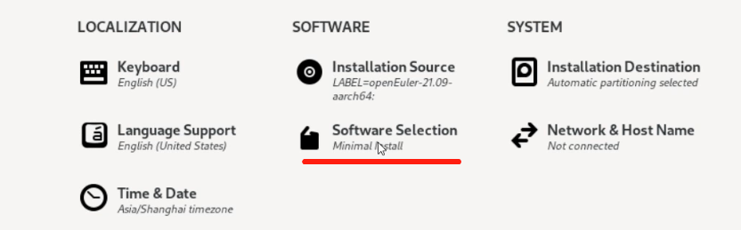
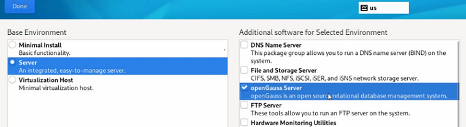

# RPM安装

本章节主要介绍在openEuler操作系统上，通过yum命令一键安装openGauss数据库。

## 支持的架构和操作系统版本以及对应的openGauss版本

| 操作系统                 | 架构   | openauss版本    |
| ----------------------- | ------ | --------------- |
| openEuler 24.03 LTS SP1 | ARM64/x86_64  | openGauss 6.0.0 极简版  |
| openEuler 22.03 LTS SP4 | ARM64/x86_64  | openGauss 5.0.1 Lite   |
| openEuler 24.03 LTS     | ARM64/x86_64  | openGauss 2.1.0 Lite   |
| openEuler 22.03 LTS SP3 | ARM64/x86_64  | openGauss 2.1.0 Lite   |
| openEuler 20.03 LTS SP4 | ARM64/x86_64  | openGauss 2.1.0 Lite   |
| openEuler 22.03 LTS SP1 | ARM64/x86_64  | openGauss 2.1.0 Lite   |

注意：上面列举的都是openEuler正在维护的版本，如果需要openEuler其他版本上安装openGauss，请联系华为技术支持。

## 支持特性

-  从openGauss 5.0.1开始，支持兼容性B库，详细参考[dolphin插件](../ExtensionReference/dolphin概述.md)。
  
## 约束

-  openGauss 6.0.0极简版不包含mot，obs和codegen功能，以及om、cm等外部组件，仅有纯数据库功能（支持兼容性B库）。

## 使用限制

- 当前仅在openEuler操作系统上支持yum方式安装，支持arm64和x86_64两种架构。
- 集成到openEuler系统上的数据库基于openGauss轻量版的能力构建。
- RPM方式安装的仅为单机版数据库实例，升级时候只能替换二进制，不支持灰度升级。
- 默认安装实例监听127.0.0.1:7654地址和端口。如果需要进行远程连接，需要手动修改postgresql.conf文件中的listen_address。
- 安装数据库默认创建用户openGauss，卸载数据库后不删除该用户。

## 安装方式

- 安装完成操作系统后使用yum install安装。

    `yum install opengauss -y`

- 在安装操作系统过程中，software选择openGauss，安装操作系统时候默认安装上openGauss数据库。

## 使用说明

1. 切换到opengauss用户 `su - opengauss`
   
2. 查看进程 `ps ux`, 可以看到，二进制安装目录在 `/usr/local/opengauss`下，默认启动的数据目录在`/var/lib/opengauss/data`目录下。

3. 数据库连接 `gsql -d postgres -p 7654 -r`，数据库默认端口为7654。连接到数据库后，可正常使用数据库。

## 数据库升级

1. 支持从低版本的数据库升级到高版本的数据库。
   注意：不支持从2.1.0 Lite升级到6.0.0 LTS，支持从2.1.0 Lite升级到5.0.1 Lite，以及5.0.1 Lite升级到6.0.0 LTS。

2. 升级操作系统时，数据库也会随之升级。

3. 升级时，只能升级默认安装下的数据库，并且保证数据库进程正常。

4. 升级的数据库的命令是
    `yum install opengauss -y` 或者 `yum update openguass -y`
