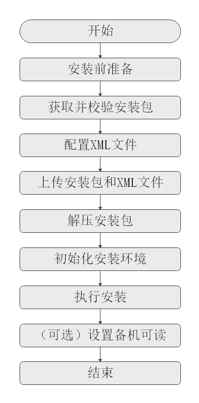

# 了解安装流程

本章节通过流程图简要介绍openGauss的安装流程。

openGauss的安装流程如[图1](#fig18264185162412)所示。

**图 1**  安装流程图  

**表 1**  安装流程图说明

<table><thead align="left"><tr id="zh-cn_topic_0241802562_row16134722161419"><th class="cellrowborder" valign="top" width="19.439999999999998%" id="mcps1.2.3.1.1">
流程

</th>
<th class="cellrowborder" valign="top" width="80.56%" id="mcps1.2.3.1.2">
说明

</th>
</tr>
</thead>
<tbody><tr id="zh-cn_topic_0241802562_row1528811611512"><td class="cellrowborder" valign="top" width="19.439999999999998%" headers="mcps1.2.3.1.1 ">
安装前准备

</td>
<td class="cellrowborder" valign="top" width="80.56%" headers="mcps1.2.3.1.2 ">
openGauss安装前需要准备相应的软硬件环境以及完成相关配置。

本文档提供了openGauss安装所需的最低要求，实际安装中，请用户根据实际情况进行规划。

更多信息，请参考<a href="安装准备_企业版.md">安装准备</a>。

</td>
</tr>
<tr id="zh-cn_topic_0241802562_row12410032134912"><td class="cellrowborder" valign="top" width="19.439999999999998%" headers="mcps1.2.3.1.1 ">
获取并校验安装包

</td>
<td class="cellrowborder" valign="top" width="80.56%" headers="mcps1.2.3.1.2 ">
安装包需要在openGauss开源社区下载并且对安装包内容进行检查，详细请参见<a href="获取安装包_企业版.md">获取安装包</a>。

</td>
</tr>
<tr id="zh-cn_topic_0241802562_row163283014916"><td class="cellrowborder" valign="top" width="19.439999999999998%" headers="mcps1.2.3.1.1 ">
配置XML文件

</td>
<td class="cellrowborder" valign="top" width="80.56%" headers="mcps1.2.3.1.2 ">
安装openGauss前需要创建XML文件。XML文件包含部署openGauss的服务器信息、安装路径、IP地址以及端口号等。用于告知openGauss如何部署。用户需根据不同场景配置对应的XML文件。

关于如何配置XML文件，详细请参见<a href="创建XML配置文件.md">创建XML配置文件</a>。

</td>
</tr>
<tr id="zh-cn_topic_0241802562_row163283014916"><td class="cellrowborder" valign="top" width="19.439999999999998%" headers="mcps1.2.3.1.1 ">
上传安装包和XML文件

</td>
<td class="cellrowborder" valign="top" width="80.56%" headers="mcps1.2.3.1.2 ">
上传安装包和XML配置文件到待安装的服务器。

</td>
</tr>
<tr id="zh-cn_topic_0241802562_row163283014916"><td class="cellrowborder" valign="top" width="19.439999999999998%" headers="mcps1.2.3.1.1 ">
解压安装包

</td>
<td class="cellrowborder" valign="top" width="80.56%" headers="mcps1.2.3.1.2 ">
使用tar命令解压安装包。

</td>
</tr>
<tr id="zh-cn_topic_0241802562_row670315277496"><td class="cellrowborder" valign="top" width="19.439999999999998%" headers="mcps1.2.3.1.1 ">
初始化安装环境

</td>
<td class="cellrowborder" valign="top" width="80.56%" headers="mcps1.2.3.1.2 ">
安装环境的初始化包含上传安装包和XML文件、解压安装包、使用gs_preinstall准备好安装环境。

关于如何初始化安装环境，详细请参见<a href="初始化安装环境.md">初始化安装环境</a>。

</td>
</tr>
<tr id="zh-cn_topic_0241802562_row143781321144912"><td class="cellrowborder" valign="top" width="19.439999999999998%" headers="mcps1.2.3.1.1 ">
执行安装

</td>
<td class="cellrowborder" valign="top" width="80.56%" headers="mcps1.2.3.1.2 ">
使用gs_install安装openGauss。

关于如何执行安装，详细请参见<a href="执行安装.md">执行安装</a>。

</td>
</tr>
<tr id="row895121316211"><td class="cellrowborder" valign="top" width="19.439999999999998%" headers="mcps1.2.3.1.1 ">
设置备机可读

</td>
<td class="cellrowborder" valign="top" width="80.56%" headers="mcps1.2.3.1.2 ">
可选操作。在开启备机可读之后，备机将支持读操作，并满足数据一致性要求。

</td>
</tr>
</tbody>
</table>

