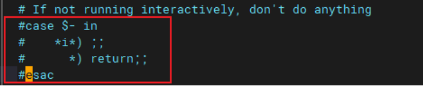

# 安装前置操作

## om适配ubuntu

### 说明

ubuntu 20.04系统安装openGauss数据库
```shell
omm@sdr-0007:~$ uname -a
Linux sdr-0007 5.4.0-190-generic #210-Ubuntu SMP Fri Jul 5 17:03:38 UTC 2024 x86_64 x86_64 x86_64 GNU/Linux
omm@sdr-0007:~$ cat /etc/os-release NAME="Ubuntu"
VERSION="20.04.6 LTS (Focal Fossa)"
ID=ubuntu ID_LIKE=debian
PRETTY_NAME="Ubuntu 20.04.6 LTS"
```

该系统的linux内核版本 = 5.4.0
对应openGauss发布的镜像， centos7=3.10 openEuler20.03=4.19 openEuler22.03=5.10
选择openGauss镜像，需要选择 openEuler 20.03系统。

1. ubuntu默认使用dash作为sh解释器，会导致普通用户没有source命令，此外om里面的脚本均是bash类型，因此需要先修改系统的sh为bash

```shell
unlink /bin/sh
In -s /bin/bash /bin/sh
```

2. 安装数据库需要的依赖。 此外需要建立一个readline.so.7版本的软连接。(这步可以需要具体情况判断是否需要，如果出现readline.so.7找不到，需要执行以下命令)

```shell
apt install libreadline-dev libaio-devel
In -s /usr/lib/x86_64-linux-gnu/libreadline.so.8 /usr/lib/x86_64-linux-gnu/libreadline.so.7
```

3. 创建用户组和用户，并修改 .bashrc ,注释掉case..esac

```shell
groupadd dbgrp
useradd -G dbgrp -U omm
echo "omm:test@123" | chpasswd
```

vi  /home/omm/.bashrc 注释掉这几行：（说明：这几行含义是只允许命令行做source，从脚本里面做source会直接return，导致后面追加的环境变量没法加载）

