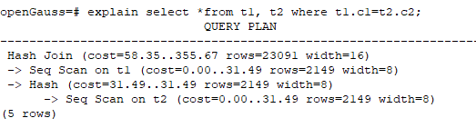

# SQL执行计划概述

SQL执行计划是一个节点树，显示openGauss执行一条SQL语句时执行的详细步骤。每一个步骤为一个数据库运算符。

使用EXPLAIN命令可以查看优化器为每个查询生成的具体执行计划。EXPLAIN给每个执行节点都输出一行，显示基本的节点类型和优化器为执行这个节点预计的开销值。如[图1](#zh-cn_topic_0283137711_zh-cn_topic_0237121510_zh-cn_topic_0073548187_zh-cn_topic_0040046537_fig27100601101634)所示。

**图 1**  SQL执行计划示例  

-   最底层节点是表扫描节点，它扫描表并返回原始数据行。不同的表访问模式有不同的扫描节点类型：顺序扫描、索引扫描等。最底层节点的扫描对象也可能是非表行数据（不是直接从表中读取的数据），如VALUES子句和返回行集的函数，它们有自己的扫描节点类型。
-   如果查询需要连接、聚集、排序、或者对原始行做其它操作，那么就会在扫描节点之上添加其它节点。 并且这些操作通常都有多种方法，因此在这些位置也有可能出现不同的执行节点类型。
-   第一行（最上层节点）是执行计划总执行开销的预计。这个数值就是优化器试图最小化的数值。

## 执行计划显示信息

除了设置不同的执行计划显示格式外，还可以通过不同的EXPLAIN用法，显示不同详细程度的执行计划信息。常见有如下几种，关于更多用法请参见[EXPLAIN](../SQLReference/EXPLAIN.md)语法说明。

-   EXPLAIN  _statement_：只生成执行计划，不实际执行。其中statement代表SQL语句。
-   EXPLAIN ANALYZE  _statement_：生成执行计划，进行执行，并显示执行的概要信息。显示中加入了实际的运行时间统计，包括在每个规划节点内部花掉的总时间（以毫秒计）和它实际返回的行数。
-   EXPLAIN PERFORMANCE  _statement_：生成执行计划，进行执行，并显示执行期间的全部信息。

为了测量运行时在执行计划中每个节点的开销，EXPLAIN ANALYZE或EXPLAIN PERFORMANCE会在当前查询执行上增加性能分析的开销。在一个查询上运行EXPLAIN ANALYZE或EXPLAIN PERFORMANCE有时会比普通查询明显的花费更多的时间。超支的数量依赖于查询的本质和使用的平台。

因此，当定位SQL运行慢问题时，如果SQL长时间运行未结束，建议通过EXPLAIN命令查看执行计划，进行初步定位。如果SQL可以运行出来，则推荐使用EXPLAIN ANALYZE或EXPLAIN PERFORMANCE查看执行计划及其实际的运行信息，以便更精准地定位问题原因。

EXPLAIN PERFORMANCE轻量化执行方式与EXPLAIN PERFORMANCE保持一致，在原来的基础上减少了性能分析的时间，执行时间与SQL执行时间的差异显著减少。

