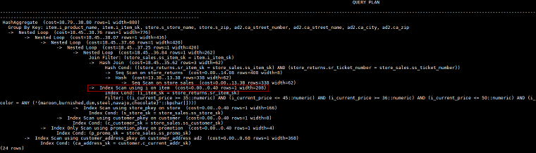

# Scan方式的Hint

## 功能描述<a name="zh-cn_topic_0237121537_section290819468377"></a>

指明scan使用的方法，可以是tablescan、indexscan和indexonlyscan。

## 语法格式<a name="zh-cn_topic_0237121537_section17380317104213"></a>

```
[no] tablescan|indexscan|indexonlyscan(table [index])
```

## 参数说明<a name="zh-cn_topic_0237121537_section35087980143822"></a>

-   **no**表示hint的scan方式不使用。

-   **table**表示hint指定的表，只能指定一个表，如果表存在别名应优先使用别名进行hint。
-   **index**表示使用indexscan或indexonlyscan的hint时，指定的索引名称，当前只能指定一个。

> **说明：**   
>对于indexscan或indexonlyscan，只有hint的索引属于hint的表时，才能使用该hint。  
>scan hint支持在行列存表、obs表、子查询表上指定。  

## 示例<a name="zh-cn_topic_0237121537_section1127715590585"></a>

为了hint使用索引扫描，需要首先在表item的i\_item\_sk列上创建索引，名称为i。

```
create index i on item(i_item_sk);
```

对[示例](Plan-Hint调优概述.md#zh-cn_topic_0237121532_section671421102912)中原语句使用如下hint：

```
explain
select /*+ indexscan(item i) */ i_product_name product_name ...
```

该hint表示：item表使用索引i进行扫描。生成计划如下所示：



