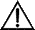

# 子查询调优<a name="ZH-CN_TOPIC_0245374560"></a>

## 子查询背景介绍<a name="zh-cn_topic_0237121525_zh-cn_topic_0118337169_s7525ddd98a4f4ee784a4ca2ffbec1296"></a>

应用程序通过SQL语句来操作数据库时会使用大量的子查询，这种写法比直接对两个表做连接操作在结构上和思路上更清晰，尤其是在一些比较复杂的查询语句中，子查询有更完整、更独立的语义，会使SQL对业务逻辑的表达更清晰更容易理解，因此得到了广泛的应用。

openGauss根据子查询在SQL语句中的位置把子查询分成了子查询、子链接两种形式。

-   子查询SubQuery：对应于查询解析树中的范围表RangeTblEntry，更通俗一些指的是出现在FROM语句后面的独立的SELECT语句。
-   子链接SubLink：对应于查询解析树中的表达式，更通俗一些指的是出现在where/on子句、targetlist里面的语句。

    综上，对于查询解析树而言，SubQuery的本质是范围表，而SubLink的本质是表达式。针对SubLink场景而言，由于SubLink可以出现在约束条件、表达式中，按照openGauss对SubLink的实现，SubLink可以分为以下几类：

    -   exist\_sublink：对应EXIST、NOT EXIST语句
    -   any\_sublink：对应op ALL\(select…\)语句，其中OP可以是IN、<、\>、=操作符
    -   all\_sublink：对应op ALL\(select…\)语句，其中OP可以是IN、<、\>、=操作符
    -   rowcompare\_sublink：对应record op \(select …\)语句
    -   expr\_sublink：对应\(SELECT with single targetlist item ...\)语句
    -   array\_sublink：对应ARRAY\(select…\)语句
    -   cte\_sublink：对应with query\(…\)语句

    其中OLAP、HTAP场景中常用的sublink为exist\_sublink、any\_sublink，在openGauss的优化引擎中对其应用场景做了优化（子链接提升），由于SQL语句中子查询的使用的灵活性，会带来SQL子查询过于复杂造成性能问题。子查询从大类上来看，分为非相关子查询和相关子查询：

    -   **非相关子查询None-Correlated SubQuery**

        子查询的执行不依赖于外层父查询的任何属性值。这样子查询具有独立性，可独自求解，形成一个子查询计划先于外层的查询求解。

        例如：

        ```
        select t1.c1,t1.c2
        from t1
        where t1.c1 in (
            select c2
            from t2
            where t2.c2 IN (2,3,4)
        );
                                      QUERY PLAN
        ----------------------------------------------------------------
         Hash Join 
           Hash Cond: (t1.c1 = t2.c2)
           ->  Seq Scan on t1 
                 Filter: (c1 = ANY ('{2,3,4}'::integer[]))
           ->  Hash 
                 ->  HashAggregate 
                       Group By Key: t2.c2
                       ->  Seq Scan on t2  
                             Filter: (c2 = ANY ('{2,3,4}'::integer[]))
        (9 rows)
        
        ```

    -   **相关子查询Correlated-SubQuery**

        子查询的执行依赖于外层父查询的一些属性值（如下列示例t2.c1 = t1.c1条件中的t1.c1）作为内层查询的一个AND-ed条件。这样的子查询不具备独立性，需要和外层查询按分组进行求解。

        例如：

        ```
        select t1.c1,t1.c2
        from t1
        where t1.c1 in (
            select c2
            from t2
            where t2.c1 = t1.c1 AND t2.c2 in (2,3,4)
        );
                                       QUERY PLAN
        ------------------------------------------------------------------------
         Seq Scan on t1
           Filter: (SubPlan 1)
           SubPlan 1
             ->  Seq Scan on t2
                   Filter: ((c1 = t1.c1) AND (c2 = ANY ('{2,3,4}'::integer[])))
        (5 rows)
        
        ```


## openGauss对SubLink的优化<a name="zh-cn_topic_0237121525_zh-cn_topic_0118337169_section8751034123616"></a>

针对SubLink的优化策略主要是让内层的子查询提升（pullup），能够和外表直接做关联查询，从而避免生成SubPlan+Broadcast內表的执行计划。判断子查询是否存在性能风险，可以通过explain查询语句查看Sublink的部分是否被转换成SubPlan的执行计划。

例如：


箭头右侧执行计划应替换成下面的执行计划：

```
QUERY PLAN
--------------------------------
Seq Scan on t1
Filter: (SubPlan 1)
SubPlan 1
->  Seq Scan on t2
Filter: (c1 = t1.c1)
(5 rows)
```

-   **目前openGauss支持的Sublink-Release场景**
    -   IN-Sublink无相关条件

        -   不能包含上一层查询的表中的列（可以包含更高层查询表中的列）。
        -   不能包含易变函数。

        

        箭头右侧执行计划应替换成下面的执行计划：

        ```
        QUERY PLAN
        --------------------------------------
        Hash Join
        Hash Cond: (t1.c1 = t2.c2)
        ->  Seq Scan on t1
        ->  Hash
        ->  HashAggregate
        Group By Key: t2.c2
        ->  Seq Scan on t2
        Filter: (c1 = 1)
        (8 rows)
        ```

    -   Exist-Sublink包含相关条件

        Where子句中必须包含上一层查询的表中的列，子查询的其它部分不能含有上层查询的表中的列。其它限制如下。

        -   子查询必须有from子句。
        -   子查询不能含有with子句。
        -   子查询不能含有聚集函数。
        -   子查询里不能包含集合操作、排序、limit、windowagg、having操作。
        -   不能包含易变函数。

        

        箭头右侧执行计划应替换成下面的执行计划：

        QUERY PLAN

        -----------------------------------

        Hash Join

        Hash Cond: \(t1.c1 = t2.c1\)

        -\>  Seq Scan on t1

        -\>  Hash

        -\>  HashAggregate

        Group By Key: t2.c1

        -\>  Seq Scan on t2

        \(7 rows\)

    -   包含聚集函数的等值相关子查询的提升

        子查询的where条件中必须含有来自上一层的列，而且此列必须和子查询本层涉及表中的列做相等判断，且这些条件必须用and连接。其它地方不能包含上层的列。其它限制条件如下。

        -   子查询中where条件包含的表达式（列名）必须是表中的列。
        -   子查询的Select关键字后，必须有且仅有一个输出列，此输出列必须是聚集函数（如max），并且聚集函数的参数（t2.c2）不能是来自外层表（t1）中的列。聚集函数不能是count。

            例如，下列示例可以提升。

            ```
            select * from t1 where c1 >(
                   select max(t2.c1) from t2 where t2.c1=t1.c1
            );
            ```

            下列示例不能提升，因为子查询没有聚集函数。

            ```
            select * from t1 where c1 >(
                   select  t2.c1 from t2 where t2.c1=t1.c1
            );
            ```

            下列示例不能提升，因为子查询有两个输出列。

            ```
            select * from t1 where (c1,c2) >(
                   select  max(t2.c1),min(t2.c2) from t2 where t2.c1=t1.c1
            );
            ```

        -   子查询必须是from子句。
        -   子查询中不能有groupby、having、集合操作。
        -   子查询只能是inner join。

            例如：下列示例不能提升。

            ```
            select * from t1 where c1 >(
                   select max(t2.c1) from t2 full join t3 on (t2.c2=t3.c2) where t2.c1=t1.c1
            );
            ```

        -   子查询的targetlist中不能包含返回set的函数。
        -   子查询的where条件中必须含有来自上一层的列，而且此列必须和子查询层涉及表中的列做相等判断，且这些条件必须用and连接。其它地方不能包含上层的上层中的列。例如：下列示例中的最内层子链接可以提升。

            ```
            select * from t3 where t3.c1=(
                    select t1.c1
                    from t1 where c1 >(
                            select max(t2.c1) from t2 where t2.c1=t1.c1 
            ));
            ```

            基于上面的示例，再加一个条件，则不能提升，因为最内侧子查询引用了上层中的列。示例如下：

            ```
            select * from t3 where t3.c1=(
                    select t1.c1
                    from t1 where c1 >(
                           select max(t2.c1) from t2 where t2.c1=t1.c1 and t3.c1>t2.c2
            
            ));
            ```

    -   提升OR子句中的SubLink

        当WHERE过滤条件中有OR连接的EXIST相关SubLink，

        例如：

        ```
        select a, c from t1
        where t1.a = (select avg(a) from t3 where t1.b = t3.b) or
        exists (select * from t4 where t1.c = t4.c);
        ```

        将OR-ed连接的EXIST相关子查询OR字句的提升过程：

        1.  提取where条件中，or子句中的opExpr。为：t1.a = \(select avg\(a\) from t3 where t1.b = t3.b\)
        2.  这个op操作中包含subquery，判断是否可以提升，如果可以提升，重写subquery为：select avg\(a\)、 t3.b from t3 group by t3.b，生成not null条件t3.b is not null，并将这个opexpr用这个not null条件替换。此时SQL变为：

            ```
            select a, c
            from t1 left join (select avg(a) avg, t3.b from t3 group by t3.b)  as t3 on (t1.a = avg and t1.b = t3.b)
            where t3.b is not null or exists (select * from t4 where t1.c = t4.c);
            ```

        3.  再次提取or子句中的exists sublink、exists \(select \* from t4 where t1.c = t4.c\)，判断是否可以提升，如果可以提升，转换subquery为：select t4.c from t4 group by t4.c生成NotNull条件t4.c is not null提升查询，SQL变为：

            ```
            select a, c
            from t1 left join (select avg(a) avg, t3.b from t3 group by t3.b)  as t3 on (t1.a = avg and t1.b = t3.b)
            left join (select t4.c from t4 group by t4.c) where t3.b is not null or t4.c is not null;
            ```


-   **目前openGauss不支持的Sublink-Release场景**

    除了以上场景之外都不支持Sublink提升，因此关联子查询会被计划成SubPlan+Broadcast的执行计划，当inner表的数据量较大时则会产生性能风险。

    如果相关子查询中跟外层的两张表做join，那么无法提升该子查询，需要通过将父SQL创建成with子句，然后再跟子查询中的表做相关子查询查询。

    例如：

    ```
    select distinct t1.a, t2.a
    from t1 left join t2 on t1.a=t2.a and not exists (select a,b from test1 where test1.a=t1.a and test1.b=t2.a);
    ```

    改写为

    ```
    with temp as
    (
            select * from (select t1.a as a, t2.a as b from t1 left join t2 on t1.a=t2.a)
    
    )
    select distinct a,b
    from temp
    where not exists (select a,b from test1 where temp.a=test1.a and temp.b=test1.b);
    ```

    -   出现在targetlist里的相关子查询无法提升（不含count）

        例如：

        ```
        explain (costs off)
        select (select c2 from t2 where t1.c1 = t2.c1) ssq, t1.c2
        from t1
        where t1.c2 > 10;
        ```

        执行计划为：

        ```
        explain (costs off)
        select (select c2 from t2 where t1.c1 = t2.c1) ssq, t1.c2
        from t1
        where t1.c2 > 10;
                   QUERY PLAN
        --------------------------------
         Seq Scan on t1
           Filter: (c2 > 10)
           SubPlan 1
             ->  Seq Scan on t2
                   Filter: (t1.c1 = c1)
        (5 rows)
        ```

        由于相关子查询出现在targetlist（查询返回列表）里，对于t1.c1=t2.c1不匹配的场景仍然需要输出值，因此使用left-outerjoin关联T1&T2确保t1.c1=t2.c1在不匹配时，子SSQ能够返回不匹配的补空值。

        > **说明：**   
        >
        >SSQ和CSSQ的解释如下：  
        >-   SSQ：ScalarSubQuery一般指返回1行1列scalar值的sublink，简称SSQ。  
        >-   CSSQ：Correlated-ScalarSubQuery和SSQ相同不过是指包含相关条件的SSQ。  

        上述SQL语句可以改写为：

        ```
        with ssq as
        (
            select t2.c2 from t2
        )
        select ssq.c2, t1.c2
        from t1 left join ssq on t1.c1 = ssq.c2
        where t1.c2 > 10;
        ```

        改写后的执行计划为：

        ```
                   QUERY PLAN
        ---------------------------------
         Hash Right Join
           Hash Cond: (ssq.c2 = t1.c1)
           CTE ssq
             ->  Seq Scan on t2
           ->  CTE Scan on ssq
           ->  Hash
                 ->  Seq Scan on t1
                       Filter: (c2 > 10)
        (8 rows)
        ```

        可以看到出现在SSQ返回列表里的相关子查询SSQ，已经被提升成Right Join，从而避免当內表T2较大时出现SubPlan计划导致性能变差。

    -   出现在targetlist里的相关子查询无法提升（带count）

        例如：

        ```
        select (select count(*) from t2 where t2.c1=t1.c1) cnt, t1.c1, t3.c1
        from t1,t3
        where t1.c1=t3.c1 order by cnt, t1.c1;
        ```

        执行计划为

        ```
                         QUERY PLAN
        --------------------------------------------
         Sort
           Sort Key: ((SubPlan 1)), t1.c1
           ->  Hash Join
                 Hash Cond: (t1.c1 = t3.c1)
                 ->  Seq Scan on t1
                 ->  Hash
                       ->  Seq Scan on t3
                 SubPlan 1
                   ->  Aggregate
                         ->  Seq Scan on t2
                               Filter: (c1 = t1.c1)
        (11 rows)
        ```

        由于相关子查询出现在targetlist（查询返回列表）里，对于t1.c1=t2.c1不匹配的场景仍然需要输出值，因此使用left-outerjoin关联T1&T2确保t1.c1=t2.c1在不匹配时子SSQ能够返回不匹配的补空值，但是这里带了count语句及时在t1.c1=t2.t1不匹配时需要输出0，因此可以使用一个case-when NULL then 0 else count\(\*\)来代替。

        上述SQL语句可以改写为：

        ```
        with ssq as
        (
            select count(*) cnt, c1 from t2 group by c1
        )
        select case when
                    ssq.cnt is null then 0
                    else ssq.cnt
               end cnt, t1.c1, t3.c1
        from t1 left join ssq on ssq.c1 = t1.c1,t3
        where t1.c1 = t3.c1
        order by ssq.cnt, t1.c1;
        ```

        改写后的执行计划为

        ```
                        QUERY PLAN
        -------------------------------------------
         Sort
           Sort Key: ssq.cnt, t1.c1
           CTE ssq
             ->  HashAggregate
                   Group By Key: t2.c1
                   ->  Seq Scan on t2
           ->  Hash Join
                 Hash Cond: (t1.c1 = t3.c1)
                 ->  Hash Left Join
                       Hash Cond: (t1.c1 = ssq.c1)
                       ->  Seq Scan on t1
                       ->  Hash
                             ->  CTE Scan on ssq
                 ->  Hash
                       ->  Seq Scan on t3
        (15 rows)
        ```

    -   相关条件为不等值场景

        例如：

        ```
        select t1.c1, t1.c2
        from t1
        where t1.c1 = (select agg() from t2.c2 > t1.c2);
        ```

        对于非等值相关条件的SubLink目前无法提升，从语义上可以通过做2次join（一次CorrelationKey，一次rownum自关联）达到提升改写的目的。

        改写方案有两种。

        -   子查询改写方式

            ```
            select t1.c1, t1.c2
            from t1, (
                select t1.rowid, agg() aggref
                from t1,t2
                where t1.c2 > t2.c2 group by t1.rowid
            ) dt /* derived table */
            where t1.rowid = dt.rowid AND t1.c1 = dt.aggref;
            ```

        -   CTE改写方式

            ```
            WITH dt as
            (
                select t1.rowid, agg() aggref
                from t1,t2
                where t1.c2 > t2.c2 group by t1.rowid
            )
            select t1.c1, t1.c2
            from t1, derived_table
            where t1.rowid = derived_table.rowid AND
            t1.c1 = derived_table.aggref;
            ```


    > **须知：**   
    >
    >-   对于AGG类型为count\(\*\)时需要进行CASE-WHEN对没有match的场景补0处理，非COUNT\(\*\)场景NULL处理。  
    >-   CTE改写方式如果有sharescan支持性能上能够更优。  


## 更多优化示例<a name="zh-cn_topic_0237121525_zh-cn_topic_0118337169_s3ec9cccc30fd42868396c57d931f3089"></a>

**示例：**修改select语句，将子查询修改为和主表的join，或者修改为可以提升的subquery，但是在修改前后需要保证语义的正确性。

```
explain (costs off) select * from t1 where t1.c1 in (select t2.c1 from t2 where t1.c1 = t2.c2);
           QUERY PLAN
--------------------------------
 Seq Scan on t1
   Filter: (SubPlan 1)
   SubPlan 1
     ->  Seq Scan on t2
           Filter: (t1.c1 = c2)
(5 rows)
```

上面事例计划中存在一个subPlan，为了消除这个subPlan可以修改语句为：

```
explain (costs off) select * from t1 where exists (select t2.c1 from t2 where t1.c1 = t2.c2 and t1.c1 = t2.c1);
                QUERY PLAN
------------------------------------------
 Hash Join
   Hash Cond: (t1.c1 = t2.c2)
   ->  Seq Scan on t1
   ->  Hash
         ->  HashAggregate
               Group By Key: t2.c2, t2.c1
               ->  Seq Scan on t2
                     Filter: (c2 = c1)
(8 rows)

```

从计划可以看出，subPlan消除了，计划变成了两个表的hash join，这样会大大提高执行效率。

