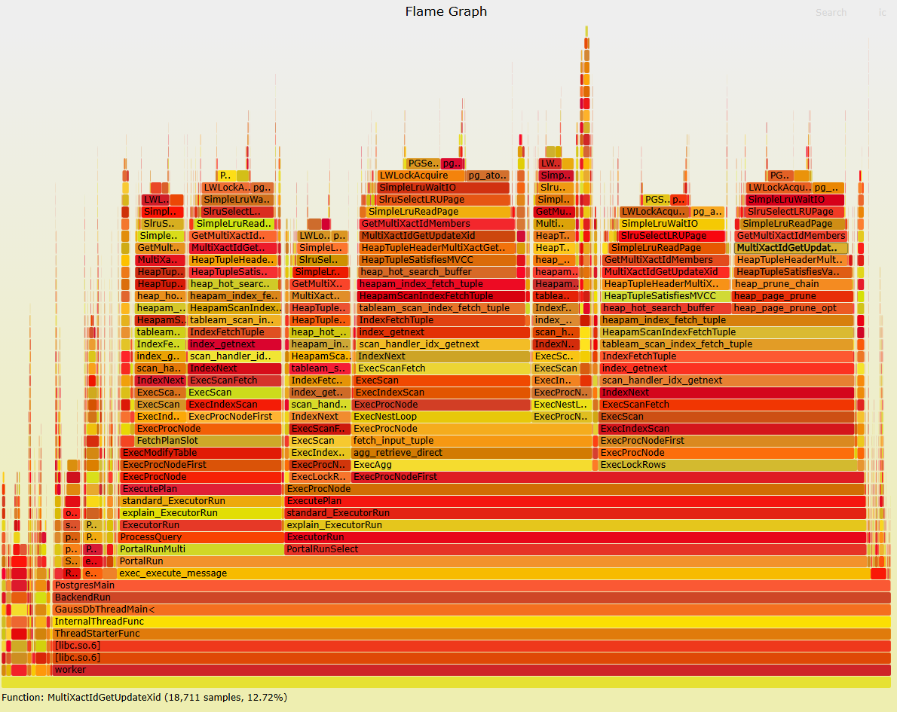

# **案例：子事务TPCC性能调优**

## 现象描述

使用benchmark工具测试tpcc性能时，jdbc配置autosave="always"后，tpcc性能劣化明显。
经测试，500仓200并发，30分钟tpcc相同数据库参数的条件下，不开启autosave="always"，tpmC性能为585258.37，开启autosave="always"，tpmC性能为18322.86，劣化超过96%。


## 优化分析

开启autosave='always'时，benchmark运行时数据库热力图如下所示，`SimpleLruWaitIO`函数占比高达66.5%。从热点可以看出，数据库热点集中在GetMultiXactIdMembers->SimpleLruWaitIO->SimpleLruWaitIO->LWLockAcqurie的流程上。MultiXactId可以理解为多事务id，一般出现执行select for share 或select for update时，当worker线程想要对元组加行锁时，如果发现该元组的xmax不为空，则会生成 multixactId并替换xmax，即一个multixactid意为多个transactionid对同一行元组加锁。openGauss使用multixact offset log和multixact member log存储multixactid信息，并使用类似于数据页面缓冲区管理机制的SLRU管理事务日志的缓存。其中multixactoffsetSLRU容量为8个页面，multixactmemberSLRU16个页面，并使用MultiXactOffsetCtlLock和MultiXactMemberCtrlLock控制页面在SLRU中的换入换出。

不同的事务id组合会生成不同的multixactid，在大量子事务并发的场景下，事务id数量变多，multixactid的数量会成倍增加。经测试，同样环境下，开启autosave会产生532MB的multixact memeber log和271MB的multixact offset log；不开启autosave时，multixact log大小在8k以内。当worker线程进行可见性判断、对tuple行锁时等multixact相关操作时，都可能会涉及到获取SLRU中的multixact信息，此时如果所需multixactid的页面不在内存中，就需要涉及内存中已有页面的换入换出，造成严重的锁冲突和频繁磁盘IO问题。



## 优化建议

openGauss自7.0.0-RC1版本引入优化，新增参数num_slru_buffers，用于设置multixact 相关日志的最大缓存槽位数，通过增大可缓存的最大槽位数，缓解multixact相关的锁冲突和频繁磁盘IO问题。

该场景的推荐配置如下：
```
num_slru_buffers='MXACT_OFFSET=256,MXACT_MEMBER=1024'
```
经测试相同场景，500仓200并发，30分钟tpcc相同数据库参数的条件下，配置num_slru_buffers='MXACT_OFFSET=256,MXACT_MEMBER=1024'，tpmC性能为210545.61，性能提升明显。