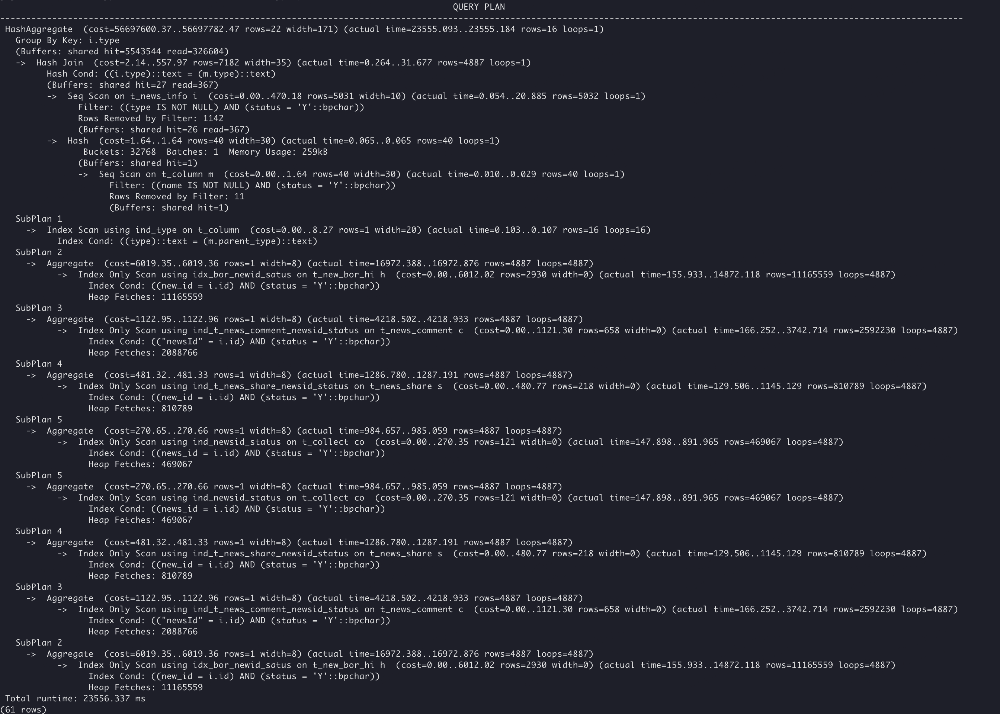

# **案例：改写SQL消除子查询与使用并行查询**

## 现象描述

如下复杂连表查询语句，存在多个子查询，存在性能问题，耗时23秒多。

```sql
SELECT
    count( a.id ) AS newsCount,
    a.type1 AS type,
    a.NAME AS typeName,
    ifnull( a.parentType, '0' ) AS parentType,
    a.columnType AS columnType,
    ( SELECT NAME FROM t_column WHERE type = a.parentType ) AS parentTypeName,
    SUM( a.countRead1 ) AS countRead,
    SUM( a.countComment1 ) AS countComment,
    SUM( a.countShare1 ) AS countShare,
    SUM( a.countCollect1 ) AS countCollect
FROM (
    SELECT 
        i.id AS id,
        i.type AS type1,
        m.NAME AS NAME,
        m.parent_type AS parentType,
        m.column_type AS columnType,
        ( SELECT count(*) FROM t_new_bor_hi h WHERE h.STATUS = 'Y' AND h.new_id = i.id ) countRead1,
        ( SELECT count(*) FROM t_news_comment c WHERE c.STATUS = 'Y' AND c.newsId = i.id ) countComment1,
        ( SELECT count(*) FROM t_news_share s WHERE s.STATUS = 'Y' AND s.new_id = i.id ) countShare1,
        ( SELECT count(*) FROM t_collect co WHERE co.STATUS = 'Y' AND co.news_id = i.id ) countCollect1
    FROM t_news_info i 
    JOIN t_column m ON m.type = i.type AND m.STATUS = 'Y'
    WHERE NAME IS NOT NULL AND i.STATUS = 'Y' and i.type is not null ) a
GROUP BY a.type1;
```

## 优化分析

原始SQL执行计划如下：



根据执行计划可知，此SQL存在大量子查询，且大部分耗时为以下部分：
```sql
SELECT
    i.id AS id,
    i.type AS type1,
    m.NAME AS NAME,
    m.parent_type AS parentType,
    m.column_type AS columnType,
    ( SELECT count(*) FROM t_new_bor_hi h WHERE h.STATUS = 'Y' AND h.new_id = i.id ) countRead1,
    ( SELECT count(*) FROM t_news_comment c WHERE c.STATUS = 'Y' AND c.newsId = i.id ) countComment1,
    ( SELECT count(*) FROM t_news_share s WHERE s.STATUS = 'Y' AND s.new_id = i.id ) countShare1,
    ( SELECT count(*) FROM t_collect co WHERE co.STATUS = 'Y' AND co.news_id = i.id ) countCollect1
FROM t_news_info i
JOIN t_Column m ON m.type = i.type AND m.STATUS = 'Y'
WHERE NAME IS NOT NULL AND i.STATUS = 'Y' and i.type is not null
```
子查询执行计划：


在这种场景下，改写消除子查询无明显性能提升，由于并行查询（SMP）不支持子查询算子，因此原 SQL 也无法直接使用并行查询。 此时需要先改造SQL，消除子查询才能使用并行特性。

将外层的 FROM 子句里面的以下子查询：
```sql
    ( SELECT count(*) FROM t_new_bor_hi h WHERE h.STATUS = 'Y' AND h.new_id = i.id ) countRead1,
    ( SELECT count(*) FROM t_news_comment c WHERE c.STATUS = 'Y' AND c.newsId = i.id ) countComment1,
    ( SELECT count(*) FROM t_news_share s WHERE s.STATUS = 'Y' AND s.new_id = i.id ) countShare1,
    ( SELECT count(*) FROM t_collect co WHERE co.STATUS = 'Y' AND co.news_id = i.id ) countCollect1
```

调整到外层 SELECT 部分后，得到新的 SQL 如下（为了方便比较结果，加上了order by）：
```sql
SELECT
    count( a.id ) AS newsCount,
    a.type1 AS type,
    a.NAME AS typeName,
    ifnull( a.parentType, '0' ) AS parentType,
    a.columnType AS columnType,
    ( SELECT NAME FROM t_column WHERE type = a.parentType ) AS parentTypeName,
    SUM( (SELECT count(*) FROM t_new_bor_hi h WHERE h.STATUS = 'Y' AND h.new_id = a.id) ) AS countRead,
    SUM( (SELECT count( c.id ) FROM t_news_comment c WHERE c.STATUS = 'Y' AND c.newsId = a.id) ) AS countComment,
    SUM( (SELECT count( s.id ) FROM t_news_share s WHERE s.STATUS = 'Y' AND s.new_id = a.id) ) AS countShare,
    SUM( (SELECT count( co.id ) FROM t_collect co WHERE co.STATUS = 'Y' AND co.news_id = a.id) ) AS countCollect
FROM (
    SELECT
        i.id AS id,
        i.type AS type1,
        m.NAME AS NAME,
        m.parent_type AS parentType,
        m.column_type AS columnType
    FROM t_news_info i
    LEFT JOIN t_column m ON m.type = i.type AND m.STATUS = 'Y'
    WHERE NAME IS NOT NULL AND i.STATUS ='Y' and i.type is not null ) a
GROUP BY a.type1 order by newsCount;
```

同时作以下参数配置：
- 设置会话级并⾏参数，开启并行：
```sql
set query_dop = 4;
```
- 设置会话级SQL rewirte参数：
```sql
set rewrite_rule='magicset,intargetlist';
```

最终执行计划如下：


相比原SQL，加上了 order by 后，耗时也只有4秒左右，性能提升约 5 倍。 经比较验证，结果正确。


