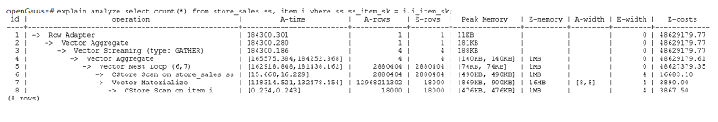
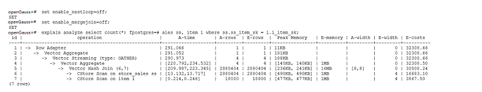
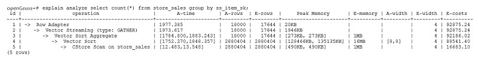
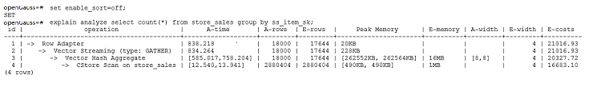

# 算子级调优<a name="ZH-CN_TOPIC_0289900563"></a>

## 算子级调优介绍<a name="zh-cn_topic_0283137632_zh-cn_topic_0237121527_zh-cn_topic_0073253804_zh-cn_topic_0062578364_section1340508119330"></a>

一个查询语句要经过多个算子步骤才会输出最终的结果。由于个别算子耗时过长导致整体查询性能下降的情况比较常见。这些算子是整个查询的瓶颈算子。通用的优化手段是EXPLAIN ANALYZE/PERFORMANCE命令查看执行过程的瓶颈算子，然后进行针对性优化。

如下面的执行过程信息中，Hashagg算子的执行时间占总时间的：\(51016-13535\)/ 56476 ≈66%，此处Hashagg算子就是这个查询的瓶颈算子，在进行性能优化时应当优先考虑此算子的优化。


## 算子级调优示例<a name="zh-cn_topic_0283137632_zh-cn_topic_0237121527_zh-cn_topic_0073253804_zh-cn_topic_0062578364_section22173273193836"></a>

**示例1：**基表扫描时，对于点查或者范围扫描等过滤大量数据的查询，如果使用SeqScan全表扫描会比较耗时，可以在条件列上建立索引选择IndexScan进行索引扫描提升扫描效率。

```
openGauss=#  explain (analyze on, costs off) select * from store_sales where ss_sold_date_sk = 2450944;
 id |             operation          |       A-time        | A-rows | Peak Memory  | A-width
----+--------------------------------+---------------------+--------+--------------+---------
  1 | ->  Streaming (type: GATHER)   | 3666.020            |   3360 | 195KB        |
  2 |    ->  Seq Scan on store_sales | [3594.611,3594.611] |   3360 | [34KB, 34KB] |
(2 rows)

 Predicate Information (identified by plan id) 
-----------------------------------------------
   2 --Seq Scan on store_sales
         Filter: (ss_sold_date_sk = 2450944)
         Rows Removed by Filter: 4968936
```

```
openGauss=#  create index idx on store_sales_row(ss_sold_date_sk);
CREATE INDEX
openGauss=#  explain (analyze on, costs off) select * from store_sales_row where ss_sold_date_sk = 2450944;
 id |                   operation                    |     A-time      | A-rows | Peak Memory  | A-width
----+------------------------------------------------+-----------------+--------+--------------+----------
  1 | ->  Streaming (type: GATHER)                   | 81.524          |   3360 | 195KB        |
  2 |    ->  Index Scan using idx on store_sales_row | [13.352,13.352] |   3360 | [34KB, 34KB] |
(2 rows)
```

上述例子中，全表扫描返回3360条数据，过滤掉大量数据，在ss\_sold\_date\_sk列上建立索引后，使用IndexScan扫描效率显著提高，从3.6秒提升到13毫秒。

**示例2：** 如果从执行计划中看，两表join选择了NestLoop，而实际行数比较大时，NestLoop Join可能执行比较慢。如下的例子中NestLoop耗时181秒，如果设置参数enable\_mergejoin=off关掉Merge Join，同时设置参数enable\_nestloop=off关掉NestLoop，让优化器选择HashJoin，则Join耗时提升至200多毫秒。





**示例3**：通常情况下Agg选择HashAgg性能较好，如果大结果集选择了Sort+GroupAgg，则需要设置enable\_sort=off，HashAgg耗时明显优于Sort+GroupAgg。





