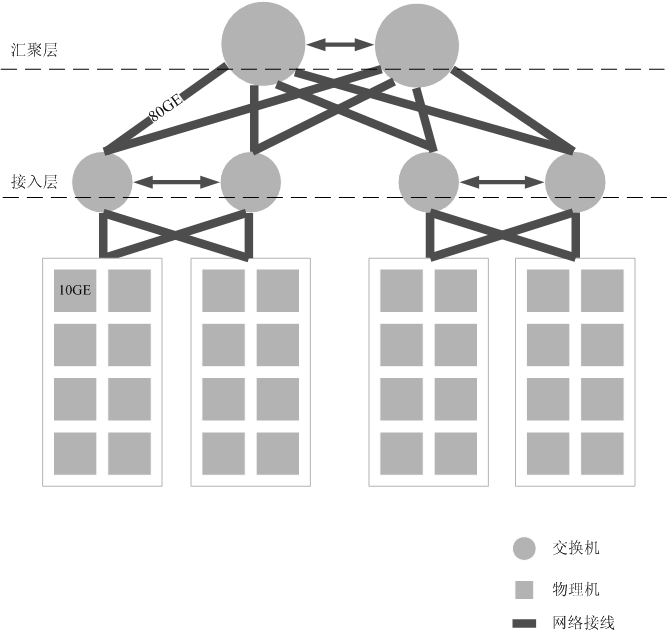

# 了解产品

openGauss是关系型数据库,采用客户端/服务器，单进程多线程架构，支持单机和一主多备部署方式，备机可读，支持双机高可用和读扩展。

## 产品特点

openGauss相比其他开源数据库主要有复合应用场景、高性能和高可用等产品特点。

-   复合应用场景
    -   行存储，支持业务数据频繁更新场景。
    -   列存储，支持业务数据追加和分析场景。
    -   内存表，支持高吞吐，低时延，极高性能场景。
-   高性能
    -   通过多核数据结构，增量检查点，大内存缓冲区管理实现百万级tpmC。
    -   服务端连接池，支持万级并发。
-   高可用
    -   支持主备同步，异步多种部署模式。
    -   数据页CRC校验，损坏数据页通过备机自动修复。
    -   备机并行恢复，10秒内可升主提供服务。
-   AI能力
    -   具备AI4DB能力，包括参数智能调优与诊断、慢SQL发现、索引推荐、时序预测、异常检测等。
    -   具备DB4AI能力，兼容MADlib生态，支持70+算法，性能比原生MADlib有数倍提升，支持XGBoost、GBDT等高级算法。

## 软件架构

openGauss主要包含了openGauss服务器，客户端驱动，OM等模块，本章将介绍这些模块之间的相互关系。

openGauss软件的架构如[图1](#f078d2fc7ab574c8aa05c4a988e0df1b3)所示。在openGauss的文档中，将openGauss服务器称为实例。

**图 1**  软件架构  

图中各模块的含义详见[表1](#t17e13a118cb14f5facbde93d2db56660)。

**表 1**  模块说明

<table><thead align="left"><tr id="r23e99de572e449a48226ecb3a7fdce97"><th class="cellrowborder" valign="top" width="14.530000000000001%" id="mcps1.2.4.1.1">
名称

</th>
<th class="cellrowborder" valign="top" width="32.09%" id="mcps1.2.4.1.2">
描述

</th>
<th class="cellrowborder" valign="top" width="53.38%" id="mcps1.2.4.1.3">
说明

</th>
</tr>
</thead>
<tbody><tr id="rfd4ccf9040a844d1a49cc65c144bb10c"><td class="cellrowborder" valign="top" width="14.530000000000001%" headers="mcps1.2.4.1.1 ">
OM

</td>
<td class="cellrowborder" valign="top" width="32.09%" headers="mcps1.2.4.1.2 ">
运维管理模块（Operation Manager）。提供openGauss日常运维、配置管理的管理接口、工具。

</td>
<td class="cellrowborder" valign="top" width="53.38%" headers="mcps1.2.4.1.3 ">
不同于服务器和客户端驱动模块，OM为用户提供了相关工具对openGauss实例进行管理。

</td>
</tr>
<tr id="r010b48617bed4420ad1ed1f7b5c6039a"><td class="cellrowborder" valign="top" width="14.530000000000001%" headers="mcps1.2.4.1.1 ">
客户端驱动

</td>
<td class="cellrowborder" valign="top" width="32.09%" headers="mcps1.2.4.1.2 ">
客户端驱动（Client Driver）。负责接收来自应用的访问请求，并向应用返回执行结果；负责与openGauss实例的通信，下发SQL在openGauss实例上执行，并接收命令执行结果。

</td>
<td class="cellrowborder" valign="top" width="53.38%" headers="mcps1.2.4.1.3 ">
负责接收来自应用的访问请求，并向应用返回执行结果。客户端驱动负责建立到openGauss实例的链接，把应用的SQL命令传输给openGauss实例，接收openGauss实例命令执行结果。

客户端驱动和应用运行在同一个进程内，部署在同一个物理节点。

</td>
</tr>
<tr id="r76b2e096c5fa4c4f9b26fb06ecb41827"><td class="cellrowborder" valign="top" width="14.530000000000001%" headers="mcps1.2.4.1.1 ">
openGauss主（备）

</td>
<td class="cellrowborder" valign="top" width="32.09%" headers="mcps1.2.4.1.2 ">
openGauss主（备）。负责存储业务数据（支持行存、列存、内存表存储）、执行数据查询任务以及向客户端驱动返回执行结果。

</td>
<td class="cellrowborder" valign="top" width="53.38%" headers="mcps1.2.4.1.3 ">
负责存储业务数据、执行数据查询任务以及向客户端驱动返回执行结果。

openGauss实例包含主、备两种类型。支持一主多备。建议将主、备openGauss分散部署在不同的物理节点中。

</td>
</tr>
<tr id="r239ecf59d9624912a07ca573b95d71e1"><td class="cellrowborder" valign="top" width="14.530000000000001%" headers="mcps1.2.4.1.1 ">
Storage

</td>
<td class="cellrowborder" valign="top" width="32.09%" headers="mcps1.2.4.1.2 ">
服务器的本地存储资源，持久化存储数据。

</td>
<td class="cellrowborder" valign="top" width="53.38%" headers="mcps1.2.4.1.3 ">
-

</td>
</tr>
</tbody>
</table>

## 典型组网

为了保证整个应用数据的安全性，建议将openGauss的典型组网划分为两个独立网络：前端业务网络和数据管理存储网络。

**图 2**  典型组网  

网络划分说明如[表2](#zh-cn_topic_0085434654_zh-cn_topic_0059782024_tb80dc4a120b64f6093f63535ce9998ef)所示。

**表 2**  网络划分

<table><thead align="left"><tr id="zh-cn_topic_0085434654_zh-cn_topic_0059782024_r157fdb513ba046169c041938f8315c67"><th class="cellrowborder" valign="top" width="21.62%" id="mcps1.2.3.1.1">
类型

</th>
<th class="cellrowborder" valign="top" width="78.38000000000001%" id="mcps1.2.3.1.2">
描述

</th>
</tr>
</thead>
<tbody><tr id="zh-cn_topic_0085434654_zh-cn_topic_0059782024_rc849bac0400340e4b0844f155986cf8e"><td class="cellrowborder" valign="top" width="21.62%" headers="mcps1.2.3.1.1 ">
数据库管理存储网络

</td>
<td class="cellrowborder" valign="top" width="78.38000000000001%" headers="mcps1.2.3.1.2 ">
DBA通过此网络调用OM脚本管理和维护openGauss实例。同时，用于openGauss主备通信组网。数据库管理存储网络也是应用执行系统监控的网络。

</td>
</tr>
<tr id="zh-cn_topic_0085434654_zh-cn_topic_0059782024_r8ce2e458c24243cd8e5035626c37982d"><td class="cellrowborder" valign="top" width="21.62%" headers="mcps1.2.3.1.1 ">
前端业务网络

</td>
<td class="cellrowborder" valign="top" width="78.38000000000001%" headers="mcps1.2.3.1.2 ">
外部客户端通过此网络访问openGauss数据库。

</td>
</tr>
</tbody>
</table>

该典型组网有如下优点：

-   业务网络与数据库管理存储网络的隔离，有效保护了后端存储数据的安全。
-   业务网络和数据库管理存储网络的隔离，可以防止攻击者通过互联网试图对数据库服务器进行管理操作，增加了系统安全性。

网络独占性及1:1的带宽收敛比是openGauss数据库网络性能的基本要求。因此，在生产系统中，对[图2](#zh-cn_topic_0085434654_zh-cn_topic_0059782024_fa885dc600f6a4c38860244454d95c7e4)中的后端存储网络，需满足独占性及至少1:1收敛比的要求。例如，[图3](#zh-cn_topic_0085434654_zh-cn_topic_0059782024_fig397545395542)中，其本质是Fattree组网方式。为实现收敛比1：1，交换网络层级每提高一层，带宽增加一倍。图中每根加粗连接线代表80GE带宽，即8台物理机带宽上限之和。接入层每单台交换机下行带宽160GE，上行带宽160GE，收敛比1:1；汇聚层每单台交换机接入带宽320GE。

对于测试系统，上述要求可以适当降低。

**图 3**  数据库管理存储网络组网示例  

