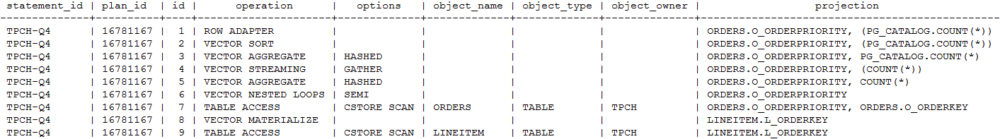

# EXPLAIN PLAN<a name="ZH-CN_TOPIC_0289900301"></a>

## 功能描述<a name="zh-cn_topic_0283136849_zh-cn_topic_0237122164_section0601642305"></a>

通过EXPLAIN PLAN命令可以将查询执行的计划信息存储于PLAN\_TABLE表中。与EXPLAIN命令不同的是，EXPLAIN PLAN仅将计划信息进行存储，而不会打印到屏幕。

## 语法格式<a name="zh-cn_topic_0283136849_zh-cn_topic_0237122164_zh-cn_topic_0165816825_section1531318315427"></a>

```
EXPLAIN PLAN
[ SET STATEMENT_ID = string ]
FOR statement ;
```

## 参数说明<a name="zh-cn_topic_0283136849_zh-cn_topic_0237122164_zh-cn_topic_0165816825_section12263165913464"></a>

-   EXPLAIN中的PLAN选项表示需要将计划信息存储于PLAN\_TABLE中，存储成功将返回“EXPLAIN SUCCESS”。
-   STATEMENT\_ID用户可以对查询设置标签，输入的标签信息也将存储于PLAN\_TABLE中。

    > **说明：** 
    >
    >用户在执行EXPLAIN PLAN时，如果没有进行SET  STATEMENT\_ID，则默认为空值。同时，用户可输入的STATEMENT\_ID最大长度为30个字节，超过长度将会产生报错。


## 注意事项<a name="zh-cn_topic_0283136849_zh-cn_topic_0237122164_zh-cn_topic_0165816825_section74641935135611"></a>

-   EXPLAIN PLAN不支持在数据库节点上执行。
-   对于执行错误的SQL无法进行计划信息的收集。
-   PLAN\_TABLE中的数据是session级生命周期并且session隔离和用户隔离，用户只能看到当前session、当前用户的数据。

## 示例<a name="zh-cn_topic_0283136849_zh-cn_topic_0237122164_zh-cn_topic_0165816825_section1128872085512"></a>

使用EXPLAIN  PLAN收集SQL语句的执行计划，通常包括以下步骤：

1.  执行EXPLAIN PLAN。

    > **说明：** 
    >执行EXPLAIN PLAN 后会将计划信息自动存储于PLAN\_TABLE中，不支持对PLAN\_TABLE进行INSERT、UPDATE、ANALYZE等操作。
    >PLAN\_TABLE详细介绍见[PLAN\_TABLE](../DatabaseReference/PLAN_TABLE.md)。

    ```
    explain plan set statement_id='TPCH-Q4' for
    select
    o_orderpriority,
    count(*) as order_count
    from
    orders
    where
    o_orderdate >= '1993-07-01'::date
    and o_orderdate < '1993-07-01'::date + interval '3 month'
    and exists (
    select
    *
    from
    lineitem
    where
    l_orderkey = o_orderkey
    and l_commitdate < l_receiptdate
    )
    group by
    o_orderpriority
    order by
    o_orderpriority;
    ```

2.  查询PLAN\_TABLE。

    ```
    SELECT * FROM PLAN_TABLE;
    ```

    

3.  清理PLAN\_TABLE表中的数据。

    ```
    DELETE FROM PLAN_TABLE WHERE xxx;
    ```


