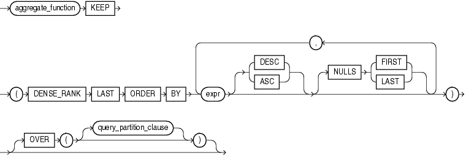

# KEEP函数

## KEEP函数<a name="zh-cn_topic_0283137174_zh-cn_topic_0237121983_zh-cn_topic_0059778391_s454ef5048f3142508bc4f06cb3454ebe"></a>

仅在openGauss数据库A模式下支持KEEP函数的使用，该函数用于对一组行中的值进行操作，将这组行按照指定的排序规则排序后返回排在第一或最后的值。可以将其用作聚合或分析函数。

列存表目前暂不支持；

该函数语法如下：
aggregate_function KEEP ( DENSE_RANK { FIRST | LAST } ORDER BY expr [ DESC | ASC ] [ NULLS { FIRST | LAST } ] [, expr [ DESC | ASC ] [ NULLS { FIRST | LAST } ]]...
)[ OVER ( [query_partition_clause] ) ]




参数说明：

| 参数                      | 解释说明                                                                                               |
|---------------------------|-------------------------------------------------------------------------------------------------------|
| aggregate_function        | 指定聚合函数的种类。                                                                                    |
| DENSE_RANK                | 为各组内值生成连续排序序号，其中相同的值具有相同序号。                                                     |
| expr                      | 可以是任何表达式。                                                                                      |
| FIRST/LAST                | 指定返回 expr 排序后那个位置的值。FIRST表示返回排在首位的值。LAST返回排在最后的值。                         |
| DESC/ASC                  | 指定列表的排序方式，为可选项。ASC为升序排序，默认值。DESC为降序排序。                                       |
| NULLS { FIRST/LAST }      | 排序后 expr 中 NULL 值的位置，为可选项。NULLS FIRST表示 NULL值排在非空值的前面。NULLS LAST表示NULL值排在非空值的后面，为默认值。                                                                                                                        |
| OVER                      | 使用 OVER 子句定义窗口进行计算。                                             |
| query_partition_clause    | 用于定义窗口函数的分区依据，指定对哪些列进行分组。数据会按这些列的值进行划分，每个分区内的数据会单独进行窗口计算。|

keep函数支持的聚集函数列表：
| 函数名称      | 描述                                                        |
|---------------|-------------------------------------------------------------|
| min(expression) | 所有输入行中 expression 的最小值。                       |
| max(expression) | 所有输入行中 expression 的最大值。                       |
| sum(expression) | 所有输入行的 expression 总和。                           |
| avg(expression) | 所有输入值的均值（算术平均）。                             |
| count(expression) | 返回查询到的数据的数量。                                 |
| stddev(expression) | stddev_samp 的别名，计算一组数值的样本标准差。           |
| variance(expression) | var_samp 的别名，计算一组数值的样本方差。               |

> **说明：** 
>
>KEEP函数用于对一组行中的值进行操作，将这组行按照指定的排序规则排序后返回排在第一或最后的值。可以将其用作聚合或分析函数。


- 示例
 ```
--创建表 employees，并向里面插入数据。

create database db dbcompatibility 'A';
CREATE DATABASE

\c db
Non-SSL connection (SSL connection is recommended when requiring high-security)
You are now connected to database "db" as user "hmy".

CREATE TABLE employees (department_id INT,manager_id INT,last_name varchar(50),hiredate varchar(50),SALARY INT);
CREATE TABLE

INSERT INTO employees VALUES
(30, 100, 'Raphaely', '2017-07-01', 1700),
(30, 100, 'De Haan', '2018-05-01',11000),
(40, 100, 'Errazuriz', '2017-07-21', 1400),
(50, 100, 'Hartstein', '2019-10-05',14000),
(50, 100, 'Raphaely', '2017-07-22', 1700),
(50, 100, 'Weiss',  '2019-10-05',13500),
(90, 100, 'Russell', '2019-07-11', 13000),
(90,100, 'Partners',  '2018-12-01',14000);
INSERT 0 8

--（1）聚合函数示例
--按照薪水排序，对排在第一的员工的薪水求和；按照雇用日期排序，对排在最后的员工的薪水求和。
SELECT SUM(salary) KEEP (DENSE_RANK FIRST ORDER BY salary) "W", SUM(salary) KEEP (DENSE_RANK LAST ORDER BY hiredate) "B" FROM employees;
  W   |   B   
------+-------
 1400 | 27500
(1 row)
--（2）分析函数示例
--对于每个部门按照薪水排序，对排在第一的员工的薪水求和；按照雇用日期排序，对排在最后的员工的薪水求和。
SELECT last_name,department_id,salary, SUM(salary) KEEP (DENSE_RANK FIRST ORDER BY salary) OVER (PARTITION BY department_id) "W", SUM(salary) KEEP (DENSE_RANK LAST ORDER BY hiredate) OVER (PARTITION BY department_id) "B" FROM employees ORDER BY department_id, salary, last_name;
 last_name | department_id | salary |   W   |   B   
-----------+---------------+--------+-------+-------
 Raphaely  |            30 |   1700 |  1700 | 11000
 De Haan   |            30 |  11000 |  1700 | 11000
 Errazuriz |            40 |   1400 |  1400 |  1400
 Raphaely  |            50 |   1700 |  1700 | 27500
 Weiss     |            50 |  13500 |  1700 | 27500
 Hartstein |            50 |  14000 |  1700 | 27500
 Russell   |            90 |  13000 | 13000 | 13000
 Partners  |            90 |  14000 | 13000 | 13000
(8 rows)
 ```

    
