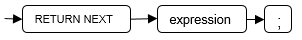
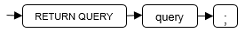

# RETURN NEXT及RETURN QUERY<a name="ZH-CN_TOPIC_0245374622"></a>

## 语法<a name="zh-cn_topic_0237122232_section66906369117"></a>

创建函数时需要指定返回值SETOF datatype。

return\_next\_clause::=



return\_query\_clause::=



对以上语法的解释如下：

当需要函数返回一个集合时，使用RETURN NEXT或者RETURN QUERY向结果集追加结果，然后继续执行函数的下一条语句。随着后续的RETURN NEXT或RETURN QUERY命令的执行，结果集中会有多个结果。函数执行完成后会一起返回所有结果。

RETURN NEXT可用于标量和复合数据类型。

RETURN QUERY有一种变体RETURN QUERY EXECUTE，后面还可以增加动态查询，通过USING向查询插入参数。

## 示例<a name="zh-cn_topic_0237122232_section663313751118"></a>

```
openGauss=# CREATE TABLE t1(a int);
openGauss=# INSERT INTO t1 VALUES(1),(10);

--RETURN NEXT
openGauss=# CREATE OR REPLACE FUNCTION fun_for_return_next() RETURNS SETOF t1 AS $$
DECLARE
   r t1%ROWTYPE;
BEGIN
   FOR r IN select * from t1
   LOOP
      RETURN NEXT r;
   END LOOP;
   RETURN;
END;
$$ LANGUAGE PLPGSQL;
openGauss=# call fun_for_return_next();
 a
---
 1
 10
(2 rows)

-- RETURN QUERY
openGauss=# CREATE OR REPLACE FUNCTION fun_for_return_query() RETURNS SETOF t1 AS $$
DECLARE
   r t1%ROWTYPE;
BEGIN
   RETURN QUERY select * from t1;
END;
$$
language plpgsql;
openGauss=# call fun_for_return_query();
 a
---
 1
 10
(2 rows)
```

