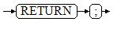

# RETURN

## 语法

返回语句的语法请参见[图1](#zh-cn_topic_0237122231_zh-cn_topic_0059778007_f7ff63e01e2a840c69a1c17b91e7dc3eb)。

**图 1**  return\_clause::=  

对以上语法的解释如下：

用于将控制从存储过程或函数返回给调用者。

## 示例

请参见调用语句的[示例](调用语句.md#zh-cn_topic_0237122223_zh-cn_topic_0059778001_scfc5c5fdac3e4a11a915ebac95b49f79)。

