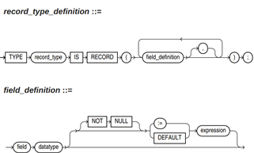

# record<a name="ZH-CN_TOPIC_0245374605"></a>

## record类型的变量<a name="zh-cn_topic_0237122215_section16992418680"></a>

创建一个record变量的方式：

定义一个record类型 ，然后使用该类型来声明一个变量。

## 语法<a name="zh-cn_topic_0237122215_section7403195020496"></a>

record类型的语法参见[图1](#zh-cn_topic_0237122215_fig092918316312)。

**图 1**  record类型的语法<a name="zh-cn_topic_0237122215_fig092918316312"></a>  


对以上语法格式的解释如下：

-   record\_type：声明的类型名称。
-   field：record类型中的成员名称。
-   datatype：record类型中成员的类型。
-   expression：设置默认值的表达式。

> **说明：**   
>在openGauss中：  
>-   record类型变量的赋值支持：  
>    1. 在函数或存储过程的声明阶段，声明一个record类型，并且可以在该类型中定义成员变量。  
>    2. 一个record变量到另一个record变量的赋值。  
>    3. SELECT INTO和FETCH向一个record类型的变量中赋值。  
>    4. 将一个NULL值赋值给一个record变量。  
>-   不支持INSERT和UPDATE语句使用record变量进行插入数据和更新数据。  
>-   如果成员有复合类型，在声明阶段不支持指定默认值，该行为同声明阶段的变量一样。
>
>-   date_type也可以为存储过程中定义的record类型、数组类型和集合类型（匿名块不支持）。 

## 示例<a name="zh-cn_topic_0237122215_zh-cn_topic_0059778979_s471412484c0048debf8a78d76cf1a439"></a>

```
下面示例中用到的表定义如下：
openGauss=# \d emp_rec
                Table "public.emp_rec"
  Column  |              Type              | Modifiers 
----------+--------------------------------+-----------
 empno    | numeric(4,0)                   | not null
 ename    | character varying(10)          | 
 job      | character varying(9)           | 
 mgr      | numeric(4,0)                   | 
 hiredate | timestamp(0) without time zone | 
 sal      | numeric(7,2)                   | 
 comm     | numeric(7,2)                   | 
 deptno   | numeric(2,0)                   | 

--演示在函数中对数组进行操作。
openGauss=# CREATE OR REPLACE FUNCTION regress_record(p_w VARCHAR2)
RETURNS
VARCHAR2  AS $$
DECLARE

   --声明一个record类型.
   type rec_type is record (name  varchar2(100), epno int);
   employer rec_type;

   --使用%type声明record类型
   type rec_type1 is record (name  emp_rec.ename%type, epno int not null :=10);
   employer1 rec_type1;

   --声明带有默认值的record类型
   type rec_type2 is record (
         name varchar2 not null := 'SCOTT', 
         epno int not null :=10);
    employer2 rec_type2;
    CURSOR C1 IS  select ename,empno from emp_rec order by 1 limit 1;
            
BEGIN
      --对一个record类型的变量的成员赋值。
     employer.name := 'WARD';
     employer.epno = 18;
     raise info 'employer name: % , epno:%', employer.name, employer.epno;

     --将一个record类型的变量赋值给另一个变量。
     employer1 := employer;
     raise info 'employer1 name: % , epno: %',employer1.name, employer1.epno;
         
      --将一个record类型变量赋值为NULL。
     employer := NULL;
     raise info 'employer name: % , epno: %',employer.name, employer.epno;

      --获取record变量的默认值。
     raise info 'employer2 name: % ,epno: %', employer2.name, employer2.epno;
            
      --在for循环中使用record变量
      for employer in select ename,empno from emp_rec order by 1  limit 1 
          loop 
               raise info 'employer name: % , epno: %', employer.name, employer.epno;
          end loop;
         
      --在select into 中使用record变量。
      select ename,empno  into employer2 from emp_rec order by 1 limit 1;
      raise info 'employer name: % , epno: %', employer2.name, employer2.epno;
            
      --在cursor中使用record变量。
      OPEN C1;
      FETCH C1 INTO employer2;
      raise info 'employer name: % , epno: %', employer2.name, employer2.epno;
      CLOSE C1;        
      RETURN employer.name;
END;
$$
LANGUAGE plpgsql;

--调用该函数。
openGauss=# CALL regress_record('abc');

--删除函数。
openGauss=# DROP FUNCTION regress_record;
```

