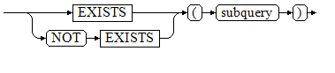
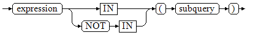
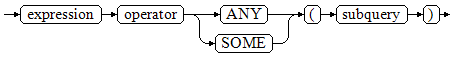
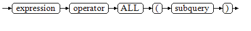

# 子查询表达式

子查询表达式主要有以下几种：

-   EXISTS/NOT EXISTS

    EXISTS/NOT EXISTS的语法图请参见[图1](#zh-cn_topic_0283136595_zh-cn_topic_0237122003_zh-cn_topic_0059777701_f0d971ea580d241e5a0dca682165b4d16)。

    **图 1**  EXISTS/NOT EXISTS::=<a name="zh-cn_topic_0283136595_zh-cn_topic_0237122003_zh-cn_topic_0059777701_f0d971ea580d241e5a0dca682165b4d16"></a>  
    

    EXISTS的参数是一个任意的SELECT语句，或者说子查询。系统对子查询进行运算以判断它是否返回行。如果它至少返回一行，则EXISTS结果就为“真”；如果子查询没有返回任何行，EXISTS的结果是“假”。

    这个子查询通常只是运行到能判断它是否可以生成至少一行为止，而不是等到全部结束。

    示例：

    ```
    openGauss=# SELECT sr_reason_sk,sr_customer_sk FROM tpcds.store_returns WHERE EXISTS (SELECT d_dom FROM tpcds.date_dim WHERE d_dom = store_returns.sr_reason_sk and sr_customer_sk <10);
    sr_reason_sk | sr_customer_sk 
    --------------+----------------
               13 |              2
               22 |              5
               17 |              7
               25 |              7
                3 |              7
               31 |              5
                7 |              7
               14 |              6
               20 |              4
                5 |              6
               10 |              3
                1 |              5
               15 |              2
                4 |              1
               26 |              3
    (15 rows)
    ```

-   IN/NOT IN

    IN/NOT IN的语法请参见[图2](#zh-cn_topic_0283136595_zh-cn_topic_0237122003_zh-cn_topic_0059777701_fd3c74d5deb5f456bab447575214b74b0)。

    **图 2**  IN/NOT IN::=<a name="zh-cn_topic_0283136595_zh-cn_topic_0237122003_zh-cn_topic_0059777701_fd3c74d5deb5f456bab447575214b74b0"></a>  
    

    右边是一个圆括弧括起来的子查询，它必须只返回一个字段。左边表达式对子查询结果的每一行进行一次计算和比较。如果找到任何相等的子查询行，则IN结果为“真”。如果没有找到任何相等行，则结果为“假”（包括子查询没有返回任何行的情况）。

    表达式或子查询行里的NULL遵照SQL处理布尔值和NULL组合时的规则。如果两个行对应的字段都相等且非空，则这两行相等；如果任意对应字段不等且非空，则这两行不等；否则结果是未知（NULL）。如果每一行的结果都是不等或NULL ，并且至少有一个NULL ，则IN的结果是NULL 。

    示例：

    ```
    openGauss=# SELECT sr_reason_sk,sr_customer_sk  FROM tpcds.store_returns WHERE sr_customer_sk IN (SELECT d_dom FROM tpcds.date_dim WHERE d_dom < 10);
    sr_reason_sk | sr_customer_sk 
    --------------+----------------
               10 |              3
               26 |              3
               22 |              5
               31 |              5
                1 |              5
               32 |              5
               32 |              5
                4 |              1
               15 |              2
               13 |              2
               33 |              4
               20 |              4
               33 |              8
                5 |              6
               14 |              6
               17 |              7
                3 |              7
               25 |              7
                7 |              7
    (19 rows)
    ```

-   ANY/SOME

    ANY/SOME的语法图请参见[图3](#zh-cn_topic_0283136595_zh-cn_topic_0237122003_zh-cn_topic_0059777701_f34ef57cea9fe4936b6874f259ee5bc0f)。

    **图 3**  any/some::=<a name="zh-cn_topic_0283136595_zh-cn_topic_0237122003_zh-cn_topic_0059777701_f34ef57cea9fe4936b6874f259ee5bc0f"></a>  
    

    右边是一个圆括弧括起来的子查询，它必须只返回一个字段。左边表达式使用operator对子查询结果的每一行进行一次计算和比较，其结果必须是布尔值。如果至少获得一个真值，则ANY结果为“真”。如果全部获得假值，则结果是“假”（包括子查询没有返回任何行的情况）。SOME是ANY的同义词。IN与ANY可以等效替换 。

    示例：

    ```
    openGauss=# SELECT sr_reason_sk,sr_customer_sk  FROM tpcds.store_returns WHERE sr_customer_sk < ANY (SELECT d_dom FROM tpcds.date_dim WHERE d_dom < 10);
    sr_reason_sk | sr_customer_sk 
    --------------+----------------
               26 |              3
               17 |              7
               32 |              5
               32 |              5
               13 |              2
               31 |              5
               25 |              7
                5 |              6
                7 |              7
               10 |              3
                1 |              5
               14 |              6
                4 |              1
                3 |              7
               22 |              5
               33 |              4
               20 |              4
               33 |              8
               15 |              2
    (19 rows)
    ```

-   ALL

    ALL的语法请参见[图4](#zh-cn_topic_0283136595_zh-cn_topic_0237122003_zh-cn_topic_0059777701_fdf5a38b067314bf7b8847e80f5346f52)。

    **图 4**  all::=<a name="zh-cn_topic_0283136595_zh-cn_topic_0237122003_zh-cn_topic_0059777701_fdf5a38b067314bf7b8847e80f5346f52"></a>  
    

    右边是一个圆括弧括起来的子查询，它必须只返回一个字段。左边表达式使用operator对子查询结果的每一行进行一次计算和比较，其结果必须是布尔值。如果全部获得真值，ALL结果为“真”（包括子查询没有返回任何行的情况）。如果至少获得一个假值，则结果是“假”。

    示例：

    ```
    openGauss=# SELECT sr_reason_sk,sr_customer_sk  FROM tpcds.store_returns WHERE sr_customer_sk < all(SELECT d_dom FROM tpcds.date_dim WHERE d_dom < 10);
     sr_reason_sk | sr_customer_sk 
    --------------+----------------
    (0 rows)
    
    ```


