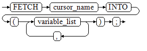

# 显式游标<a name="ZH-CN_TOPIC_0245374634"></a>

显式游标主要用于对查询语句的处理，尤其是在查询结果为多条记录的情况下。

## 处理步骤<a name="zh-cn_topic_0237122244_zh-cn_topic_0059778930_sc5b784c0452149129c10634ecba2baa7"></a>

显式游标处理需六个PL/SQL步骤：

1. 定义静态游标：就是定义一个游标名，以及与其相对应的SELECT语句。

   定义静态游标的语法图，请参见[图1](#zh-cn_topic_0237122244_zh-cn_topic_0059778930_f3cd97ed9f2474aa785f5626e468a75de)。

   **图 1**  static\_cursor\_define::=<a name="zh-cn_topic_0237122244_zh-cn_topic_0059778930_f3cd97ed9f2474aa785f5626e468a75de"></a>  
   

   参数说明：

   -   cursor\_name：定义的游标名。
   -   parameter：游标参数，只能为输入参数，其格式为：

       ```
       parameter_name datatype
       ```

   -   select\_statement：查询语句。

   > **说明：**   
   >
   >+ 根据执行计划的不同，系统会自动判断该游标是否可以用于以倒序的方式检索数据行。  
   >+ 语法上支持parameter为输出参数，但其行为与输入参数保持一致。

   **定义动态游标：**指ref游标，可以通过一组静态的SQL语句动态的打开游标。首先定义ref游标类型，然后定义该游标类型的游标变量，在打开游标时通过OPEN FOR动态绑定SELECT语句。

   定义动态游标的语法图，请参见[图2](#zh-cn_topic_0237122244_zh-cn_topic_0059778930_f1579c1867b984124b10da33d032a55b0)和[图3](#zh-cn_topic_0237122244_zh-cn_topic_0059778930_fceaf870eaa73494496e8a65e7afc8cec)。

   **图 2**  cursor\_typename::=<a name="zh-cn_topic_0237122244_zh-cn_topic_0059778930_f1579c1867b984124b10da33d032a55b0"></a>  
   

   **图 3**  dynamic\_cursor\_define::=<a name="zh-cn_topic_0237122244_zh-cn_topic_0059778930_fceaf870eaa73494496e8a65e7afc8cec"></a>  
   

2.  打开静态游标：就是执行游标所对应的SELECT语句，将其查询结果放入工作区，并且指针指向工作区的首部，标识游标结果集合。如果游标查询语句中带有FOR UPDATE选项，OPEN语句还将锁定数据库表中游标结果集合对应的数据行。

    打开静态游标的语法图，请参见[图4](#zh-cn_topic_0237122244_zh-cn_topic_0059778930_fac5b397fa6184f35a416626255a9280d)。

    **图 4**  open\_static\_cursor::=<a name="zh-cn_topic_0237122244_zh-cn_topic_0059778930_fac5b397fa6184f35a416626255a9280d"></a>  
    

    **打开动态游标：**可以通过OPEN FOR语句打开动态游标，动态绑定SQL语句。

    打开动态游标的语法图，请参见[图5](#zh-cn_topic_0237122244_zh-cn_topic_0059778930_f8e95270034c744b3bec53bd78cf56a22)。

    **图 5**  open\_dynamic\_cursor::=<a name="zh-cn_topic_0237122244_zh-cn_topic_0059778930_f8e95270034c744b3bec53bd78cf56a22"></a>  
    

    PL/SQL程序不能用OPEN语句重复打开一个游标。

3.  提取游标数据：检索结果集合中的数据行，放入指定的输出变量中。

    提取游标数据的语法图，请参见[图6](#zh-cn_topic_0237122244_zh-cn_topic_0059778930_f0759ffa7118d4c4481c0f0fd9a600351)。

    **图 6**  fetch\_cursor::=<a name="zh-cn_topic_0237122244_zh-cn_topic_0059778930_f0759ffa7118d4c4481c0f0fd9a600351"></a>  
    

4.  对该记录进行处理。
5.  继续处理，直到活动集合中没有记录。
6.  关闭游标：当提取和处理完游标结果集合数据后，应及时关闭游标，以释放该游标所占用的系统资源，并使该游标的工作区变成无效，不能再使用FETCH语句获取其中数据。关闭后的游标可以使用OPEN语句重新打开。

    关闭游标的语法图，请参见[图7](#zh-cn_topic_0237122244_zh-cn_topic_0059778930_fdd13133c237949828f65e55cb3ec2f5b)。

    **图 7**  close\_cursor::=<a name="zh-cn_topic_0237122244_zh-cn_topic_0059778930_fdd13133c237949828f65e55cb3ec2f5b"></a>  
    


## 属性<a name="zh-cn_topic_0237122244_zh-cn_topic_0059778930_s1bdd24dd1cbd463db67fcb2eb8a5dfbd"></a>

游标的属性用于控制程序流程或者了解程序的状态。当运行DML语句时，PL/SQL打开一个内建游标并处理结果，游标是维护查询结果的内存中的一个区域，游标在运行DML语句时打开，完成后关闭。显式游标的属性为：

-   %FOUND布尔型属性：当最近一次读记录时成功返回，则值为TRUE。
-   %NOTFOUND布尔型属性：与%FOUND相反。
-   %ISOPEN布尔型属性：当游标已打开时返回TRUE。
-   %ROWCOUNT数值型属性：返回已从游标中读取的记录数。

