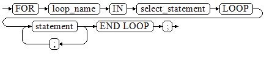

# 游标循环

游标在WHILE语句、LOOP语句中的使用称为游标循环，一般这种循环都需要使用OPEN、FETCH和CLOSE语句。下面要介绍的一种循环不需要这些操作，可以简化游标循环的操作，这种循环方式适用于静态游标的循环，不用执行静态游标的四个步骤。

## 语法

FOR AS循环的语法请参见[图1](#zh-cn_topic_0237122246_zh-cn_topic_0059778239_fd1982700d7d8496a9358b5d029a0123b)。

**图 1**  FOR\_AS\_loop::=  

## 注意事项

-   不能在该循环语句中对查询的表进行更新操作。
-   变量loop\_name会自动定义且只在此循环中有效，类型和select\_statement的查询结果类型一致。loop\_name的取值就是select\_statement的查询结果。
-   变量loop_name在编译过程中不会解析具体的类型，如果有需要解析具体类型的场景（比如loop_name作为重载函数或者存储过程的出入参）会编译报错。如需解析变量的具体类型，可以设置参数behavior_compat_options='allow_procedure_compile_check'。
-   游标的属性中%FOUND、%NOTFOUND、%ROWCOUNT在openGauss数据库中都是访问同一个内部变量，事务和匿名块不支持多个游标同时访问。

