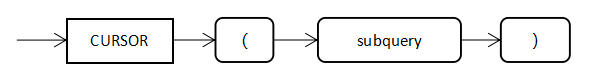

# 游标表达式

语法格式：




游标表达式一般用于嵌套游标或者构造游标参数场景，如下为一些使用样例：

使用样例：

```
-- 样例表
create table test1(id int, name varchar, job varchar);
create table test2(id int, age int);
insert into test1 values (1, 'zhang', 'worker'),(2, 'li', 'teacher'),(3, 'wang', 'engineer');
insert into test2 values (1, 20),(2, 30),(3, 40);

-- 在匿名块中使用游标表达式样例
openGauss=# DECLARE CURSOR c1 IS SELECT t.age, CURSOR(SELECT name FROM test1 t1 where t1.id = t.id) abc FROM test2 t;
openGauss-#   age_temp int;
openGauss-#   name_temp varchar;
openGauss-#   type emp_cur_type is ref cursor;
openGauss-#   c2 emp_cur_type;
openGauss-# BEGIN
openGauss$#   OPEN c1;
openGauss$#   loop
openGauss$#     fetch c1 into age_temp, c2;
openGauss$#     exit when c1%notfound;
openGauss$#     raise notice 'age : %',age_temp;
openGauss$#     loop
openGauss$#         fetch c2 into name_temp;
openGauss$#         exit when c2%notfound;
openGauss$#         raise notice 'name : %', name_temp;
openGauss$#     end loop;
openGauss$#     close c2;
openGauss$#   end loop;
openGauss$#   CLOSE c1;
openGauss$# END;
openGauss$# /
NOTICE:  age : 20
NOTICE:  name : zhang
NOTICE:  age : 30
NOTICE:  name : li
NOTICE:  age : 40
NOTICE:  name : wang
ANONYMOUS BLOCK EXECUTE
openGauss=#


-- 在存储过程中使用游标表达式样例
openGauss=# create or replace procedure test_cursor_expression
openGauss-# as
openGauss$#     age_temp int;
openGauss$#     name_temp varchar;
openGauss$#     type emp_cur_type is ref cursor;
openGauss$#     c2 emp_cur_type;
openGauss$#     cursor c1 is SELECT t.age, CURSOR(SELECT name FROM test1 t1 where t1.id = t.id) abc FROM test2 t;
openGauss$# begin
openGauss$#     OPEN c1;
openGauss$#     loop
openGauss$#     fetch c1 into age_temp, c2;
openGauss$#     exit when c1%notfound;
openGauss$#     raise notice 'age : %',age_temp;
openGauss$#       loop
openGauss$#          fetch c2 into name_temp;
openGauss$#          exit when c2%notfound;
openGauss$#          raise notice 'name : %', name_temp;
openGauss$#       end loop;
openGauss$#       close c2;
openGauss$#     end loop;
openGauss$#     CLOSE c1;
openGauss$# end;
openGauss$# /
CREATE PROCEDURE
openGauss=# call test_cursor_expression();
NOTICE:  age : 20
NOTICE:  name : zhang
NOTICE:  age : 30
NOTICE:  name : li
NOTICE:  age : 40
NOTICE:  name : wang
 test_cursor_expression
------------------------

(1 row)

openGauss=# drop procedure test_cursor_expression;
DROP PROCEDURE
openGauss=#


-- 游标表达式作为SYS_REFCURSOR参数
openGauss=# CREATE FUNCTION f(cur SYS_REFCURSOR)
openGauss-#    RETURN NUMBER IS
openGauss$#    name_temp varchar;
openGauss$#    count_temp number:=0;
openGauss$# begin
openGauss$#    loop
openGauss$#    fetch cur into name_temp;
openGauss$#    exit when cur%NOTFOUND;
openGauss$#    count_temp:=count_temp+1;
openGauss$#    end loop;
openGauss$#    close cur;
openGauss$#    return count_temp;
openGauss$# end;
openGauss$# /
CREATE FUNCTION
openGauss=#
openGauss=# select * from test1 where f(cursor(select name from test1)) > 0;
 id | name  |   job
----+-------+----------
  1 | zhang | worker
  2 | li    | teacher
  3 | wang  | engineer
(3 rows)

openGauss=#

```

