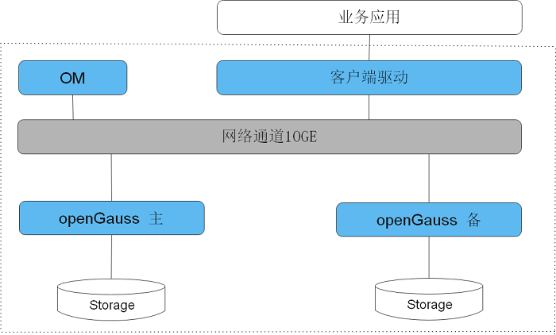

# 软件架构

openGauss是单机系统，在这样的系统架构中，业务数据存储在单个物理节点上，数据访问任务被推送到服务节点执行，通过服务器的高并发，实现对数据处理的快速响应。同时日志复制可以把数据复制到备机，提供数据的高可靠和读扩展。

openGauss支持主备部署，openGauss逻辑架构如[图1](#zh-cn_concept_0283139007_zh-cn_topic_0237080634_zh-cn_topic_0231764167_fig5205420191411)所示。

**图 1**  openGauss逻辑架构图  

**表 1**  架构说明

<table><thead align="left"><tr id="zh-cn_concept_0283139007_zh-cn_topic_0237080634_zh-cn_topic_0231764167_row4411284819151"><th class="cellrowborder" valign="top" width="14.469999999999999%" id="mcps1.2.3.1.1">
名称

</th>
<th class="cellrowborder" valign="top" width="85.53%" id="mcps1.2.3.1.2">
描述

</th>
</tr>
</thead>
<tbody><tr id="zh-cn_concept_0283139007_zh-cn_topic_0237080634_zh-cn_topic_0231764167_row3200216592122"><td class="cellrowborder" valign="top" width="14.469999999999999%" headers="mcps1.2.3.1.1 ">
OM

</td>
<td class="cellrowborder" valign="top" width="85.53%" headers="mcps1.2.3.1.2 ">
运维管理模块（Operation Manager），提供数据库日常运维、配置管理的管理接口、工具。

</td>
</tr>
<tr id="row117405422415"><td class="cellrowborder" valign="top" width="14.469999999999999%" headers="mcps1.2.3.1.1 ">
CM

</td>
<td class="cellrowborder" valign="top" width="85.53%" headers="mcps1.2.3.1.2 ">
集群管理模块（Cluster Manager）。管理和监控数据库系统中各个功能单元和物理资源的运行情况，确保整个系统的稳定运行。

</td>
</tr>  
<tr id="zh-cn_concept_0283139007_zh-cn_topic_0237080634_zh-cn_topic_0231764167_row6476976919151"><td class="cellrowborder" valign="top" width="14.469999999999999%" headers="mcps1.2.3.1.1 ">
客户端驱动

</td>
<td class="cellrowborder" valign="top" width="85.53%" headers="mcps1.2.3.1.2 ">
客户端驱动（Client Driver），负责接收来自应用的访问请求，并向应用返回执行结果。客户端驱动负责与openGauss实例通信，发送应用的SQL命令，接收openGauss实例的执行结果。

</td>
</tr>
<tr id="zh-cn_concept_0283139007_zh-cn_topic_0237080634_zh-cn_topic_0231764167_row5813821019151"><td class="cellrowborder" valign="top" width="14.469999999999999%" headers="mcps1.2.3.1.1 ">
openGauss（主备）

</td>
<td class="cellrowborder" valign="top" width="85.53%" headers="mcps1.2.3.1.2 ">
openGauss主备（Datanode），负责存储业务数据、执行数据查询任务以及向客户端返回执行结果。

openGauss实例包含主、备两种类型，支持一主多备。建议将主、备openGauss实例分散部署在不同的物理节点中。

</td>
</tr>
<tr id="zh-cn_concept_0283139007_zh-cn_topic_0237080634_zh-cn_topic_0231764167_row4354812919183"><td class="cellrowborder" valign="top" width="14.469999999999999%" headers="mcps1.2.3.1.1 ">
Storage

</td>
<td class="cellrowborder" valign="top" width="85.53%" headers="mcps1.2.3.1.2 ">
服务器的本地存储资源，持久化存储数据。

</td>
</tr>
</tbody>
</table>

