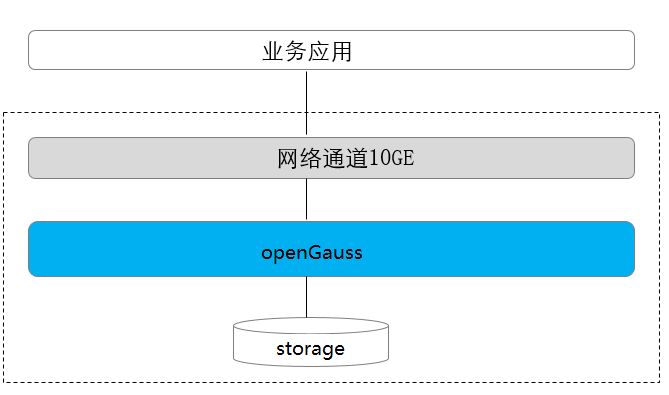
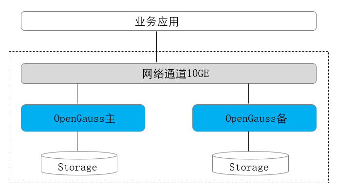
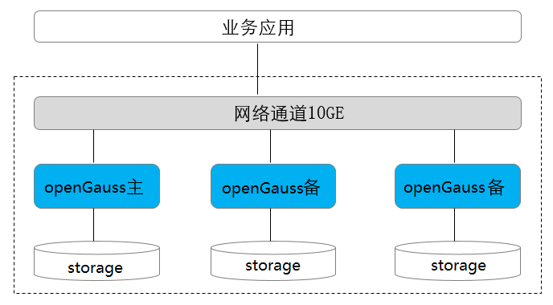
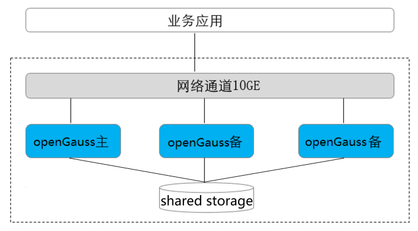
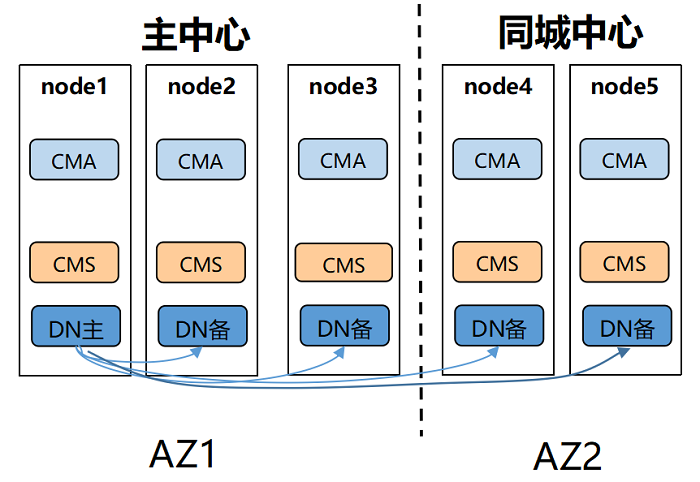
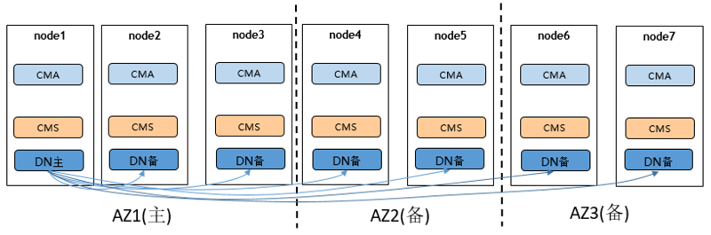
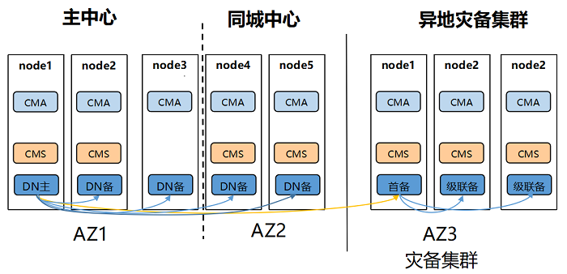

# 部署方案

openGauss支持单机部署和一主多备部署两种部署形态。

## 常用概念

-   单机

    单机指的是只有一个数据库实例。

-   双机

    双机指的是系统中存在主备数据库实例，主实例支持读写，备实例支持只读。

-   一主多备

    一主多备指的是在系统存在一个主机，多个备机。openGauss最多支持8个备机。

-   冷热备份

    冷备份：是指备份就是一个简单的备份集，不可以提供服务。

    热备份：是指备份实例可以对外提供服务 。

## 部署形态汇总

单机和双机两种部署形态方案介绍请见[表1](#zh-cn_topic_0243295239_zh-cn_topic_0240782908_table138801827134510)。

**表 1**  openGauss部署形态汇总表

<table><thead align="left"><tr id="zh-cn_topic_0243295239_zh-cn_topic_0240782908_row88806271452"><th class="cellrowborder" valign="top" width="7.830783078307831%" id="mcps1.2.8.1.1">
部署形态

</th>
<th class="cellrowborder" valign="top" width="11.561156115611562%" id="mcps1.2.8.1.2">
技术方案

</th>
<th class="cellrowborder" valign="top" width="10.051005100510052%" id="mcps1.2.8.1.3">
高可用

</th>
<th class="cellrowborder" valign="top" width="10.671067106710671%" id="mcps1.2.8.1.4">
基础设置要求

</th>
<th class="cellrowborder" valign="top" width="10.41104110411041%" id="mcps1.2.8.1.5">
业务场景

</th>
<th class="cellrowborder" valign="top" width="20.99209920992099%" id="mcps1.2.8.1.6">
场景特点

</th>
<th class="cellrowborder" valign="top" width="28.48284828482848%" id="mcps1.2.8.1.7">
技术规格

</th>
</tr>
</thead>
<tbody><tr id="zh-cn_topic_0243295239_zh-cn_topic_0240782908_row18811277455"><td class="cellrowborder" valign="top" width="7.830783078307831%" headers="mcps1.2.8.1.1 ">
单机

</td>
<td class="cellrowborder" valign="top" width="11.561156115611562%" headers="mcps1.2.8.1.2 ">
单机

</td>
<td class="cellrowborder" valign="top" width="10.051005100510052%" headers="mcps1.2.8.1.3 ">
无高可用能力

</td>
<td class="cellrowborder" valign="top" width="10.671067106710671%" headers="mcps1.2.8.1.4 ">
单机房

</td>
<td class="cellrowborder" valign="top" width="10.41104110411041%" headers="mcps1.2.8.1.5 ">
物理机

</td>
<td class="cellrowborder" valign="top" width="20.99209920992099%" headers="mcps1.2.8.1.6 "><ul id="zh-cn_topic_0243295239_zh-cn_topic_0240782908_ul61827011712"><li>对系统的可靠性和可用性无任何要求</li><li>主要用于体验试用以及调测场景</li></ul>
</td>
<td class="cellrowborder" valign="top" width="28.48284828482848%" headers="mcps1.2.8.1.7 "><ul id="zh-cn_topic_0243295239_zh-cn_topic_0240782908_ul83681420142312"><li>系统RTO和RPO不可控</li><li>无实例级容灾能力，一旦出现实例故障，系统不可用</li><li>一旦实例级数据丢失，则数据永久丢失，无法恢复</li></ul>
</td>
</tr>
<tr id="zh-cn_topic_0243295239_zh-cn_topic_0240782908_row16881142774510"><td class="cellrowborder" valign="top" width="7.830783078307831%" headers="mcps1.2.8.1.1 ">
主备

</td>
<td class="cellrowborder" valign="top" width="11.561156115611562%" headers="mcps1.2.8.1.2 ">
主机+备机

</td>
<td class="cellrowborder" valign="top" width="10.051005100510052%" headers="mcps1.2.8.1.3 ">
抵御实例级故障

</td>
<td class="cellrowborder" valign="top" width="10.671067106710671%" headers="mcps1.2.8.1.4 ">
单机房

</td>
<td class="cellrowborder" valign="top" width="10.41104110411041%" headers="mcps1.2.8.1.5 ">
物理机

</td>
<td class="cellrowborder" valign="top" width="20.99209920992099%" headers="mcps1.2.8.1.6 "><ul id="zh-cn_topic_0243295239_zh-cn_topic_0240782908_ul617272701813"><li>节点间无网络延迟</li><li>要求承受实例级故障</li><li>适用于对系统可靠性要求不高的场景</li></ul>
</td>
<td class="cellrowborder" valign="top" width="28.48284828482848%" headers="mcps1.2.8.1.7 "><ul id="zh-cn_topic_0243295239_zh-cn_topic_0240782908_ul15571133112234"><li>RPO=0</li><li>实例故障RTO&lt;10s</li><li>无AZ级容灾能力</li><li>推荐主备最大可用模式</li></ul>
</td>
</tr>
<tr id="zh-cn_topic_0243295239_zh-cn_topic_0240782908_row1188192764517"><td class="cellrowborder" valign="top" width="7.830783078307831%" headers="mcps1.2.8.1.1 ">
一主多备

</td>
<td class="cellrowborder" valign="top" width="11.561156115611562%" headers="mcps1.2.8.1.2 ">
主机+多个备机 Quorum/Paxos

</td>
<td class="cellrowborder" valign="top" width="10.051005100510052%" headers="mcps1.2.8.1.3 ">
抵御实例级故障

</td>
<td class="cellrowborder" valign="top" width="10.671067106710671%" headers="mcps1.2.8.1.4 ">
单机房

</td>
<td class="cellrowborder" valign="top" width="10.41104110411041%" headers="mcps1.2.8.1.5 ">
物理机

</td>
<td class="cellrowborder" valign="top" width="20.99209920992099%" headers="mcps1.2.8.1.6 "><ul id="zh-cn_topic_0243295239_zh-cn_topic_0240782908_ul1473717417212"><li>节点间无网络延迟</li><li>要求承受实例级故障</li></ul>
</td>
<td class="cellrowborder" valign="top" width="28.48284828482848%" headers="mcps1.2.8.1.7 "><ul id="zh-cn_topic_0243295239_zh-cn_topic_0240782908_ul13758194392316"><li>RPO=0</li><li>实例故障RTO&lt;10s</li><li>无AZ级容灾能力</li><li>推荐主备同步模式</li><li>最少2个副本，最多4个副本</li></ul>
</td>
</tr>
</tbody>
</table>

## 软硬件规格说明

openGauss支持的CPU和OS见下表。

**表 2**  openGauss软硬件规格

<table><thead align="left"><tr id="zh-cn_topic_0243295239_zh-cn_topic_0240782908_row1521418485347"><th class="cellrowborder" valign="top" width="33.33333333333333%" id="mcps1.2.4.1.1">
交付模式

</th>
<th class="cellrowborder" valign="top" width="33.33333333333333%" id="mcps1.2.4.1.2">
CPU

</th>
<th class="cellrowborder" valign="top" width="33.33333333333333%" id="mcps1.2.4.1.3">
OS

</th>
</tr>
</thead>
<tbody><tr id="zh-cn_topic_0243295239_zh-cn_topic_0240782908_row18214144823411"><td class="cellrowborder" rowspan="2" valign="top" width="33.33333333333333%" headers="mcps1.2.4.1.1 ">
开源线下

</td>
<td class="cellrowborder" valign="top" width="33.33333333333333%" headers="mcps1.2.4.1.2 ">
x86

</td>
<td class="cellrowborder" valign="top" width="33.33333333333333%" headers="mcps1.2.4.1.3 ">
CentOS 7.6、openEuler 20.03 LTS、openEuler 22.03 LTS、Asianux 7.6

</td>
</tr>
<tr id="zh-cn_topic_0243295239_zh-cn_topic_0240782908_row221414883410"><td class="cellrowborder" valign="top" headers="mcps1.2.4.1.1 ">
鲲鹏

</td>
<td class="cellrowborder" valign="top" headers="mcps1.2.4.1.2 ">
openEuler 20.03 LTS、openEuler 22.03 LTS、麒麟V10、Asianux 7.5

</td>
</tr>
</tbody>
</table>

## 部署方案介绍

整体部署方案可以分为四类：单机部署、一主一备部署、一主多备部署、资源池化部署。

-   单机部署

    单机部署形态是一种非常特殊的部署形态，这种形态对于可靠性、可用性均无任何保证。由于只有一个数据副本，一旦发生数据损坏、丢失，只能通过物理备份恢复数据。这种部署形态，一般用于数据库体验用户，以及测试环境做语法功能调测等场景。不建议用于商业现网运行。

    **图 1**  单机部署形态图    
     
    
-   主备部署

    主备模式相当于两个数据副本，主机和备机各一个数据副本，备机接受日志、执行日志回放。

    **图 2**  主备部署形态图  
    

-   一主多备部署

    多副本的部署形态，提供了抵御实例级故障的能力，适用于不要求机房级别容灾，但是需要抵御个别硬件故障的应用场景。

    一般多副本部署时使用1主2备模式，总共3个副本，3个副本的可靠性为99.99%，可以满足大多数应用的可靠性要求。

    -   主备间Quorum复制，至少同步到一台备机，保证最大性能。
    -   主备任意一个节点故障，不影响业务的进行。
    -   数据有三份，任何一个节点故障，系统仍然有双份数据确保继续运行。任何一个备份都可以升主。
    -   主备实例之间不可部署在同一台物理机上。

    **图 3**  一主多备部署形态图  
    

-   资源池化部署

    基于磁阵设备的主备资源池化HA部署形态，只支持主备部署在同一磁阵设备上，不支持容灾部署，也不支持主备混合部署（如主和备部署在不同的磁阵设备上）。

    **图 4** 资源池化部署形态图
    

## 常见主备部署方案

### 单中心

**图 4**  单中心部署图  
    

组网特点：
单AZ部署，可以配置一个同步备一个异步备

优势：
1. 三个node完全等价，故障任意一个node都可以提供服务
2. 成本低

劣势：
高可用能力较低，发生AZ级故障只能依赖节点恢复

适用性：
适用于对高可用性要求较低的业务系统

### 同城双中心

**图 5**  同城双中心部署图  
    

组网特点：
同城两个AZ，相比单AZ可靠性更强，主中心和同城中心可以分别配置一个同步备

优势：
1. 同城同步复制，任意一个中心故障，另一个中心还可以提供服务，数据不丢失，RPO=0
2. 成本适中

劣势：
1. 同城距离不宜太远，一般建议70km以内，业务设计要考虑读写次数过多导致的总延时
2. 不具备异地容灾能力

适用性：
适用于一般业务系统

### 两地三中心

**图 6**  两地三中心部署图  
    

组网特点：
两地三中心，每个AZ都保证至少有一个同步备，同时地点和中心数的增加，集群的可靠性能够达到最高

优势：
具备异地容灾能力，并且能够保证异地容灾数据不丢失，RPO=0，可靠性最强

劣势：
1. 异地距离较远，若在异地中心配置了同步备，可能会影响性能
2. 成本较高

适用性：
适用于核心重要业务系统

### 两地三中心流式容灾方案

**图 7**  两地三中心流式容灾方案部署图  
    

组网特点：
双集群容灾方案，两个独立集群，主备集群组网方式可任意选择，备集群会选出首备连接主集群的主DN，灾备集群内都以级联备方式连接首备

优势：
1. 主集群具备单集群组网的优点，只有主集群彻底不可用后才需要手动切换为备集群
2. 跨集群(异地)复制链路无论是否发生容灾切换都只有一条，占用网络带宽相对较少
3. 组网更加灵活，主集群和灾备集群都可以选择不同的组网

劣势：
1. 需要增加灾备集群，相应增加成本
2. 异地灾备RPO>0

适用性：
适用于核心重要业务系统

> **说明：** 
以上为一些典型的部署方案，用户可以依据自身实际业务场景对以上各种部署方案进行调整，比如增减备机数量、调整中心数量、适当安置同步备和异步备、适当使用级联备机等

