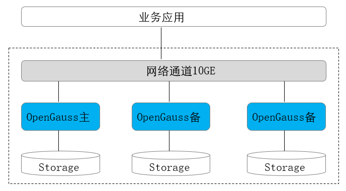

# 一主多备部署

多副本的部署形态，提供了抵御实例级故障的能力，。适用于不要求机房级别容灾，但是需要抵御个别硬件故障的应用场景。

一般多副本部署时使用1主2备模式，总共3个副本，3个副本的可靠性为4个9，可以满足大多数应用的可靠性要求。

-   主备间Quorum复制，至少同步到一台备机，保证最大性能。
-   主备任意一个节点故障，不影响业务的进行。
-   数据有三份，任何一个节点故障，系统仍然有双份数据确保继续运行。任何一个备份都可以升主。
-   主备实例之间不可部署在同一台物理机上。

**图 1**  一主多备部署形态图  

