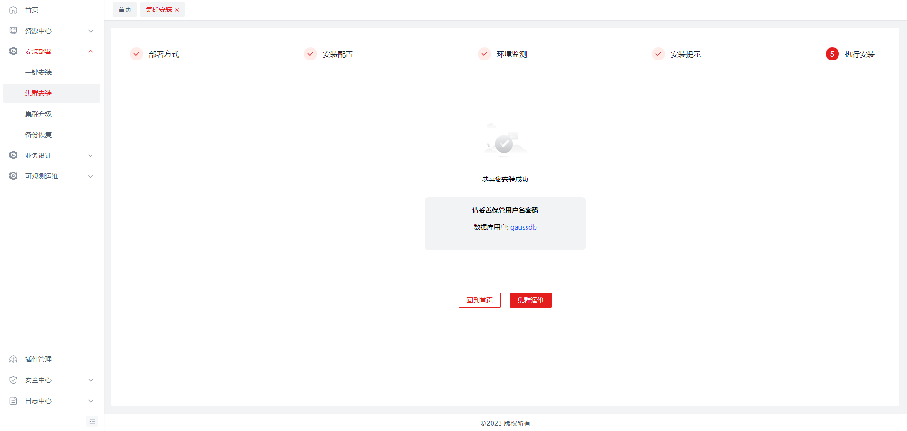
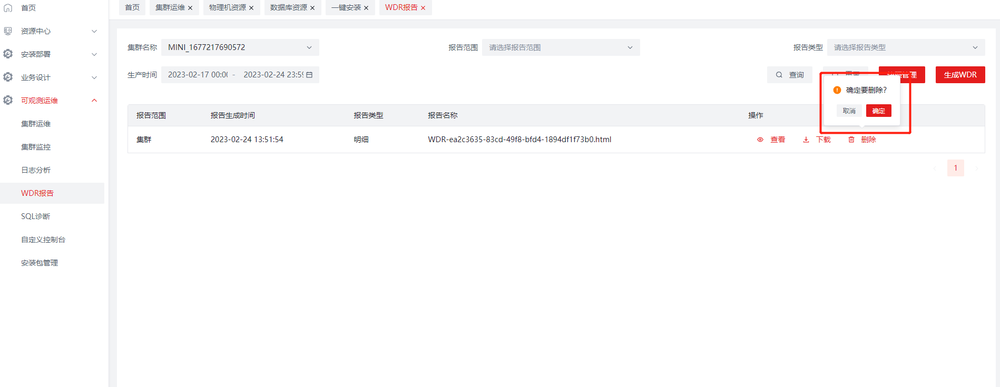

# 基础运维

## 功能介绍
基础运维提供的主要功能如下：
<table>
    <tr>
        <th>特性名称</th>
        <th>特性描述</th>
        <th>备注</th>
    </tr>
    <tr>
        <td>集群安装</td>
        <td>支持openGauss企业版、极简版、轻量版安装</td>
        <td>支持3.0.0+</td>  
    </tr>
    <tr>
        <td>集群导入</td>
        <td>支持openGauss企业版、极简版、轻量版导入</td>
        <td>支持3.0.0+</td>  
    </tr>
    <tr>
        <td>一键安装</td>
        <td>支持openGauss一键安装</td>
        <td>无</td>  
    </tr>
    <tr>
        <td>集群升级</td>
        <td>支持openGauss企业版升级</td>
        <td>支持3.0.0+</td>  
    </tr>
    <tr>
        <td>集群运维</td>
        <td>支持openGauss企业版、极简版、轻量版的各类运维操作，例如：启动、停止、卸载、备机重建等</td>
        <td>支持3.0.0+</td>  
    </tr>
    <tr>
        <td>快照管理</td>
        <td>支持openGauss企业版、极简版、轻量版的快照生成与删除</td>
        <td>无</td>
    </tr>
    <tr>
        <td>WDR报告</td>
        <td>支持openGauss企业版的WDR报告生成与在线查看</td>
        <td>无</td>
    </tr>
    <tr>
        <td>备份恢复</td>
        <td>支持openGauss企业版、极简版、轻量版的数据备份恢复</td>
        <td>无</td>
    </tr>
</table>

### 系统要求
#### 硬件设备要求

|**用途**|           **性能要求**            |
| :-: |:-----------------------------:|
|客户端| CPU：4核8G 2.0GHz   硬盘：128GB |

#### 软件要求
软件要求，包括要用到的操作系统、浏览器等。

|**用途**| **软件要求** |**操作系统**|
| :-: |:--------:| :-: |
|客户端|  Chrome  |Windows 10 |

## 使用指导

注意，如果是openEuler操作系统，需要手动先设置umask值为022，设置命令： `umask 022` 

### 一键安装

1. 安装准备，左侧菜单栏点击【安装部署】-【一键安装】进入该页面。

   - 用户切换主机IP时，主机的架构信息将显示在右侧。

   - 用户可以选择不同版本的极简版进行安装，版本号来自于安装包管理内与用户所选系统和CPU架构匹配的极简版版本号。

   - 选择主机IP，输入有效的root密码，点击【一键安装】进入安装页面。

   - 主机IP：默认显示所有物理机。

   - root密码：安全校验，需填写物理机对应密码。

   **注意：**

   - 一键安装时，默认选择目标主机上的第一个非root用户进行安装，如果目标物理机上没有非root用户，则会自动创建一个omm用户用于安装，如果omm已经存在，则会按自然顺序继续创建omm1、omm2.....直到创建成功为止。

      

   - 当用户已经在该机器上安装了极简版时（判断方式为默认安装目录/opt/openGauss下是否有文件，如果有，认为已经安装了极简版），提示用户前往集群安装画面进行更为个性化的安装。

      

2. 安装中

   - 选择主机IP，输入有效的root密码，点击【一键安装】进入安装中页面。显示安装实时进程信息。

      

   - 一键安装的过程中不能关闭tab，点击关闭时，将会提示用户不能关闭tab。

      

3. 安装失败

   安装失败后，左侧控制台显示安装失败信息。右侧显示自定义控制台和重试按钮。用户可以在右侧自定义控制台中执行命令修正机器上的安装问题。

   

   重试：点击后重新开始安装过程。

4. 安装成功

   安装成功时，提示安装成功，点击【集群运维】可以跳转到集群运维页面进行运维操作。数据库的默认密码为`1qaz2wsx#EDC`。

   

###  集群安装
#### 安装准备

   左侧菜单栏点击【安装部署】-【集群安装】进入该页面。

   对于openGauss的三个版本，安装的前三个步骤是一致的，下面介绍这些通用步骤。

   依赖说明：

   touch命令：环境分离方式安装集群时，会通过touch命令创建环境变量文件

####  通用步骤

   1. 选择版本

      用户首先选择一个openGauss的版本进行安装，目前提供极简版、轻量版、企业版的安装选项。

      

   2. 选择安装模式
   
      安装模式分为安装、导入两种模式，默认的选择为“安装”选项，即通过后续步骤在物理机上安装openGauss。

      

   3. 选择安装网络类型

      安装网络类型分为离线安装和在线安装两类，离线安装需要用户自行上传安装包，在线安装会按照安装包管理页面上的在线地址设置进行下载。

      

      - 离线安装：选择后，跳转安装包选择页面。

         用户在可以在离线安装处上传openGauss安装包，上传安装包后将尝试自动解析所属系统、CPU架构、版本名称、版本号等，尝试失败的安装包，所属系统将被选择为通用系统all，CPU架构将被选择为通用架构noarch。此处上传的安装包将被保存到安装包管理列表内。

         

         点击上传按钮或者直接点击确定均可以完成安装包上传，点击上传按钮右侧的删除图标移除不需要的安装包。

         

         上传完成后，安装包名称中含有-all.tar.gz的将被过滤为企业版，含有-Lite-的被过滤为轻量版，两者都不满足的，并且以.tar.bz2结尾的，过滤为极简版。

      - 在线安装：选择后，跳转安装包下载页面，支持用户下载不同版本的安装包，下载后成功点击【下一步】进入安装步骤页面。

         

         当用户下载了多个不同版本的安装包时，可以选择任意一个进行安装。

         

      对于不同的版本，安装步骤有所不同，具体如下。

####  极简版安装

   安装版本选择页面，选择【极简版】后，选择安装网络类型后跳转到极简版安装引导界面

   

   1. 部署方式

      部署方式页面，选择集群部署方式为极简版单节点或一主一备，点击【下一步】跳转到对应安装配置页面。

      

   2. 安装配置

      安装配置页面，填写有效的配置信息，点击【下一步】校验通过后，将进入到环境检测页面。

      

      点击【下一步】校验不通过时，会对相应项目进行提示，目前的检测项目为端口与安装目录。

      

   3. 环境检测

      在这个页面上，会自动检测当前安装主机硬件环境、软件环境，检测完成后弹出对应提示信息。

      

   4. 安装提示

      安装提示页面，显示用户在前面步骤选择的安装主机IP、安装目录等提示信息，方便用户做最后的确认。点击【下一步】进入安装执行页面。

      

   5. 执行安装

      安装执行页面，显示安装进度及安装日志。

      

      安装成功后，点击下方【集群运维】按钮即可跳转到集群运维页面，进行集群运维管理。

      

#### 轻量版安装
   
   安装版本选择页面，选择【轻量版】后，选择安装网络类型后跳转到轻量版安装引导界面

   

   1. 部署方式

      部署方式页面，选择集群部署方式为轻量版单节点或一主一备，点击【下一步】跳转到对应安装配置页面。

      

   2. 安装配置

      安装配置页面，填写有效的配置信息，点击【下一步】校验通过后，将进入到环境检测页面。

      

      点击【下一步】校验不通过时，会对相应项目进行提示，目前的检测项目为端口与数据目录。

      

   3. 环境检测

      在这个页面上，会自动检测当前安装主机硬件环境、软件环境，检测完成后弹出对应提示信息。

      

   4. 安装提示

      安装提示页面，显示用户在前面步骤选择的安装主机IP、安装目录等提示信息，方便用户做最后的确认。点击【下一步】进入安装执行页面。

      

   5. 执行安装

      安装执行页面，显示安装进度及安装日志。

      

      安装成功后，点击下方【集群运维】按钮即可跳转【集群运维】页面，进行集群管理。

      

      若安装失败时，可在右侧自定义控制台输入命令。如果在轻量版一主一备模式下，可以分别在两个不同的机器上执行命令。处理完成后，点击【重试】按钮再次进行安装。

      

#### 企业版安装

   安装版本选择页面，选择【企业版】后，选择安装网络类型后跳转到企业版安装引导界面。

   

   1. 集群配置

      用户在这个页面进行集群版安装前的配置准备，一般来说用户不需要更改安装目录。用户需要输入集群标识、数据库密码。

      内核架构默认是采用“主备架构”进行安装，如果要进行资源池化的安装，需要选择为“共享存储架构”。

      用户需要选择是否安装CM，根据是否选择安装CM，分为以下两种情况。

      - 在安装CM的情况下必须至少安装一主二备。可以启用DCF自选主功能。

      - 在不安装CM的情况下，用户可以安装最少一个主节点，并且不能开启DCF自选主功能。

      

   2. 节点配置

      在节点配置页面上，用户需要填写每个节点对应的配置信息，选择要安装节点的机器，并且选择一个AZ用于企业版安装。

      如果在一主多备并且DCF开启的模式下，用户输入更高的AZ优先级数字可以使得该节点更容易被选择为主节点。

      确认无误后，点击【下一步】完成节点配置。

      以下为一种单节点企业版节点配置的典型情况。

      

      开启安装CM的情况下，需要配置额外的CM信息，例如CM的数据路径和CM的端口号。一般情况下用户无需改变里面的默认配置。

      以下为一种一主两备企业版节点配置的典型情况。

      

      如果是“共享存储架构”下安装，则CM默认开启，同时还需要填写共享存储页的信息，其中，DSS共享卷路径、Xlog卷路径、CM共享卷路径、CM投票卷路径会根据配置的主机在下拉列表中提供，用户选择对应的卷名即可。

      

      点击【下一步】后，将会对企业版安装相关端口和数据目录的占用情况进行校验，相应检查问题会表示在对应项目的下方。当检查未发生端口、路径占用后，将进入到环境检测步骤。

      

   3. 环境检测

      在这个页面上将自动检测当前企业版所有节点的安装主机硬件环境、软件环境是否满足安装要求，检测完成后弹出对应提示信息。

      

   4. 安装提示

      这个页面显示用户在前面步骤选择的每个节点的安装主机IP、安装目录等提示信息，方便用户做最后的确认。点击【下一步】进入安装执行页面。

      

   5. 执行安装

      安装执行页面，显示安装进度及安装日志。

      

      安装成功后，点击下方【集群运维】按钮即可跳转【集群运维】页面，进行集群运维管理。

      

      若安装失败时，可在右侧自定义控制台输入命令或点击【重试】按钮。

      

#### openLooKeng安装

用户可以通过【集群安装】-【sharding + openLooKeng】进入安装界面，或者通过【资源中心】-【OpenLooKeng管理】进入。

关于这部分功能安装完成后的详细使用方法，可以参考以下文档：

[openLooKeng文档](https://docs-openlookeng.osinfra.cn/zh/docs/docs/start.html)

[ShardingProxy文档](https://shardingsphere.apache.org/document/5.3.1/en/user-manual/shardingsphere-proxy/)

1. 配置添加

   安装openLooKeng需要分别配置基础配置、ShardingProxy配置、openLooKeng配置画面上的表单项目，没有对应安装包时，可以在直接在画面上添加对应安装包。

   对于distribute deploy，它的安装路径和包上传路径为同一个。所有安装、上传路径在不存在时，都会自动创建。

   

   配置ShardingProxy时，需要选择至少两个数据源以达到分片的效果，用户需要自行输入表名称和分片键，并以,分割。

   

   openLooKeng的配置界面上的高级配置用户在不填写时，默认按照推荐方式进行配置。

   

   配置完成后，点击下一步进入配置预览画面。

2. 配置预览

   在这个画面上，用户可以对分片配置文件rule.yaml进行编辑和预览，这个配置文件将在安装时被上传到ShardingProxy中。

   点击右上角的【重新生成】可以根据上一步的配置情况重新生成rule配置，将会覆盖用户当前的修改。

   

3. 执行安装

   点击下一步将开始安装过程，实时的进度会在画面上自动刷新，用户可以下载日志，或这点击自定义控制台按钮对主机进行操作。

   

   安装失败时，可以根据日志提示到主机上进行操作，排除问题后可以点击重试按钮重新进行安装过程。

   

   安装完成后，可以跳转到openLooKeng管理界面对安装好的集群进行管理。

   

4. 管理页面

   点击【资源中心】-【OpenLooKeng管理】进入管理页面，在这个页面上，用户可以对安装好的openLooKeng集群进行查看、删除、启停、销毁等操作。删除仅指删除这条记录而不释放资源，销毁则是既释放资源也删除这一条记录。

   每个操作进行过程中，用户都可以实时下载日志进行查看，每个新操作开始后，都会清除上一个操作的日志。

   

   点击启动、停止、销毁时，这个集群上的其它操作将暂时不能执行，用户可以下载日志查看。运行结束后，会弹出运行结果是否成功失败的提示。

   

### 集群导入

#### 极简版导入

1. 选择版本

   选择安装模式为【导入】，并且选择极简版，点击【下一步】

   

2. 部署方式

   选择要导入的极简版的部署方式，可以为单节点或一主一备。选择完成后，点击【下一步】进入节点配置步骤。

   

3. 节点配置

   本步骤需要输入极简版集群节点配置信息，输入集群标识及要导入集群的安装目录与端口、数据库用户名与密码。如果此处输入的数据库用户名密码不正确，将导致后续无法正确连接数据库而导致导入失败。点击【下一步】将进行实例校验，防止用户输入错误路径或者端口导致导入失败。

   

   校验失败时，对应项目的下方会弹出提示。目前检测的项目有安装目录和端口。

   

4. 导入提示

   这个页面显示用户在前面步骤输入的每个节点的安装主机IP、安装目录等提示信息，方便用户做最后的确认。点击【下一步】进入导入执行页面。

   

5. 执行导入

   执行导入时，将首先尝试连接目标集群，如果连接失败，将会提示连接错误，用户可以返回【集群配置】步骤进行修改。

   

   导入成功时，将提示导入成功页面，用户可以在这里返回首页或者进入【集群运维】页面。至此，极简版集群就已经被导入了。

   

#### 轻量版导入

1. 选择版本

   选择安装模式为【导入】，并且选择轻量版，点击【下一步】

   

2. 部署方式

   选择要导入的轻量版的部署方式，可以为单节点或一主一备。选择完成后，点击【下一步】进入节点配置步骤。

   

3. 节点配置

   本步骤需要输入轻量版集群节点配置信息，输入集群标识及要导入集群的安装目录与端口、数据库用户名与密码。用户还可以选择是否是环境分离的轻量版导入，如果需要导入环境分离的轻量版，需要打开是否环境分离开关，并输入环境分离文件的路径。如果此处输入的数据库用户名密码不正确，将导致后续无法正确连接数据库而导致导入失败。点击【下一步】将进行实例校验，防止用户输入错误路径或者端口导致导入失败。

   

   校验失败时，对应项目的下方会弹出提示。目前检测的项目有数据目录和端口。

   

4. 导入提示

   这个页面显示用户在前面步骤输入的每个节点的安装主机IP、安装目录等提示信息，方便用户做最后的确认。点击【下一步】进入导入执行页面。

   

5. 执行导入

   执行导入时，将首先尝试连接目标集群，如果连接失败，将会提示连接错误，用户可以返回【集群配置】步骤进行修改。

   

   导入成功时，将提示导入成功页面，用户可以在这里返回首页或者进入【集群管理】页面。至此，轻量版集群就已经被导入了。

   

#### 企业版导入

导入集群之前，需要对现有数据库进行设置以便于平台能够获取到数据库的监控数据信息。

- 创建平台所需的连接用户

   `CREATE USER username WITH MONADMIN PASSWORD "password";`

- 对所有节点配置白名单并重启数据库

   `gs_guc set -N all -I all -h "host all all 平台ip地址/32 sha256"`

1. 选择版本

      选择安装模式为【导入】，并且选择企业版，点击【下一步】

      

2. 集群配置

      输入集群标识及要导入集群的各种路径与端口、数据库用户名与密码，及该集群是否安装了CM。如果需要导入环境分离的企业版，还需要打开是否环境分离的开关，并输入环境分离文件路径。如果此处输入的数据库用户名密码不正确，将导致后续无法正确连接数据库而导致导入失败。点击【下一步】进入节点配置。

      

3. 节点配置

      本步骤需要输入完整的企业版集群节点配置信息，假设企业版有一主二备，这里也增加同样数量的节点并输入每个节点的配置。

      节点配置时不需要输入AZ名称及每个节点的AZ优先级，相关信息将自动从企业版集群中获取，并创建到Datakit平台上。

      点击【下一步】进行实例校验，防止用户输入错误路径或者端口导致导入失败。

      

      校验失败时，对应项目的下方会弹出提示。目前检测的项目有数据路径和端口。

      

4. 导入提示

      这个页面显示用户在前面步骤输入的每个节点的安装主机IP、安装目录等提示信息，方便用户做最后的确认。点击【下一步】进入导入执行页面。
   
      

5. 执行导入

      执行导入时，将首先尝试连接目标集群，如果连接失败，将会提示连接错误，用户可以返回【集群配置】步骤进行修改。
      
      
      
      导入成功时，将提示导入成功页面，用户可以在这里返回首页或者进入【集群管理】页面。至此，企业版集群就已经被导入了。
      
      

#### 批量导入

   批量导入为新增功能，且为了简化导入集群用户需要填写的信息，导入后只存储了数据库的数据路径和安装路径，用户在导入模板中只需要填写集群名、内外网IP、安装用户、数据库安装用户（非初始用户）、数据库密码、集群端口号、环境文件路径即可进行导入，相关详细步骤如下。

1. 下载导入模板

      首先点击【批量导入】按钮进入批量导入界面。
      
      
      
      其次，点击导入下载模板进行下载。
      
      

2. 编辑导入模板

      模板中存在一个示例，可以根据示例来进行填写（注意：极简版一主一备需要填写两个相同的IP，集群对应的端口只填写主或者备机的任意一个即可）。

      

3. 上传导入文件

      填写完成后，点击上传文件，并选中已经编辑好的文件。
      
      
      
      之后点击确定即可开始解析。
      
      

4. 解析导入文件

      解析过程中不要中途关闭，不然会导致无法查看错误报告。

      

5. 下载错误报告

      解析完成后，点击下载错误报告，查看错误日志。

      

6. 查看错误报告

      错误报告一般会提示用户主要错误在哪里，所以需要学会看报错信息。("check publicIp, installUsername and envPath"这个报错大概率是环境变量的报错，可以重点排查里面的相关字段，企业版：GAUSSHOME（安装目录）、PGDATA（数据目录）；轻量版：GAUSSHOME、GAUSSDATA（数据目录）；极简版：GAUSSHOME。如果以上字段中某些不存在，可能会报错，所以需要添加或者将相关字段对应修改。分离环境变量可以如实填写路径即可，未分离环境变量时可以填写~/.bashrc)
      
      （此外，如果环境分离文件路径填写错误，但是该文件如果存在，也可能导致导入成功，请填写时注意！）
      
      

### 集群升级

1. 升级配置

   用户点击左侧菜单中【安装部署】-【批量升级】进入集群升级功能，功能分为三步进行，第一步进行集群配置，第二部环境检查，第三步执行升级。
   
   集群配置页面分为左右两个区域，左边区域进行多个要升级的企业版集群选择，右侧选择要升级的目标版本。
   
   左侧集群来源于用户在Datakit平台上所安装的所有企业版集群，只有状态可用的集群可以选择。
   
   右侧目标版本列表来源于安装包管理功能，按照版本新旧顺序降序排列。
   
   左右两侧选择区按照集群版本号、系统、cpu架构互相进行筛选，符合条件的可以选择，不能满足条件的将会置灰。可以一次性把多个集群升级到一个版本，目标版本必须大于左边选择集群列表的所有版本号，并且系统、cpu架构要完全一致。
   
   
   
   点击两侧标题右边的刷新按钮可以分别更新集群列表和目标版本列表。集群中任意节点服务器未保存root密码时，将展示输入root密码的输入框，所有节点服务器的root密码必须保持一致。
   
   当左侧两侧至少选择了一个项目后，可以进入下一步，否则会提示相应错误。
   
   

2. 环境检查

   本步骤将对上一步选择升级项目进行环境检查，使用gs_checkos检查操作系统、控制参数、磁盘配置等内容并返回报告供用户查看。
   
   如果主节点的磁盘使用率大于90%，将不能进行下一步执行，用户可点击控制台图标释放部分磁盘空间后重新检测；磁盘使用率大于70%，将提示橙色警告，小于70%则展示为绿色的提示。
   
   
   
   

3. 执行升级

   环境检查正常通过后，将进行集群升级，每个升级项目单独列出一个区域，上半部分展示升级的内容，即从哪些集群升级到什么版本，中部展示升级进度，右侧展示当前的升级步骤和操作按钮。
   
   
   
   点击右上角全部收起或全部展开按钮，可以批量展开或收起全部升级项目，点击升级项目标题也可单独收起或展开单个升级项目。点击【下载日志】按钮，可以下载运行过程中产生的日志。
   
   
   
   升级成功时，用户可以选择【提交升级】或【升级回滚】，提交升级后，集群将不能再进行其它操作，视为已经升级完成。除了点击相应升级项目的提交和回滚以外，还可以点击右上角的【批量提交】和【批量回滚】进行批量操作，系统将判断哪些升级项目可以进行对应操作，并自动进行相应操作。
   
   
   
   下图为升级成功提交后的表示。
   
   
   
   升级失败时，用户可以点击【重试】重新开始升级过程，或者点击【升级回滚】进行回滚。
   
   

### 备份恢复

1. 备份操作

   用户在集群运维页面上进行备份操作，点击某个集群上的备份按钮进行数据库备份。弹出确认备份对话框，输入必要的备注以后点击备份按钮进行备份。
   
   备份采用的是`gs_dumpall`逻辑备份，详细信息请查看openGauss官方文档：[备份与恢复](https://docs-opengauss.osinfra.cn/zh/docs/6.0.0-RC1/docs/DatabaseOMGuide/%E5%A4%87%E4%BB%BD%E4%B8%8E%E6%81%A2%E5%A4%8D.html)
   
   
   
   备份开始后，相关执行过程中的日志将会弹出显示。
   
   
   
2. 恢复操作

   点击左侧菜单的【安装部署】-【备份恢复】菜单，进入备份恢复页面，这里可以看到每个集群所产生的备份文件列表。
   
   通过右上角的集群标识，用户可以过滤自己想要查看的集群备份列表。
   
   
   
   点击右侧的【恢复】，即可将备份文件中的数据恢复到对应的集群中。
   
   
   
   点击【删除】按钮，将会把选中的这一条备份信息连同备份文件一起删除。
   
   

### 容灾集群安装

1. 容灾集群配置

   用户在此页面进行容灾集群安装的配置，选择主备集群以及对应的磁阵信息。如果没有安装对应的单集群和磁阵，可以在点击当前的集群安装和磁阵管理按钮去添加对应的集群和磁阵信息。
   
   
   
   磁阵管理页面如下。需要添加磁阵的IP端口号，以及同步复制pairId等信息。
   
   

2. 执行安装

   填写好具体信息之后，点击下一步执行安装，安装过程如下。
   
   
   
   如果安装成功，会显示如下界面。在这个页面可以下载安装日志，或者跳转到容灾集群管理。
   
   
   
   通过点击容灾集群管理可以到容灾集群管理页面。
   
   
   
   如果安装失败，可以通过上一步或者下载日志进行分析。
   
   

### 运维

#### 集群运维

左侧菜单栏点击【资源中心】-【集群管理】进入该页面。

在这个页面上，用户可以查看所有集群信息，集群对应的机器信息，也可以对集群、实例进行运维操作。

##### 集群操作

集群运维的下图部分为集群操作，上面的任意操作都是针对整个集群的运维操作。

- 启动：点击后可启动该集群。

- 停止：点击后可停止该集群。

- 重启：点击后可重新启动该集群。

- 备份：点击后自动生成备份。

- 卸载：点击后可卸载该集群。

- 强制卸载：点击后可强制卸载该集群。会调用openGauss卸载命令，同时也会删除当前这条记录。

- 删除集群：只会删除当前这条记录，但是不会调用卸载命令。

点击任意操作按钮后弹出执行窗口执行，窗口可以进行缩放、拖动。

##### 实例操作

对于极简版和轻量版，实例操作有启动、停止、重启。

- 主机上的实例操作

   对于单个实例来说，选择主机点击操作，可进行【启动所有实例、停止所有实例】

   

- 单独实例上的操作

   对于单个实例来说，可以点击开关，开启关闭实例，也可以从右侧的操作下拉面板中选择对应的启停操作。

   

- 企业版额外操作

   对于企业版的节点，有额外的三个高级操作可以选择，分别是主备切换、生成配置、节点重建。其中主备切换和节点重建位于备节点上，生成配置在主备节点上都存在。

   

  - 主备切换：用来手动将备机切换为主机，该功能使用的命令为`gs_ctl switchover`。关于这个命令的详细文档请参照[实例主备切换 ](https://docs-opengauss.osinfra.cn/zh/docs/latest/docs/DatabaseOMGuide/%E5%AE%9E%E4%BE%8B%E4%B8%BB%E5%A4%87%E5%88%87%E6%8D%A2.html)。**注意：一旦将备机转换为主机，可能导致集群中出现两个主节点的错误状态，此时可以参照此文档中的异常处理章节进行调整。**
   
     
   
  - 生成配置：如果静态配置文件无意损坏后，会影响openGauss感知openGauss拓扑结构和主备关系。使用本功能，可以替换已经损坏的配置文件，保证openGauss的正常运行。使用的命令为`gs_om -t generateconf`，这个操作在主节点和备节点上均可以执行。关于这个命令的详细文档请参照
  [配置文件的备份与恢复](https://docs-opengauss.osinfra.cn/zh/docs/6.0.0-RC1/docs/DatabaseOMGuide/%E9%85%8D%E7%BD%AE%E6%96%87%E4%BB%B6%E7%9A%84%E5%A4%87%E4%BB%BD%E4%B8%8E%E6%81%A2%E5%A4%8D.html)。
   
     
   
  - 节点重建： 用来重建备机实例，使用的命令为`gs_ctl build`。关于这个命令的详细文档请参照[gs_ctl](https://docs-opengauss.osinfra.cn/zh/docs/6.0.0-RC1/docs/ToolandCommandReference/gs_ctl.html)的build命令。
   
     

##### guc参数设置

对每个集群可以进行guc参数设置，点击任意实例上的guc参数设置按钮进行设置。

用户可在guc参数列表的上方进行参数名称检索，批量设置为默认值或批量还原所作的修改。对于企业版集群，还额外有【应用到所有实例】的选项，即把一个节点上的参数同步到所有数据库节点上。

对于不同的guc参数类型，有不同的界面控件与之对应，详细见下表。

| 参数类型             | 对应的控件类型         |
| -------------------- | ---------------------- |
| int64\|integer\|real | 数字输入并带有大小限制 |
| string               | 文本输入               |
| enum                 | 下拉选择               |
| bool                 | 开关                   |

每条guc参数右侧都有【设为默认值】及【还原修改】两个操作按钮，可以针对该条guc参数进行对应设置。每个已被修改的guc参数名称旁边都会有一个已修改标记用来进行标识。

对于postmaster类型的guc参数，在保存时会提示集群需要重启，除此之外其它类型的guc参数则不会重启集群。

#### 集群监控

左侧菜单栏点击【基础运维】-【集群监控】进入该页面。

页面上可以进行集群名称、主机IP的筛选，其中集群名称、主机IP在进入画面时均默认第一项。

- **CPU使用率**

   横轴：当前主机CPU使用率占比（%）
   纵轴：当前时间格式，MM:SS

   

- **内存占用率**

   横轴：当前主机内存占用率（%）
   
   纵轴：当前时间格式，MM:SS
   
   

- **网络状态**

   横轴：当前主机网络状态（G）
   
   纵轴：当前时间格式，MM:SS
   
   

- **锁**

   横轴：当前主机锁（pcs）
   
   纵轴：当前时间格式，MM:SS
   
   

- **会话**
   
   横轴：当前主机会话（pcs）
   
   纵轴：当前时间格式，MM:SS
   
   

- **连接数**

   横轴：当前主机连接数（pcs）
   
   纵轴：当前时间格式，MM:SS
   
   

- **占用内存最多的会话TOP10**

   横轴为会话sessionID，纵轴为占用内存，单位为字节
   
   按照占用内存大小倒序排列
   
   
   

#### 日志分析
左侧菜单栏点击【基础运维】-【日志分析】进入该页面。

在这个页面上用户可以查看与openGauss相关的各类日志并下载，包含系统日志、操作日志、审计日志、性能日志、黑匣子日志。

页面上可以进行集群名称、主机IP的筛选，其中集群名称、ip地址在进入画面时均默认为第一项。

##### 系统日志
系统日志tab页面，默认显示当前集群对应主机的系统日志。

用户可以使用【..】回到上一层文件系统中，每一行文件后面的数字为文件的字节大小，用户可以点击下载按钮进行日志下载。

切换集群及IP地址后，页面刷新显示对应IP地址的系统日志信息。

##### 操作日志
操作日志tab页面，默认显示当前集群对应主机的操作日志，没有对应日志时显示为空白。

切换集群及IP地址后，页面刷新显示对应IP地址的操作日志信息。可点击下载按钮查看日志信息。

##### 审计日志
审计日志tab页面，默认显示当前集群对应主机的审计日志，没有对应日志时显示为空白。

支持日期时间筛选，切换集群及IP地址后，页面刷新显示对应IP地址的审计日志信息。可点击查看操作日志信息。

##### 性能日志
性能日志tab页面，默认显示当前集群对应主机的性能日志，没有对应日志时显示为空白。

切换集群及IP地址后，页面刷新显示对应IP地址的性能日志信息。可点击查看、下载日志信息。

##### 黑匣子日志
黑匣子日志tab页面，默认显示当前集群对应主机的黑匣子日志，没有对应日志时显示为空白。

切换集群及IP地址后，页面刷新显示对应IP地址的黑匣子日志信息。可点击查看、下载日志信息。

#### WDR报告
左侧菜单栏点击【基础运维】-【WDR报告】进入该页面，列表显示集群对应的所有WDR报告信息。

用户可以通过集群名称、报告范围、报告类型、生产时间条件进行筛选。默认选择集群列表中的第一个。

##### 查看报告
在某条报告的后面点击【查看】按钮，浏览器将自动打开一个新的tab页面，显示该报告的内容，用户可以进行在线查看。

##### 下载
在某条报告的后面点击【下载】按钮，将下载该报告的HTML文件。

##### 删除
列表选择报告数据，操作项点击【删除】

删除确认框内点击【确定】，即可删除该报告。

##### 快照管理

WDR报告页面左上角，点击【快照管理】，弹出“快照管理”窗口。

在这个页面上，可以创建快照、筛选快照。

1. 筛选区域：集群名称、主机IP

   集群名称、主机IP：均默认选择第一项，即列表默认显示该集群主机IP下对应快照信息。

2. 创建快照：

   点击【创建快照】按钮，自动为当前集群生成快照信息。
   
   
   
##### 生成WDR报告

点击右上角的【生成WDR按钮】，弹出生成对话框，选择任意两个快照后点击【生成】按钮即可生成新的WDR报告。关于不同报告类型的详细区别，请查看openGauss官方文档：[例行维护-导出并查看wdr诊断报告](https://docs.opengauss.org/zh/docs/3.1.1/docs/Administratorguide/%E4%BE%8B%E8%A1%8C%E7%BB%B4%E6%8A%A4.html#%E5%AF%BC%E5%87%BA%E5%B9%B6%E6%9F%A5%E7%9C%8Bwdr%E8%AF%8A%E6%96%AD%E6%8A%A5%E5%91%8A)。

#### SQL诊断

左侧菜单栏点击【基础运维】-【SQL诊断】进入该页面，显示当前主机SQL诊断信息。

用户可以根据集群名称、主机IP、报告创建时间进行筛选。集群名称及主机IP默认选择第一项，时间控件默认选择当天。

#### 自定义控制台
左侧菜单栏点击【基础运维】-【自定义控制台】进入该页面。

用户可以切换主机IP进行不同机器上的操作。主机IP默认选择第一项，如果第一个主机没有选择保存密码，则立即需要输入root密码进行安全校验。

root密码校验成功后，自动连接该主机；连接成功后，控制台可直接输入命令执行。用户可以打开多个tab标签页，同时对多个主机进行操作。

#### 安装包管理

左侧菜单栏点击【基础运维】-【安装包管理】进入该页面。

##### 新增安装包

点击【新增安装包】按钮，弹出新增安装包窗口，用户可以选择在线地址或离线安装包这两种至少一种作为安装来源，也可以同时两种都有。

上传安装包后将尝试自动解析所属系统、CPU架构、版本名称、版本号等，尝试失败的安装包，所属系统将被选择为通用系统all，CPU架构将被选择为通用架构noarch。

openGauss的在线下载地址将根据用户所选择系统、CPU架构、版本名称，输入版本号后将自动计算，默认为华为的官方下载地址。

目前支持的安装包类型为openGauss、Zookeeper、ShardingProxy、OpenLooKeng、DistributeDeploy五种。

 
##### 编辑

列表选择安装包，点击操作项【修改】，弹出“修改”窗口，即可编辑该安装包信息。点击删除安装包图标可以删除上传的离线安装包，一旦删除将无法恢复。

##### 删除

列表选择安装包，点击操作项【删除】，删除确认框内点击【确定】，即可删除该安装包记录及相关的离线安装包（如果有的话）。

