# 录制回放
> 前提条件：
>
> 1.建议：录制回放时需要源端和目标端的数据一致，所以需要先使用迁移工具同步源端数据到目标端。
>
> 2.使用“实例管理”导入数据库实例或者集群管理导入集群实例作为源端和目标端数据库。

## 1.创建录制回放任务
点击【创建录制回放任务】进入创建页面。
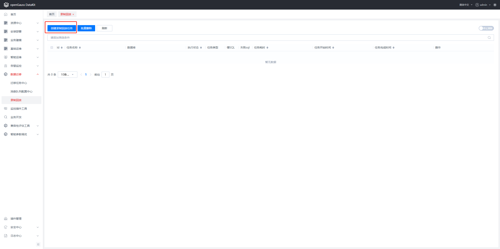
填写源端和目标端数据库信息和配置项信息（配置项信息如果没有特别大的数据量，无需进行配置，使用默认值就好。）
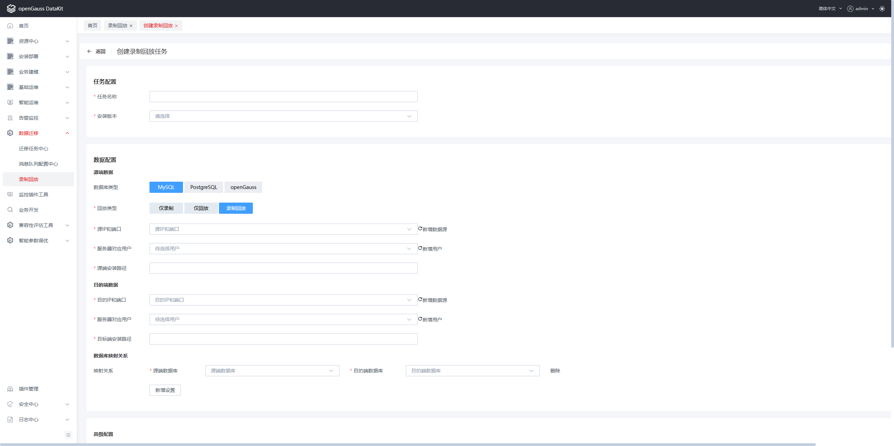
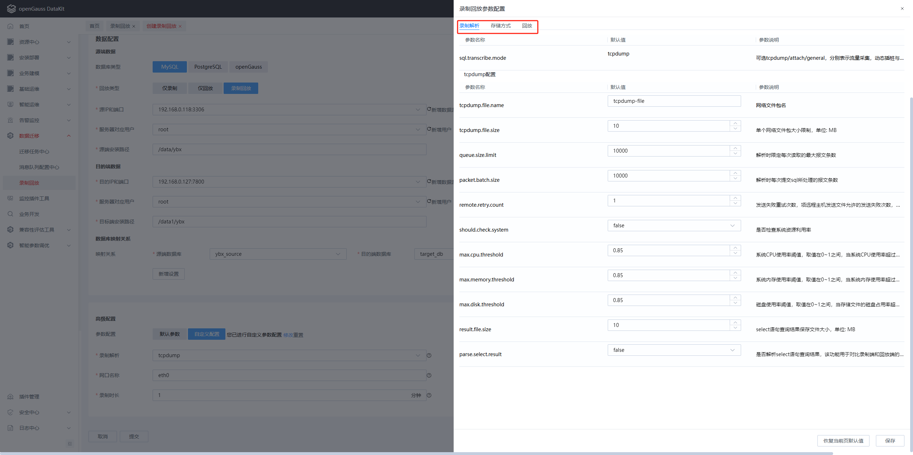
配置完成后点击【保存】即可。
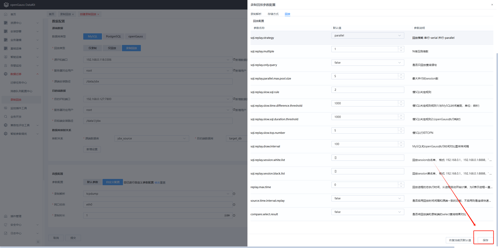
记得配置ip地址对应的网卡名，之后点击【提交】，即可创建任务成功。
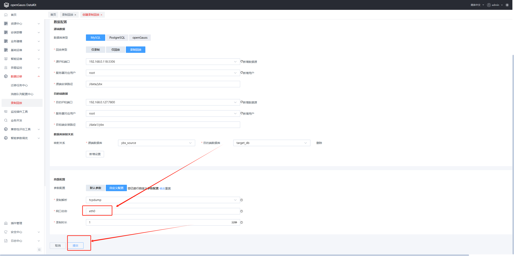
如图是创建的任务，状态是”未执行“。
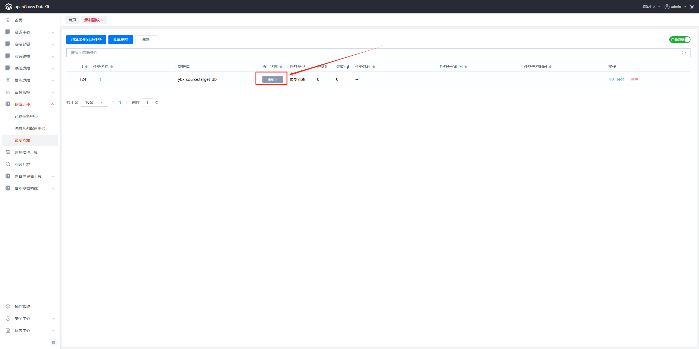
点击【执行任务】，任务状态变为“执行中”，此时在源端执行的SQL都会被录制到并在目标端进行回放。

录制回放的三种模式的全部介绍参考以下链接：

https://gitee.com/opengauss/compatibility-assessment/tree/master/dynamic_sql_collection/transcribe-replay-tool

具体录制操作和设置的参数有关，参数含义请参考上面的链接。
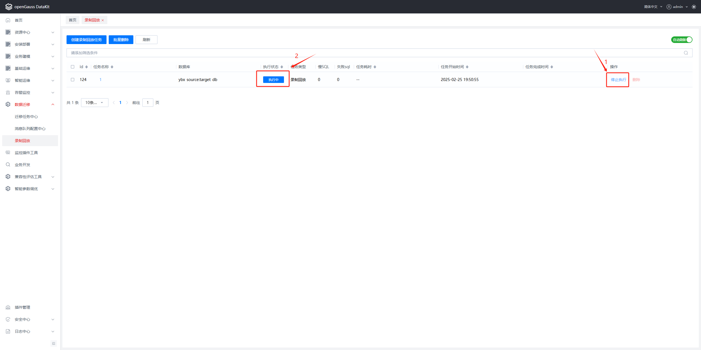
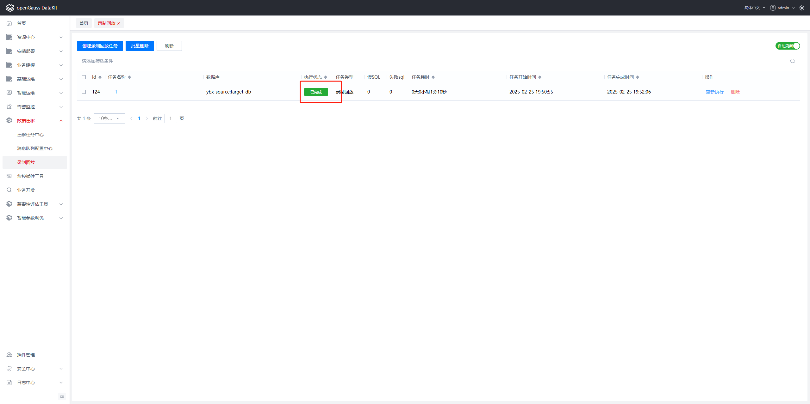

点击任务名称可以查看录制回放结果，即“录制回放详情页面”。（慢SQL、失败SQL、慢SQL在源端和目标端的耗时对比）。
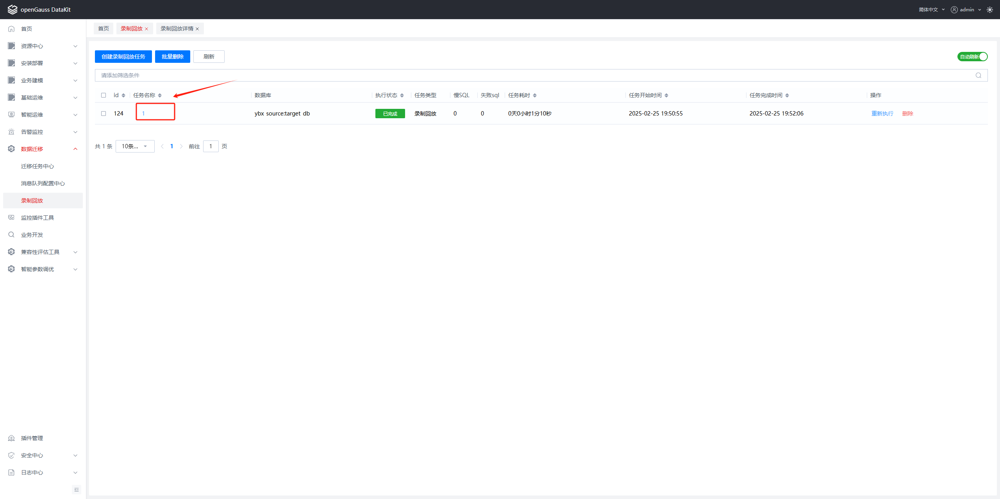

## 2.录制回放详情
如果插入数据，详情页面会显示相应的数据详情，如下示例：
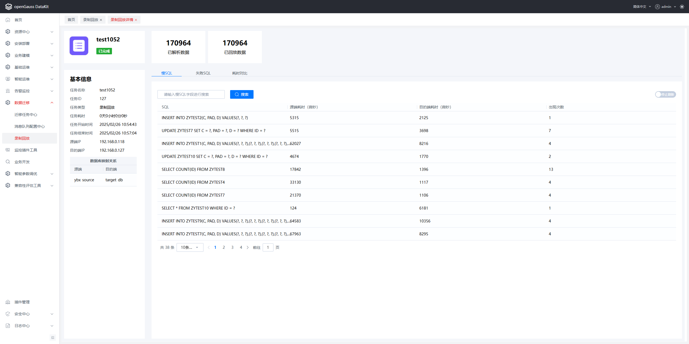
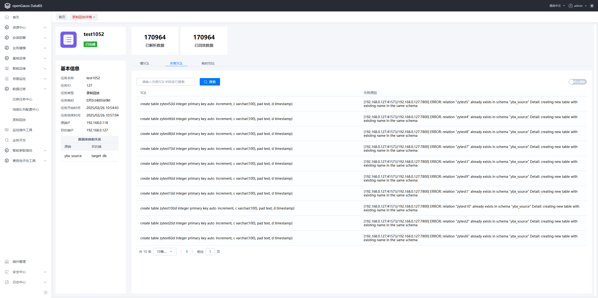
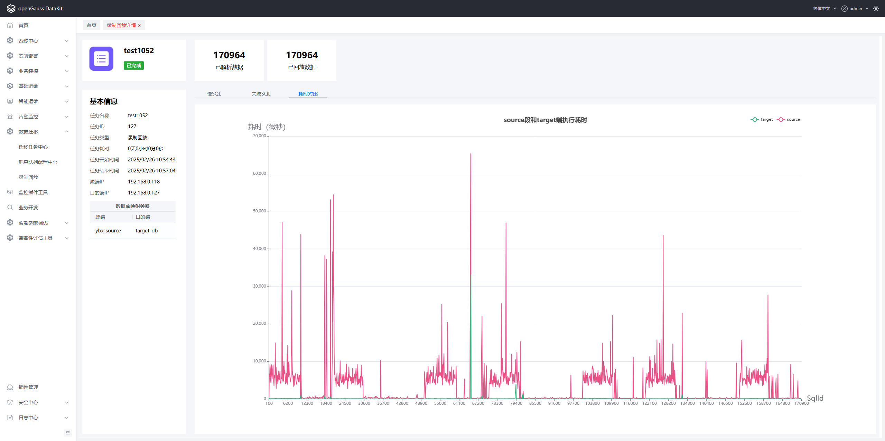
