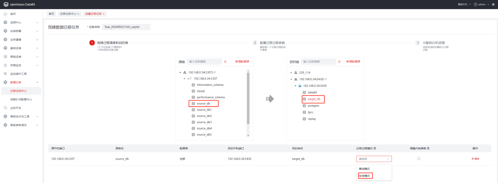
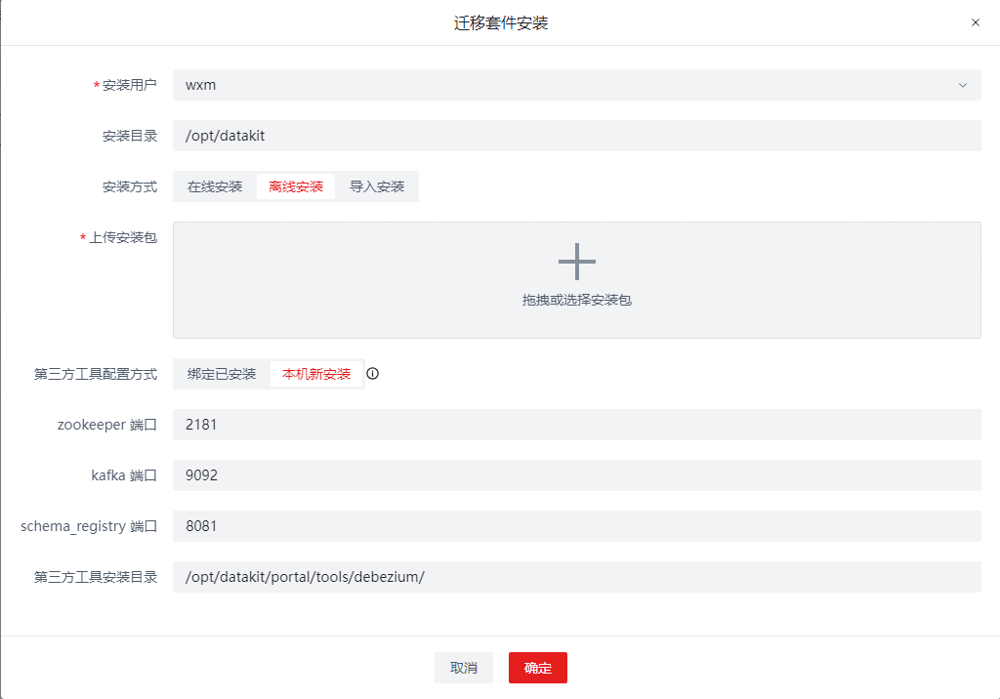
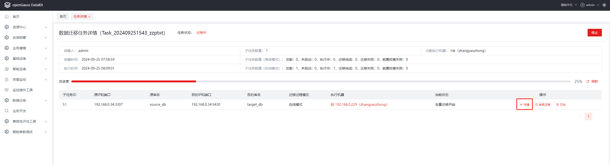
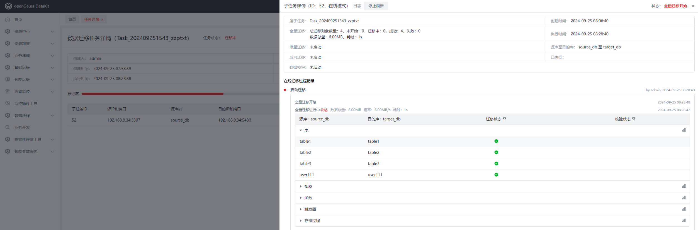
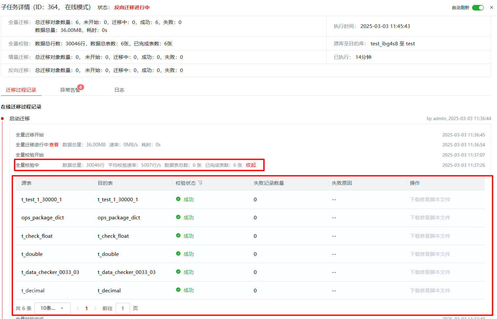
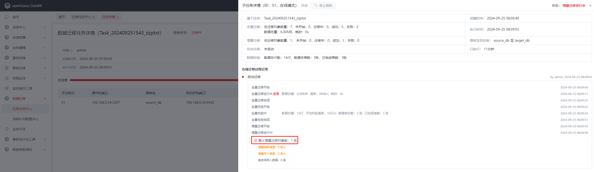
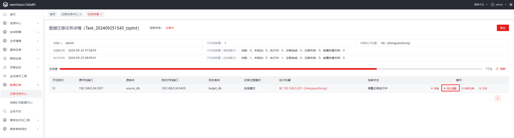

# Portal数据迁移

## 版本介绍

data-migration项目目前版本为1.0.0。

## 功能特性介绍
1. 可将MySQL源端数据库通过在线或离线的方式将数据迁移至openGauss目的端数据库。

2. 实现MySQL迁移前预检查，Datakit通过调用Portal命令进行全量迁移、反向迁移以及增量迁移前预检查，保证迁移任务成功率。

3. 基于资源最大化原则分配调度迁移任务运行机器。

4. 可批量管理迁移任务。

## 版本使用注意事项
- data-migration为一个Java 插件，在构建时需确保配置Java 11+的JDK。

## 安装说明

- ```
  #下载源码：
  git clone git@gitee.com:opengauss/openGauss-workbench.git
  #进入根目录
  cd data-migration
  #编译打包
  mvn clean package -Dmaven.test.skip

- 打包完成后在data-migration/target目录中找到data-migration-6.0.0-RC1-repackage.jar即为插件安装包。

- 打开并登录openGauss Datakit，点击插件管理-安装插件，将上诉步骤获得的安装包上传并安装。

## DataKit安装Portal说明
1. Datakit成功安装data-migration插件。

   
   
2. 访问Datakit服务，点击进入”数据迁移->迁移任务中心”目录下，点击“创建数据迁移任务”按钮。

   

3. 开始“选择迁移源库和目的库”步骤，分别选择源端数据库（database），选择目的端数据库（database），并点击“添加子任务”按钮。如果无数据源，点击
  “新增数据源”，输入所需参数进行新增。添加子任务成功后，在页面下方选择对应子任务的“迁移过程模式”，支持在线模式和离线模式。离线模式：自动执行全量迁移，
   完成后自动结束，释放资源。 在线模式：自动执行全量迁移+增量迁移，用户手动启动反向迁移，需要用户操作结束迁移，释放资源。 

   “选择迁移源库和目的库”配置成功，点击下一步。

   

4. 进入“配置迁移过程参数”步骤，可直接使用默认参数，或者根据实际需要自定义，保存后击“下一步”。

   

5. 进入“分配执行机资源”步骤，页面会展示所有的执行机列表信息，选择对应执行机点击“开始安装”，进入“迁移套件安装”步骤。

   此处如果无执行机信息显示，请前往“资源中心->服务器管理”添加服务器资源，注意添加服务器时需要勾选“记住密码”，添加服务器成功后，页面会显示添加成功
   的服务器记录。

   点击所需服务器记录右侧的“用户管理”，添加普通用户。至此，此服务器可作为安装portal的执行机。

   
6. 进行portal安装

   “安装用户”选择上述添加的服务器的普通用户。“安装目录”选择使用“安装用户”创建的已有目录，不建议使用默认的“安装用户”的home目录。“第三方工具配置
   方式”选择“本机新安装”，选择后会出现“zookeeper 端口”，“kafka 端口”，“schema_registry 端口”三条配置项，请确保配置的三个端口未被占用，如
   默认端口被占用，支持自定义端口。“第三方工具安装目录”使用默认的即可，支持自定义，但同样请配置到使用“安装用户”创建的目录下。

   选择安装方式，“在线安装”是在线下载安装包，完成安装，需要确保对应的服务器网络正常。“离线安装”支持手动上传portal安装包进行安装，注意自行下载时
   请下载匹配对应服务器系统及架构的安装包。“导入安装”支持导入对应服务器上已安装的portal，但要求已安装的portal成功安装了所有的mysql迁移插件，
   否则导入安装无法成功。

   - 在线安装
   
      

   - 离线安装
   
      
   
      
   
      
   
   -  导入安装
   
      

7. “安装包名称”建议选用最新版本的安装包。至此“迁移套件安装”步骤配置成功，点击“确认”按钮，开始portal安装。
8. 进行portal安装时，“分配执行机资源”页面的对应执行机的“是否安装迁移套件”字段会显示为“安装中”，安装成功则显示为“已安装”。如果安装失败，可下载
   “安装日志”，排除故障后，点击“清理环境”，然后再次安装即可。

   

9. 迁移插件安装成功后，通过jps命令可查看到三个相关的进程：zookeeper, kafka和schema-registry，该三个进程与增量迁移和数据校验流程有关，迁移
   插件安装成功后，会自动启动这三个进程。

   

## Portal离线安装步骤
数据迁移插件底层依赖Portal组件，在任务执行时如果执行机器未安装Portal，将会执行Portal的安装，因为安装过程时间较长，因此可选择在执行机器上提前安
装Portal，安装步骤如下。

1. 在执行机器上创建非root用户，并授予sudo免密权限。
    > + 添加用户 `useradd og_ops`
    > + 设置密码 `passwd og_ops`
    > + 增加文件编辑权限 `chmod u+w /etc/sudoers`
    > + 编辑文件 `/etc/sudoers`，在文件底部增加：`og_ops ALL=(ALL) NOPASSWD: ALL`
    > + 回收文件编辑权限 `chmod u-w /etc/sudoers`
    >
2. 切换非root用户，进入根目录下，`cd ~`。

3. 执行`wget -P ~ portal下载地址 -O portal.zip`。

4. 执行`unzip -d ~/portal ~/portal.zip`。

5. 执行`sed -i 's#/ops/portal#/home/非root用户名/portal#g' ~/portal/config/toolspath.properties`。

6. 执行`java -Dpath=/home/非root用户名/portal/ -Dorder=install_mysql_all_migration_tools -Dskip=true -jar /home/非root用户名/portal/portalControl-*-exec.jar`。

**注意**

1. 以上命令中的"portal下载地址"需要更换成实际的下载地址。

2. 以上命令中的"非root用户名"需要跟换成实际操作用户名。

## 数据迁移步骤
对于在线模式的迁移任务，任务启动后，会首先进入全量迁移阶段，将MySQL端的数据迁移至目标库，全量迁移结束后会进入全量校验阶段，会输出每个表的校验结果；
之后进入增量迁移阶段，增量迁移阶段会同步执行增量校验。详情界面可以看到迁移过程状态信息。

详细描述如下：

1. 启动迁移任务，详情界面可以看到详细的迁移过程状态信息。

    

    

    

2. 进行全量迁移，全量迁移会将表、数据、视图、函数、触发器、存储过程迁移至openGauss数据库，全量迁移结束后，可在openGauss端验证数据及对象是否成功迁移。
   图示为全量迁移完成：

    

3. 全量迁移完成后进行全量校验，全量校验输出每个表的校验结果。

    

4. 全量校验完成后进行增量迁移，增量迁移会将增量的数据（增删改）和DDL迁移至openGauss数据库，与增量迁移并行执行的还有增量校验。

    

5. 业务割接

   等增量数据全部迁移完成后，可进行业务割接。停止增量迁移，并启动反向迁移，修改应用程序的配置文件，启动应用程序，用openGauss承载业务。
   在openGauss端进行增删改操作，验证MySQL端数据是否同步修改。

    1. 增量数据追平后可进行业务割接，当剩余待写入数据为0条，表示增量数据已追平，可进行业务割接。

       

    2. 停止增量迁移

       

    3. 启动反向迁移

       
   
       

    4. 停止反向迁移，反向迁移将数据从openGauss实时迁移至MySQL数据库，可保证源端数据库与目标数据库实时一致。作为一种数据逃生的通道，当目标数据库出现问题时，可及时将应用切回至源端数据库。
   当业务平稳运行一段时间后，可停止反向迁移。

       
