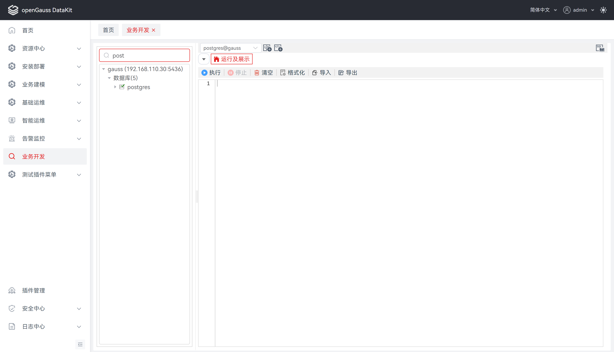
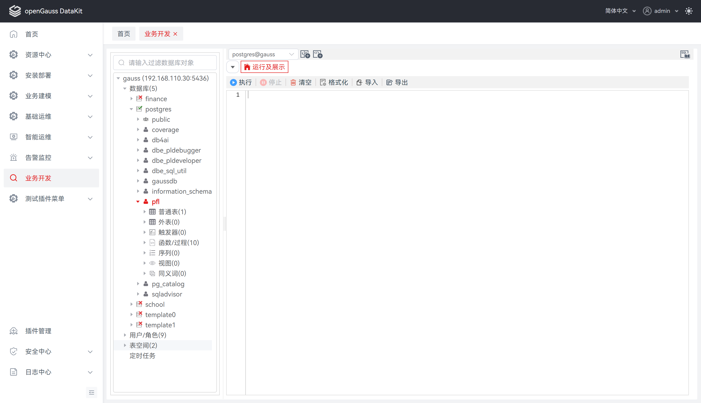
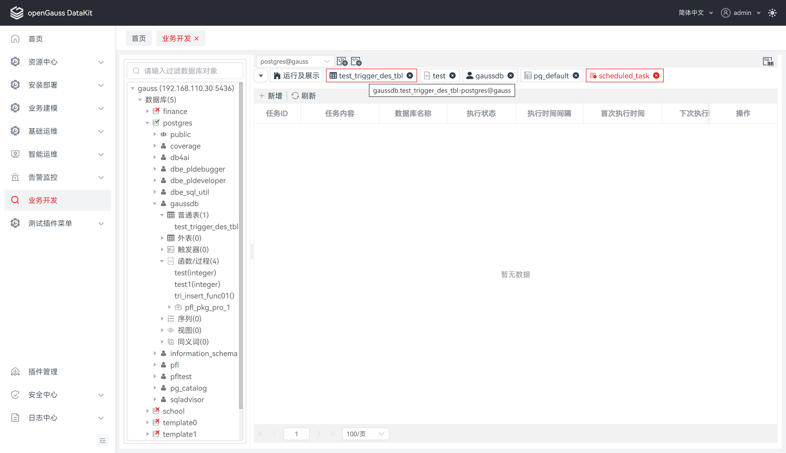
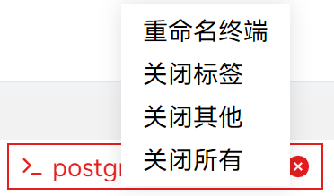
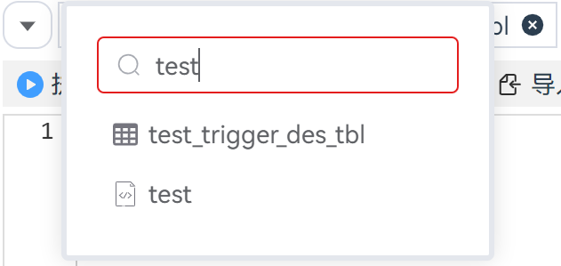
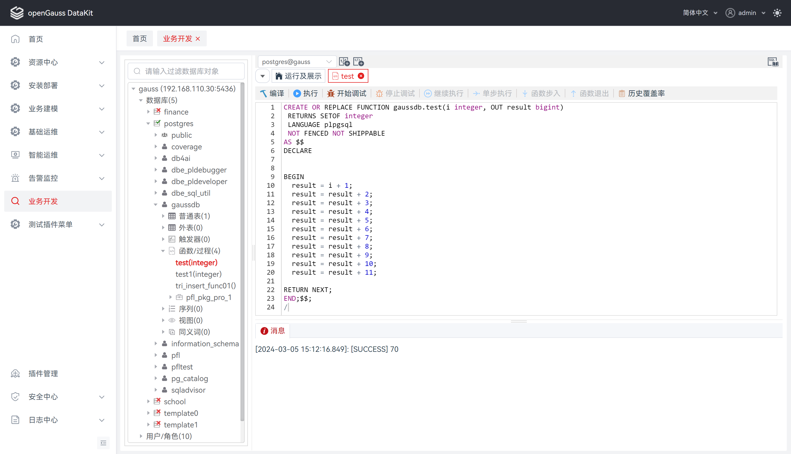
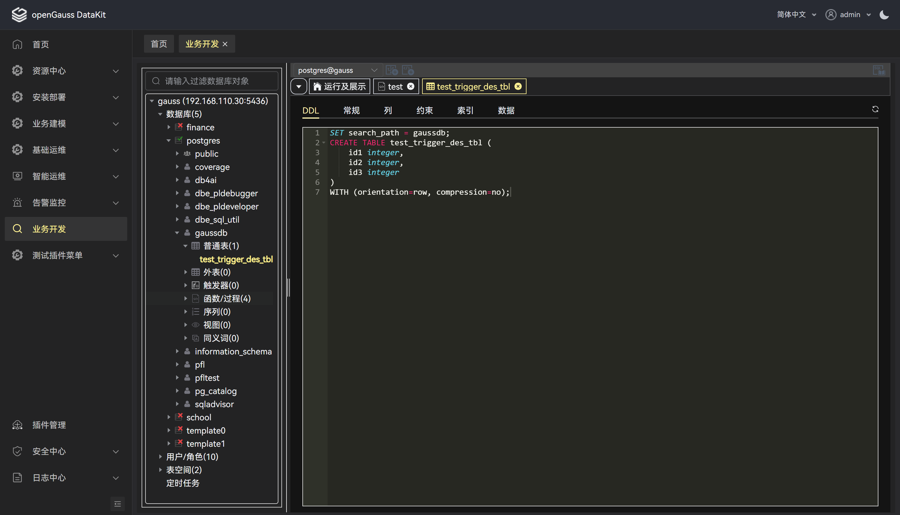
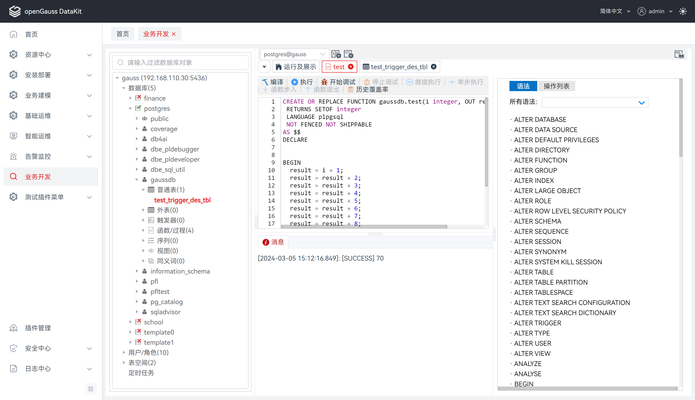

# 业务开发-用户操作手册

##  功能介绍

### 概述

通过提供图形化界面来展示数据库的主要功能，简化了数据库开发和应用构建任务。

数据库开发人员可以使用所提供的特性：

- 创建和管理数据库对象

- 执行 SQL 语句或 SQL 脚本

- 编辑和执行 PL/SQL 语句

  管理数据库对象包括：

    - 函数
    - 存储过程
    - 表
    - 序列
    - 视图
    - 同义词
    - 用户/角色
    - ......

### 系统要求

**浏览器兼容性**

| 内置对象 \ 浏览器及版本                                      | Chrome | Edge | Firefox | Opera | Safari |
| :----------------------------------------------------------- | :----: | :--: | :-----: | :---: | :----: |
| `Proxy`                                                      |   49   |  12  |   18    |  36   |   10   |
| [`Proxy()` constructor](https://developer.mozilla.org/en-US/docs/Web/JavaScript/Reference/Global_Objects/Proxy/Proxy) |   49   |  12  |   18    |  36   |   10   |
| [`revocable`](https://developer.mozilla.org/en-US/docs/Web/JavaScript/Reference/Global_Objects/Proxy/revocable) |   63   |  12  |   34    |  50   |   10   |

**软件要求**

| 软件 | 规格         |
| ---- | ------------ |
| Java | jdk 11及以上 |

**数据库版本要求**

| 数据库    | 版本                             |
| --------- |--------------------------------|
| openGauss | 所有（debug功能需3.0.0以上），企业版不支持创建函数 |

### 主要功能

对 openGauss 数据库提供的功能如下：

<table>
    <tr>
        <th>功能模块</th>
        <th>子功能模块</th>
    </tr>   
    <tr>
        <td>连接信息</td>
        <td>新建连接、编辑连接、查看连接属性、删除连接记录</td>
    </tr>
    <tr>
        <td rowspan="4">表</td>
        <td>查看表：查看DDL、查看常规、查看列、查看约束、查看索引、查看数据、查看分区</td>
    </tr>
    <tr>
        <td>创建表：管理列、管理约束、管理索引</td>
    </tr>
    <tr>
        <td>管理表：查询相关序列、重建索引、清理表、截断表、设置表模式、设置表空间、设置表描述、重命名表、删除表</td>
    </tr>
    <tr>
        <td>管理表数据：操作表数据、导出表数据、导出表DDL和数据、导入表数据</td>
    </tr>
    <tr>
        <td>序列</td>
        <td>创建序列、删除序列、查看DDL、导出序列DDL、导出序列DDL和数据</td>
    </tr>
    <tr>
        <td>视图</td>
        <td>创建视图、删除视图、查看视图、编辑视图、导出视图DDL</td>
    </tr>
    <tr>
        <td>同义词</td>
        <td>创建同义词、删除同义词、删除同义词属性</td>
    </tr>
    <tr>
        <td rowspan="6">SQL终端</td>
        <td>打开多个"SQL终端"页签</td>
    </tr>
    <tr>
        <td>执行SQL：执行单条/多条SQL查询/插入/删除/修改、执行单个函数/过程</td>
    </tr>
    <tr>
        <td>使用SQL编辑器：注释/取消注释、插入空格/取消插入空格、清空、格式化、导入、导出</td>
    </tr>
    <tr>
        <td>重命名SQL终端</td>
    </tr>
    <tr>
        <td>SQL助手</td>
    </tr>
    <tr>
        <td>SQL查询执行历史</td>
    </tr>
    <tr>
        <td rowspan="4">函数/过程</td>
        <td>创建函数/过程</td>
    </tr>
    <tr>
        <td>使用函数/过程：执行函数/过程、删除函数/过程、导出函数/过程DDL、编辑函数/过程</td>
    </tr>
    <tr>
        <td>调试函数/过程/匿名块：使用断点、控制执行、查看堆栈信息</td>
    </tr>
    <tr>
        <td>覆盖率统计：显示覆盖率、导出覆盖率报告、删除覆盖率记录</td>
    </tr>
    <tr>
        <td>数据库</td>
        <td>创建数据库、断开所有连接、打开连接、断开连接、编辑数据库属性、删除数据库、查看数据库属性、打开新终端</td>
    </tr>
    <tr>
        <td>模式</td>
        <td>创建模式、编辑模式、删除模式、导出模式DDL、导出模式DDL和数据</td>
    </tr>
    <tr>
        <td>用户/角色</td>
        <td>创建用户/角色、编辑用户/角色、修改用户/角色密码、删除用户/角色</td>
    </tr>
    <tr>
        <td>外表</td>
        <td>创建外表、编辑外表、删除外表</td>
    </tr>
    <tr>
        <td>表空间</td>
        <td>创建表空间、编辑表空间、删除表空间</td>
    </tr>
    <tr>
        <td>触发器</td>
        <td>创建触发器、查看触发器、重命名触发器、启用/禁用触发器、删除触发器</td>
    </tr>
    <tr>
        <td>定时任务</td>
        <td>查看定时任务、创建定时任务、编辑定时任务、启用/禁用定时任务、删除定时任务</td>
    </tr>
     <tr>
        <td rowspan="2">通用管理</td>
        <td>复制数据库对象：复制/高级复制数据、复制DDL</td>
    </tr>
    <tr>
        <td>批量导出：批量导出DDL（模式、普通表、函数/过程、序列、视图）、批量导出DDL和数据（模式、普通表、序列）</td>
    </tr>
</table>

### 约束和限制

**函数/过程**

在“**SQL** **终端**”或“**创建函数**/**过程**”向导创建的函数/过程须以“/”结尾，表示函数/过程的结尾。函数/过程随后输入的语句结尾如果没有“/”，语句会被视为单条查询，执行过程中可能会报错。

**调试**

前置条件：
1. 安装openGauss3.1.0  
2. 安装 pldebugger 插件

仅支持plpgsql语言的调试

**项目运行**

本项目依赖主平台的web-socket，若需要使用本项目所有功能，只能通过编译成 jar 包的形式作为插件运行在主平台上，操作步骤详见 **编译与部署** 。若需单独运行将影响 SQL 终端语句执行、调试函数/过程等功能的使用。

## 使用指导

###  数据库导航栏

连接数据库后，进入数据库管理界面。左侧为数据库导航栏，提供过滤数据库对象以及数据库导航功能。

#### 过滤数据库对象

**步骤 1：** 输入数据库对象名称，若存在过滤的筛选对象则自动展开至对应子项，若不存在则显示”暂无数据”。

**说明：** 所有搜索内容基于已加载过节点数据（通过展开节点操作）过滤，若所搜索的内容在未加载的节点数据中，将无法匹配。

#### 数据库导航菜单

对 openGauss 数据库支持导航菜单如下：

<table>
    <tr>
        <th>一级菜单</th>
        <th>二级菜单</th>
        <th>三级菜单</th>
        <th>四级菜单</th>
        <th>五级菜单</th>
        <th>六级菜单</th>
        <th>说明</th>
    </tr>   
    <tr>
        <td rowspan="10">连接名称(主机地址:端口号)</td>
        <td rowspan="7">数据库</td>
        <td rowspan="7">数据库 名称</td>
        <td rowspan="7">模式名称</td>
        <td>普通表（子级总数）</td>
        <td>普通/分区表文件名称</td>
        <td rowspan="7">一 ~ 五级菜单均支持单独刷新</td>
    </tr>
    <tr>
        <td>外表(子级总数)</td>
        <td>外表文件名称</td>
    </tr>
    <tr>
        <td>触发器(子级总数)</td>
        <td>触发器文件名称</td>
    </tr>
    <tr>
        <td>函数/过程(子级总数)</td>
        <td>函数/过程文件名称</td>
    </tr>
    <tr>
        <td>序列(子级总数)</td>
        <td>序列文件名称</td>
    </tr>
    <tr>
        <td>视图(子级总数)</td>
        <td>视图文件名称</td>
    </tr>
    <tr>
        <td>同义词(子级总数)</td>
        <td>同义词文件名称</td>
    </tr>
    <tr>
        <td>用户/角色</td>
        <td colspan="4">用户/角色名称</td>
        <td rowspan="2">一级菜单支持单独刷新</td>
    </tr>
    <tr>
        <td>表空间</td>
        <td colspan="4">表空间名称</td>
    </tr>
    <tr>
        <td>定时任务</td>
        <td colspan="4">当前连接下的所有数据库定时任务信息查看入口</td>
    </tr>
</table>

### 数据库对象编辑栏

#### 标签

标签命名规则如下：

**说明：** 标签显示图标+对象名称（宽度max/min：130/30px），悬停标签显示完整标签（含对象所在数据库以及连接名称）。

<table>
    <tr>
        <th>类型</th>
        <th>标签类型</th>
        <th>标签命名规则/完整标签命名规则</th>
        <th>标签示例/完整标签示例</th>
        <th>说明</th>
    </tr>   
    <tr>
        <td rowspan="7">数据库对象</td>
        <td>普通表</td>
        <td>图标+普通表名称/模式名称.普通表名称-数据库名称@连接名称</td>
        <td>图标+table/gaussdb.table-postgres@connection1</td>
        <td rowspan="11">悬停标签显示完整标签名称</td>
    </tr>
    <tr>
        <td>外表</td>
        <td>图标+外表名称/模式名称.外表名称-数据库名称@连接名称</td>
        <td>图标+external/gaussdb.external-postgres@connection1</td>
    </tr>
    <tr>
        <td>触发器</td>
        <td>图标+触发器名称/模式名称.触发器名称-数据库名称@连接名称</td>
        <td>图标+trigger/gaussdb.trigger-postgres@connection1</td>
    </tr>
    <tr>
        <td>函数/过程</td>
        <td>图标+函数或存储过程名称/模式名称.函数或存储过程名称-数据库名称@连接名称</td>
        <td>图标+function/gaussdb.function-postgres@connection1</td>
    </tr>
    <tr>
        <td>序列</td>
        <td>图标+序列名称/模式名称.序列名称-数据库名称@连接名称</td>
        <td>图标+sequence/gaussdb.sequence-postgres@connection1</td>
    </tr>
    <tr>
        <td>视图</td>
        <td>图标+视图名称/模式名称.视图名称-数据库名称@连接名称</td>
        <td>图标+view/gaussdb.view-postgres@connection1</td>
    </tr>
    <tr>
        <td>同义词</td>
        <td>图标+同义词名称/模式名称.同义词名称-数据库名称@连接名称</td>
        <td>图标+synonym/gaussdb.synonym-postgres@connection1</td>
    </tr>
    <tr>
        <td rowspan="4">其他</td>
        <td>用户/角色</td>
        <td>图标+用户或角色名称/模式名称.用户或角色名称-数据库名称@连接名称</td>
        <td>图标+user/gaussdb.user-postgres@connection1</td>
    </tr>
    <tr>
        <td>表空间</td>
        <td>图标+表空间名称/模式名称.表空间名称-数据库名称@连接名称</td>
        <td>图标+tablespace/gaussdb.tablespace-postgres@connection1</td>
    </tr>
    <tr>
        <td>定时任务</td>
        <td>图标+定时任务名称/模式名称.定时任务名称-数据库名称@连接名称</td>
        <td>图标+task/gaussdb.task-postgres@connection1</td>
    </tr>
    <tr>
        <td>SQL终端</td>
        <td>图标+SQL终端名称/SQL终端名称-数据库名称@连接名称</td>
        <td>图标+sql/sql-postgres@connection1</td>
    </tr>
</table>

标签右键支持刷新、重命名、关闭等操作，具体功能如下：

<table>
    <tr>
        <th>功能项</th>
        <th>描述</th>
    </tr>   
    <tr>
        <td>(右键标签) 刷新当页</td>
        <td>仅普通表页面支持刷新当前页面数据</td>
    </tr>
    <tr>
        <td>(右键标签) 重命名终端</td>
        <td>仅SQL终端窗口支持重命名终端</td>
    </tr>
    <tr>
        <td>(右键标签) 关闭标签</td>
        <td>当前页面关闭，自动显示下一个标签页页面信息</td>
    </tr>
    <tr>
        <td>(右键标签) 关闭其他</td>
        <td>除当前页面和【运行及展示】外，其他所有页面都关闭</td>
    </tr>
    <tr>
        <td>(右键标签) 关闭所有</td>
        <td>除【运行及展示】外，其他所有页面都关闭</td>
    </tr>
</table>

标签窗口支持搜索、跳转等操作，具体功能如下：

<table>
    <tr>
        <th>功能项</th>
        <th>描述</th>
    </tr>   
    <tr>
        <td>搜索标签页</td>
        <td>输入标签页名称，基于打开的标签页列表匹配对应的搜索数据，若存在，即可通过点击操作，面板内容切换至指定的页面信息</td>
    </tr>
    <tr>
        <td>跳转至搜索的标签页</td>
        <td>点击指定的标签页，面板内容切换至指定的页面信息</td>
    </tr>
</table>

#### 功能区

功能区的面板布局如下：

<table>
    <tr>
        <th>面板</th>
        <th>功能</th>
        <th>描述</th>
    </tr>   
    <tr>
        <td rowspan="4">便捷区</td>
        <td>连接选择框</td>
        <td>选择目标数据库，结合新建终端一起使用，可便捷打开连接指定数据库的新终端</td>
    </tr>
    <tr>
        <td>新建连接</td>
        <td>打开新建连接弹窗</td>
    </tr>
    <tr>
        <td>新建终端</td>
        <td>打开新建终端，新终端默认连接至选择框中的目标数据库</td>
    </tr>
    <tr>
        <td>SQL助手</td>
        <td>右侧打开 openGauss SQL 助手</td>
    </tr>
    <tr>
        <td>标签区</td>
        <td>标签栏</td>
        <td>标签窗口 + 标签</td>
    </tr>
    <tr>
        <td rowspan="3">展示区</td>
        <td>SQL 窗口</td>
        <td>SQL 脚本输入窗口 + SQL 结果展示栏</td>
    </tr>
    <tr>
        <td>PL/SQL 窗口</td>
        <td>调试工具栏 + 函数/过程调试脚本 + 调试结果展示栏</td>
    </tr>
    <tr>
        <td>数据展示</td>
        <td>页面数据展示区，通常用于数据库对象的数据管理、查看等操作</td>
    </tr>
</table>

### 整体功能

#### 主题色

​             支持两种主题色：亮色主题（背景色：#ffffff  /  主题色：#e41d1d）、黑暗主题（背景色：#232324  /  主题色：#fcef92)

#### 窗口拖动

​             支持窗口拖动，具体描述如下：

<table>
    <tr>
        <th>拖动类型</th>
        <th>描述</th>
    </tr>   
    <tr>
        <td>数据库导航栏与数据库对象编辑栏左右拖动</td>
        <td>鼠标移至数据库导航栏和数据库对象编辑栏中间：长按鼠标往左拖动、往右拖动以调节两个窗口的宽度</td>
    </tr>
    <tr>
        <td>数据库对象编辑栏与SQL助手栏左右拖动</td>
        <td>鼠标移至数据库对象编辑栏与SQL助手栏中间：长按鼠标往左拖动、往右拖动以调节两个窗口的宽度</td>
    </tr>
    <tr>
        <td>SQL窗口的编辑器和执行结果窗口上下拖动</td>
        <td>鼠标移至SQL编辑器和执行结果窗口中间：长按鼠标往上拖动、往下拖动以调节两个窗口的高度</td>
    </tr>
    <tr>
        <td>PL/SQL窗口的编辑器和调用堆栈窗口左右拖动</td>
        <td>鼠标移至PL/SQL编辑器和调用堆栈窗口中间：长按鼠标往左拖动、往右拖动以调节两个窗口的宽度</td>
    </tr>
</table>

