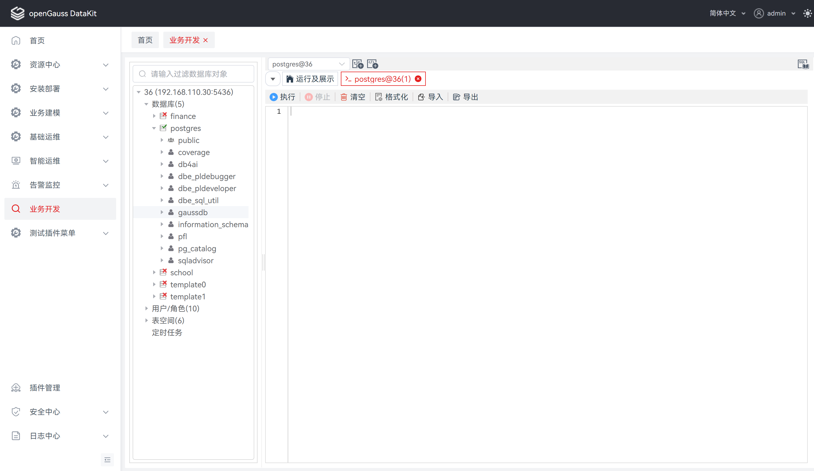

# SQL 终端

## 打开多个 "SQL 终端" 页签

通过该功能，可在当前 “SQL 终端”页签执行查询时使用多个 SQL 查询。执行如下步骤打开新“SQL 终端”页签：

**步骤** **1**： 在页签栏的目标终端选择框中，选择目标终端，选择新建终端，即可显示新的 "SQL终端" 页签。

**说明：** 目标终端的下拉选项值为所有连接中的数据库，默认为最近打开连接的数据库。

"SQL终端" 命名规则为：终端图标+数据库名+@+连接名称+(自增数)，如。



## 使用 SQL 查询

### 使用单条 SQL 查询

**步骤** **1**：在 “SQL 终端” 页签输入函数/过程或 SQL 语句，单击 “SQL 终端” 页签的 "**执行**"。

**步骤** **2**：在 SQL 编辑器下方将出现结果栏。

**说明：** 结果栏分别由消息栏和结果集组成，默认显示结果集 "结果" 页面。

结果集中的表数据列宽支持拖动调整。


###  执行多条 SQL 或函数/过程查询

**步骤** **1**：在 “SQL 终端” 页签中，在函数/过程定义之后插入 “/” 。

**步骤** **2**：在下一行添加新的函数/过程语句。


执行如下步骤执行多条 SQL 查询：

**步骤** **1**：在 “SQL终端” 页签中输入多个SQL查询，如下所示：

**步骤** **2**：在 “SQL终端” 页签中单击 "**执行**"。

**说明：** 默认显示结果集最后返回的 "结果" 页面，非最后执行语句对应的结果。

支持同时查询多表，表数据的查询结果将以结果集的形式呈现，表数据列宽支持拖动调整，执行后将覆盖原先结果集。


## 使用 SQL 编辑器

###  注释/取消注释

注释/取消注释选项用于注释或取消注释行或整段。

**步骤** **1**： 选择目标行。

**步骤** **2**：使用快捷键 “Ctrl+/” 单独注释/取消注释每个选中的行。

按照以下步骤在 “PL/SQL Viewer” 或 “SQL 终端” 中注释/取消注释整段：

**步骤** **1**： 选择目标行或整段内容。

**步骤** **2**：使用快捷键 “Ctrl+/” 单独注释/取消注释选中的行或整段内容。


### 插入空格/取消插入空格

按照以下步骤在 “PL/SQL Viewer” 或 “SQL 终端” 中缩进/取消缩进：

**步骤 1**： 选中目标行。

**步骤 2**： 按下 Tab 键缩进，按下 “Shift+Tab” 键取消缩进。


### 清空

按照以下步骤在  “SQL 终端” 中清空执行语句：

**步骤 1**： 在工具栏中单击 "**清空**"。

### 格式化

按照以下步骤在  “SQL 终端” 中格式化执行语句：

**步骤 1**： 选择需要格式化的SQL语句。

**步骤 2**： 在工具栏中单击 "**格式化**"。


### 导入

按照以下步骤在  “SQL 终端” 中导入 sql 语句：

**步骤 1**： 在工具栏中单击 "**导入**"，打开文件选择窗口。

**步骤 2**： 选择 .sql 文件并点击 "**打开**"，若当前 "SQL终端" 不存在执行语句，将直接导入所选文件中的 sql 语句；若当前 "SQL终端" 存在执行语句，将弹出选择 "**覆盖**" 或 "**附加**" 的选择窗口，点击确定，将根据用户所选操作导入所选文件中的 sql 语句。


###  导出

按照以下步骤在  “SQL 终端” 中导出 sql 语句：

**步骤 1**： 在工具栏中单击 "**导出**"，直接导出当前 "SQL终端" 的所有执行语句；若要导出当前 "SQL终端" 中的指定语句，在选中语句后单击 "**导出**" 即可。

**说明：** 导出文件为 sql 文件。


##  重命名 SQL 终端

**步骤** **1**： 在 "SQL 终端"页中，右键页签，选择 "**重命名终端**"，弹出 "**重命名终端**" 对话框。

**步骤** **2**： 填写终端新名称，单击 "**确定**" 即可继续，或单击 "**取消**" 即可退出操作。

**说明：** 修改终端页签名称，所修改的名称仅本次登录显示，不做保存。

仅新建的SQL终端支持修改终端名称，首页中 “运行及展示” 页签不支持重命名。


## SQL 助手

SQL 助手为用户在使用 SQL 终端和使用函数/过程中输入信息提供建议或参考。

执行以下步骤打开 SQL 助手：

**步骤** **1**： 在任意页中，单击 ，右侧打开 "**SQL助手**" 窗口。

**说明：** 用户可以从 SQL 语法、操作维度使用该手册，语法。

**步骤** **2**： 选择 "**语法**" 项，将显示 openGauss SQL 语法，点击指定语法可查看详情，包括注意事项、示例、语法、函数和参数说明。


选择 "**操作列表**" 项，用户可以基于功能维度、场景维度、操作维度快速找到所需执行的语句。


##  SQL 查询执行历史

SQL 查询执行历史支持查看和管理频繁执行的 SQL 查询。SQL 查询执行历史只保存在 “SQL 终端” 页签中。

**步骤** **1**： 在 “SQL 终端” 中，选择 "**历史执行**" 项。页面内容包含如下字段：

| **字段** | **字段说明**                                                 |
| -------- | ------------------------------------------------------------ |
| 序号     | 执行历史记录的序号                                           |
| 开始时间 | SQL查询的开始时间                                            |
| 状态     | SQL查询的执行状态：  |
| SQL语句  | SQL查询的执行语句                                            |
| 执行时间 | SQL查询的执行耗时，单位：ms                                  |
| 操作     | 预览SQL语句弹窗、锁定/取消锁定、删除 |

**步骤** **2**： 选择 ，打开 SQL 语句预览弹窗，用于查看当前执行操作的 SQL 语句。

**说明：** 单击 "**加载至终端**" 将追加当前执行SQL语句至SQL编辑器中。

单击 "**复制**" 将复制当前执行SQL语句，以便进行后续的粘贴操作。

单击 "**取消**" 将关闭 SQL 语句预览弹窗。


**步骤** **3**： 选择  / ，锁定 / 解锁当前执行 SQL 操作记录，用于置顶 / 取消置顶当前执行操作的 SQL 语句。

**说明：**锁定：单击按钮可将当行记录锁定，锁定后置顶当行记录并置灰，序号前新增图标，不支持删除操作。

取消锁定：单击按钮可将当行记录取消锁定，取消锁定后取消当行记录置顶状态，取消图标，支持删除操作。

同一平台用户所操作的执行历史记录最多锁定50条，超出将显示提示语句。

**步骤** **4**： 选择 ，单击按钮将弹出确认删除弹窗，确认后可将当行记录删除，该删除操作不可逆。

## FAQ
1. 现象：出现终端页面执行无响应，停止按钮失灵。

   原因：平台token过期，需调整心跳时间小于token过期时间，重新打包安装规避问题。

   解决方法：在`plugins/data-studio/web-ui/src/config/index.ts`修改配置心跳时间（单位：毫秒）
    
    ```javascript
    // websocket心跳时间
    export const wsHeartbeatTime = 1000 * 30;
    // http心跳时间
    export const httpHeartbeatTime = 1000 * 30;
    ```
