# 函数/过程

函数/过程支持创建函数/过程、使用函数/过程、调试函数/过程、覆盖率统计。

**说明：** package 包中函数/过程支持调试，不支持修改，调试详见 **调试函数/过程/匿名块**。

函数/过程下的package包名、函数/过程名称不可相同，不同package包下的函数/过程名称可以相同。

##  创建函数/过程

**步骤 1**：在 "**数据库导航菜单**" 窗格中，右键单击数据库中的 "**函数/过程**"，按照要求选择“**创建函数**”、“**创建过程**”、“**创建** **SQL** **函数**”、"**匿名块**"。

将在新页签中显示所选模板。

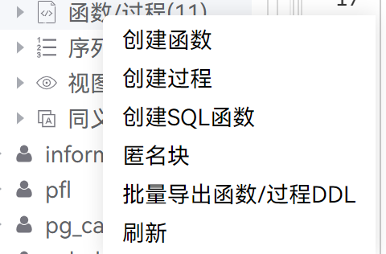

**步骤 2**：选择 “**创建函数**” 。系统打开新的页签。

**步骤 3**：编辑代码。

**步骤 4**：右键单击 "编译"，编译该过程。

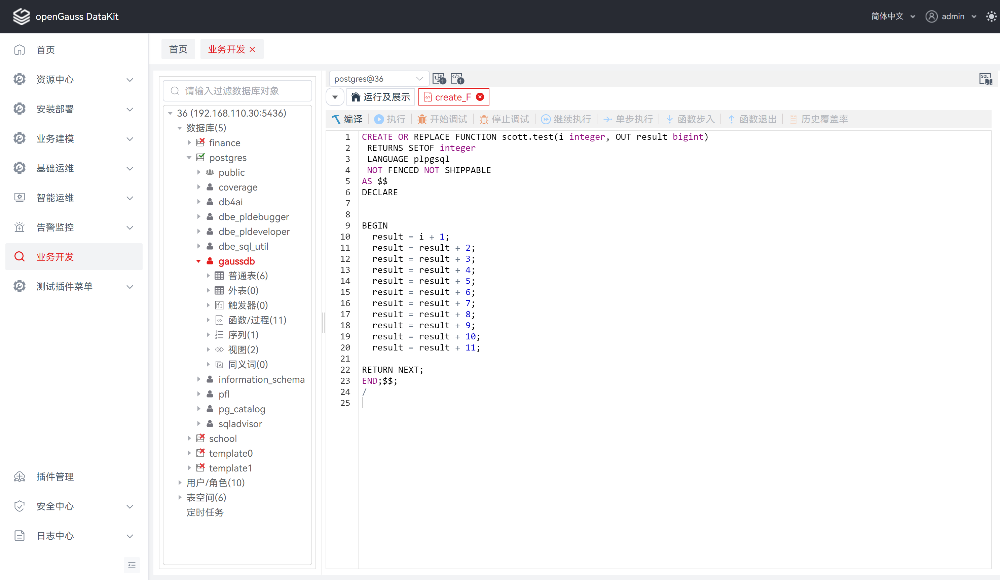

**步骤 5**：编译成功，该创建的函数将被保存。

状态栏需要刷新才能显示已完成操作的状态。

##  使用函数/过程

### 执行函数/过程

**步骤** **1**：双击打开 PL/SQL 程序或 SQL 函数。

**步骤** **2**：在工具栏单击 "执行"。

**步骤** **3**： 若该 PL/SQL 程序或 SQL 函数需要入参，则弹出的 “**调试函数/过程**” 对话框提示您输入信息。

**步骤 4**：填写入参后，点击 "确定" ，即可执行该 PL/SQL 程序或 SQL 函数。

###  删除函数/过程

**步骤** **1**：在 "**数据库导航菜单**" 窗格中，右键单击数据库中的函数/过程对象，选择 “**删除函数/过程**” 。

**步骤** **2**：提示确认该操作窗口中，单击 “**是**” 完成该操作。

### 导出函数/过程 DDL

**步骤 1：** 在 "**数据库导航菜单**" 窗格中，右键单击数据库中的函数/过程名称，选择 "**导出 DDL**"。

**说明：** 导出文件为 sql 文件。

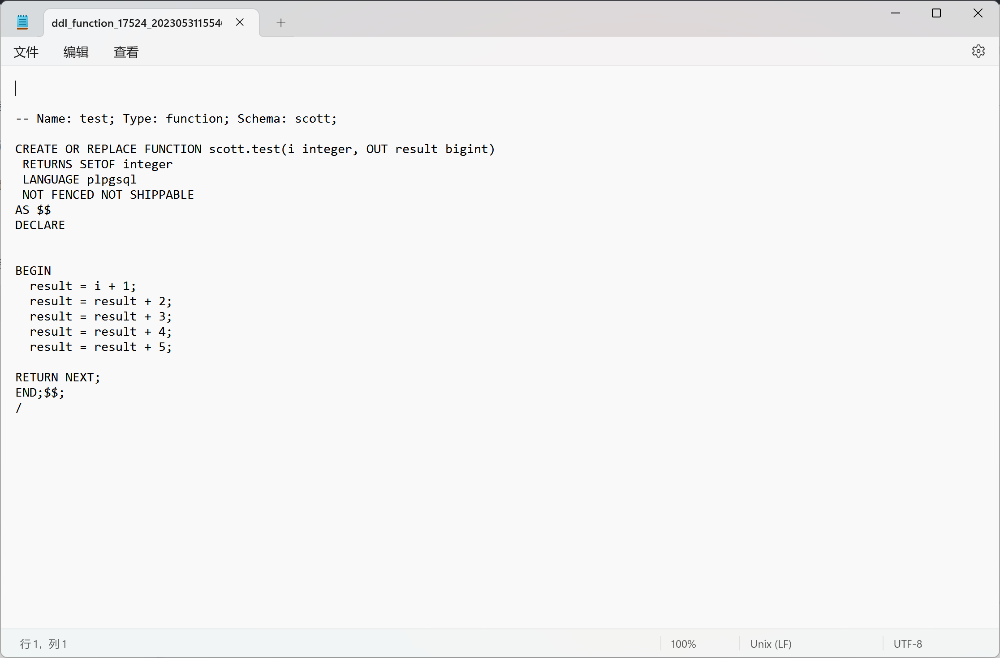


## 调试函数/过程/匿名块

调试操作期间，如果连接丢失，但数据库导航菜单中仍存在该数据库连接，建议刷新浏览器并重启调试操作。

**说明：** SQL 语言函数不支持调试操作，仅 plpgsql 语言支持调试操作。

**package 包**

支持修改与查看package中的源码：点击右键package包，点击【查看源码】，在package 源码中，支持修改，不支持调试。

支持调试 package 包内的函数/过程，不支持修改（编辑器为查看状态），调试操作详见 **使用断点、控制执行**。

**匿名块**

函数/过程调试左键点击左侧连接中对应的函数/过程，进行调试。匿名块调试右键点击连接下的函数/过程父目录，然后左键点击“**匿名块**”，进行匿名块编辑/调试。调试操作详见 **使用断点**和**控制执行**。

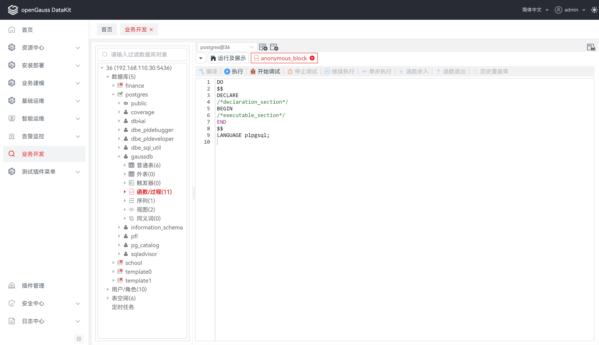

### 使用断点

断点用于暂停其所在行中的 PL/SQL 程序的执行，可用断点控制执行并调试过程。

- 设置并启用断点后，PL/SQL 程序会在该断点所在的行停止执行，此时用户可以进行其他调试操作。支持以下断点操作：
    - 为某行设置或创建断点。
    - 启用或禁用某行的断点。
    - 删除某行的断点。
- 禁用断点后，PL/SQL 程序不会在断点处暂停执行。

执行如下步骤调试 PL/SQL 程序：

**步骤** **1**：在需要 PL/SQL 程序暂停执行的行设置断点。

**步骤** **2**：启动调试会话。

达到断点所在行时，监视调试窗口中应用程序的状态，然后继续执行程序。

**步骤** **3**： 关闭调试会话。

**使用 "断点" 窗格**

在 “**断点**” 窗格中可查看已有断点。

“**断点**” 窗格会列出每一个断点所在行的行号、调试对象的名称以及断点是否可用。

在 “**断点**” 窗格中，勾选断点复选框，可以进行断点启用、禁用操作。

**说明：** 禁用断点后，程序不会在该断点处暂停执行，但该断点仍会保留（以备将来启用）。

**设置或添加断点**

**步骤** **1**：打开需要添加断点的 PL/SQL 函数。

**步骤** **2**：步骤在“**PL/SQL Viewer**”窗格中，双击行号字段左侧，设置断点，断点标志 [] 表示操作成功。

**说明：** 如果函数在调试过程中不会间断或停止执行，则说明其设置的断点不会生效。

**启用或禁用断点**

设置断点后，再次单击断点，暂时禁用该断点[]。“**PL/SQL Viewer**”窗格中，禁用的断点的状态列显示断点的状态为 禁用。

若要启用已禁用的断点，再次单击对应断点。

**删除断点**

用户可删除不再使用的断点。其方法与断点创建的方法相同，双击行号字段左侧的断点即可。

**使用断点测试 PL/SQL 程序**

**步骤** **1**：打开 PL/SQL 程序，在要调试的行创建断点。

**步骤** **2**：在弹出的 “**函数执行入参**” 对话框中，输入参数信息。

**说明：** 如果无需输入参数，则 “**函数执行入参**” 对话框不会弹出。

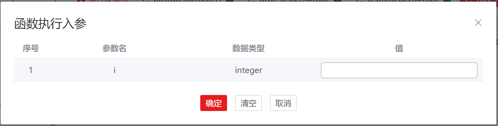

**步骤** **3**：输入信息，单击 “**确定**” 。

可以看到箭头指向断点所在行[]，同时所在行高亮。箭头所指的行号，即为继续执行程序时的起始行号。

**说明：** 用户可继续执行、单步执行跳过代码。

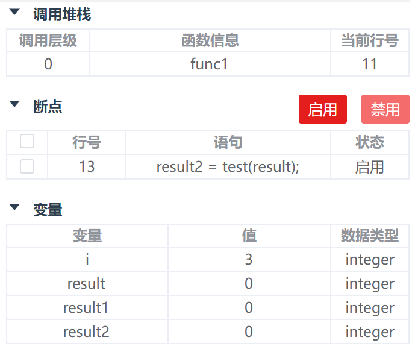

**步骤** **4**：单击 继续执行至下一断点（如有）。“结果” 页签中显示执行 PL/SQL 程序的结果， “调用堆栈” 和 “变量” 窗格将被清除。


### 控制执行

本节描述控制调试执行相关操作。


**开始调试**

在 “**数据库导航菜单**” 窗格中选择需调试的函数。单击工具栏中的 "**开始调试**"。

如果没有设置断点，或者设置的断点无效，则不会停止任何语句、进行调试操作，而仅会执行对象并显示结果（如有）。

**继续执行 PL/SQL 函数**

调试执行函数时，用户可使用工具栏中 “**继续执行**”。通过进行断点间控制，可逐行调试程序。“**继续执行**” 是指从一个断点跳到下一个断点。断点执行一条语句后，可以在其他调试窗口中查看执行结果。

**单步执行 PL/SQL 函数**

调试执行函数时，用户可使用工具栏中 “**单步执行**”。通过进行单步控制，可逐行调试程序。如果进行单步操作时遇到断点，则该单步操作会停止，程序也会暂停执行。“**单步**” 是指一次执行一条语句。单步执行一条语句后，可以在其他调试窗口中查看执行结果。

**步入 PL/SQL 函数(step in)**

在主函数调试程序中调试执行子函数时，用户可使用工具栏中 “**函数步入**”。操作 "**函数步入**"，自动打开新的子函数窗口，可对子函数进行逐行调试程序。子函数窗口仅支持 "**继续执行**"、"**单步执行**"、"**进入函数**"、"**退出函数**"。


**说明：** 进入子函数后，主函数的操作栏除 "停止调试" 启用状态外，其余操作均为禁用状态。

**退出 PL/SQL 函数(step out)**

调试执行子函数时，用户可使用工具栏中 “**函数退出**”。步入函数，打开新的子函数窗口对子函数进行逐行调试程序。子函数窗口仅支持 "**继续执行**"、"**单步执行**"、"**进入函数**"、"**退出函数**"。

**查看调用堆栈信息**

“**调用堆栈**” 窗格展示调用过程时的堆栈信息。

**停止调试**

单击工具栏中的 "**停止调试**"，即可终止调试。

### 查看堆栈信息

使用时，可通过一些调试窗口查看调试信息。本节介绍可用于检查调试信息的操作：

**变量操作**

“**变量**” 窗格用于监视信息或估算值。可从小化窗口窗格中打开 “**变量**” 窗格。通过这个窗格，可以估算或者修改 PL/SQL 过程中的变量或参数。执行代码时，一些本地变量可能被修改，值发生变化的参数会出现黄色标记，可以通过 “**变量**” 窗格观察参数的变化。

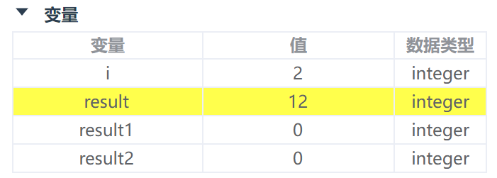


**查看结果**

“**结果**” 页签显示 PL/SQL 调试会话的结果。只有出现执行 PL/SQL 程序的结果时，“**结果**” 页签才会自动弹出。

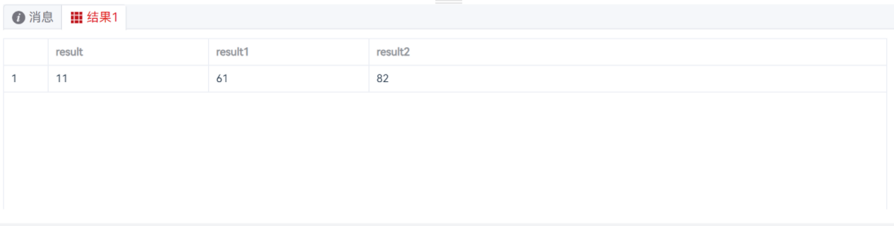

## 覆盖率统计

本节介绍在执行调试函数/过程操作后，如何使用函数历史调试结果统计功能。覆盖率统计基于函数或存储过程调试时被汇总至 coverage.proc_coverage 表的数据（执行到的行号、执行行数百分比等信息）提取到覆盖率历史表，且可对记录进行删除或导出为html 文件的报告。

**说明：** 仅 opengauss 3.0 及以上版本数据库支持调试函数或存储过程。

仅 opengauss 5.1.0 b011及以上版本数据库支持查看 coverage.proc_coverage 表。

仅调试前将参数 [enable_proc_coverage ](https://docs-opengauss.osinfra.cn/zh/docs/latest/docs/DatabaseReference/其它选项.html#section14683125861213)为on时才会将函数或存储过程调试记录存储至 coverage.proc_coverage 表，且仅特定用户（初始用户和 monadmin 用户）有访问权限。

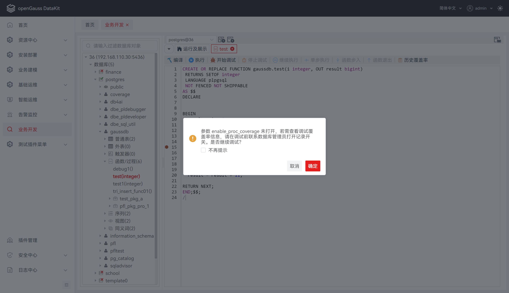

### 显示覆盖率

按照 **调试函数/过程**后，点击图标，弹出覆盖率信息。


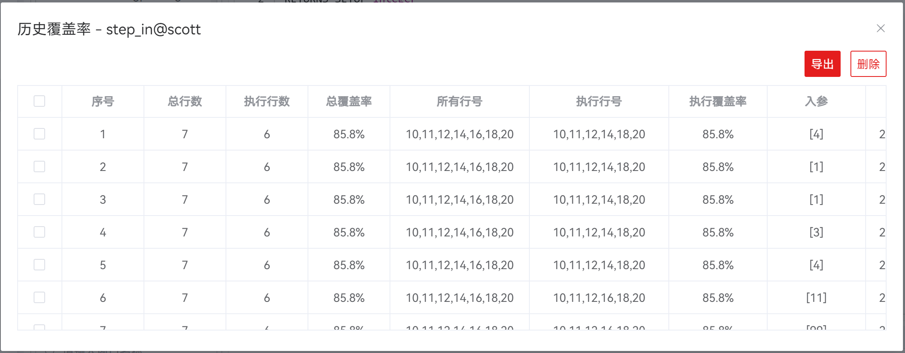

### 导出覆盖率报表

选中需要查看的调试记录，点击 "**导出**"  ，导出 html 文件。

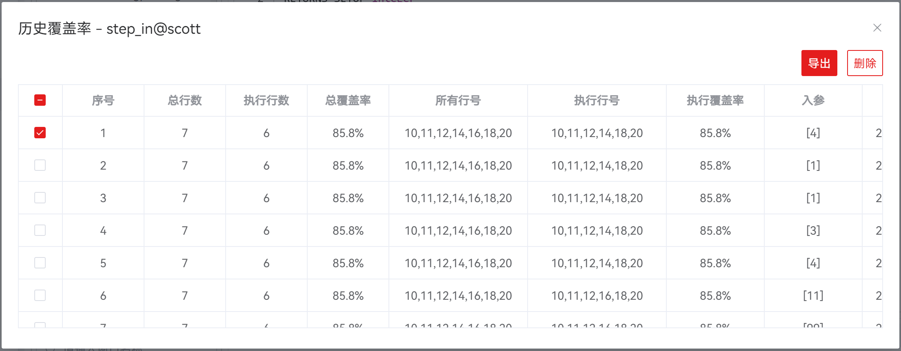

打开所导出的函数覆盖率报告文件，显示内容包含执行语句及调试信息列表，具体如图：

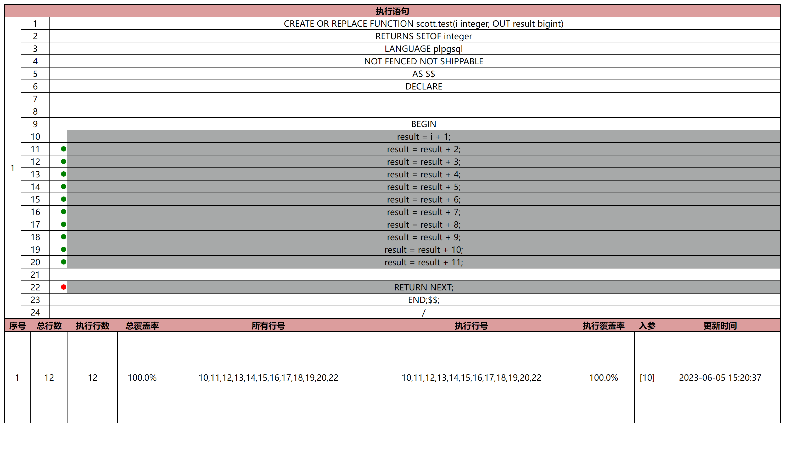

**说明：** 调试信息系统会自动在“数据库--public--普通表”中生成his_coverage中。

| **字段**   | **说明**                       |
| ---------- | ------------------------------ |
| 序号       | 用于展示覆盖率执行记录序号     |
| 总行数     | 用于展示执行函数过程的总行数   |
| 执行行数   | 用于展示执行函数过程的执行行数 |
| 总覆盖率   | 用于展示执行函数过程的总覆盖率 |
| 所有行号   | 用于展示函数过程所有行号       |
| 执行行号   | 用于展示执行函数过程执行行号   |
| 执行覆盖率 | 用于展示执行函数过程执行覆盖率 |
| 入参       | 用于展示执行函数过程入参       |
| 更新时间   | 用于展示执行函数过程执行时间   |


### 删除覆盖率记录

选中需要删除的调试记录，点击 "**删除**"  ，即可删除所选调试记录。

## FAQ

1. 现象：调试功能不支持 C 语言，SQL 语言的调试。

   原因：调试语言由内核决定，目前仅支持基于 plpgsql 语言函数/过程调试。

2. 现象：调试停留十几分钟后自动断开连接。

   原因：调试停留时间由数据库配置的超时时间决定，数据库默认设置的超时时间为 900s（15min）。

   解决办法：修改调试停留时间，用户设定数据库配置的 pldebugger_timeout 数值为目标停留时间（单位为s）即可。
    ```
    ALTER DATABASE postgres SET pldebugger_timeout TO 86400;
    ```
3. 覆盖率统计中，无法在主函数的调试界面导出所有子函数的调试信息。

   原因：目前 proc_coverage 表中没有记录主函数和子函数的关系，所以主函数和子函数的覆盖率报告都是单独管理。
  
   解决办法：在主函数调试界面仅显示和导出主函数的调试信息，进入单个子函数可以导出子函数的调试信息。
