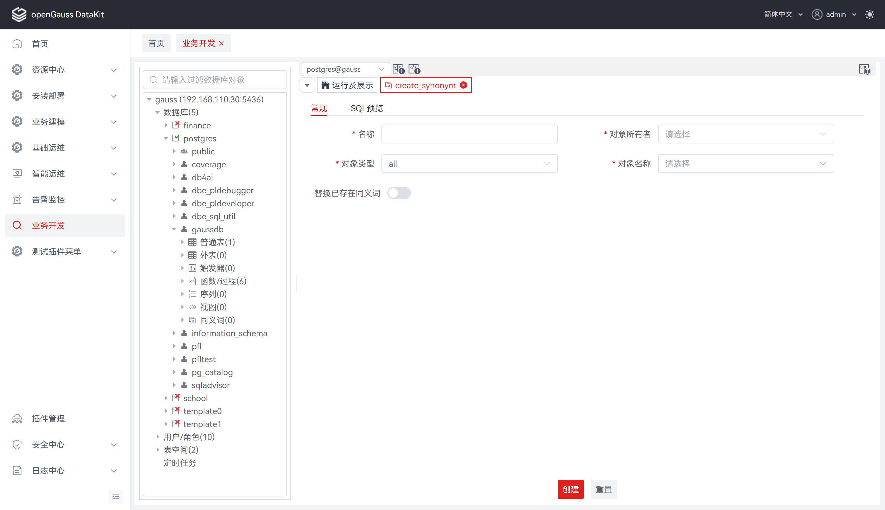
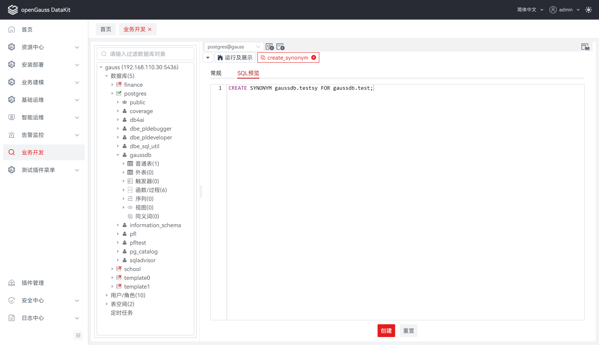
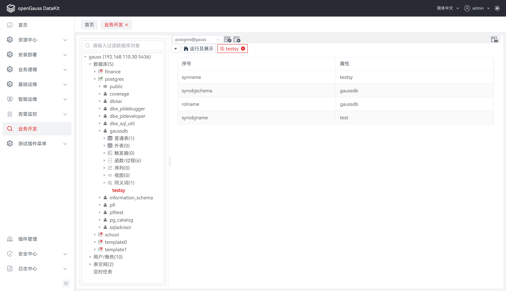

# 同义词

## 创建同义词

**步骤 1：** 在 "**数据库导航菜单**" 窗格中，右键单击数据库中的 "**同义词**"，选择 "**创建同义词**"，跳转至 "**创建同义词**" 页面。

**步骤 2：** 选择 "**常规**"，设置如下参数，创建同义词。

**说明：** 所有必选参数均需要填写。必填参数用星号（*）标识。

单击 "**确定**" 将创建并保存更新后的同义词信息。

单击 "**重置**" 即可重置 "**创建同义词**"对话框中的所有字段。

| 配置项           | 必填 | 配置说明                                                     |
| ---------------- | ---- | ------------------------------------------------------------ |
| 名称             | 是   | 用于定义同义词名称；默认为空                                 |
| 对象所有者       | 是   | 用于指定同义词归属者；默认为空，选项为所有用户模式           |
| 对象类型         | 是   | 用于指定同义词对象类型；默认为all，选项为all、函数/过程、视图、普通表 |
| 对象名称         | 是   | 用于指定同义词对象类型下的名；默认为空，选项为所选对象类型下的子项 |
| 替换已存在同义词 | 否   | 用于替换已存在的同义词；默认为关闭，即不替换                 |

**步骤 3：** 选择 "**SQL预览**"，可基于创建同义词的配置信息进行 SQL 预览。

**说明：** 若未填写 "**常规**" 必填项，将无法通过校验进入 "**SQL预览**" 界面。

"**SQL预览**" 界面的编辑框仅支持查看，不支持编辑。

## 删除同义词

**步骤 1：** 在 "**数据库导航菜单**" 窗格中，右键单击数据库中的同义词列表，选择 "**删除同义词**"，弹出 "**删除同义词**" 确认框。

**步骤 2：** 单击 "**确定**" 即可继续，或单击 "**取消**" 即可退出操作。

**说明：** 单击 "**确定**" 将删除并更新同义词信息，此操作不可逆。

单击 "**取消**" 即可退出本次对话框操作。

## 查看同义词属性

**步骤 1：** 在 "**数据库导航菜单**" 窗格中，单击同义词列表，将显示同义词属性。

