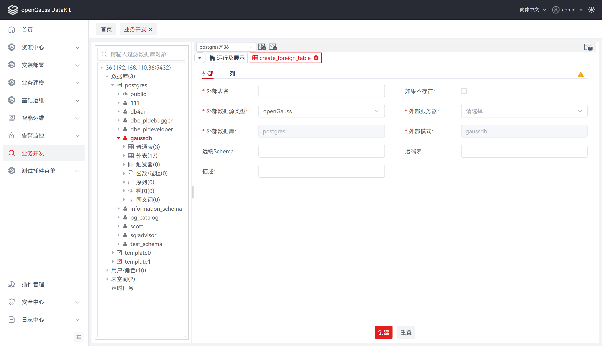
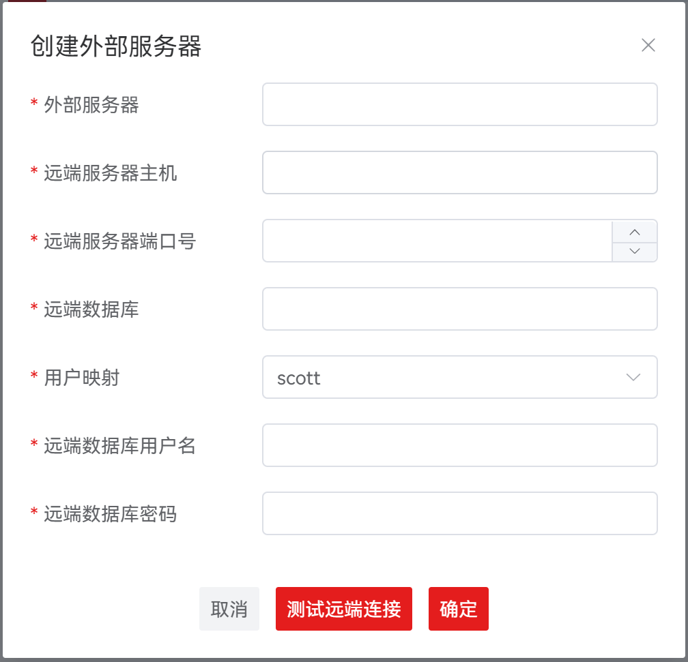
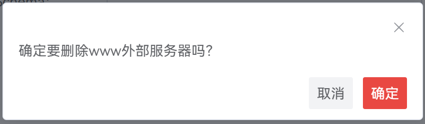
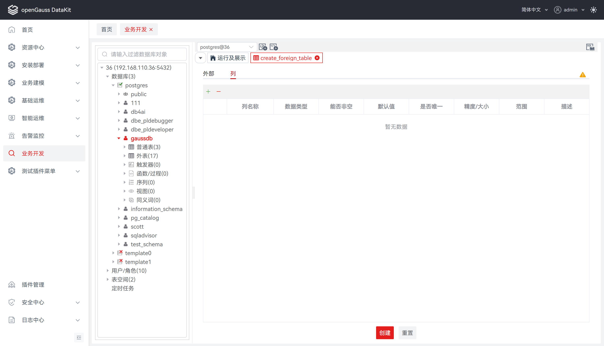
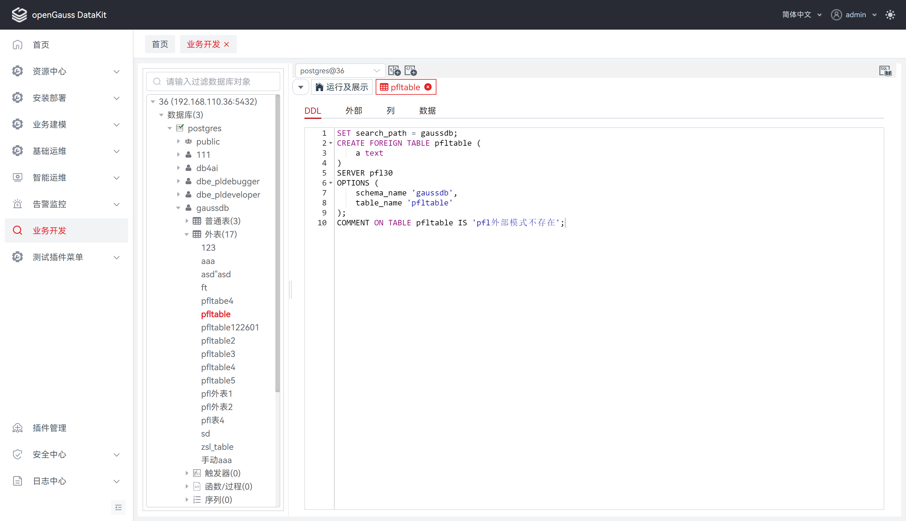
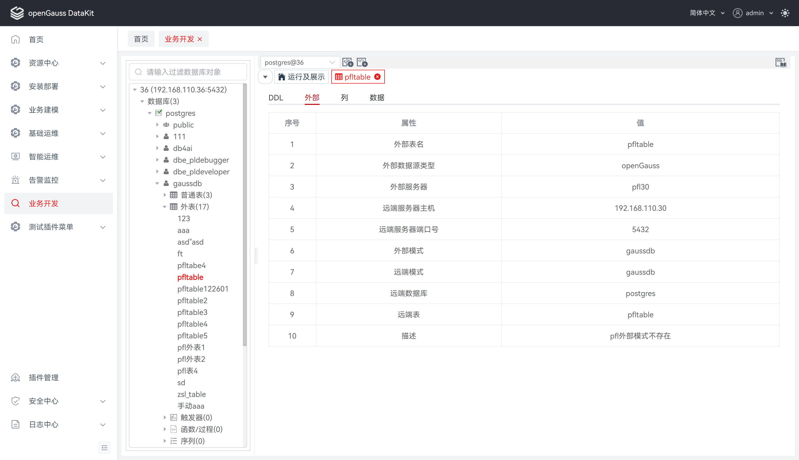
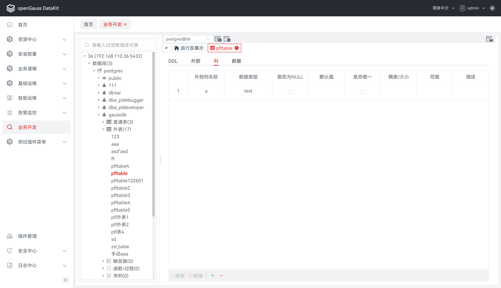
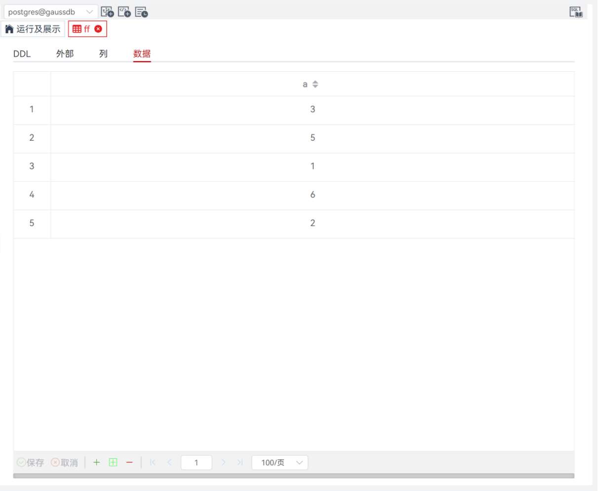
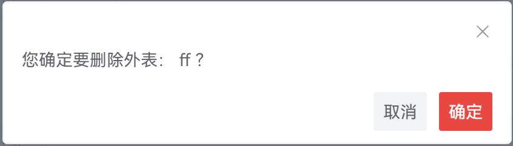

# 外表

外部表是一种特殊类型的表，它表示数据库中的一个虚拟表，其数据存储在数据库外部的数据源中，而不是数据库本身的存储介质中。

## 创建外表

**步骤 1：** 在 "**数据库导航菜单**" 窗格中，右键单击数据库中的 "**外表**" ，选择 "**创建外表**" ，跳转至 "**创建外表**" 页面。

**说明：** 创建外表前，请提前安装好所选外部数据源类型指定的拓展，否则可能导致外表创建失败！

**步骤 2：** 点击 "**外部**" ，定义外部表信息，如外部表名、外部数据库类型、外部服务器等。详情请参见 [**定义外部**](#定义外部)。

**说明：** 外部服务器支持创建和删除，详情请参见 [**定义外部服务器**](#定义外部服务器) 。

**步骤 3：** 点击 "**列**" ，定义外表列信息，如列名称、数据类型、能否非空、默认值等。详情请参见 [**定义列**](#定义列) 。

### 定义外部

设置如下参数：

**说明：** 所有必选参数均需要填写。必填参数用星号（*）标识。

若点击 "**创建**" ，tab 将自动切换至   "**外部**" ，待补全信息后才可执行创建操作。

| **配置项**     | **必填** | **配置说明**                                                 |
| -------------- | -------- | ------------------------------------------------------------ |
| 外部表名       | 是       | 用于定义所创建外部表的名称                                   |
| 如果不存在     | 否       | 条件语句，勾选则表示添加 "IF NOT EXISTS" 语句，添加后可以确保在对象已存在的情况下不会重新创建该对象，从而防止因重复创建而引发错误 |
| 外部数据源类型 | 是       | 用于指定外部数据源类型，默认为 openGauss。当前版本仅支持openGauss，Oracle、MySQL尚未支持 |
| 外部服务器     | 是       | 用于定义所连接远程服务器名称，默认未选择。选项为当前用户已创建的外部服务器列表。外部服务器支持新建和删除，创建和删除具体说明详见下方 **定义外部服务器** 。 |
| 外部数据库     | 是       | 用于指定外部表所在的数据库，默认为当前数据库，不可更改       |
| 外部模式       | 是       | 用于指定外部表所在的模式，默认为当前模式，不可更改           |
| 远端schema     | 否       | 用于填写远端的schema名称。如果不指定的话，将使用外表自身的schema名称作为远端的schema名称 |
| 远端表         | 否       | 用于填写远端的表名。如果不指定的话，将使用外表自身的表名作为远端的表名 |
| 描述           | 否       | 用于定义所外部表的描述                                       |

### 定义外部服务器

外部服务器支持新建和删除。

### 创建外部服务器

**步骤 1：** 在 "**外表**" 页面中，单击 "**外部服务器**" 选择框，点击 "**+新建**"  ，弹出 "**创建外部服务器**" 对话框。

**步骤 2：** 单击 "**确定**" 或 "**确定**" 即可继续，或单击 "**取消**" 即可退出操作。

**说明：** 所有必选参数均需要填写。必填参数用星号（*）标识。

单击 "**确定**" 即可继续，创建后，外表页面的外部服务器选项选中最新创建成功的外部服务器。

单击 "**测试远端连接**" 即可发送建立远端表连接的测试请求。

单击 "**取消**" 即可退出操作。

| **配置项**       | **必填** | **配置说明**                                 |
| ---------------- | -------- | -------------------------------------------- |
| 外部服务器       | 是       | 用于定义所连接远程服务器名称                 |
| 远端服务器主机   | 是       | 用于填写所连接远程服务器数据库主机ip         |
| 远端服务器端口号 | 是       | 用于填写所连接远程服务器数据库端口号         |
| 远端数据库       | 是       | 用于填写所连接远程服务器数据库名称           |
| 用户映射         | 是       | 用于赋予指定用户具备读写权限，默认为当前用户 |
| 远端数据库用户名 | 是       | 用于填写所连接远程服务器数据库用户名         |
| 远端数据库密码   | 是       | 用于填写所连接远程服务器数据库密码           |

### 删除外部服务器

**步骤 1：** 在 "**外表**" 页面中，单击 "**外部服务器**" 选择框，移入下拉列表并点击  ，弹出 "**删除外部服务器**" 确认框。

**步骤 2：** 单击 "**确定**" 即可继续，或单击 "**取消**" 即可退出操作。

**说明：** 单击 "**确定**" 将删除并更新外部服务器列表，此操作不可逆。

单击 "**取消**" 即可退出本次对话框操作。

### 定义列

设置如下参数：

| **配置项** | **必填** | **配置说明**                                                 |
| ---------- | -------- | ------------------------------------------------------------ |
| 列名称     | 是       | 用于定义列名称                                               |
| 数据类型   | 是       | 用于配置数据库常用数据类型，默认为第一个数据类型。配置项数据由后端返回 |
| 能否非空   | 否       | 用于定义列约束，指该列不能包含空值                           |
| 默认值     | 否       | 用于定义列约束，指定该列未定义值的情况下使用的默认值         |
| 是否唯一   | 否       | 用于定义列约束，指列可能仅包含唯一值                         |
| 精度/大小  | 否       | 用于定义数据类型的精度/大小                                  |
| 范围       | 否       | 用于定义数据类型的范围                                       |
| 描述       | 否       | 用于说明列信息                                               |

## 编辑外表

**步骤 1：** 在 "**数据库导航菜单**" 窗格中，展开数据库中的外表列表，单击外表列表，跳转至外表查看与编辑页面。

**步骤 2：** 支持查看DDL/外部、查看与修改列/数据，详情请见下方说明。

### 查看 DDL

### 查看外部

### 修改列

与普通表管理列同，详情请参见 [**表-管理列**](表.md#管理列)

### 修改数据

除外表不支持自定义唯一键外，其他操作与普通表操作表数据相同，详情请参见 [**表-操作表数据**](表.md#操作表数据)

**说明：** 外表数据操作内核不支持添加约束，故无法设置自定义唯一键，待内核完善后补齐该功能。

## 删除外表

**步骤 1：** 在 "**数据库导航菜单**" 窗格中，右键单击数据库中的外表名称，选择 "**删除表**"，弹出 "**删除表**" 确认框。

**步骤 2：** 单击 "**确定**" 即可继续，或单击 "**取消**" 即可退出操作。

**说明：** 单击 "**确定**" 将删除外表，此操作不可逆。

单击 "**取消**" 即可退出本次对话框操作。

## FAQ
1. 无法创建外表数据源类型为 Oracle、MySQL 的外部表。

   原因：目前仅支持创建外部数据源类型为 openGauss 的外部表，Oracle、MySQL 将在后续版本支持。
