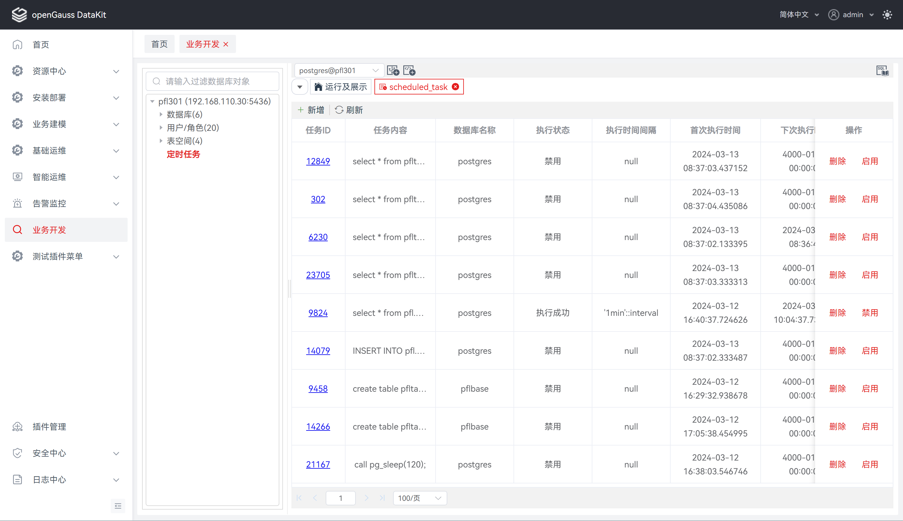
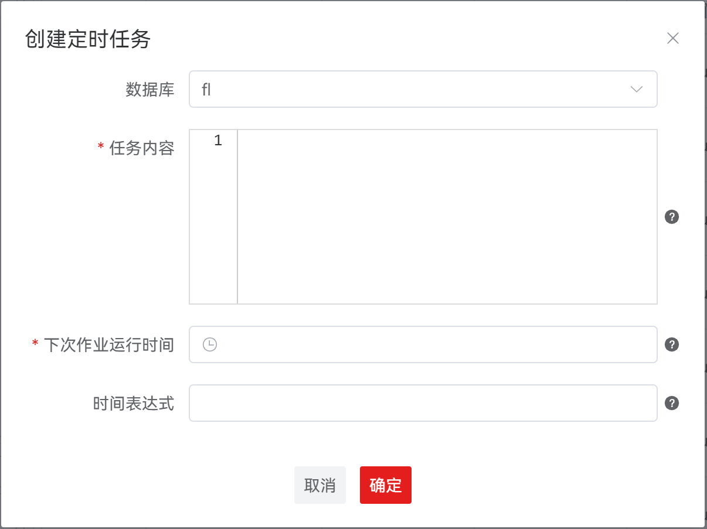
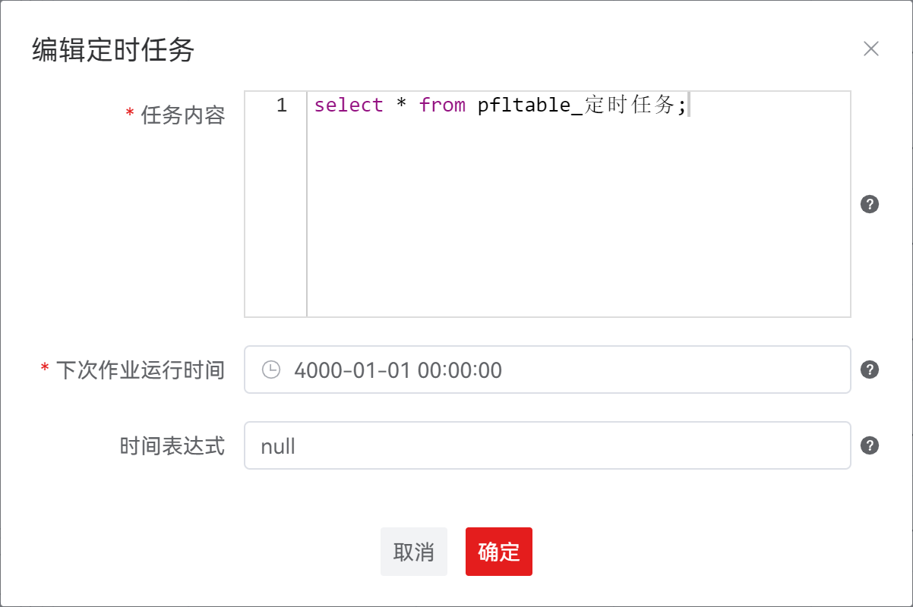

#  定时任务

支持通过编写SQL脚本形式（自定义SQL语句或者调用已有的函数/存储过程）的任务内容并设定任务执行时间，数据库将在任务时间内执行对应的任务内容，以达到自动化执行任务的效果。

##  查看定时任务

执行如下步骤在连接实例中查看实例下所有数据库的定时任务信息：

**步骤 1：** 在 "**数据库导航菜单**" 窗格中，单击连接名称下的 "**定时任务**" ，跳转至定时任务列表页面。

**说明：**

1. 点击定时任务页面操作栏中的，可刷新定时任务列表信息。

2. 点击定时任务页面操作栏中的，可创建定时任务，详情请参见 **创建定时任务**。

3. 点击定时任务页面列表中的任务ID，如，可编辑定时任务，详情请参见 **编辑定时任务**。

4. 点击定时任务页面列表中的操作，如"**启用**"或"**禁用**"，可修改定时任务状态，详情请参见 **启用/禁用定时任务**。

5. 点击定时任务页面列表中的操作，如"**删除**"，可删除定时任务，详情请参见 **删除定时任务**。

##  创建定时任务

**步骤 1：** 在 "**数据库导航菜单**" 窗格中，单击连接名称下的 "**定时任务**" ，跳转至定时任务列表页面。

**步骤 2：** 点击定时任务页面操作栏中的，弹出 "**创建定时任务**" 对话框。

**步骤 3：** 设置如下参数，创建定时任务。

**说明：** 所有必选参数均需要填写。必填参数用星号（*）标识。

| **配置项**       | **必填** | **配置说明**                                                 |
| ---------------- | -------- | ------------------------------------------------------------ |
| 数据库           | 否       | 用于指定定时任务所对应的数据库。默认为当前连接实例对应的数据库，下拉选项为当前连接实例所有已连接的数据库 |
| 任务内容         | 是       | 用于填写要执行的SQL语句。支持一个或多个‘DML’，‘匿名块’，‘调用存储过程的语句’或3种混合的场景 |
| 下次作业运行时间 | 是       | 用于指定下次作业运行时间，默认值为当前系统时间（sysdate）。如果是过去时间，在提交作业时表示立即执行 |
| 时间表达式       | 否       | 用于计算下次作业运行时间的时间表达式，可以是interval表达式，也可以是sysdate加上一个numeric值（例如：sysdate+1.0/24）。如果为空值或字符串"null"表示只执行一次，执行后 JOB 状态 STATUS 变成'd' 不再执行 |

## 编辑定时任务

**步骤 1：** 在 "**数据库导航菜单**" 窗格中，单击连接名称下的 "**定时任务**" ，跳转至定时任务列表页面。

**步骤 2：** 定时任务页面列表中的任务ID，如，弹出 "**编辑定时任务**" 对话框。

**步骤 3：** 设置如下参数，编辑定时任务。

**说明：** 所有必选参数均需要填写。必填参数用星号（*）标识。

该操作仅支持在非正在执行的定时任务上执行。

| **配置项**       | **是否支持修改** | **配置说明**                                                 |
| ---------------- | ---------------- | ------------------------------------------------------------ |
| 任务内容         | 是               | 用于填写要执行的SQL语句，默认数据回显。支持一个或多个‘DML’，‘匿名块’，‘调用存储过程的语句’或3种混合的场景 |
| 下次作业运行时间 | 是               | 用于指定下次作业运行时间，默认数据回显。如果是过去时间，在提交作业时表示立即执行 |
| 时间表达式       | 是               | 用于计算下次作业运行时间的时间表达式，默认数据回显。可以是interval表达式，也可以是sysdate加上一个numeric值（例如：sysdate+1.0/24）。如果为空值或字符串"null"表示只执行一次，执行后JOB状态STATUS变成'd' 不再执行 |

## 启用/禁用定时任务

**步骤 1：** 在 "**数据库导航菜单**" 窗格中，单击连接名称下的 "**定时任务**" ，跳转至定时任务列表页面。

**步骤 2：** 点击定时任务页面列表中的"**启用**"或"**禁用**"操作，弹出修改定时任务状态确认框。

**说明：** "**启用**" 操作仅支持在已禁用的定时任务上执行。

"**禁用**" 操作仅支持在已启用且非正在执行的定时任务上执行。

**步骤 3：** 单击 "**确定**" 即可继续，或单击 "**取消**" 即可退出操作。

## 删除定时任务

**步骤 1：** 在 "**数据库导航菜单**" 窗格中，单击连接名称下的 "**定时任务**" ，跳转至定时任务列表页面。

**步骤 2：** 点击定时任务页面列表中的"**删除**"操作，弹出 "**删除定时任务**" 确认框。

**步骤 3：** 单击 "**确定**" 即可继续，或单击 "**取消**" 即可退出操作。

**说明：** 单击 "**确定**" 将删除定时任务，此操作不可逆。

单击 "**取消**" 即可退出本次对话框操作。

该操作仅支持在非正在执行的定时任务上执行。

