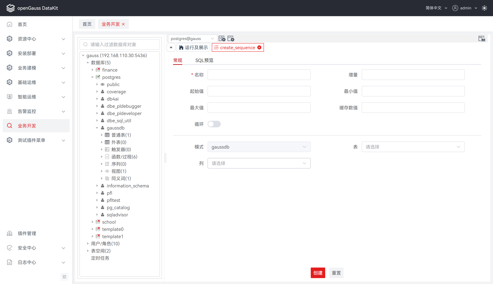
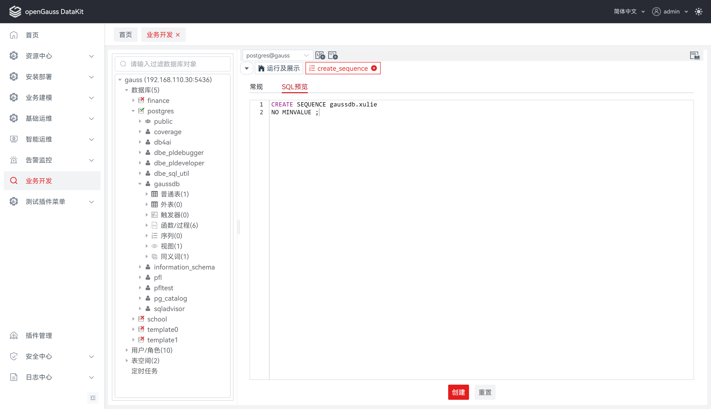
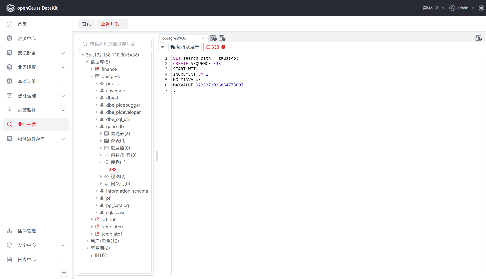
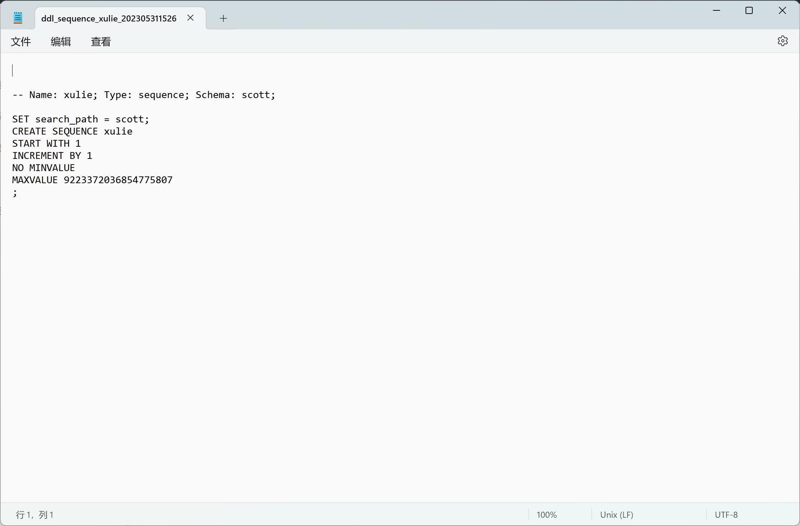
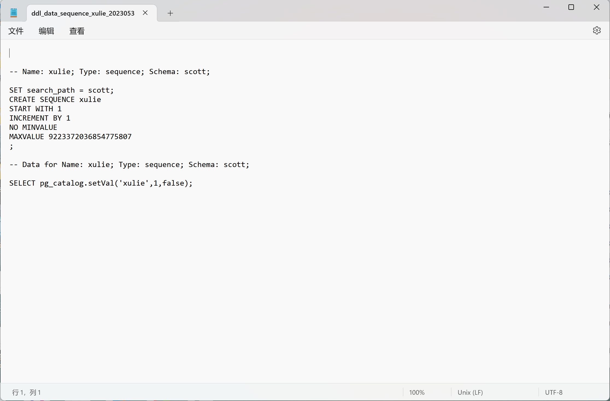

# 序列

## 创建序列

**步骤 1：** 在 "**数据库导航菜单**" 窗格中，右键单击数据库中的 "**序列**"，选择 "**创建序列**"，跳转至 "**创建序列**" 页面。

**步骤 2：** 选择 "**常规**"，设置如下参数，创建序列。

**说明：** 所有必选参数均需要填写。必填参数用星号（*）标识。

单击 "**确定**" 将创建并保存更新后的序列信息。

单击 "**重置**" 即可重置 "**创建序列**"对话框中的所有字段。

单击 "**取消**" 即可退出本次对话框操作。

<table>
    <tr>
        <th style="width: 100px">配置项</th>
        <th style="width: 80px">必填</th>
        <th>配置说明</th>
    </tr>
    <tr>
        <td style="text-align: center">名称</td>
        <td style="text-align: center">是</td>
        <td>用于定义序列名称，默认为空</td>  
    </tr>
    <tr>
        <td style="text-align: center">增量</td>
        <td style="text-align: center">否</td>
        <td>用于定义序列的步长；默认为空，若省略，则数据库设置默认为1，若出现负值，则代表序列的值是按照此步长递减</td>  
    </tr>
    <tr>
        <td style="text-align: center">起始值</td>
        <td style="text-align: center">否</td>
        <td>用于定义序列的初始值(即产生的第一个值)；默认为空，若省略，则数据库设置默认为1</td>  
    </tr>
    <tr>
        <td style="text-align: center">最小值</td>
        <td style="text-align: center">否</td>
        <td>用于定义序列生成器能产生的最小值；默认为空，若省略，则代表没有最小值定义，这时对于递减序列，系统能够产生的最小值的取值范围应在-9223372036854775808；对于递增序列，最小值是1</td>  
    </tr>
    <tr>
        <td style="text-align: center">最大值</td>
        <td style="text-align: center">否</td>
        <td>用于定义序列生成器能产生的最大值 ；默认为空，若省略，则代表没有最大值定义，这时对于递增序列，系统能够产生的最大值是 9223372036854775807 ；对于递减序列，最大值是-1</td>  
    </tr>
    <tr>
        <td style="text-align: center">缓存数值</td>
        <td style="text-align: center">否</td>
        <td>用于定义存放序列的内存块的大小；默认为空，若省略，则数据库默认设置为20；对序列进行内存缓冲，可以改善序列的性能</td>  
    </tr>
    <tr>
        <td style="text-align: center">循环</td>
        <td style="text-align: center">否</td>
        <td>用于定义当序列生成器的值达到限制值后是否循环；默认为不循环，若循环，则当递增序列达到最大值时，循环到最小值;对于递减序列达到最小值时，循环到最大值。如果不循环，达到限制值后，继续产生新值就会发生错误</td> 
    </tr>
    <tr>
        <td style="text-align: center">模式</td>
        <td style="text-align: center">是</td>
        <td>用于定于所属对象模式；默认为当前模式，置灰不可选</td>
    </tr>
    <tr>
        <td style="text-align: center">表</td>
        <td style="text-align: center">否</td>
        <td>用于选择所属对象模式下对应的表；默认为空，若省略，默认仅指向上一级，即模式</td>
    </tr>
    <tr>
        <td style="text-align: center">列</td>
        <td style="text-align: center">否</td>
        <td>用于选择所属对象模式下指定表对应的列；默认为空，若省略，默认指向指定项的上一级，即表、模式</td>
    </tr>
</table>

**步骤 3：** 选择 "**SQL预览**"，可基于创建序列的配置信息进行 SQL 预览。

**说明：** 若未填写 "**常规**" 必填项，将无法通过校验进入 "**SQL预览**" 界面。

"**SQL预览**" 界面的编辑框仅支持查看，不支持编辑。

## 删除序列

**步骤 1：** 在 "**数据库导航菜单**" 窗格中，右键单击数据库中的序列列表，选择 "**删除序列**"，弹出 "**删除序列**" 确认框。

**步骤 2：** 单击 "**确定**" 即可继续，或单击 "**取消**" 即可退出操作。

**说明：** 单击 "**确定**" 将删除并更新序列信息，此操作不可逆。

单击 "**取消**" 即可退出本次对话框操作。

##  查看 DDL

**步骤 1：** 在 "**数据库导航菜单**" 窗格中，单击序列列表，将显示序列 DDL。

## 导出序列 DDL

**步骤 1：** 在 "**数据库导航菜单**" 窗格中，右键单击数据库中的序列名称，选择 "**导出 DDL**"。

**说明：** 导出文件为 sql 文件。

## 导出序列 DDL 和数据

**步骤 1：** 在 "**数据库导航菜单**" 窗格中，右键单击数据库中的序列名称，选择 "**导出 DDL 和数据**"。

**说明：** 导出文件为 sql 文件。

