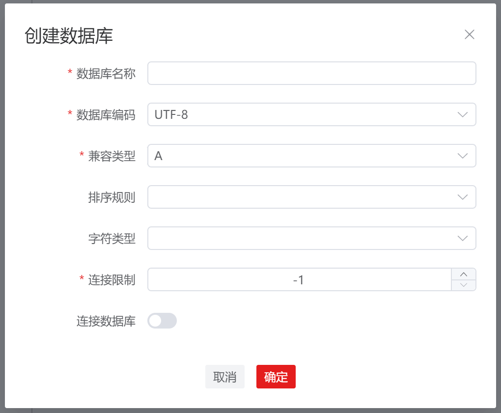

# 数据库

## 创建数据库

**步骤 1：** 在 "**数据库导航菜单**" 窗格中，右键单击连接名称下的 "**数据库**" ，选择 "**创建数据库**" ，弹出 "**创建数据库**" 对话框。

**说明：** 只有当至少存在一个已建立的连接时才能执行此操作。

**步骤 2：** 设置如下参数，创建数据库连接。

**说明：** 所有必选参数均需要填写。必填参数用星号（*）标识。

| 配置项     | 必填   | 配置说明                                                     |
| ---------- |------| ------------------------------------------------------------ |
| 数据库名称 | 是    | 用于定义数据库名称，默认为空                                 |
| 数据库编码 | 是    | 用于配置数据库编码，默认为 UTF-8；通用选项为：UTF-8、GBK、LATIN1、SQL_ASCII |
| 兼容类型   | 是    | 用于配置兼容的数据库的类型，默认为 A，即表示兼容 O；通用选项为：A、B、C、PG，分别表示兼容O、MY、TD和POSTGRES |
| 排序规则   | 否    | 用于配置数据库的排序规则，默认为空，后端使用模板数据库template0的字符类型en_US.UTF-8；通用选项为：C、POSIX、en_US.UTF-8 |
| 字符类型   | 否    | 用于配置数据库的字符类型，默认为空，后端使用模板数据库template0的字符类型en_US.UTF-8；通用选项为：C、POSIX、en_US.UTF-8 |
| 连接限制   | 是    | 用于配置数据库可以接受的并发连接数，默认为-1，表示无限制；取值范围：>=-1的整数，建议填写1~50的整数 |
| 连接数据库 | 否    | 用于是否在创建数据库成功后打开该数据库连接，默认为关闭       |

## 断开所有连接

执行如下步骤断开某一连接下的所有数据库：

**步骤 1：** 在 "**数据库导航菜单**" 窗格中，右键单击连接名称，选择 "**断开所有连接**" ，弹出 "**断开所有连接**" 确认框。

**说明：** 该操作仅能在已连接的数据库上执行。

**步骤 2：** 单击 "**确定**" 即可继续，或单击 "**取消**" 即可退出操作。

**说明：** 单击 "**确定**" 将断开当前连接下的所有数据库的连接，操作成功后将更新当前连接状态。

单击 "**取消**" 即可退出本次对话框操作。

## 打开连接

**步骤 1：** 在 "**数据库导航菜单**" 窗格中，右键单击数据库中的数据库名称，选择 "**打开连接**"，操作成功后将更新数据库连接状态。

**说明：** 该操作仅能在断连的数据库上执行。

## 断开连接

**步骤 1：** 在 "**数据库导航菜单**" 窗格中，右键单击数据库中的数据库名称，选择 "**断开连接**"，弹出 "**断开连接**" 确认框。

**说明：** 该操作仅能在已连接的数据库上执行。

**步骤 2：** 单击 "**确定**" 即可继续，或单击 "**取消**" 即可退出操作。

**说明：** 单击 "**确定**" 将断开当前数据库的连接，操作成功后将更新当前连接状态。

单击 "**取消**" 即可退出本次对话框操作。

## 编辑数据库属性

**步骤 1：** 在 "**数据库导航菜单**" 窗格中，右键单击数据库中的数据库名称，选择 "**编辑数据库属性**"，弹出 "**编辑数据库属性**" 对话框。

**说明：** 该操作仅能在断连的数据库上执行。

**步骤 2：** 设置如下参数，编辑数据库属性。

**说明：** 所有必选参数均需要填写。必填参数用星号（*）标识。

| 配置项     | 是否支持修改 | 必填 | 配置说明                                                     |
| ---------- | ------------ | ---- | ------------------------------------------------------------ |
| 数据库名称 | 是           | 是   | 用于定义数据库名称，默认为回显数据                           |
| 数据库编码 | 否           | 是   | 用于配置数据库编码，默认为回显数据；通用选项为：UTF-8、GBK、LATIN1、SQL_ASCII |
| 兼容类型   | 否           | 是   | 用于配置兼容的数据库的类型，默认为回显数据；通用选项为：A、B、C、PG，分别表示兼容O、MY、TD和POSTGRES |
| 排序规则   | 否           | 否   | 用于配置数据库的排序规则，默认为回显数据；通用选项为：C、POSIX、en_US.UTF-8 |
| 字符类型   | 否           | 否   | 用于配置数据库的字符类型，默认为回显数据；通用选项为：C、POSIX、en_US.UTF-8 |
| 连接限制   | 是           | 否   | 用于配置数据库可以接受的并发连接数，默认为回显数据；取值范围：>=-1的整数，建议填写1~50的整数 |
| 连接数据库 | 是           | 否   | 用于是否在创建数据库成功后打开该数据库连接，默认为关闭       |

## 删除数据库

**步骤 1：** 在 "**数据库导航菜单**" 窗格中，右键单击数据库中的数据库名称，选择 "**删除数据库**"，弹出 "**删除数据库**" 确认框。

**说明：** 该操作仅能在断连的数据库上执行。

**步骤 2：** 单击 "**确定**" 即可继续，或单击 "**取消**" 即可退出操作。

**说明：** 单击 "**确定**" 将删除并更新连接信息，此操作不可逆。

单击 "**取消**" 即可退出本次对话框操作。

## 查看数据库属性

**步骤 1：** 在 "**数据库导航菜单**" 窗格中，右键单击数据库中的数据库名称，选择 "**查看数据库属性**"，对话框将显示所选数据库的属性。

**说明：** 该操作仅能在已连接的数据库上执行。

## 打开新终端

**步骤 1：** 在 "**数据库导航菜单**" 窗格中，右键单击数据库中的数据库名称，选择 "**打开新终端**"，新终端将连接目标数据库。

**说明：** 该操作仅能在已连接的数据库上执行。

## 设置数据库断连时间

**步骤 1：** 在 "**数据库导航菜单**" 窗格中，右键单击数据库中的数据库名称，选择 "**设置断连时间**"，弹出 "**设置数据库自动断连时间**" 对话框。

**说明：** 默认 2 小时内用户未执行数据库操作将自动断开，取值区间为 2 ~ 24 的正整数。

## 数据库连接失效重连

数据库连接失效重连功能可在数据库连接失效后，通过用户再次执行数据库操作时根据建立数据库连接时口令保存情况，重新建立数据库连接。在执行管理数据库对象等操作时，通过当前数据库状态判断并做出不同的交互操作：

| 数据库连接状态                                   | 界面显示                             |
| ------------------------------------------------ | ------------------------------------ |
| 数据库正常连接时                                 | 正常执行数据库操作                   |
| 数据库连接失效且在建立数据库连接时选择未保存口令 | 弹出重新输入密码弹窗                 |
| 数据库连接失效且在建立数据库连接时选择保存口令   | 自动重连数据库后可正常执行数据库操作 |

## FAQ
1. 现象：使用非规范式命名，数据库提示报错。

   原因：数据库不支持直接使用非规范式命名，如纯数字，保留大小写，数字与特殊符号开头等。

   解决办法：若需要使用非规范式命名，需要用户在命名内容前后加上双引号才可创建成功。
