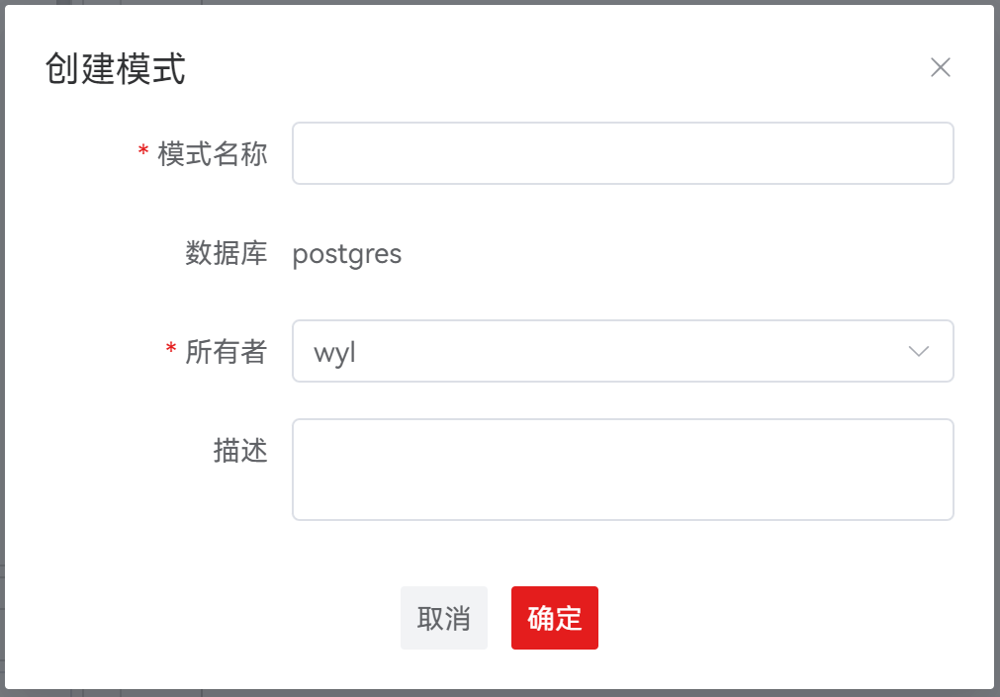
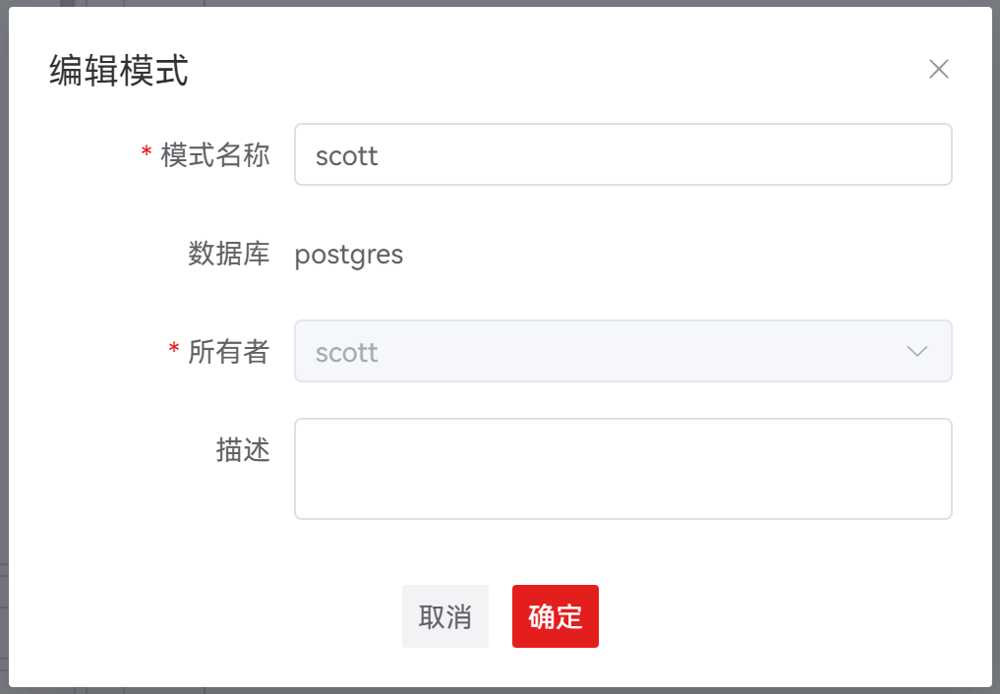
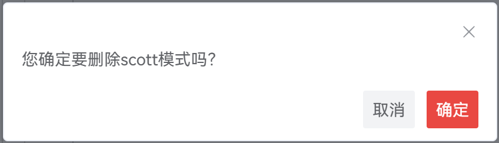
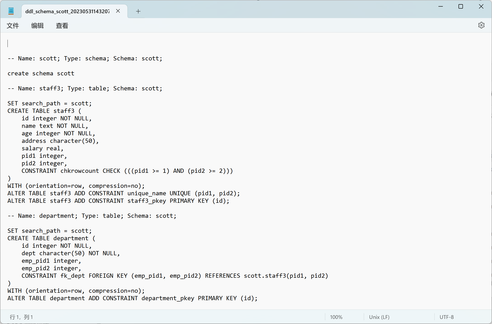
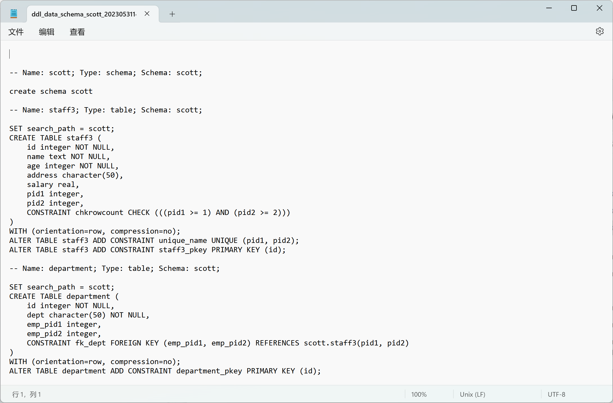

# 模式

数据库模式分为系统模式和用户模式。

本节介绍如何创建、编辑与删除用户模式；导出数据库模式 DDL、导出 DDL 和数据。

## 创建模式

在关系型数据库技术中，模式提供数据库对象的逻辑分类，一个模式可能包含如下数据库对象：函数/过程、表、视图、序列和索引。 执行如下步骤定义模式：

**步骤 1：** 在 "**数据库导航菜单**" 窗格中，右键单击数据库中的数据库名称，选择 "**创建模式**" ，弹出 "**创建模式**" 对话框。

**说明：** 仅在数据库为连接状态时，可创建用户模式。

**步骤 2：** 设置如下参数，创建用户模式。

**说明：** 所有必选参数均需要填写。必填参数用星号（*）标识。

| 配置项   | 必填 | 配置说明                                                     |
| -------- | ---- | ------------------------------------------------------------ |
| 模式名称 | 是   | 用于定义模式名称，默认为空                                   |
| 数据库   | 否   | 用于显示模式所属数据库，默认为当前数据库，不支持更改         |
| 所有者   | 是   | 用于定义模式所有者，默认为当前创建用户，所有者下拉选项由后端返回非系统的用户/角色选项 |
| 描述     | 否   | 用于说明模式信息，默认为空                                   |

## 编辑模式

**步骤 1：** 在 "**数据库导航菜单**" 窗格中，右键单击数据库中的模式名称，选择 "**编辑模式**"，弹出 "**编辑模式**" 对话框。

**说明：** 仅在数据库为连接状态时，可编辑用户模式。

**步骤 2：** 设置如下参数，编辑用户模式。

**说明：** 所有必选参数均需要填写。必填参数用星号（*）标识。

| 配置项   | 是否支持修改 | 必填 | 配置说明                             |
| -------- | ------------ | ---- | ------------------------------------ |
| 模式名称 | 是           | 是   | 用于定义模式名称，默认数据回显       |
| 数据库   | 否           | 否   | 用于显示模式所属数据库，默认数据回显 |
| 所有者   | 否           | 是   | 用于定义模式所有者，默认数据回显     |
| 描述     | 是           | 否   | 用于说明模式信息，默认数据回显       |

## 删除模式

**步骤 1：** 在 "**数据库导航菜单**" 窗格中，右键单击数据库中的模式名称，选择 "**删除模式**"，弹出 "**删除模式**" 确认框。

**说明：** 仅在数据库为连接状态时，可删除用户模式。

**步骤 2：** 单击 "**确定**" 即可继续，或单击 "**取消**" 即可退出操作。

**说明：** 单击 "**确定**" 将删除并更新连接信息，此操作不可逆。

单击 "**取消**" 即可退出本次对话框操作。

## 导出模式 DDL

可通过导出 DDL 导出该模式下函数/过程、表、序列和视图的DDL。

**步骤 1：** 在 "**数据库导航菜单**" 窗格中，右键单击数据库中的模式名称，选择 "**导出 DDL**"。

**说明：** 导出文件为 sql 文件。

## 导出模式 DDL 和数据

通过导出模式的 DDL 和数据，可导出该模式下的函数/过程的 DDL、表的 DDL 和数据、视图的 DDL、序列的 DDL 和数据。执行以下步骤导出模式的 DDL 和数据：

**步骤 1：** 在 "**数据库导航菜单**" 窗格中，右键单击数据库中的模式名称，选择 "**导出 DDL 和数据**"。

**说明：** 导出文件为 sql 文件。

