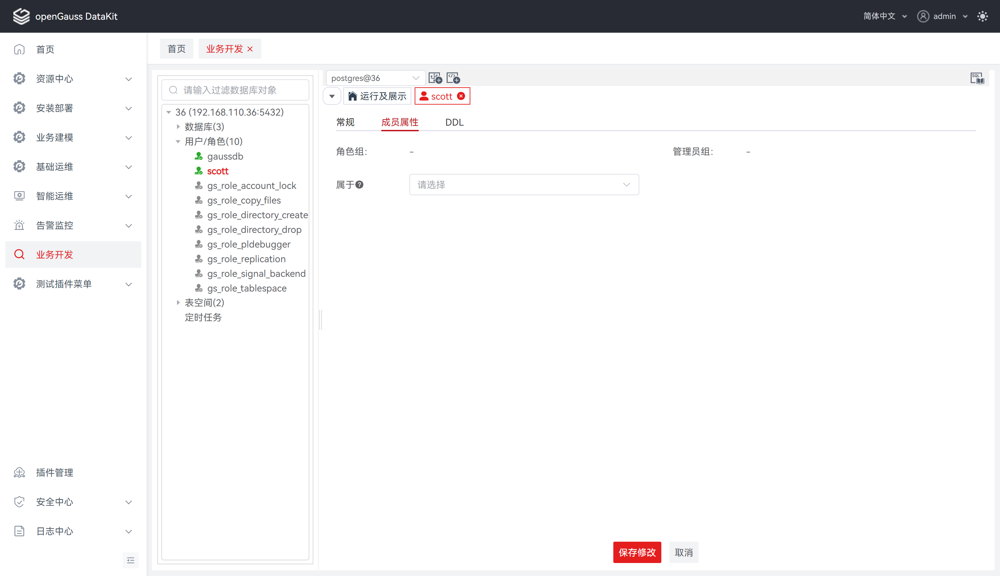

# 用户/角色

多个用户可以使用同一数据库，为了方便管理，需要将用户进行分组。一个数据库角色代表一个或一组数据库用户。

在数据库中，用户和角色的概念类似。实际应用中，建议使用角色来进行权限管理而不是直接访问数据库。

**用户：**  数据库用户的集合。这些用户与操作系统用户不同，可以为其他用户分配权限以访问数据库对象。

**角色：** 根据用途的不同，可以将角色分为用户或用户组。角色是集群级别的定义，适用于集群中的所有数据库。

## 创建用户/角色

执行如下步骤在数据库中定义用户/角色：

**步骤 1：** 在 "**数据库导航菜单**" 窗格中，右键单击连接名称下的 "**用户/角色**" ，选择 "**创建用户/角色**" ，跳转至 "**创建用户/角色**" 页面。

**步骤 2：** 点击 "**常规**" ，定义用户/角色基本信息，如名称、密码、类型、连接限制、权限等。详情请参见 **定义常规** 。

**步骤 3：** 点击 "**成员属性**" ，定义成员所有者等。详情请参见 **定义成员属性** 。

**步骤 4：** 点击 "**DDL 预览**" ，查看输入所自动生成的 SQL 查询。详情请参见 **DDL 预览** 。

**定义常规**

设置如下参数：

**说明：** 所有必选参数均需要填写。必填参数用星号（*）标识。

若点击 "**创建**" ，tab 将自动切换至   "**常规**" ，待补全信息后才可执行创建操作。

| 配置项   | 必填 | 配置说明                                                    |
| -------- | ---- | ----------------------------------------------------------- |
| 名称     | 是   | 用于定义用户/角色名称，默认为空                             |
| 类型     | 否   | 用于定义所创建的类型，默认为用户                            |
| 密码     | 是   | 用于定义用户/角色密码，默认为空                             |
| 确认密码 | 是   | 用于二次确认用户/角色密码，默认为空                         |
| 开始日期 | 否   | 用于为该用户/角色密码指定有效开始时间，默认为空。若为空，则表示创建后立即生效 |
| 结束日期 | 否   | 用于为该用户/角色密码指定有效结束时间，默认为空。若为空，则表示永久有效。在有效时间范围内，该角色可以正常使用；超出有效时间范围后，该角色将被自动禁用，并无法再使用 |
| 连接限制 | 否   | 用于指定该用户/角色支持的并发连接数，默认为-1表无限制        |
| 资源池   | 否   | 用于为该用户/角色选择资源池，默认为空                      |
| 权限     | 否   | 用于为该用户/角色指定权限，默认为空                         |
| 描述     | 否   | 用于为该用户/角色指定描述，默认为空                         |

**定义成员属性**

设置如下参数：

| **配置项** | **必填** | **配置说明**                                                 |
| ---------- | -------- | ------------------------------------------------------------ |
| 角色组     | 否       | 用于指定该用户/角色的角色组，默认为空；若为空，该用户/角色默认不归属于任何人。即该用户/角色不是任何其他角色或用户的子集，其权限和访问范围由角色本身的权限和授权决定 |
| 管理员组   | 否       | 用于指定该用户/角色的管理员组，默认为空；若为空，该用户/角色默认不归属于任何人。即该用户/角色不是任何其他角色或用户的子集，其权限和访问范围由角色本身的权限和授权决定 |

**DDL 预览**

按照输入的内容，生成一个DDL 语句。

**说明：** 该 DDL 语句仅支持查看、选择、复制，不支持编辑。

## 编辑用户/角色

执行如下步骤编辑用户/角色：

**步骤 1：** 在 "**数据库导航菜单**" 窗格中，单击用户/角色列表，跳转至用户/角色查看与编辑页面。

**步骤 2：** 支持查看DDL、查看与修改常规信息以及成员属性信息，详情请见下方说明。

**修改常规**

设置如下参数：

**说明：** 所有必选参数均需要填写。必填参数用星号（*）标识。

| **配置项** | **是否支持修改** | **配置说明**                                                 |
| ---------- | ---------------- | ------------------------------------------------------------ |
| 名称       | 是               | 用于定义用户/角色名称，默认数据回显                          |
| OID        | 否               | 返回对应的用户/角色OID                                       |
| 类型       | 否               | 返回创建时所选的用户/角色类型                                |
| 开始日期   | 是               | 用于为该用户/角色密码指定有效开始时间，默认数据回显；若为空，则表示立即生效；不支持由已有日期设置为空 |
| 结束日期   | 是               | 用于为该用户/角色密码指定有效结束时间，默认数据回显；若为空，则表示永久有效；在有效时间范围内，该角色可以正常使用；超出有效时间范围后，该角色将被自动禁用，并无法再使用；不支持由已有日期设置为空 |
| 连接限制   | 是               | 用于指定该用户/角色支持的并发连接数，默认数据回显            |
| 资源池     | 是               | 用于为该用户/角色选择资源池，默认数据回显                    |
| 权限       | 是               | 用于为该用户/角色指定权限，默认数据回显                      |
| 描述       | 是               | 用于为该用户/角色指定描述，默认数据回显                      |

**修改成员属性**

设置如下参数：

**说明：** 所有必选参数均需要填写。必填参数用星号（*）标识。

| **配置项** | **是否支持修改** | **配置说明**                                                 |
| ---------- | ---------------- | ------------------------------------------------------------ |
| 角色组     | 否               | 用于指定该用户/角色的角色组，默认为空；若为空，该用户/角色默认不归属于任何人。即该用户/角色不是任何其他角色或用户的子集，其权限和访问范围由角色本身的权限和授权决定 |
| 管理员组   | 否               | 用于指定该用户/角色的管理员组，默认为空；若为空，该用户/角色默认不归属于任何人。即该用户/角色不是任何其他角色或用户的子集，其权限和访问范围由角色本身的权限和授权决定 |
| 属于       | 是               | 用 GRANT 赋权，表示当前用户/角色  是该字段填写的用户/角色的成员，默认为空 |

**查看 DDL**

## 修改用户/角色密码

**步骤 1：** 在 "**数据库导航菜单**" 窗格中，右键单击连接名称下的用户/角色名称，选择 "**修改密码**"，弹出 "**修改用户/角色密码**" 对话框。

**步骤 2：** 设置如下参数，修改用户/角色密码。

**说明：** 所有必选参数均需要填写。必填参数用星号（*）标识。

除了初始用户外其他管理员或普通用户修改自己的密码需要输入正确的旧密码。只有初始用户、系统管理员（sysadmin）或拥有创建用户（CREATEROLE）权限的用户才可以重置普通用户密码，无需输入旧密码。初始用户可以重置系统管理员的密码，系统管理员不允许重置其他系统管理员的密码。

| **配置项**   | **必填** | **配置说明**                                       |
| ------------ | -------- | -------------------------------------------------- |
| 原密码       | 是       | 用于填写用户/角色旧密码                            |
| 新密码       | 是       | 用于填写用户/角色新密码                            |
| 确认新密码   | 是       | 用于填写用户/角色新密码                            |
| 操作用户密码 | 是       | 用于填写当前操作用户的密码，用于验证数据库用户身份 |

## 删除用户/角色

**步骤 1：** 在 "**数据库导航菜单**" 窗格中，右键单击连接名称下的用户/角色名称，选择 "**删除用户/角色**"，弹出 "**删除用户/角色**" 确认框。

**步骤 2：** 单击 "**确定**" 即可继续，或单击 "**取消**" 即可退出操作。

**说明：** 单击 "**确定**" 将删除用户/角色，此操作不可逆。

单击 "**取消**" 即可退出本次对话框操作。

## FAQ
1. 现象：DDL 回显为空。

   原因：当前登录用户不存在查看权限。
  
   解决办法：使用存在查看权限的用户登录。

