#  表

## 查看表

支持查看表属性，查看内容包含 DDL、常规、列、约束、索引、数据，若所选表为分区表，查看内容还将包含分区属性。

### 查看 DDL

执行以下步骤查看 DDL：

**步骤 1：** 在 "**数据库导航菜单**" 窗格中，单击普通表列表，将显示所选表对应的属性与数据，选中 "**DDL**"。

**说明**：当前显示数据仅在首次加载时自动获取，若需更新数据请点击刷新按钮。

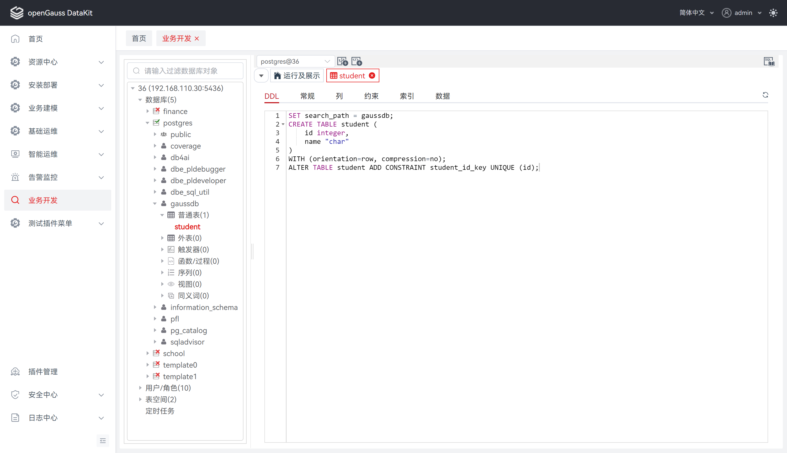

### 查看常规

执行以下步骤查看常规：

**步骤 1：** 在 "**数据库导航菜单**" 窗格中，单击普通表列表，将显示所选表对应的属性与数据，选中 "**常规**"。

**说明**：当前显示数据仅在首次加载时自动获取，若需更新数据请点击刷新按钮。

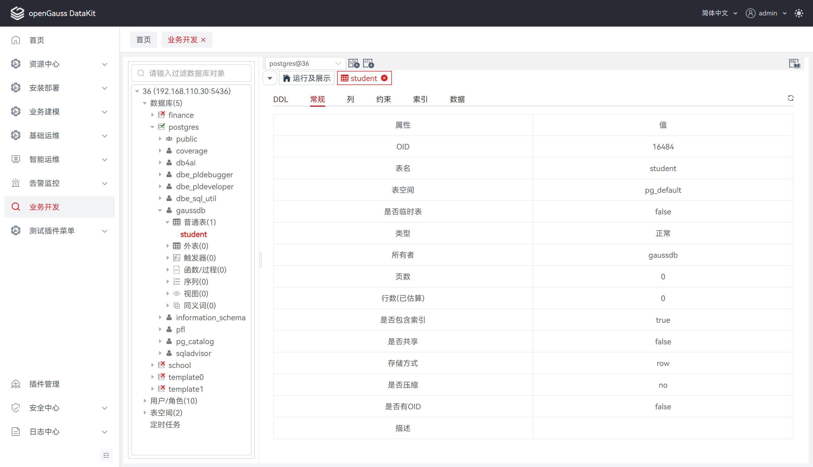

### 查看列

执行以下步骤查看列：

**步骤 1：** 在 "**数据库导航菜单**" 窗格中，单击普通表列表，将显示所选表对应的属性与数据，选中 "**列**"。

**说明**：当前显示数据仅在首次加载时自动获取，若需更新数据请点击刷新按钮。

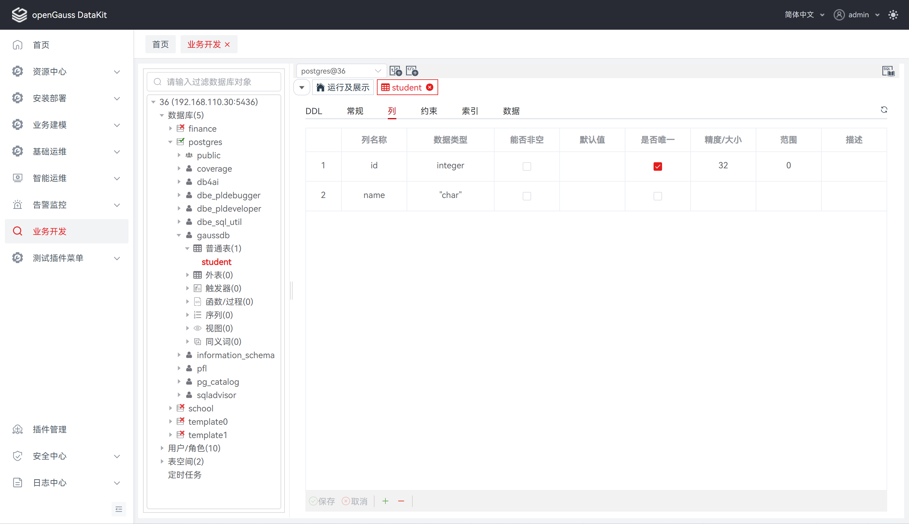

### 查看约束

执行以下步骤查看约束：

**步骤 1：** 在 "**数据库导航菜单**" 窗格中，单击普通表列表，将显示所选表对应的属性与数据，选中 "**约束**"。

**说明**：当前显示数据仅在首次加载时自动获取，若需更新数据请点击刷新按钮。

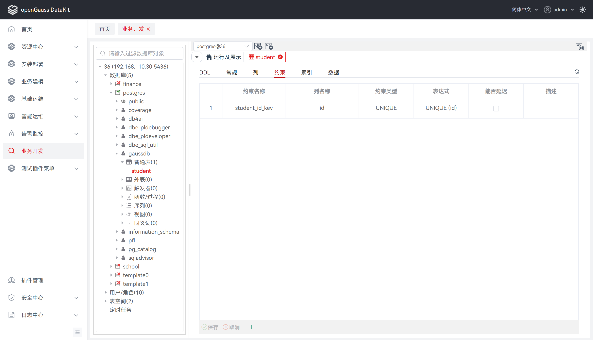

### 查看索引

执行以下步骤查看索引：

**步骤 1：** 在 "**数据库导航菜单**" 窗格中，单击普通表列表，将显示所选表对应的属性与数据，选中 "**索引**"。

**说明**：当前显示数据仅在首次加载时自动获取，若需更新数据请点击刷新按钮。

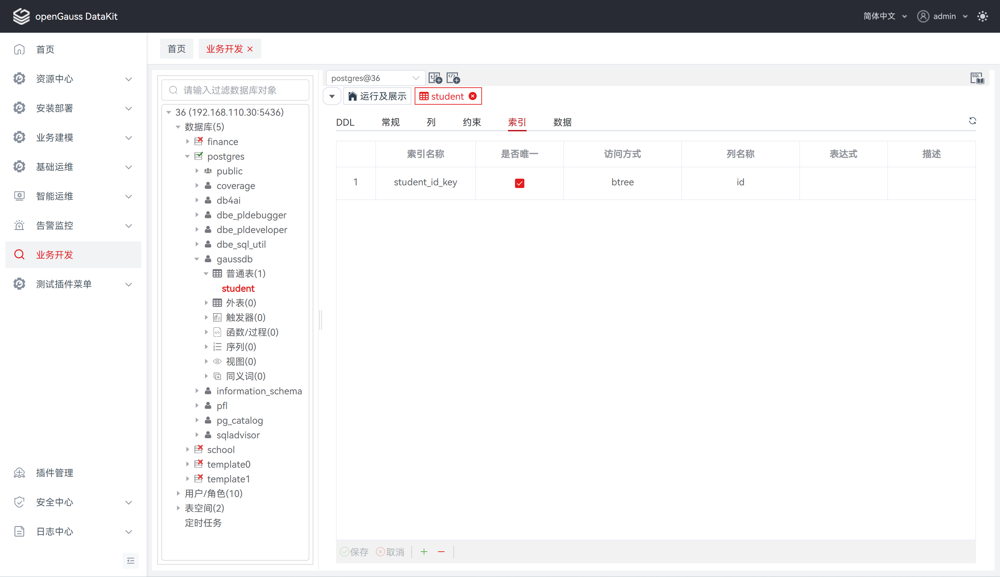

### 查看数据

执行以下步骤查看数据：

**步骤 1：** 在 "**数据库导航菜单**" 窗格中，单击普通表列表，将显示所选表对应的属性与数据，选中 "**数据**"。

**说明：** 当前显示数据仅在首次加载时自动获取，若需更新数据请点击刷新按钮。

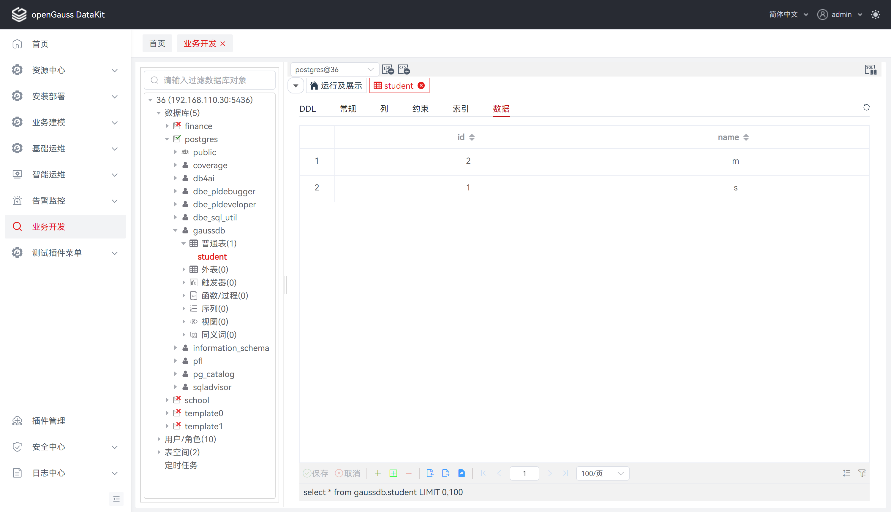

### 查看分区

执行以下步骤查看分区属性：

**步骤 1：** 在 "**数据库导航菜单**" 窗格中，单击普通表列表，若所选表为分区表，将显示分区属性，选中 "**分区**"。

**说明：** 当前显示数据仅在首次加载时自动获取，若需更新数据请点击刷新按钮。

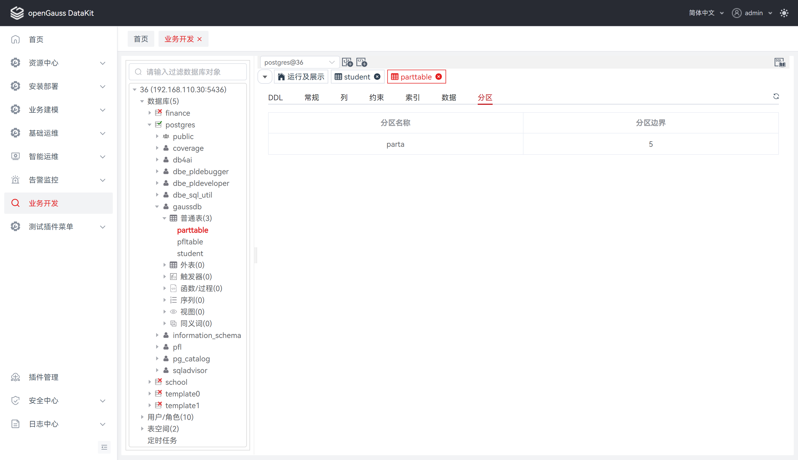

## 创建表

执行如下步骤在数据库中定义表：

**步骤 1：** 在 "**数据库导航菜单**" 窗格中，右键单击数据库中的 "**普通表**" ，选择 "**创建表**" ，弹出 "**创建表**" 对话框。

**步骤 2：** 点击 "**常规**" ，定义表基本信息，如表名称、表空间、表类型等。详情请参见 **定义常规** 。

**步骤 3：** 点击 "**列**" ，定义列相关信息，如列名、数据类型模式、数据类型、列约束等。详情请参见 **定义列** 。

**步骤 4：** 点击 "**约束**" ，为不同约束类型定义列约束。约束类型包含主键（PRIMARY KEY）、唯一（UNIQUE）、检查（CHECK）、外键（FOREIGN KEY）。详情请参见 **定义约束** 。

**步骤 5：** 点击 "**索引**" ，定义表索引信息，如索引名称、访问方法、表空间等。详情请参见 **定义索引** 。

**步骤 6：** 若在 "**常规**" 勾选 "**是否分区表**" 则可点击 "**分区**" ，定义分区表信息，如表分区类型、间隔值、分区名称、表空间等。详情请参见 **定义分区** 。

**步骤 7：** 点击 "**DDL 预览**" ，查看输入所自动生成的 SQL 查询。详情请参见 **DDL 预览** 。

**定义常规**

设置如下参数：

**说明：** 所有必选参数均需要填写。必填参数用星号（*）标识。

若点击 "**创建**" ，tab 将自动切换至   "**列**" ，待补全列信息后才可执行创建操作。

| 配置项     | 必填 | 配置说明                                                     |
| ---------- | ---- | ------------------------------------------------------------ |
| 表名       | 是   | 用于定义表名称                                               |
| 如果不存在 | 否   | 用于定义表是否判断是否已存在，如果不存在则进行创建操作       |
| 表类型     | 否   | 用于定义表类型，选项分别为常规/UNLOGGED                      |
| 带OIDS     | 否   | 用于定义表是否带有oids                                       |
| 表空间     | 否   | 用于定义表所在表空间                                         |
| 填充因子   | 否   | 用于定义填充因子                                             |
| 存储方式   | 否   | 用于定义表存储方式，选项分别为ROW、COLUMN                    |
| 是否分区表 | 否   | 用于定义是否为分区表，默认不勾选为普通表，勾选后需要在”分区”栏填写分区信息 |
| 描述       | 否   | 用于说明列信息                                               |

**定义列**

设置如下参数：

| **配置项** | **配置说明**                                         |
| ---------- | ---------------------------------------------------- |
| 列名称     | 用于定义列名称                                       |
| 数据类型   | 用于配置数据库常用数据类型，默认为第一个数据类型     |
| 能否非空   | 用于定义列约束，指该列不能包含空值                   |
| 默认值     | 用于定义列约束，指定该列未定义值的情况下使用的默认值 |
| 是否唯一   | 用于定义列约束，指列可能仅包含唯一值                 |
| 精度/大小  | 用于定义数据类型的精度/大小                          |
| 范围       | 用于定义数据类型的范围                               |
| 描述       | 用于说明列信息                                       |

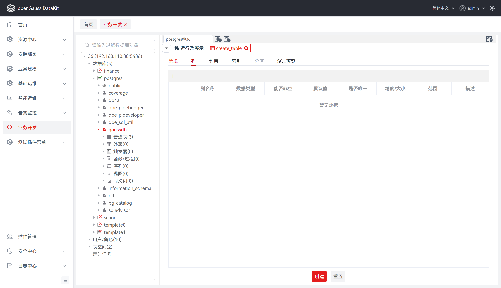

**定义约束**

设置如下参数：

<table>
    <tr>
        <th>配置项</th>
        <th>配置说明</th>
    </tr>   
    <tr>
        <td>约束名称</td>
        <td>用于定义约束名称</td>
    </tr>
    <tr>
        <td>列名称</td>
        <td>用于选择定义约束的列名称</td>
    </tr>
    <tr>
        <td>约束类型</td>
        <td>用于选择定义约束的类型；配置项：CHECK、UNIQUE、PRIMARY KEY、FOREIGN KEY、 PARTIAL CLUSTER KEY，以上数据由前端固定配置，其中FOREIGN KEY选项下一级分别需要配置命名空间、 表、列，对应数据由后端返回；如果选择多个列，配置项中的FOREIGN KEY选项置灰不可选，一个外键只能 设置一个列</td>
    </tr>
    <tr>
        <td>表达式</td>
        <td>用于定义约束的表达式</td>
    </tr>
    <tr>
        <td>能否延迟</td>
        <td>用于定义约束延迟检查功能，设置延迟类型为IMMEDIATE</td>
    </tr>
    <tr>
        <td>描述</td>
        <td>用于定义约束信息</td>
    </tr>
</table>

**定义索引**

设置如下参数：

| **配置项** | **配置说明**               |
| ---------- | -------------------------- |
| 索引名称   | 用于定义索引名称           |
| 是否唯一   | 用于定义索引的唯一性       |
| 访问方式   | 用于选择使用的索引方法名称 |
| 列名称     | 用于选择定义索引的列名称   |
| 表达式     | 用于输入用户自定义表达式   |
| 描述       | 用于定义索引信息           |

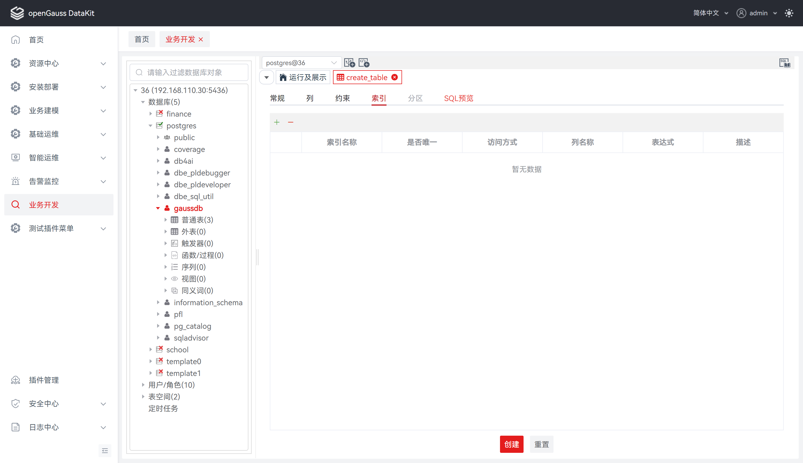

**定义分区**

设置如下参数：

**说明：** 所有必选参数均需要填写。必填参数用星号（*）标识。

| 配置项   | 必填 | 配置说明                               |
| -------- | ---- | -------------------------------------- |
| 分区类型 | 否   | 用于定义分区类型                       |
| 间隔值   | 否   | 用于配置分区类型为 interval 时的间隔值 |
| 分区名称 | 是   | 用于定义分区名称                       |
| 表空间   | 否   | 用于定义分区所在表空间                 |
| 分区列   | 是   | 用于定义分区列                         |
| 分区值   | 是   | 用于定义分区列的分区值                 |

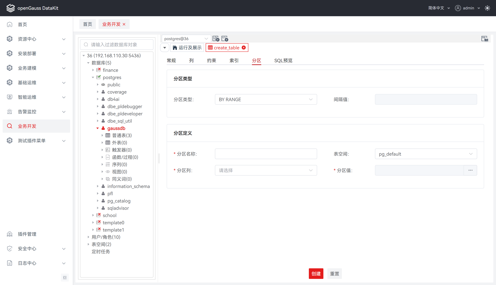

**SQL 预览**

按照输入的内容，生成一个SQL 语句。

**说明：** 该 DDL 语句仅支持查看、选择、复制，不支持编辑。

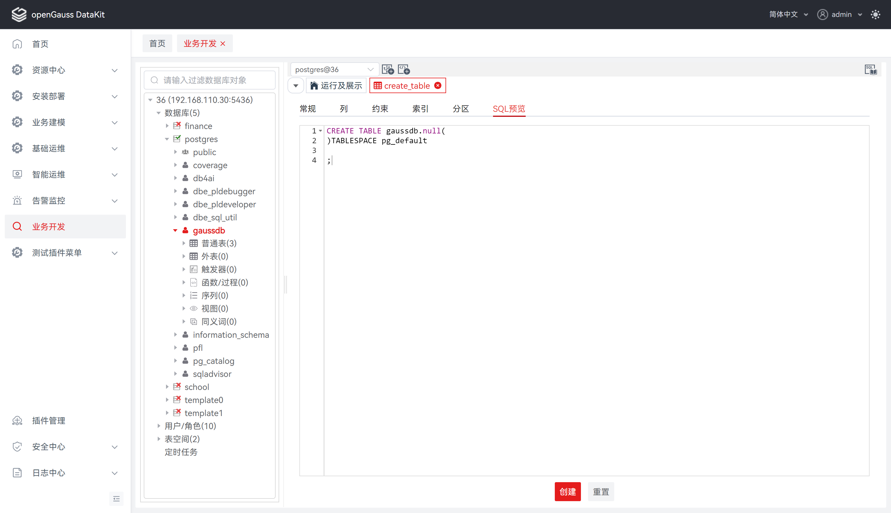

### 管理列

创建表后，可以在该表中添加新的列。可对当前列执行添加、修改、删除操作。

**创建列**

**步骤 1：** 在 "**数据库导航菜单**" 窗格中，单击表名称，选择 "**列**"。

**步骤 2：** 点击添加按钮 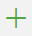将显示新增列数据行。

**步骤 3：** 双击新增列数据行的每个表格即可启用编辑状态，定义列详情请参见 **定义列** 。

**步骤 4：** 新增列数据编辑完成后，点击  将保存新增列数据行；若点击  将关闭新增列数据行，恢复至未创建前的操作状态。

**修改列**

**步骤 1：** 在 "**数据库导航菜单**" 窗格中，单击表名称，选择 "**列**"。

**步骤 2：** 双击已有列数据行的每个表格即可启用编辑状态，已修改数据背景将高亮。定义列详情请参见 **定义列** 。

**步骤 3：** 已有列数据修改完成后，点击  将保存修改列数据行；若点击  将取消修改列数据行操作，恢复至未修改前的操作状态。

**删除列**

**步骤 1：** 在 "**数据库导航菜单**" 窗格中，单击表名称，选择 "**列**"。

**步骤 2：** 单击选择已有列数据行，点击 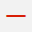 将使所需删除列数据行背景高亮。

**步骤 3：** 所需删除列数据行选择完毕后，点击  将删除所选列数据行；若点击  将取消删除列数据行操作，恢复至未修改前的操作状态。

### 管理约束

创建表后，可以在该表中添加新的约束。可对当前约束执行添加、修改、删除操作。

**创建约束**

**步骤 1：** 在 "**数据库导航菜单**" 窗格中，单击表名称，选择 "**约束**"。

**步骤 2：** 点击添加按钮 将显示新增约束数据行。

**步骤 3：** 双击新增约束数据行的每个表格即可启用编辑状态，定义约束详情请参见 **定义约束** 。

**步骤 4：** 新增约束数据编辑完成后，点击  将保存新增约束数据行；若点击  将关闭新增约束数据行，恢复至未创建前的操作状态。

**修改约束**

**步骤 1：** 在 "**数据库导航菜单**" 窗格中，单击表名称，选择 "**约束**"。

**步骤 2：** 双击已有约束数据行的每个表格即可启用编辑状态，已修改数据背景将高亮。定义约束详情请参见 **定义约束** 。

**步骤 3：** 已有约束数据修改完成后，点击  将保存修改约束数据行；若点击  将取消修改约束数据行操作，恢复至未修改前的操作状态。

**删除约束**

**步骤 1：** 在 "**数据库导航菜单**" 窗格中，单击表名称，选择 "**约束**"。

**步骤 2：** 单击选择已有约束数据行，点击  将使所需删除约束数据行背景高亮。

**步骤 3：** 所需删除约束数据行选择完毕后，点击  将删除所选约束数据行；若点击  将取消删除约束数据行操作，恢复至未修改前的操作状态。

### 管理索引

创建表后，可以在该表中添加新的索引。可对当前索引执行添加、修改、删除操作。

**创建索引**

**步骤 1：** 在 "**数据库导航菜单**" 窗格中，单击表名称，选择 "**索引**"。

**步骤 2：** 点击添加按钮 将显示新增索引数据行。

**步骤 3：** 双击新增索引数据行的每个表格即可启用编辑状态，定义索引详情请参见 **定义索引** 。

**步骤 4：** 新增索引数据编辑完成后，点击  将保存新增索引数据行；若点击  将关闭新增索引数据行，恢复至未创建前的操作状态。

**修改索引**

**步骤 1：** 在 "**数据库导航菜单**" 窗格中，单击表名称，选择 "**索引**"。

**步骤 2：** 双击已有索引数据行的每个表格即可启用编辑状态，已修改数据背景将高亮。定义索引详情请参见 **定义索引** 。

**步骤 3：** 已有索引数据修改完成后，点击  将保存修改索引数据行；若点击  将取消修改索引数据行操作，恢复至未修改前的操作状态。

**删除索引**

**步骤 1：** 在 "**数据库导航菜单**" 窗格中，单击表名称，选择 "**索引**"。

**步骤 2：** 单击选择已有索引数据行，点击  将使所需删除索引数据行背景高亮。

**步骤 3：** 所需删除索引数据行选择完毕后，点击  将删除所选索引数据行；若点击  将取消删除索引数据行操作，恢复至未修改前的操作状态。

## 管理表

创建表后，可在表中执行操作。右键单击表，选择要执行的管理表操作。

### 查询相关序列

openGauss 支持显示表和序列之间的依赖关系。

**步骤 1：** 在 "**数据库导航菜单**" 窗格中，右键单击数据库中的表名称，选择 "**查询相关序列**" ，进入显示相关序列页面。

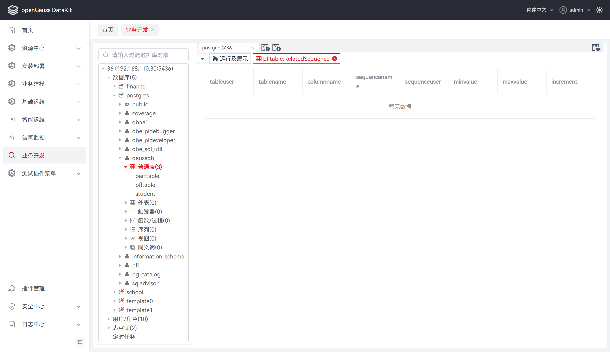

### 重建索引

使用索引可帮助用户更快地查找数据。以下场景需要重建索引：

- 索引已破坏，不再包含任何有效数据。虽然理论上不会发生，但事实上，索引可能由于软件或硬件故障而被破坏重建索引提供恢复方法。
- 索引包含很多空的或几乎为空的页面，这种情况会在一些非通用访问类型下openGauss 中的 B-tree 索引中出现重建索引提供一种通过写新版本的方式减少索引消耗的方法。新版本中无空页面。
- 已修改索引的存储参数（如“填充因子”），且希望保证修改完全生效。

执行以下步骤重建索引：

**步骤 1：** 在 "**数据库导航菜单**" 窗格中，右键单击数据库中的表名称，选择 "**重建索引**" ，弹出确认对话框。

**步骤 2：** 单击 "**确定**" 重建索引。

状态栏显示已完成操作的状态。

### 清理表

用于收回空间，便于重复利用。

**步骤 1：** 在 "**数据库导航菜单**" 窗格中，右键单击数据库中的表名称，选择 "**清理表**" ，弹出确认对话框。

**步骤 2：** 单击 "**确定**" 重建索引。

状态栏显示已完成操作的状态。

###  截断表

删除当前表的所有数据。

**步骤 1：** 在 "**数据库导航菜单**" 窗格中，右键单击数据库中的表名称，选择 "**截断表**" ，弹出确认对话框。

**步骤 2：** 单击 "**确定**" 截断表。

状态栏显示已完成操作的状态。

###  设置表模式

**步骤 1：** 在 "**数据库导航菜单**" 窗格中，右键单击数据库中的表名称，选择 "**设置表模式**" ，弹出设置表模式对话框。

**步骤 2：** 从下拉列表中选择模式名称，单击 "**确定**" 已选表将被移动到新模式。

状态栏显示已完成操作的状态。

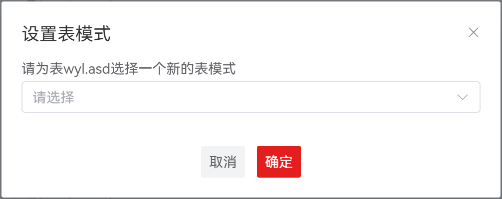

### 设置表空间

**步骤 1：** 在 "**数据库导航菜单**" 窗格中，右键单击数据库中的表名称，选择 "**设置表空间**" ，弹出设置表空间对话框。

**步骤 2：** 从下拉列表中选择名称，单击 "**确定**" 已选表将被移动到新的表空间。

状态栏显示已完成操作的状态。

### 设置表描述

**步骤 1：** 在 "**数据库导航菜单**" 窗格中，右键单击数据库中的表名称，选择 "**设置表描述**" ，弹出设置表描述对话框。

**步骤 2：** 根据对话框提示输入表描述，单击 "**确定**" 已选表将更新表描述。

状态栏显示已完成操作的状态。

###  重命名表

**步骤 1：** 在 "**数据库导航菜单**" 窗格中，右键单击数据库中的表名称，选择 "**重命名表**" ，弹出重命名表对话框。

**步骤 2：** 根据对话框提示输入表的新名称，单击 "**确定**" 已选表将更新表名称。

状态栏显示已完成操作的状态。

###  删除表

**步骤 1：** 在 "**数据库导航菜单**" 窗格中，右键单击数据库中的表名称，选择 "**删除表**" ，弹出确认对话框。

**步骤 2：** 单击 "**确定**" 即可继续，或单击 "**取消**" 即可退出操作。

**说明：** 单击 "**确定**" 将删除表，此操作不可逆。

###  分析表

“分析” 统计表和表索引的数据，在数据库内部表中存储统计的信息。数据库中，查询优化器可以访问信息并根据该信息制定更好的查询规划策略。

**步骤 1：** 在 "**数据库导航菜单**" 窗格中，右键单击数据库中的表名称，选择 "**分析表**" ，弹出确认对话框。

**步骤 2：** 单击 "**确定**" 分析表。

状态栏显示已完成操作的状态，分析生成最新的表统计信息存储在系统表 PG_STATISTIC 中。

##  管理表数据

支持操作表数据、导出表 DDL、导出表 DDL 和数据、导出表数据。

###  操作表数据

创建表后，可以在该表中添加新的数据。可对当前数据执行新增、修改、删除、筛选、排序、导入、导出操作，同时支持在表数据工具栏下方预览所有操作所对应的 SQL 语句。

**说明：** 新增数据若未保存的单元格高亮为绿色，保存后，其颜色重置为默认颜色。

编辑数据若未保存的单元格高亮为浅红色 ，保存后，其颜色重置为默认颜色。

删除数据若未保存的单元格高亮为深红色，保存后，其颜色重置为默认颜色。

**新增数据**

**步骤 1：** 在 "**数据库导航菜单**" 窗格中，单击表名称，选择 "**数据**"。

**步骤 2：** 点击添加按钮 将显示新增数据行。

**步骤 3：** 双击新增数据行的每个表格即可启用编辑状态。

**步骤 4：** 新增数据编辑完成后，点击  将保存新增数据行；若点击  将关闭新增数据行，恢复至未创建前的操作状态。

**说明：** 若所操作表未设置主键，将显示 "**自定义唯一键**" 对话框，详情请参见 **自定义唯一键** 。

**修改数据**

**步骤 1：** 在 "**数据库导航菜单**" 窗格中，单击表名称，选择 "**数据**"。

**步骤 2：** 双击已有数据行的每个表格即可启用编辑状态，已修改数据背景将高亮。

**步骤 3：** 已有数据修改完成后，点击  将保存修改数据行；若点击  将取消修改数据行操作，恢复至未修改前的操作状态。

**说明：** 若所操作表未设置主键，将显示 "**自定义唯一键**" 对话框，详情请参见 **自定义唯一键** 。

**删除数据**

**步骤 1：** 在 "**数据库导航菜单**" 窗格中，单击表名称，选择 "**数据**"。

**步骤 2：** 单击选择已有数据行，点击  将使所需删除数据行背景高亮。

**步骤 3：** 所需删除数据行选择完毕后，点击  将删除所选数据行；若点击  将取消删除数据行操作，恢复至未修改前的操作状态。

**自定义唯一键**

**步骤 1：** 未设置主键提示的对话框中选择 "**自定义唯一键**" 。

**步骤 2：** 勾选设置为唯一键的列，点击 "**确定**" 设置唯一键。

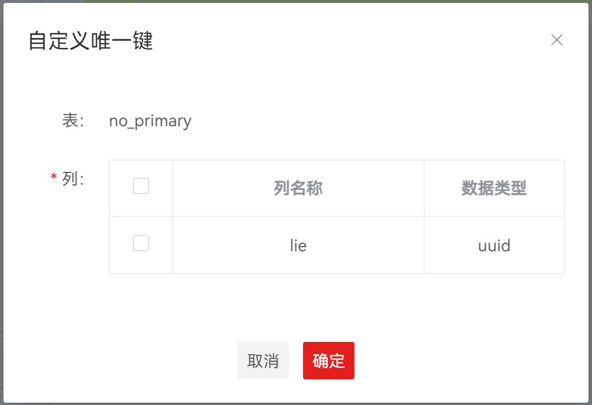

**数据筛选**

**步骤 1：** 在 "**数据库导航菜单**" 窗格中，单击表名称，选择 "**数据**"。

**步骤 2：** 点击  将打开数据筛选栏，点击 或"**隐藏**" 按钮即可关闭数据筛选栏。

**步骤 3：** 在数据筛选栏中，可选择显示列，勾选表示显示，未勾选表示隐藏，默认为全选，即全部显示。

**步骤 4：** 在数据筛选栏中，筛选项操作如下：

为新增一组筛选项，新增后当前筛选项仅支持删除。筛选项由列、条件、值组成，点击下划线即可修改对应的下拉选项。

为新增一组子筛选项，新增后当前筛选项仅支持删除，子筛选项仍支持新增以及加孙筛选项，以此类推。

为删除当前筛选项，不包含子级筛选，超过一组筛选项支持删除。

**说明：** 超出一个筛选项将出现拼接的运算符，选项为and、or，默认显示值为and。

**步骤 5：** 单击 "**应用**"，所选操作项将被作为筛选条件进行查询，可查看左侧的数据变化。

**数据排序**

**步骤 1：** 在 "**数据库导航菜单**" 窗格中，单击表名称，选择 "**数据**"。

**步骤 2：** 点击  将打开数据筛选栏，点击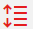 或"**隐藏**" 按钮即可关闭数据排序栏。

**步骤 3：** 在数据排序栏中，选择排序列，对应排序值的选项为ASC、DESC，其中ASC为升序，DESC为降序。

**步骤 4：** 单击 "**应用**"，所选排序列的排序值将被作为排序条件进行查询，可查看左侧的数据变化。

**说明：** 表格数据每列的表头新增支持单列排序，为升序状态，为降序状态，表格数据进行升序/降序操作与排序栏选项相关联。

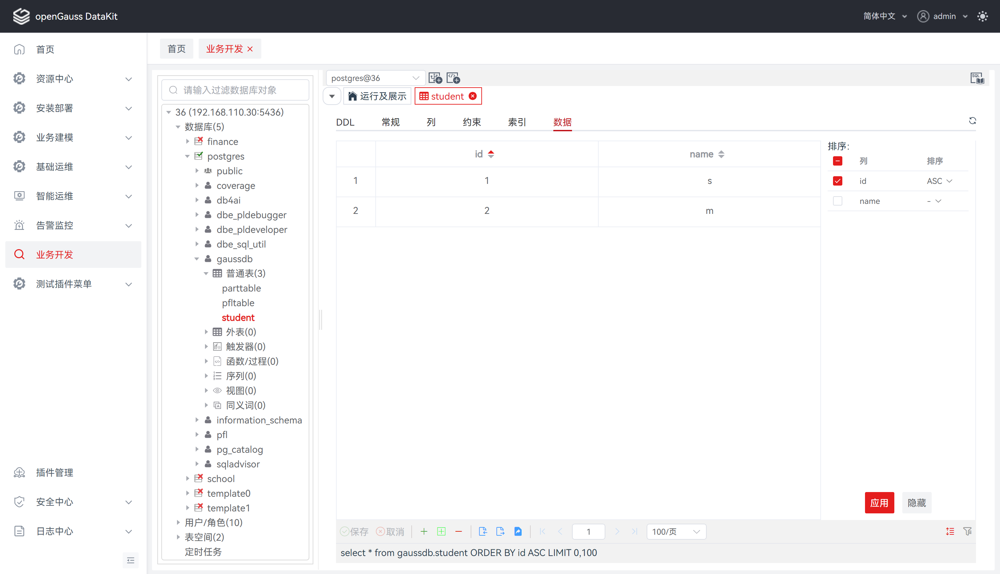

### 导出表 DDL

**步骤 1：** 在 "**数据库导航菜单**" 窗格中，右键单击数据库中的表名称，选择 "**导出 DDL**" 。

**说明：** 导出文件为 sql 文件。

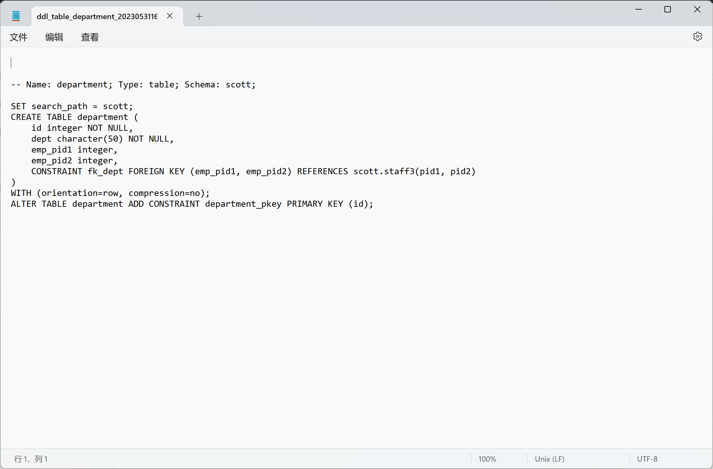

### 导出表 DDL 和数据

执行以下步骤导出表 DDL 和数据：

**步骤 1：** 在 "**数据库导航菜单**" 窗格中，右键单击数据库中的表名称，选择 "**导出 DDL 和数据**"。

**说明：** 导出文件为 sql 文件。

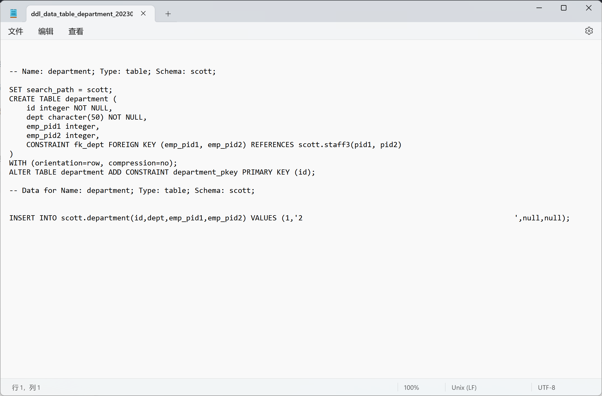

### 导出表数据

创建表后，可以导出该表中的数据。支持导出该表所有数据、导出该表所有查询数据、导出该表当前页查询数据。

**导出所有数据**

**步骤 1：** 在 "**数据库导航菜单**" 窗格中，右键单击数据库中的表名称，选择 "**导出表数据**" ，弹出 "**导出表数据**" 对话框。

**步骤 2：** 设置如下参数，导出表数据。

**说明：** 导出文件由所配置的格式项决定。

| 配置项       | 必填 | 配置说明                                                     |
| ------------ | ---- | ------------------------------------------------------------ |
| 选择列       | 是   | 用于选择导出数据对应的列，默认全选                           |
| 格式         | 否   | 用于选择导出数据的格式，默认为Excel(xlsx)所有选项分别为：Excel(xlsx)、Excel(xls)、Text、Binary |
| 包含标题     | 否   | 用于配置导出数据中是否包含列名称，默认包含仅对Text启用修改，对Excel（xlsx/xls）和Binary格式禁用 |
| 引号         | 否   | 用于定义引号。在此字段中仅能输入单字节字符。引号不得与分隔符相同。该项默认对和文本格式启用，但不是必选。对Excel（xlsx/xls）和Binary格式禁用l 如果表数据中包含分隔符，则会使用该项中指定的符号l 如果引号出现在值中，该值不会被转义l 如果结果中包含多行值，则会用引号引用 |
| 分隔符       | 否   | 用于定义分隔符。可选择提供的分隔符，或在“分隔符”区域的“其他”字段中自定义分隔符。格式的默认分隔符为半角逗号“,”。“其他”字段中的内容最大可为 10 字节。该项对和文本格式启用，但不是必选，对Excel（xlsx/xls）和Binary格式禁用。如果“其他”字段被选中，则必须设置该字段 |
| 转义符       | 否   | 用于定义转义值。该项仅支持单字节字符。“转义符”和“引号”的值不得相同。该项对和文本格式启用，但不是必选。对Excel（xlsx/xls）和Binary格式禁用 |
| 将NULL替换为 | 否   | 可指定字符串，用于替换表中的null 值。该项不支持填入换行符或回车符，最多可填入 100 个字符。该字段的值不得与分隔符和引号值相同。该项默认对和文本格式启用，但不是必选。对 Excel（xlsx/xls）和Binary格式禁用 |
| 编码         | 否   | 用于配置导出数据的编码格式，默认为UTF-8所有选项分别为：UTF-8、GBK、LATIN1 |

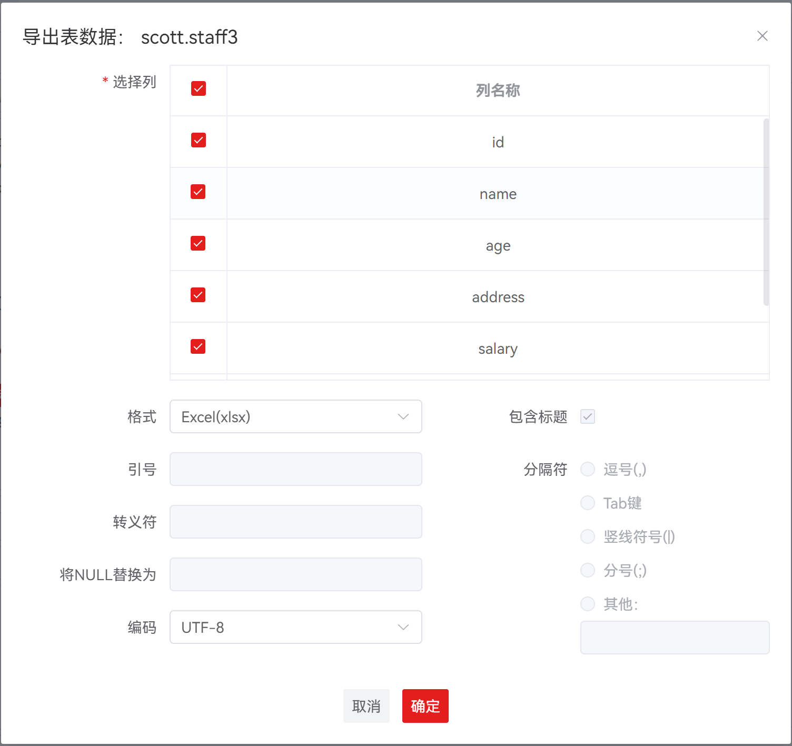

**导出所有查询数据**

**步骤 1：** 在 "**数据库导航菜单**" 窗格中，单击表名称，选择 "**数据**"。

**步骤 2：** 点击导出所有查询数据按钮 ，弹出导出查询数据对话框，选择导出格式，导出格式为 xlsx、xls，默认选择为 xlsx。

**步骤 3：** 单击 "**确定**" 即可继续，或单击 "**取消**" 即可退出操作。

**说明：** 单击 "**确定**" 将下载所有查询数据至所选格式文件。

**导出当前页查询数据**

**步骤 1：** 在 "**数据库导航菜单**" 窗格中，单击表名称，选择 "**数据**"。

**步骤 2：** 点击导出当前页查询数据按钮 ，弹出导出查询数据对话框，选择导出格式，导出格式为 xlsx、xls，默认选择为 xlsx。

**步骤 3：** 单击 "**确定**" 即可继续，或单击 "**取消**" 即可退出操作。

**说明：** 单击 "**确定**" 将下载当前页查询数据至所选格式文件。

### 导入表数据

**步骤 1：** 在 "**数据库导航菜单**" 窗格中，右键单击数据库中的表名称，选择 "**导入表数据**" 或者在表数据操作工具栏点击，弹出 "**导入表数据**" 对话框。

**步骤 2：** 设置如下参数，导入表数据。

**说明：** 导入文件格局需要与所配置的格式项相符。

**步骤 3：** 单击 "**确定**" 即可继续，或单击 "**取消**" 即可退出操作。

**说明：** 导入成功后点击刷新按钮即可获取最新数据。

| 配置项       | 必填 | 配置说明                                                     |
| ------------ | ---- | ------------------------------------------------------------ |
| 选择列       | 是   | 用于选择导入数据对应的列，默认全选                           |
| 导入数据文件 | 是   | 用于选择导入文件，按钮默认为”选择文件”，上传文件后更改按钮为“更换文件”且显示文件名称 |
| 格式         | 否   | 用于选择导入数据的格式类型，默认为Excel(xlsx)所有选项分别为：Excel(xlsx)、Excel(xls)、CSV、Binary、Text(txt) |
| 包含标题     | 否   | 用于配置导入数据中是否包含列名称，默认包含仅对Binary禁用修改，对Excel(xlsx)、Excel(xls)、CSV、Text(txt)格式启用 |
| 引号         | 否   | 用于定义引号。在此字段中仅能输入单字节字符。引号不得与分隔符相同。该项默认对CSV、Text(txt)格式启用，但不是必选。对Excel（xlsx/xls）和Binary格式禁用l 如果表数据中包含分隔符，则会使用该项中指定的符号l 如果引号出现在值中，该值不会被转义l 如果结果中包含多行值，则会用引号引用 |
| 分隔符       | 否   | 用于定义分隔符。可选择提供的分隔符，或在“分隔符”区域的“其他”字段中自定义分隔符。格式的默认分隔符为半角逗号“,”。“其他”字段中的内容最大可为 10 字节。该项默认对CSV、Text(txt)格式启用，但不是必选。对Excel（xlsx/xls）和Binary格式禁用。如果“其他”字段被选中，则必须设置该字段 |
| 转义符       | 否   | 用于定义转义值。该项仅支持单字节字符。“转义符”和“引号”的值不得相同。该项默认对CSV、Text(txt)格式启用，但不是必选。对Excel（xlsx/xls）和Binary格式禁用 |
| 将NULL替换为 | 否   | 可指定字符串，用于替换表中的null 值。该项不支持填入换行符或回车符，最多可填入 100 个字符。该字段的值不得与分隔符和引号值相同。该项默认对CSV、Text(txt)格式启用，但不是必选。对Excel（xlsx/xls）和Binary格式禁用 |
| 编码         | 否   | 用于配置导入数据的编码格式，默认为UTF-8所有选项分别为：UTF-8、GBK、LATIN1 |
| 时间格式     | 否   | 用于配置导入数据的时间格式，默认为yyyy-MM-dd HH:mm:ss所有选项分别为：yyyy-MM-dd HH:mm:ss、yyyy-MM-dd hh:mm:ss该项仅对Excel（xlsx/xls）启用，对CSV、Binary、Text(txt) 格式禁用 |

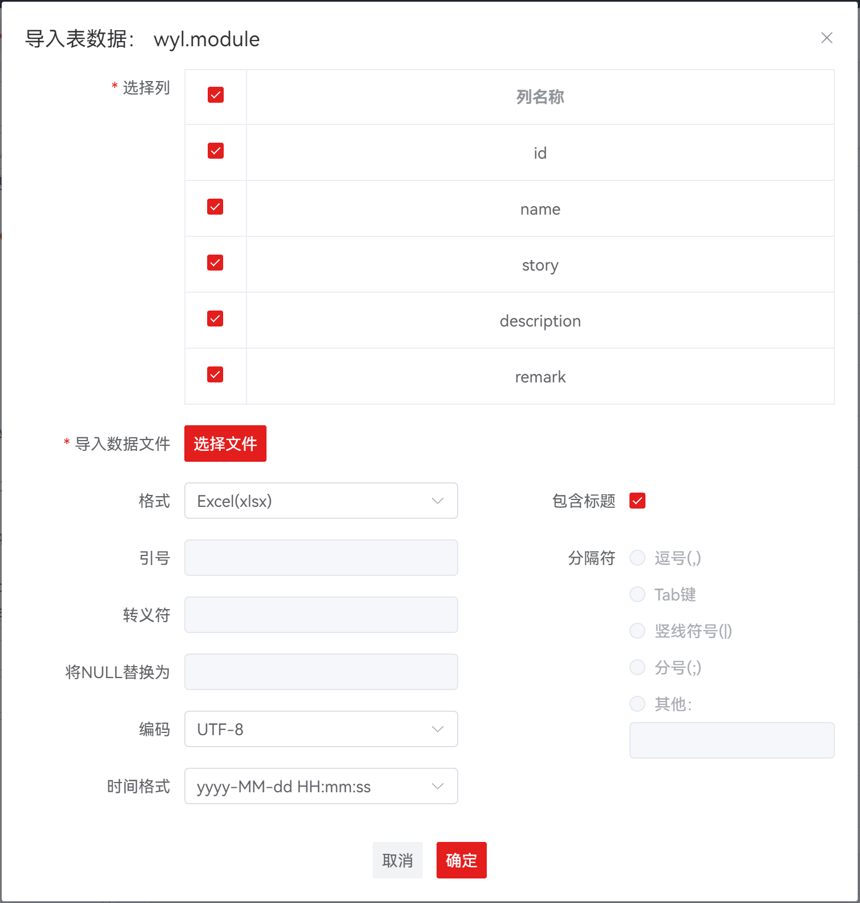
