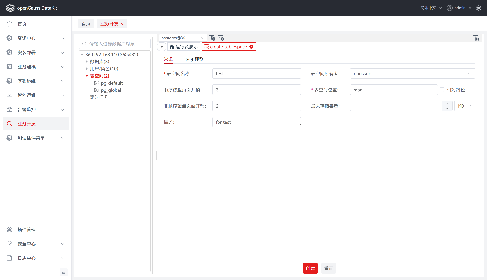
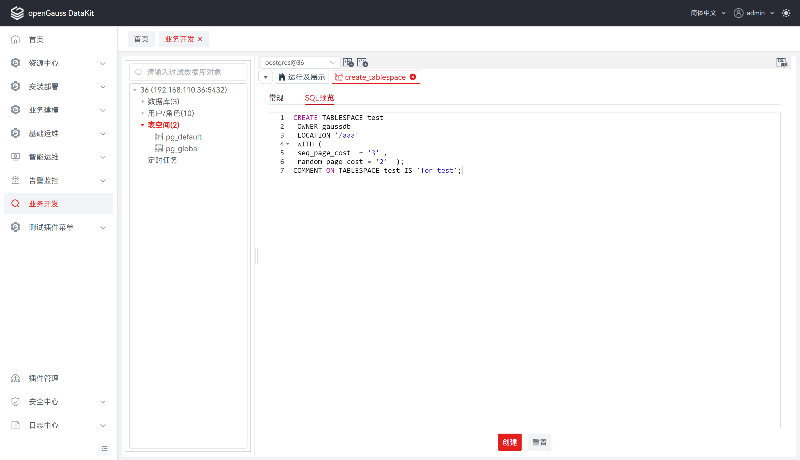
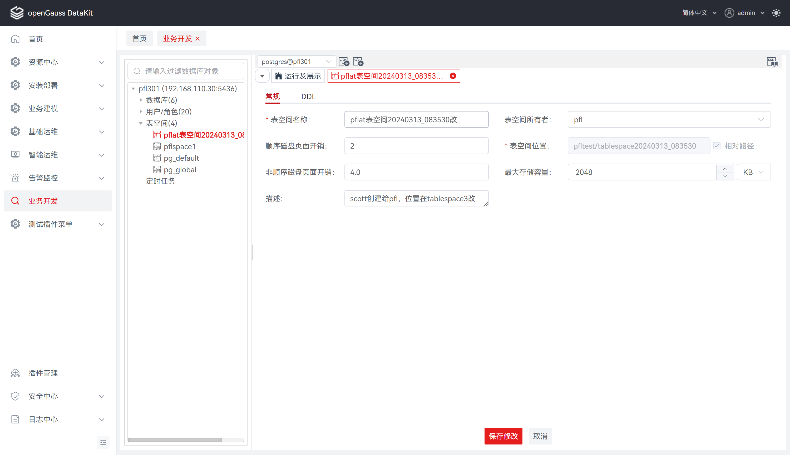
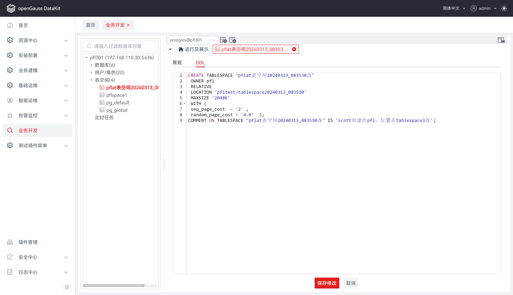

# 表空间

表空间是一个逻辑划分，其功能主要在于控制一个数据库的磁盘布局。它是数据库的逻辑划分，一个表空间只能属于一个数据库，所有的数据库对象（例如表、索引等）都存放在指定的表空间中。

openGauss 自带了两个表空间：pg_default 和 pg_global。默认表空间 pg_default 用来存储非共享系统表、用户表、用户表 index、临时表、临时表 index、内部临时表的默认表空间，对应存储目录为实例数据目录下的 base 目录。共享表空间 pg_global 用来存放共享系统表的表空间，对应存储目录为实例数据目录下的 global 目录。需要注意的是，在 HCS 等场景下一般不建议用户使用自定义的表空间。

## 创建表空间

执行如下步骤在数据库中定义表空间：

**步骤 1：** 在 "**数据库导航菜单**" 窗格中，右键单击连接名称下的 "**表空间**" ，选择 "**创建表空间**" ，跳转至 "**创建表空间**" 页面。

**步骤 2：** 点击 "**常规**" ，定义表空间基本信息，如表空间名称、所有者、位置、最大存储容量等。详情请参见 **定义常规** 。

**步骤 3：** 点击 "**DDL 预览**" ，查看输入所自动生成的 SQL 查询。详情请参见 **DDL 预览** 。

**定义常规**

设置如下参数：

**说明：** 所有必选参数均需要填写。必填参数用星号（*）标识。

若点击 "**创建**" ，tab 将自动切换至   "**常规**" ，待补全信息后才可执行创建操作。

| **配置项**         | **必填** | **配置说明**                                                 |
| ------------------ | -------- | ------------------------------------------------------------ |
| 表空间名称         | 是       | 用于定义所创建表空间的名称                                   |
| 表空间所有者       | 否       | 用于定义所创建表空间的所有者，若为空，数据库默认为创建者，可选项由后端数据回显 |
| 表空间位置         | 是       | 用于创建表空间的位置，默认对应绝对路径                       |
| 相对路径           | 否       | 与表空间位置相关联，若勾选，则表空间位置为相对路径           |
| 最大存储容量       | 否       | 用于指定表空间的最大存储容量，若为空，数据库默认为不限制单位选项分别为：KB、MB、GB、TB、PB，默认为KB |
| 顺序磁盘页面开销   | 否       | 用于指定按照物理存储顺序（从磁盘上连续的位置）读取或写入数据的成本 |
| 非顺序磁盘页面开销 | 否       | 用于指定按照物理存储顺序之外的方式（非连续）读取或写入数据的成本 |
| 描述               | 否       | 用于定义所创建表空间的描述                                   |

**DDL 预览**

按照输入的内容，生成一个DDL 语句。

**说明：** 该 DDL 语句仅支持查看、选择、复制，不支持编辑。

##  编辑表空间

**步骤 1：** 在 "**数据库导航菜单**" 窗格中，单击表空间列表，跳转至表空间查看与编辑页面。

**步骤 2：** 支持查看DDL、查看与修改常规信息，详情请见下方说明。

**修改常规**

设置如下参数：

**说明：** 所有必选参数均需要填写。必填参数用星号（*）标识。

| **配置项**         | **是否支持修改** | **配置说明**                                                 |
| ------------------ | ---------------- | ------------------------------------------------------------ |
| 表空间名称         | 是               | 用于定义所创建表空间的名称，默认数据回显                     |
| 表空间所有者       | 是               | 用于定义所创建表空间的所有者，默认数据回显，可选项由后端数据回显 |
| 表空间位置         | 否               | 用于创建表空间的位置，默认数据回显                           |
| 相对路径           | 否               | 与表空间位置相关联，默认数据回显                             |
| 最大存储容量       | 是               | 用于指定表空间的最大存储容量，默认数据回显单位选项分别为：KB、MB、GB、TB、PB |
| 顺序磁盘页面开销   | 是               | 用于指定按照物理存储顺序（从磁盘上连续的位置）读取或写入数据的成本，默认数据回显 |
| 非顺序磁盘页面开销 | 是               | 用于指定按照物理存储顺序之外的方式（非连续）读取或写入数据的成本，默认数据回显 |
| 描述               | 是               | 用于定义所创建表空间的描述，默认数据回显                     |

**查看 DDL**

## 删除表空间

**步骤 1：** 在 "**数据库导航菜单**" 窗格中，右键单击连接名称下的表空间名称，选择 "**删除表空间**"，弹出 "**删除表空间**" 确认框。

**步骤 2：** 单击 "**确定**" 即可继续，或单击 "**取消**" 即可退出操作。

**说明：** 单击 "**确定**" 将删除表空间，此操作不可逆。

单击 "**取消**" 即可退出本次对话框操作。

