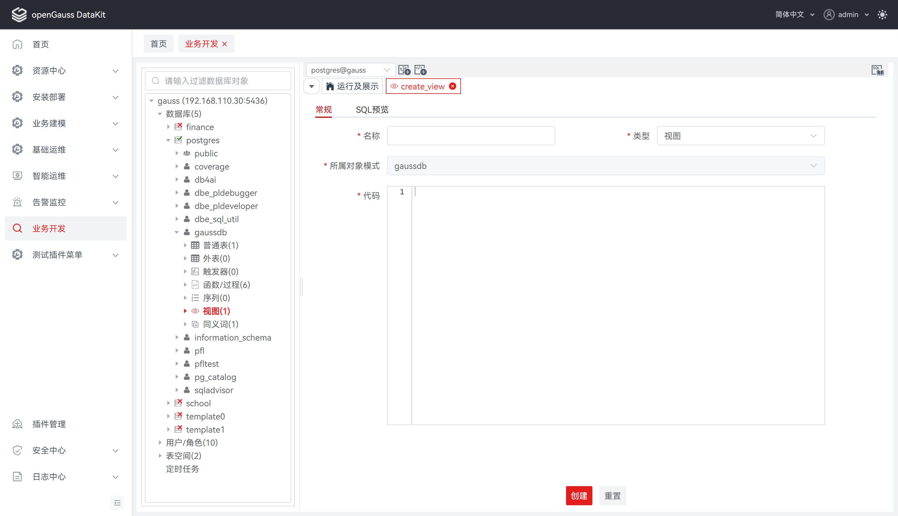
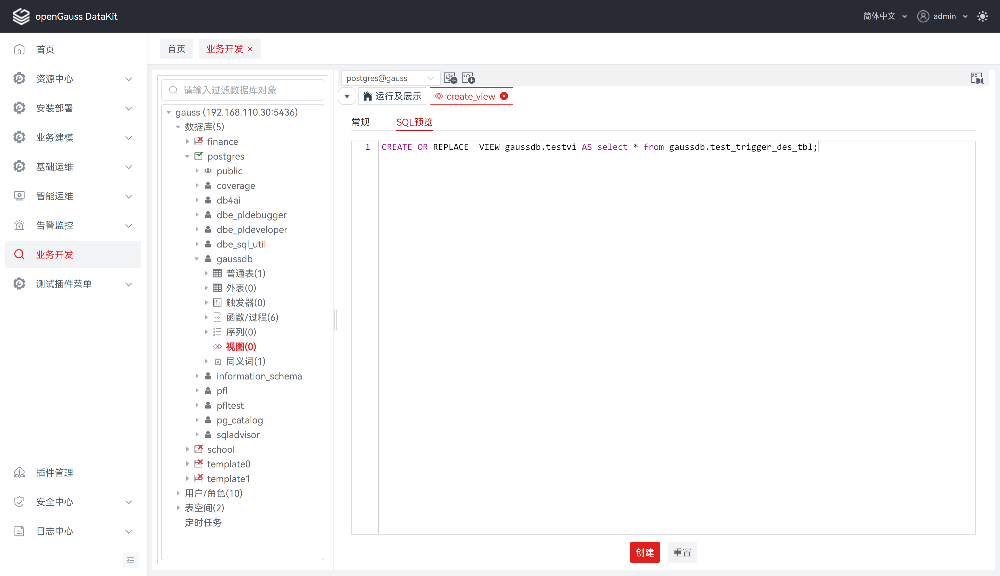
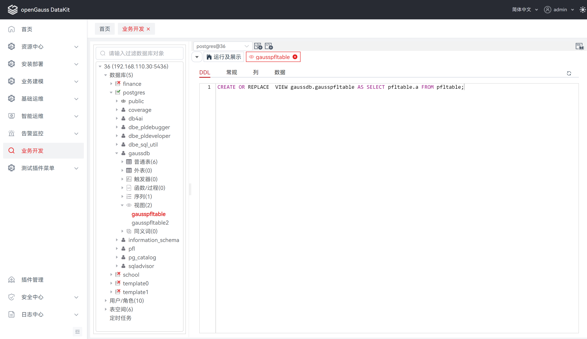
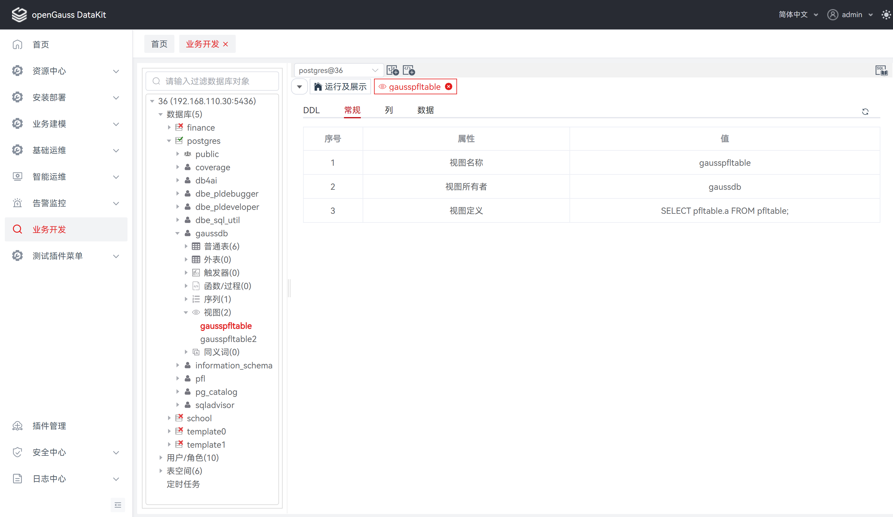
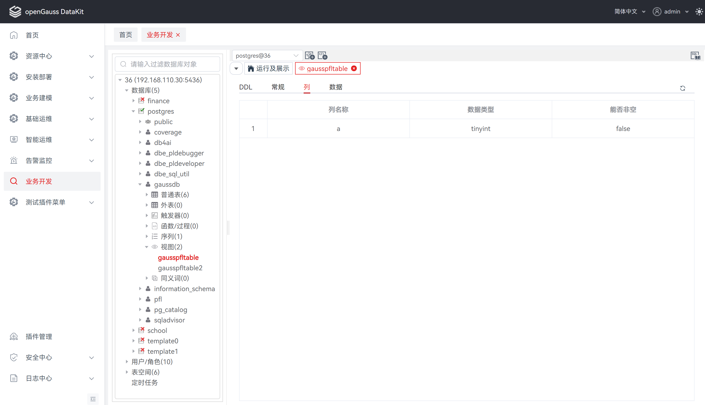
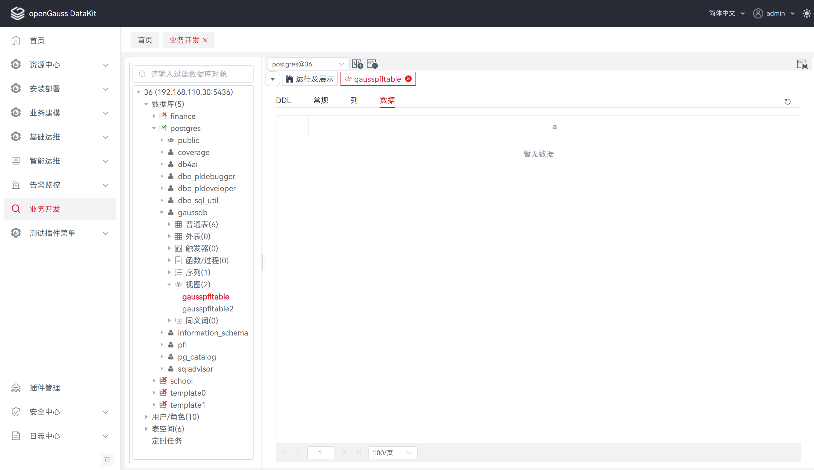
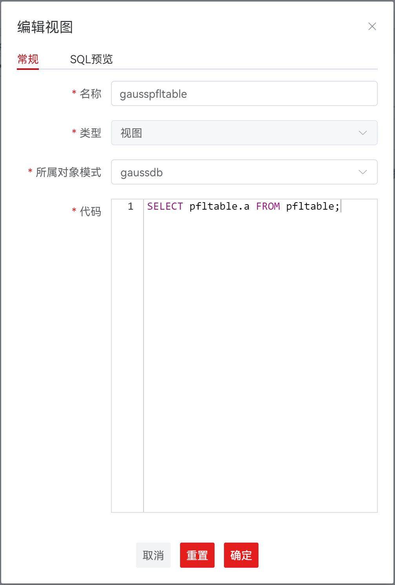
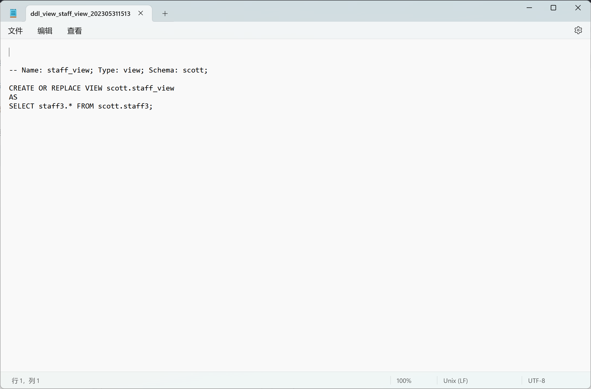

#  视图

## 创建视图

**步骤 1：** 在 "**数据库导航菜单**" 窗格中，右键单击数据库中的 "**视图**"，选择 "**创建视图**"，跳转至 "**创建视图**" 页面。

**步骤 2：** 选择 "**常规**"，设置如下参数，创建视图。

**说明：** 所有必选参数均需要填写。必填参数用星号（*）标识。

单击 "**确定**" 将创建并保存更新后的视图信息。

单击 "**重置**" 即可重置 "**创建视图**"对话框中的所有字段。

| 配置项       | 必填 | 配置说明                                               |
| ------------ | ---- | ------------------------------------------------------ |
| 名称         | 是   | 用于定义视图名称，默认为空                             |
| 类型         | 是   | 用于定义视图类型，类型分别为视图、物化视图，默认为视图 |
| 所属对象模式 | 是   | 用于定于所属对象模式，默认为当前模式，置灰不可选       |
| 代码         | 是   | 用于编写sql语句，默认为空                              |

**步骤 3：** 选择 "**SQL预览**"，可基于创建视图的配置信息进行 SQL 预览。

**说明：** 若未填写 "**常规**" 必填项，将无法通过校验进入 "**SQL预览**" 界面。

"**SQL预览**" 界面的编辑框仅支持查看，不支持编辑。

## 删除视图

**步骤 1：** 在 "**数据库导航菜单**" 窗格中，右键单击数据库中的视图列表，选择 "**删除视图**"，弹出 "**删除视图**" 确认框。

**步骤 2：** 单击 "**确定**" 即可继续，或单击 "**取消**" 即可退出操作。

**说明：** 单击 "**确定**" 将删除并更新视图信息，此操作不可逆。

单击 "**取消**" 即可退出本次对话框操作。

## 查看视图

创建视图后，单击视图列表，支持查看该视图 DDL、一般、列、数据。

**说明**：当前显示数据仅在首次加载时自动获取，若需更新数据请点击刷新按钮。

**查看 DDL**

**步骤 1：** 在 "**数据库导航菜单**" 窗格中，单击视图列表，所选视图对应的4大维度内容，默认显示DDL。

**查看常规**

**步骤 1：** 在 "**数据库导航菜单**" 窗格中，单击视图列表，所选视图对应的4大维度内容，选中 "**常规**"。

**查看列**

**步骤 1：** 在 "**数据库导航菜单**" 窗格中，单击视图列表，所选视图对应的4大维度内容，选中 "**列**"。

**查看数据**

**步骤 1：** 在 "**数据库导航菜单**" 窗格中，单击视图列表，所选视图对应的4大维度内容，选中 "**数据**"。

## 编辑视图

**步骤 1：** 在 "**数据库导航菜单**" 窗格中，右键单击数据库中的视图名称，选择 "**编辑视图**"。

**步骤 2：** 选择 "**基本**"，修改视图名称、所属对象模式、代码。设置如下参数。

| 配置项       | 是否支持编辑 | 配置说明                                                 |
| ------------ | ------------ | -------------------------------------------------------- |
| 名称         | 是           | 用于定义视图名称，默认数据回显                           |
| 类型         | 否           | 用于定义视图类型，类型分别为视图、物化视图，默认数据回显 |
| 所属对象模式 | 是           | 用于定于所属对象模式；默认数据回显                       |
| 代码         | 否           | 用于编写sql语句，默认数据回显                            |

## 导出视图 DDL

**步骤 1：** 在 "**数据库导航菜单**" 窗格中，右键单击数据库中的视图名称，选择 "**导出 DDL**"。

​                **说明：** 导出文件为 sql 文件。

​ 