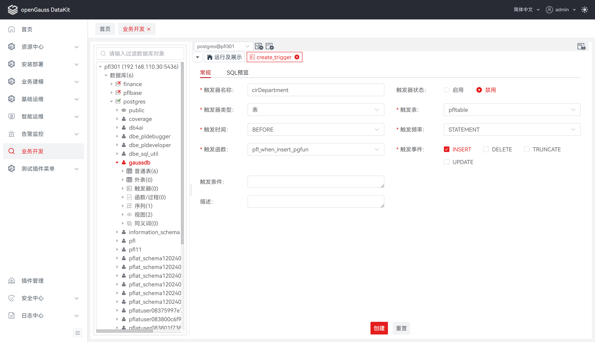
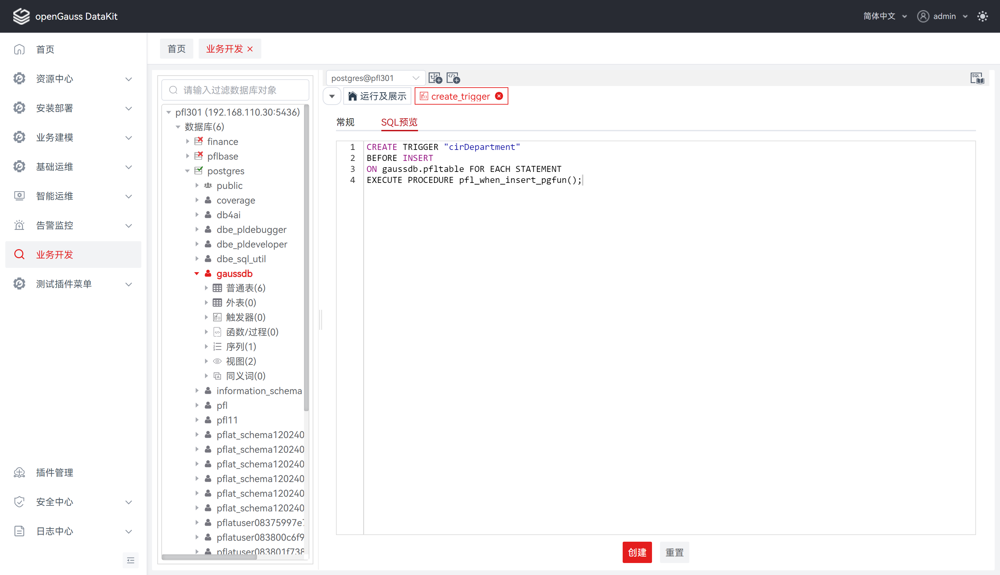
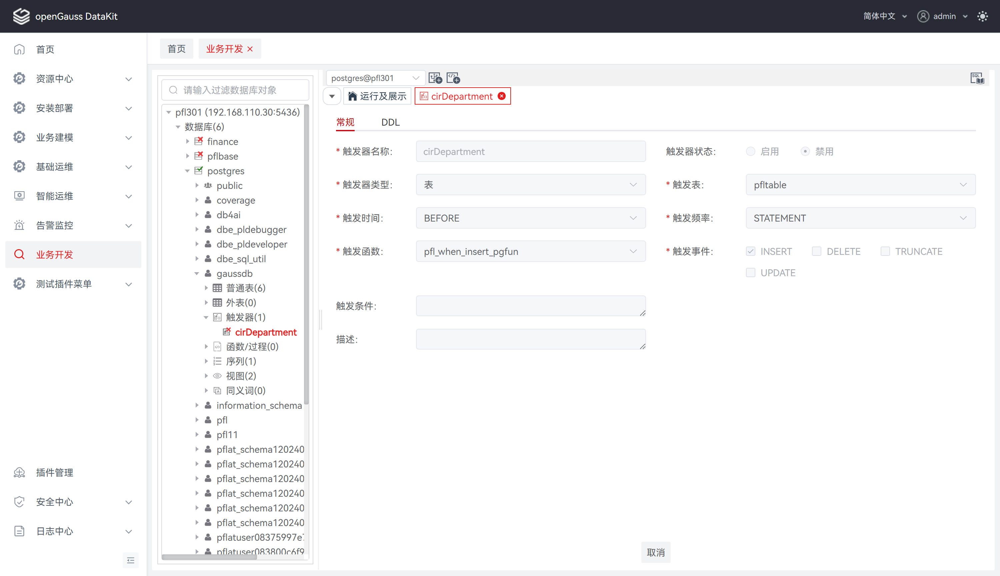
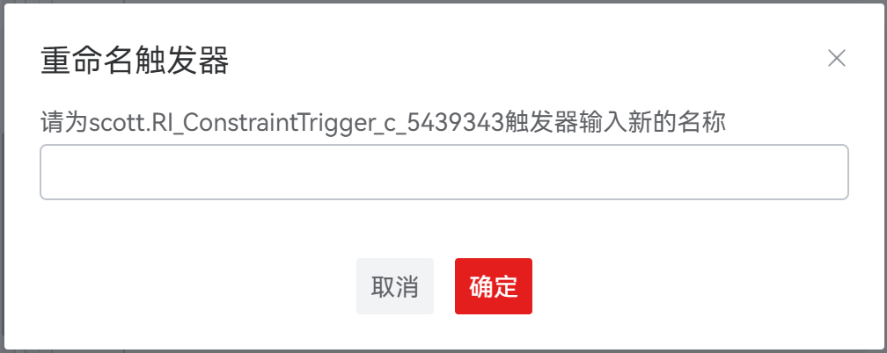
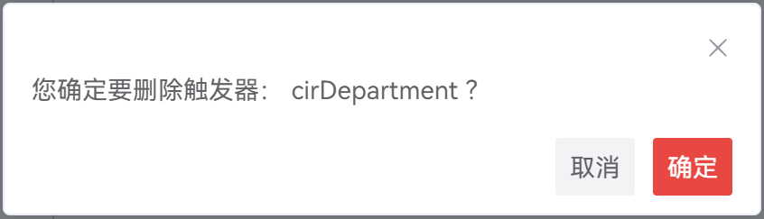

# 触发器

触发器是一种数据库对象，它与特定的表相关联，并在表上的指定事件发生时自动触发一系列操作。当满足预定义的触发条件时，触发器可以执行各种操作，比如插入、更新或删除数据，或者触发其他的数据库操作、函数或过程。

## 创建触发器

**步骤 1：** 在 "**数据库导航菜单**" 窗格中，右键单击数据库中的 "**触发器**" ，选择 "**创建触发器**" ，跳转至 "**创建触发器**" 页面。

**步骤 2：** 点击 "**常规**" ，定义触发器基本信息，如触发器名称、状态、时间、频率等。详情请参见 **定义常规** 。

**步骤 3：** 点击 "**DDL 预览**" ，查看输入所自动生成的 SQL 查询。详情请参见 **DDL 预览** 。

**定义常规**

设置如下参数：

**说明：** 所有必选参数均需要填写。必填参数用星号（*）标识。

若点击 "**创建**" ，tab 将自动切换至   "**常规**" ，待补全信息后才可执行创建操作。

| **配置项**      | **必填** | **配置说明**                                                 |
| --------------- | -------- | ------------------------------------------------------------ |
| 触发器名称      | 是       | 用于定义所创建触发器的名称                                   |
| 触发器状态      | 否       | 用于指定触发器创建成功后的状态，默认为禁用；选项为：启用、禁用 |
| 触发器类型      | 是       | 用于指定所创建触发器的类型，默认为表；选项为：表、视图       |
| 触发表/触发视图 | 是       | 用于指定触发的表名、视图名                                   |
| 触发频率        | 是       | 用于指定所创建触发器的触发频繁，默认为STATEMENT，约束触发器只能指定为FOR EACH ROW；选项为：ROW、STATEMENT； ROW：指该触发器是受触发事件影响的每一行触发一次；STATEMENT：指该触发器是每个SQL语句只触发一次 |
| 触发时间        | 是       | 用于指定触发器函数的触发时间，默认为BEFORE；选项为：BEFORE、AFTER、INSTEAD OF BEFORE：触发器函数是在触发事件发生前执行；AFTER：触发器函数是在触发事件发生后执行；INSTEAD OF：触发器函数直接替代触发事件 |
| 触发事件        | 是       | 用于指定启动触发器的事件，默认为未选择；选项为：INSERT、DELETE、TRUNCATE、UPDATE。 |
| UPDATE字段      | 否       | 用于指定 UPDATE 字段，默认为全选。仅触发器类型为表且触发事件为 UPDATE 时显示 |
| 触发函数        | 是       | 用于指定用户定义的函数，且该函数必须声明为不带参数并返回类型为触发器，默认为未选择 |
| 触发条件        | 否       | 用于指定触发器的触发条件，用于填写关键字 WHEN 后的 SQL 条件语句 |
| 描述            | 否       | 用于定义所创建触发器的描述                                   |

**DDL 预览**

按照输入的内容，生成一个DDL 语句。

**说明：** 该 DDL 语句仅支持查看、选择、复制，不支持编辑。

## 查看触发器

**步骤 1：** 在 "**数据库导航菜单**" 窗格中，展开数据库中的触发器列表，单击触发器名称，跳转至触发器查看与编辑页面。

## 重命名触发器

**步骤 1：** 在 "**数据库导航菜单**" 窗格中，右键单击数据库中的触发器名称，选择 "**重命名触发器**" ，弹出重命名触发器对话框。

**步骤 2：** 根据对话框提示输入触发器的新名称，单击 "**确定**" 将更新触发器名称。

## 启用/禁用触发器

**步骤 1：** 在 "**数据库导航菜单**" 窗格中，右键单击数据库中的触发器名称，选择 "**启用触发器**" 或 "**禁用触发器**" ，弹出修改触发器状态确认框。

**说明：**  "**启用触发器**" 操作仅在已禁用的触发器上执行。

"**禁用触发器**" 操作仅在已启用的触发器上执行。

**步骤 2：** 单击 "**确定**" 即可继续，或单击 "**取消**" 即可退出操作。

##  删除触发器

**步骤 1：** 在 "**数据库导航菜单**" 窗格中，右键单击数据库中的触发器名称，选择 "**删除触发器**"，弹出 "**删除触发器**" 确认框。

**步骤 2：** 单击 "**确定**" 即可继续，或单击 "**取消**" 即可退出操作。

**说明：** 单击 "**确定**" 将删除触发器，此操作不可逆。

单击 "**取消**" 即可退出本次对话框操作。

## FAQ

1. 现象：无法编辑触发器信息。

   原因：目前仅支持创建、查看、删除触发器，编辑触发器将在后续版本支持。
