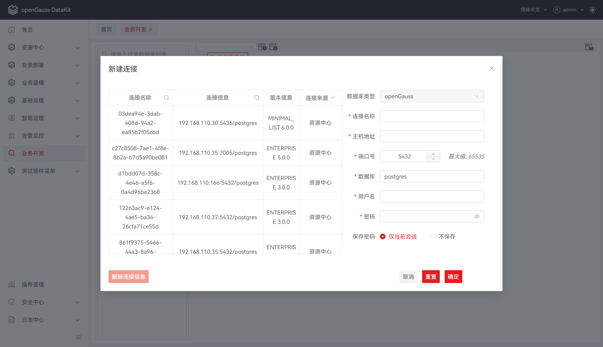
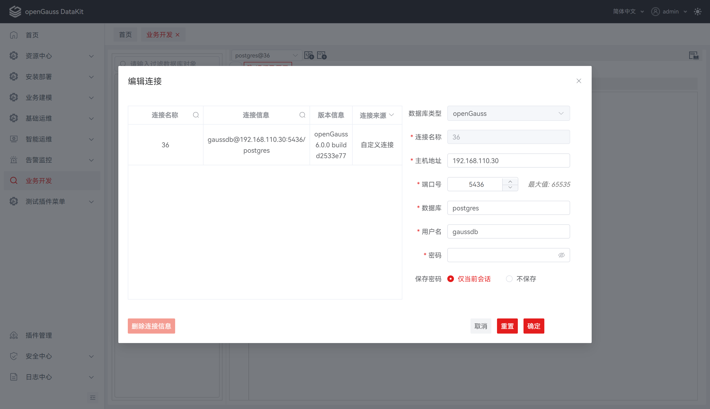
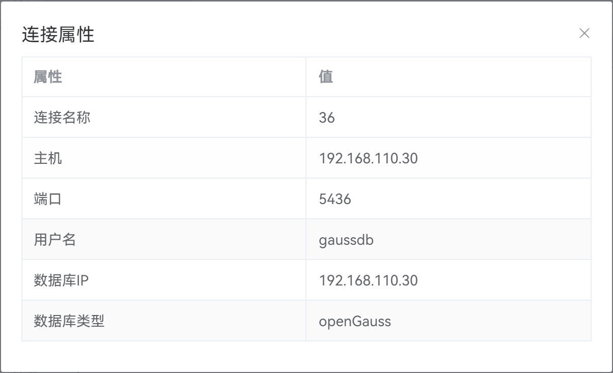

# 连接信息

启动后，默认打开 **“新建连接”** 对话框。要执行数据库操作，需连接至少一个数据库。

## 新建连接

**步骤 1：** 若不存在连接，默认弹出 **"新建连接"** 对话框；若已存在连接，可在工具栏中单击，弹出 **"新建连接"** 对话框。

**步骤 2：** 该连接对话框的左侧列表中显示已有的连接信息和服务器信息。

**说明：** 单击连接名称，可自动填充 “**名称**”、“**主机名**” 和 “**端口号**” 等连接参数。

**步骤 3：** 设置如下参数，创建数据库连接。

**说明：** 所有必选参数均需要填写。必填参数用星号（*）标识。

支持连接名称、连接信息、连接来源筛选。

支持删除选中左侧连接来源为 "自定义连接" 的连接信息。

| 配置项     | 必填 | 配置说明                                                     |
| ---------- | ---- | ------------------------------------------------------------ |
| 数据库类型 | 是   | 用于选择数据库类型；默认为openGauss，不可选，置灰状态        |
| 连接名称   | 是   | 用于填写连接名称；默认为空，限制字符个数不大于30             |
| 主机地址   | 是   | 用于填写ip地址；默认为空 ，输入内容需要符合ip地址规范        |
| 端口号     | 是   | 用于填写数据库端口；默认为5432 ，输入内容需要符合端口号范围，即0-65535 |
| 数据库     | 是   | 用于填写数据库名；默认为postgres                             |
| 用户名     | 是   | 用于填写连接数据库的用户名；默认为空                         |
| 密码       | 是   | 用于填写连接数据库的密码；默认为空 ，支持显示和隐藏密码      |
| 保存密码   | 否   | 用于选择是否在建立数据库连接时保存口令；默认为仅当前会话，仅做保存密码的标识存储 |

## 编辑连接

执行以下步骤编辑数据库连接属性：

**步骤 1：** 在 "**数据库导航菜单**" 窗格中，右键单击连接名称，选择 "**编辑连接**" ，弹出 "**编辑连接**" 对话框。

**步骤 2：** 单击 "**确定**" 即可继续，或单击 "**取消**" 即可退出操作。

**步骤 3：** 编辑连接参数详细说明。

**说明**：单击 "**确定**" 将保存更新后的连接信息。

单击 "**重置**" 即可重置 "编辑连接"对话框中的所有字段。

单击 "**取消**" 即可退出本次对话框操作。

## 查看连接属性

执行以下步骤编辑数据库连接属性：

**步骤 1：** 在 "**数据库导航菜单**" 窗格中，右键单击连接名称，选择 "**连接属性**" ，弹出 "**连接属性**" 对话框，对话框将显示所选连接的属性。

## 删除连接

执行以下步骤删除数据库连接：

**步骤 1：** 在 "**数据库导航菜单**" 窗格中，右键单击连接名称，选择 "**删除连接**" ，弹出确认对话框。

**步骤 2：** 单击 "**确定**" 删除连接。

状态栏显示已完成操作的状态。

此操作将从 "数据库导航菜单" 中删除与当前服务器的连接，任何未保存的数据将会丢失。

## FAQ
1. 现象：新建连接或打开数据库连接时提示超出限制。

   原因：建立连接数限制为 100，超出将无法继续建立新的连接。
