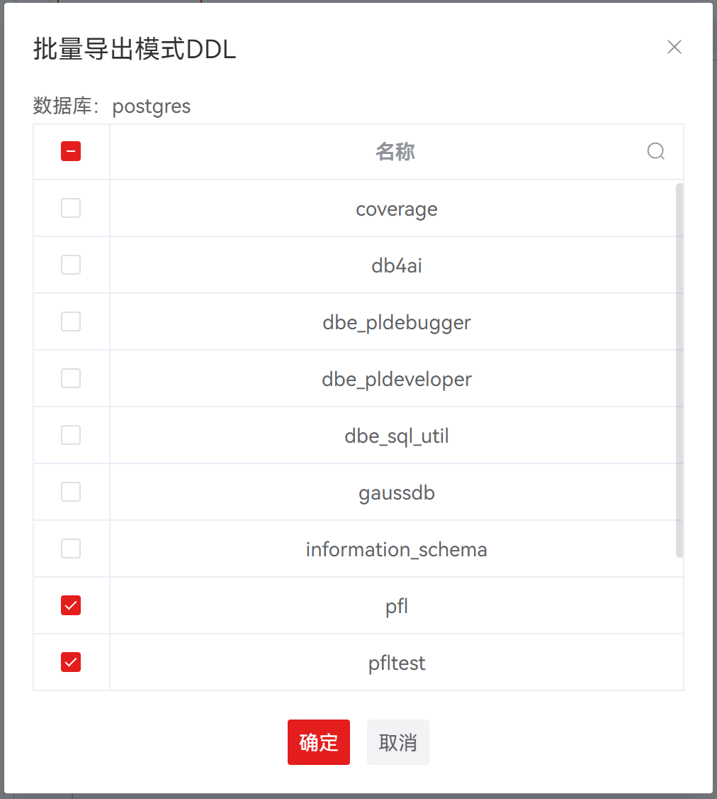
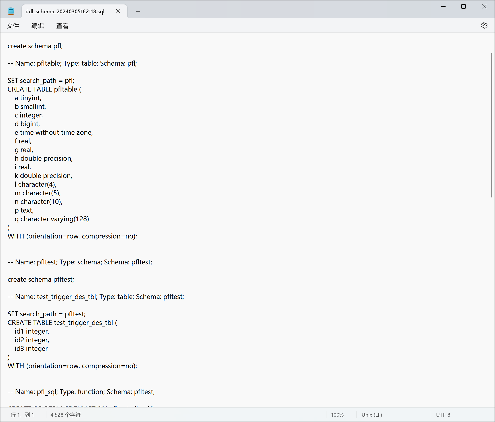
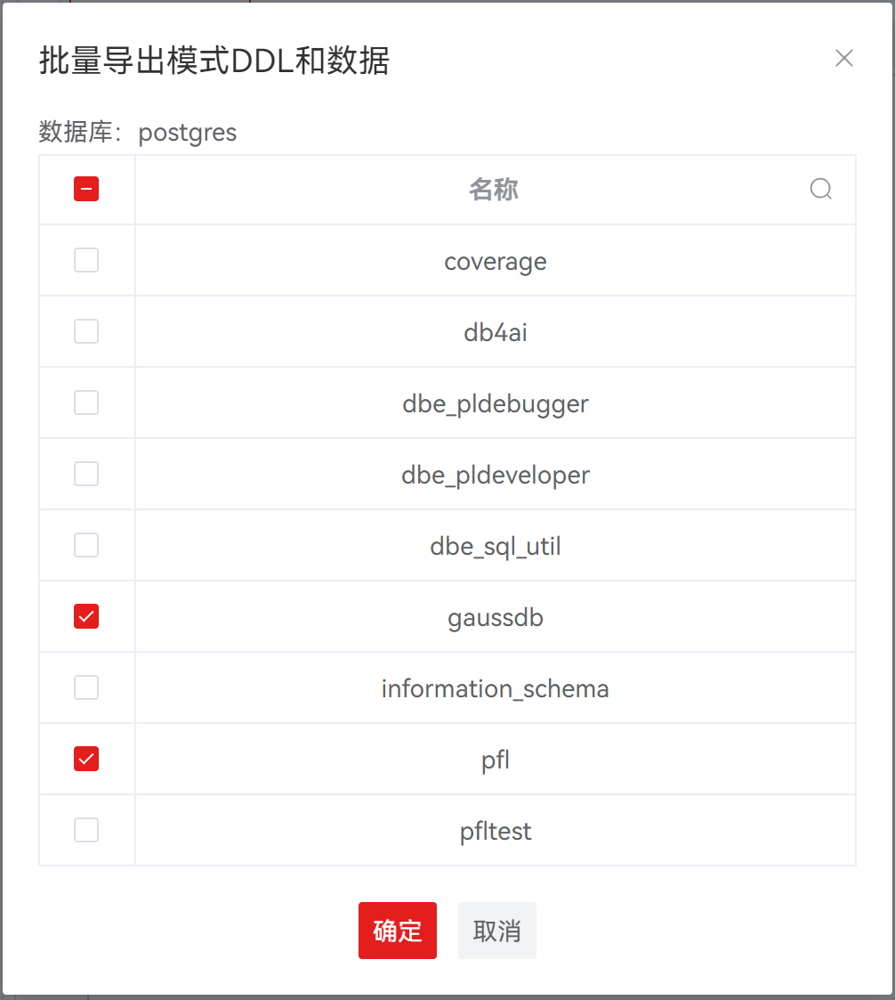
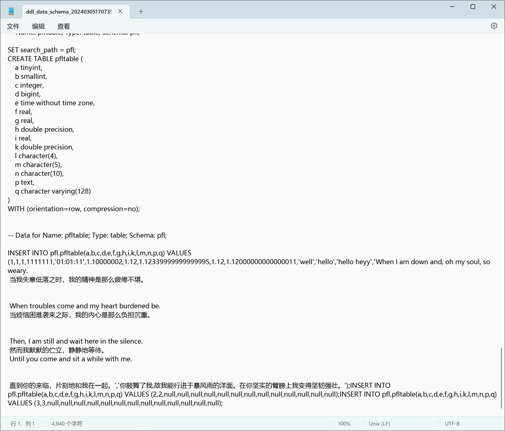

# 通用管理

## 复制数据库对象

支持复制数据库对象（表、视图、函数/过程、触发器、索引、用户/角色）的 DDL 以及数据。

**复制 DDL**

| 支持的数据库对象                                             | 操作入口                                        | 功能描述                             |
| ------------------------------------------------------------ | ----------------------------------------------- | ------------------------------------ |
| 表、视图、序列、触发器、函数/过程、用户/角色以及其他相关的DDL | 选择对应的数据库对象的 DDL 语句，右键选择“复制” | 复制所选 DDL 语句并保留对应的DDL格式 |

**复制数据**

| 支持的数据库对象   | 操作入口                                           | 功能描述                       |
| ------------------ | -------------------------------------------------- | ------------------------------ |
| 表、视图以及特殊表 | 点击左侧序号以选中需要复制的数据行，右键选择“复制” | 复制当前数据并保留对应数据格式 |

**高级复制**

| 支持的数据库对象                                            | 操作入口                                               | 功能描述                             |
| ----------------------------------------------------------- | ------------------------------------------------------ | ------------------------------------ |
| 表相关（数据/列/索引/约束）、视图（数据、列）以及特殊表相关 | 点击左侧序号以选中需要复制的数据行，右键选择“高级复制” | 复制当前列名、数据并保留对应数据格式 |

## 批量导出

批量导出窗口说明如下：（以批量导出模式DDL为例）

| **字段** | **说明**                                               |
| -------- | ------------------------------------------------------ |
| 数据库   | 显示当前数据库名称，不可编辑                           |
| 名称     | 回显当前数据库下所有模式的名称，支持多选、支持前端搜索 |

### 批量导出 DDL

| **功能**              | **操作入口**                                                 |
| --------------------- | ------------------------------------------------------------ |
| 批量导出模式DDL       | 右键连接状态数据库名称，选择批量导出DDL，打开所选数据库的模式名称选择窗口 |
| 批量导出普通表 DDL    | 右键普通表，选择批量导出DDL，打开普通表文件的名称选择窗口    |
| 批量导出函数/过程 DDL | 右键函数/过程，选择批量导出DDL，打开函数/过程的名称选择窗口  |
| 批量导出序列 DDL      | 右键序列，选择批量导出DDL，打开序列的名称选择窗口            |
| 批量导出视图 DDL      | 右键视图，选择批量导出DDL，打开视图的名称选择窗口            |

**以批量导出模式 DDL 为例：**

**步骤 1：** 在 "**数据库导航菜单**" 窗格中，右键单击数据库中的数据库名称，选择 "**批量导出模式DDL**"，弹出 "**选择名称**" 对话框。

**步骤 2：** 勾选所需导出的模式名称。名称支持搜索。

**步骤 3：** 单击 "**确定**" 即可继续，或单击 "**取消**" 即可退出操作。

### 批量导出 DDL 和数据

| **功能**                | **操作入口**                                                 |
| ----------------------- | ------------------------------------------------------------ |
| 批量导出模式DDL和数据   | 右键连接状态数据库名称，选择批量导出DDL和数据，打开所选数据库的模式名称选择窗口 |
| 批量导出普通表DDL和数据 | 右键普通表，选择批量导出DDL和数据，打开普通表文件的名称选择窗口 |
| 批量导出序列 DDL和数据  | 右键序列，选择批量导出DDL和数据，打开序列的名称选择窗口      |

**以批量导出模式 DDL 和数据为例：**

**步骤 1：** 在 "**数据库导航菜单**" 窗格中，右键单击数据库中的数据库名称，选择 "**批量导出模式DDL和数据**"，弹出 "**选择名称**" 对话框。

**步骤 2：** 勾选所需导出的模式名称。名称支持搜索。

**步骤 3：** 单击 "**确定**" 即可继续，或单击 "**取消**" 即可退出操作。

